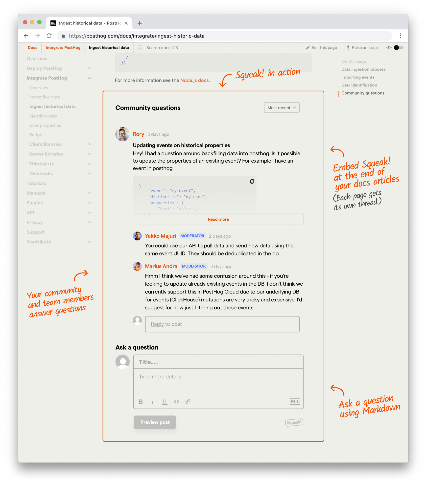

import ImgForums from '../images/blog/how-our-community-works/forums.png'
import ImgQuestion from '../images/blog/how-our-community-works/question.png'
import ImgQuestionTraffic from '../images/blog/how-our-community-works/traffic.png'
import ImgModeratorTools from '../images/blog/how-our-community-works/moderator.png'

Hosted community platforms make it easy for startups to set up forums or a feature request board without pulling engineering resources away from building their core product.

One popular platform you've likely seen before is [Discourse](https://www.discourse.org/). Given that it's feature-rich, it's obvious why many startups use it.

But when we started building our community features as a relatively small startup, we took a different approach. We went this route to avoid the ghost town effect.

## What is the ghost town effect?

When creating a community from scratch, you don't instantly start out with a large, active user base. And if a prospective customer opens the forums only to see a bunch of categories with hardly any posts or activity, it can be a negative signal that the company lacks traction.

This is specifically what we wanted to avoid.

Some companies have been known to seed posts themselves in the beginning – to jump start the process. But we felt this approach is deceiving and dishonest. One of the guiding principles at PostHog is to always do the right thing by our customers. Our reputation is more important than that. One negative post on Hacker News for doing something sleazy like this can completely derail the trust we're trying to build.

So our challenge: how do we jumpstart a community without resorting to cheap tactics?

We had an idea…

## Incorporating community into our docs

To understand our approach, it's important to have some context as to our unique challenges a couple years ago.

Our [technical docs](/docs) have existed from the start of the company. But with how quickly we've moved, many of our articles suffered from out-of-date information or a general lack of depth. We heard this from many customers on our ([now-retired](/blog/slack-closure)) community Slack, via our support channels, or on X.

But helping customers in these various platforms doesn't solve the larger issue: if one person is asking, there's likely 10x more who have the same question but *haven't* reached out for a solution.

Part of the reason we moved away from our community Slack is that rich information wasn't discoverable *outside* of Slack, and even that info would disappear into the abyss of the interwebs after a few months. (Slack hides older posts on free accounts, and their pricing doesn't scale for communities with thousands of users.)

## Our solution: inline Q&A

We decided to try adding a public question & answer form in each page of our docs. (Think: Disqus, but geared around threaded questions and answers instead of generic comments.)

Question threads would appear publicly on the page where they were originally asked.

We called in Squeak!, and we even toyed around with the idea of open sourcing it. (Ultimately we decided against it, as the time cost of supporting a productized version slowed down feature development for PostHog.com.)

The MVP used [Supabase](https://supabase.com) for the database and ran transactional emails through [Mailgun](https://www.mailgun.com). We even built a Slack thread importer, so any valuable questions previously posted to our community Slack could easily be migrated to specific pages in the docs.

I was pleasantly surprised to see how many of our users were willing to create an account and post a question. Within weeks, we had dozens of questions posted throughout our docs pages.

This helped eliminate the ghost town effect. If there were no questions posted on a single page, it didn't feel empty. But when there were questions, it felt like an FAQ section at the end of a page.

## Building the forums

Now that we were starting to build volume throughout the docs, it [finally made sense](https://github.com/PostHog/posthog.com/pull/3007) to build the "forum" interface we're accustomed to.

Because PostHog is a multi-product company, our docs are set up with subfolders for each product:

- `docs/`
  - `product-analytics`
  - `session-replay`
  - `feature-flags`
  - etc

So we mapped each subfolder to a different forum "category", and made the index view a feed of questions with recent activity.

<ProductScreenshot
  imageLight={ImgForums} 
  alt="Community forums" 
  classes="rounded"
/>

Now, questions would appear both on the docs page where they were originally asked and would also be aggregated to their forum category.

Each question lives on its own permalink page inside the `/questions` subfolder.

<ProductScreenshot
  imageLight={ImgQuestion} 
  alt="Community question" 
  classes="rounded"
/>

The slug is auto-generated from the question's title.

Soon these pages began ranking in Google Search for many longtail terms. Today these question permalink pages generate over half of all pageviews in our forum.

<ProductScreenshot
  imageLight={ImgQuestionTraffic} 
  alt="Question traffic" 
  classes="rounded"
/>

## How does it work?

### We adopted Strapi (headless CMS)

As our MVP evolved into a full-blown forum, we moved away from Supabase and adopted [Strapi](https://strapi.io/) as our headless CMS. This allows our small [Website & Docs team](/handbook/small-teams/website-docs) (that consists of our insanely talented [front end developer, Eli](/community/profiles/3) and [yours truly](/community/profiles/2), a designer and acting product manager) to add new features without having to rely on a full stack engineer to help us manage a database.

### It works with our static Gatsby site

Our website is technically static (and built on [Gatsby](https://www.gatsbyjs.com/docs)), where pages are created at build time. So how do we show dynamic content on these question pages? Question pages are served client-side.

- We base this all around slugs stored in Strapi.
- When a forum category (or docs page) is loaded, we check for IDs of questions posted to that page.
- Any permalink URL under `/questions` looks at the requested slug and checks for the relevant questions and responses that should load there.

### Notifications

Users receive email updates (still using Mailgun) for new replies to threads where they're subscribed.

Our small teams can optionally receive Slack notifications for specific categories. Each new question also creates a Zendesk ticket and gets assigned to the relevant team.

### Moderator tools

We also have built-in tools that help give our team more context that may be useful when answering questions - like [Sidecar](/roadmap/sidecar) (a previous hackathon project). When a question gets marked as resolved, it automatically closes out the ticket in Zendesk so everything stays in sync.

<ProductScreenshot
  imageLight={ImgModeratorTools} 
  alt="Moderator tools" 
  classes="rounded"
/>

## Community roadmap

Our small teams use their same community accounts as our customers (just with a moderator role) to add [roadmap items](/roadmap) or edit the [changelog](/changelog).

## Community profiles

We've also built profiles ([here's mine!](/community/profiles/2)) that aggregates all discussions a user has participated in, articles they've posted (limited to moderators for now), and upvoted posts.

Soon we'll be adding community badges that will turn into tangible perks (like merch store credit) for being active in the community.

---

The launch of our community has been a bit unorthodox, and you could make an argument that a platform like Discourse might actually make sense for us *now*, but we're having a great time building rolling our own tools as we need new features.

We're not as feature-rich as Discourse (yet), but we have ultimate control over how it works, looks, and feels, and we wouldn't trade that for anything.
