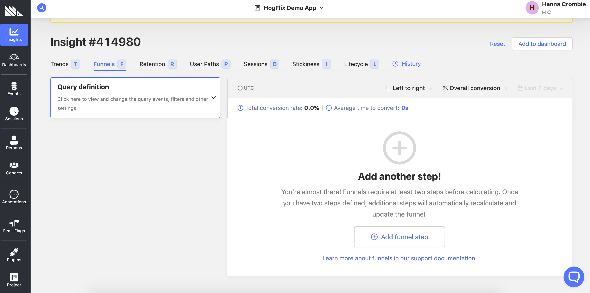
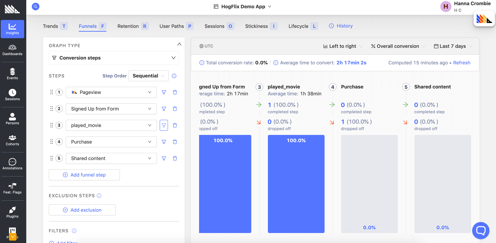
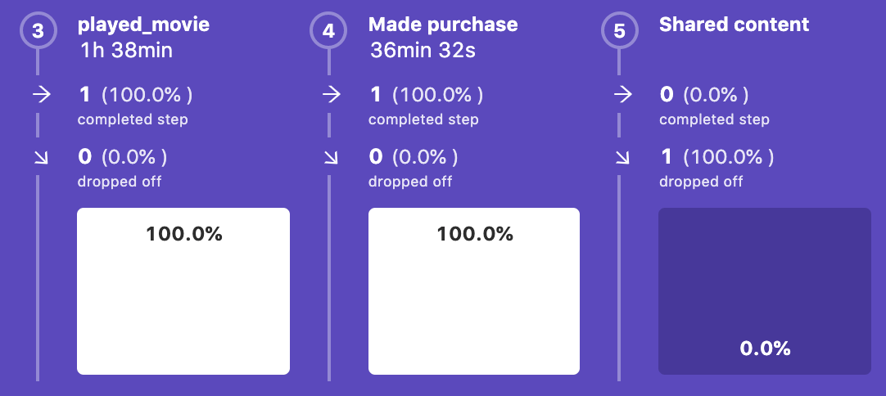

Applying pirate metrics to your business is a really efficient way to determine where you are losing customers and how you should be optimizing your marketing and sales funnel, especially when you are just getting started with metrics.

## What are pirate metrics and what do they have to do with analytics?

The pirate funnel is a framework created by Dave McClure – lauded entrepreneur and co-founder of over 500 startups. His theory was that founders and CEOs should start by focusing on just 5 key metrics in order to be successful: _Acquisition_, _Activation_, _Retention_, _Referral_ and _Revenue_. Also known well by their acronym A.A.R.R.R (me hearties – get it?).

Growth hackers use the pirate funnel to identify the weakest point in a customer acquisition cycle and see where they need to focus more effort. Simply put, if you aren’t sure where you’re going wrong, this is a great place to start.

In this tutorial we’ll walk through how to create an A.A.R.R.R. funnel using PostHog insights.

## Step 1: Define your funnel stages

The stages are open for interpretation and will look different for every business. Start by examining your user journey and identifying the most important steps people take, like signing-up, adding an item to the basket, adding a new task to their dashboard, or completing a purchase.

There are a lot of [great resources](https://ms-mbalke.medium.com/aarrr-framework-metrics-that-let-your-startup-sound-like-a-pirate-ship-e91d4082994b) which can help you figure out how to define your funnel steps and how to adjust the framework to work for you. Different companies will interpret the funnel differently. Depending on your business model you might consider the acquisition stage to be represented by a new customer gain rather than a page visit, or want to swap the retention and revenue stages because repeat engagement may be more important.

For this tutorial we’re going to be using HogFlix, a demo app built for streaming movies.

A successful customer acquisition journey for a HogFlix looks like:

1. **Acquisition**: a potential user lands on the HogFlix website
2. **Activation**: the user is interested, and begins a free trial by signing up for a free account
3. **Retention**: the user enjoys the experience and watches a movie during their trial
4. **Revenue**: the user signs up for a paid account
5. **Referral**: the users shares the site with a contact

These are the steps we’ll track in each stage of our funnel in order to determine where the successful (and not so successful) parts of our pipeline are.

Before getting started with the funnel, it’s important to make sure all of these events are properly defined and working in your event pipeline. PostHog has the capability to capture all front end events automatically, so you won’t need to add track(‘event’) to individual buttons or parts of your product, but if you need to generate more refined event or action metrics for your funnel, you can [read about how to do so in our docs](https://posthog.com/docs/user-guides/events).

## Step 2: Navigate to 'Funnels'

On your PostHog app you’ll find the ‘Funnels’ feature tab located inside ‘Insights’.

## Step 3: Adding steps to your funnel

Once you’re here, you can begin to create your five step funnel.

### Acquisition: Getting customers in

In the pirate funnel, acquisition refers to how many people visit your site from any channel. For this step we’ll be measuring pageviews.

Click on the ‘Add funnel step’ button and use the ‘Select action’ box on the left hand side of the dashboard to add a step with the ‘Pageview’ event. You can see that the properties for this event are automatically set as ‘when a user loads (or reloads) a page’.

Because a funnel relies on at least two steps to calculate conversion success, you won’t see a conversion comparison until you add your second step.

### Activation: the first move

Activation is the first important interaction that a user makes with your product. It might be signing up for an account, downloading an app or posting a comment.

For HogFlix, we count entering a free trial as the activation metric for users and we want to see what percentage of visits to the website result in sign ups for this.

Use the ‘Add funnel step’ button once again. This time the metric will be based on the ‘Signed Up from Form’ action which shows how many users have completed the sign up process for a free trial on the HogFlix website.

Our Autocapture functionality will capture a lot of frontend elements by default, but if you need more nuance in your activation metrics, you can also [set up or group actions manually](https://posthog.com/docs/user-guides/actions).

Now that we have a couple of steps in our funnel, it is beginning to take shape and tell a story.

Already we can see the conversion percentage, and that there seem to be no issues in getting users to move through to the activation stage.

To get the full picture however, the rest of the steps will need to be added.

### Retention: proving your value

Of course, you want the users of your product to stick around. The metrics measured for retention tell you more about the regular interactions users are having with your site, how much value they might be getting out of it, and where they need product improvements. 

Users dropping out during the retention stage is often the first big flag that you might have a poor user experience or a faulty product.

There are a number of actions you may want to track to tell you about user retention. They could include users returning to your site, turning on and interacting with push notifications, feature usage, and stickiness (how often people use the product).

We want to track the number of users who watch a movie during their free trial. We might count users watching at least one movie during their free trial as a success metric for retention, so the ‘played_movie’ event will be used as the next step in our funnel.

### Revenue: time to level up

Monetization is the root of the financial health of your business, meaning at some point users need to convert to customers. The revenue stage of the funnel sets a goal to track how well initial users are converting to paying customers. This might mean upgrading a free plan to a premium subscription, continuing usage after the end of a free trial, or purchasing additional features.

In the case of HogFlix, users who proceed through the payment process following their free trial are counted as a successful metric for the revenue stage. The ‘Made purchase’ action defines the fourth stage of the A.A.R.R.R. funnel.

### Referral: sharing is caring

Referrals can be a golden metric for many companies. Evidence that your customers are working for you to promote your product is proof that you are providing a strong user experience. [Word-of-mouth marketing is broadly considered the favourite](https://www.investopedia.com/terms/w/word-of-mouth-marketing.asp) and most effective form of marketing amongst executives and customers.

There’s a big difference between a happy customer and a brand evangelist. Taking the extra steps which encourage users to become a campaigner for your product, whether that’s providing content which is easy to share, offering referral programs or reaching out directly, can offer a huge ROI.

Referral is the final step of the funnel to add here, and has been defined as a sharing event by users who have completed the rest of the journey.

## Step 4: Refining your metrics

You can now add a filter to specific actions or a general filter to the entire funnel ('Filters' -> 'Add filter'). You can filter events by [properties](https://posthog.com/docs/integrate/client/js#sending-user-information) and [cohorts](https://posthog.com/docs/user-guides/cohorts).

It's also worth noting how the funnels work in terms of what counts as a conversion. When your funnel is ready, you will be able to specify a time range, such as "Last 7 days", "Last 30 days", or a custom range.

Based on that time range, PostHog can determine conversion based on if the user performed one action after the other at any point during the time period. That means that if my time range is set to 30 days, a user may perform step 1 on day 2 and step 2 on day 13 and it will still count as a conversion.

## Step 5: Saving your funnel

It can take some time to figure out how best to define the requirements for all of the funnel stages for your business. Luckily PostHog makes it easy to iterate on your funnel and run multiple versions so you can test which metrics work best for you.

Now that your basic funnel is created you can save it to your dashboard by clicking on the ‘Add to dashboard’ button in the top left hand corner.

## Step 6: Find your bottleneck

When starting out with a pirate funnel, it might seem like finding the root of your conversion problems is going to be the hardest part, but this step is easier than you think.

PostHog funnels automatically calculate conversion and dropoff, so you can instantly see where your largest percentage of users drop off in the process. This is your bottleneck.

Do look at them relatively of course. Some steps may be unfair to compare to others, especially if you have spent a significant amount of time refining your funnel properties. You may have added additional actions or filters which you may want to experiment with before determining the best place to focus on.

At HogFlix there is a significant drop off at the referral stage. Despite the great success from acquisition to revenue, there’s something keeping customers from really falling in love with the platform enough to promote the service to others.

## Step 7: investigation

This is where you want to turn from hard data to soft data. The broad metrics used to create an A.A.R.R.R. function as a kicking off point to let you know where your problem areas are. 

Now it’s time to do a deep dive into the user journey in our bottleneck and figure out where the dropoff comes from. This can be via direct outreach and further data analysis. Perhaps you need to get a survey out to your customers to find out about how they are experiencing this part of the customer journey, or maybe there are already new features which you have in mind to solve the problem.

There are a host of other features you can use on the PostHog platform to explore the area. The [toolbar](https://posthog.com/docs/tutorials/toolbar) offers a heatmap feature, providing valuable context about how users navigate your website or app, so you can determine how to display information and structure your product in a way that steers users towards that next stage of the funnel.

[Feature flags](https://posthog.com/docs/user-guides/feature-flags) are a fantastic tool for safely experimenting with deploying and rolling back new features which you have identified as possible solutions to your bottleneck. For example, here we might want to add a strong CTA which encourages users to share content with friends or provides a discount code based on referral. By rolling out to a percentage of your users you can build new funnels which test the impact based on specific cohorts so you can see the impact.

## Step 8: Getting meta with it

The possibilities for steps you can create between your steps are endless. You can use filters, cohorts and custom actions to refine your data on a much larger scale, segment your users by behaviour or channel, and really zoom in on interactions.

Creating different funnels for different kinds of users or adding more steps to a funnel could also give you a better idea of where you want to focus attention.

Ultimately, the A.A.R.R.R. framework serves as a great tool for considering the most critical metrics available to you so you can break down KPIs and prioritize efficiently. If you can apply the principles of the pirate funnel to your business, you’re already in a really healthy place to create a data-driven product.
