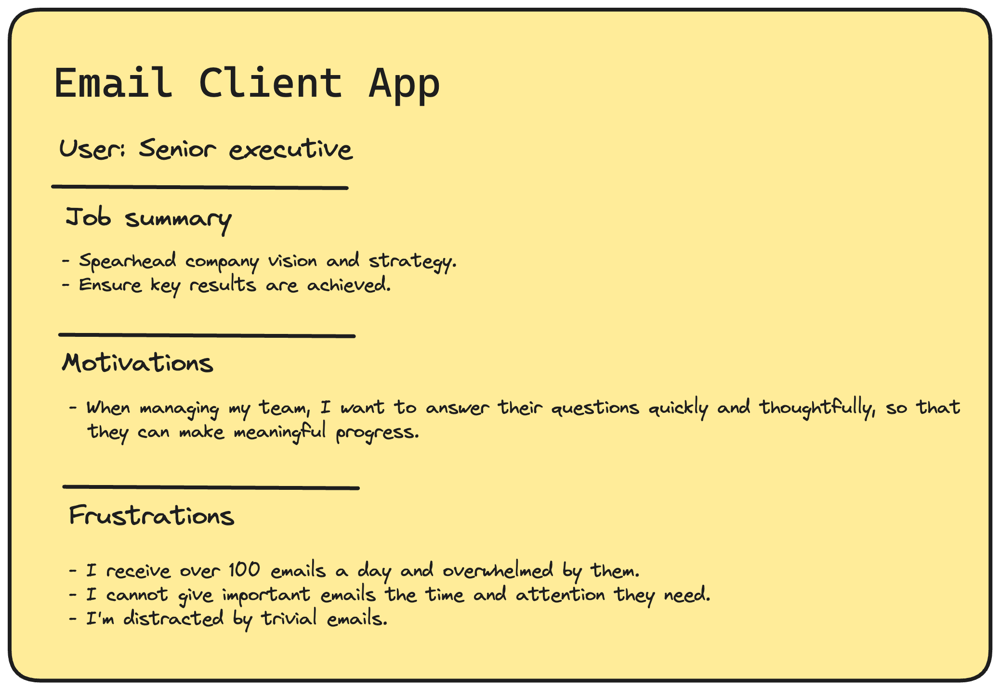

The best products are built by engineers that deeply understand their users' problems. A great way to do this is by creating user personas. But what are they exactly? And what makes a good one?

In this post we'll dive into those answers, as well as show you how to make your own one.

## What are user personas

Personas are a generalized way of talking about the people who are using your product. This enables you to visualize them while you're building your app.

This is different from other personas, like buyer personas or ideal customer profiles (ICPs), who may not actually use your product. 

Here's a quick comparison:

- **ICP:** Companies that buy your product.
- **Buyer:** The person who sign off on the purchase.
- **User:** The people who actually use your product. 

As an example, here's how these different personas look like for our company:

<Caption>Our ICP are companies that have engineers as decision makers. The buyer is the VP of engineering, but the actual users are the developers in the company.
  
Credit to <a href="https://www.developermarkepear.com/blog/developer-personas">developer markepear</a> for the original image.</Caption>

## What makes a good user persona

A great persona enables you to clearly picture who your user is. To do this, your persona needs to highlight the following:

1. **Job Summary** – your user's skills and responsibilities. 
2. **Motivation** – what their goals are.
3. **Frustrations** – what's blocking them from achieving their goals.

If it helps you visualize your user, you can also include other information such as workflows, tools, or jobs to be done.

Below are three examples of what user personas could look like for different companies:

If you're looking for more examples, GitLab has published the [16 different personas they use](https://about.gitlab.com/handbook/product/personas/).

## How to build a user persona step-by-step

### Step 1: Speak to your users

Here are three key questions you need to ask your users:

1. What is your job title?
2. What are you using [name of your product] to do right now?
3. What obstacles do you face when trying to accomplish your goals?

These will tell you you who your users are, what motivates them and what their problems are.

The quickest and easiest way to ask these questions is with an [in-product survey](/surveys):

If you need to go more in-depth, you can also conduct interviews with your users. Good questions to dig into in these interviews are:

- What are your main responsibilities in your current role?
- How do you define success in your role?
- Can you walk me through a typical task or project from start to finish?
- What problem does our product solve for you? Which problems doesn't it solve?
- Why is [name of specific feature] important for you to complete specific tasks?

> Need more tips on how to interview your users? We've written a guide on [how to uncover your users' real problems](https://newsletter.posthog.com/p/how-to-uncover-your-users-real-problems)

### Step 2: Distill their answers

Once you've spoken to your users, the next step is to transform their answers into something that's easier to understand. 

Do this by grouping responses into categories. What you're looking for are themes in their responses – specifically where 50% or more of users highlight specific needs.

For example, let's say you're building an email client. You ask your receive what obstacles they face when trying to achieve their goals and here's what they:

| Job title | Participant’s answer | Themes |
|--------------------------------------------------------------------|-----------------------------------------------------------------------------------------------------------------------|---------------------|
| **CTO** | I get distracted by too many non-priority emails that appear at the top of my inbox. | Email overload, prioritization |
| **CEO** | Notifications don't work properly, so I miss important updates. I end up prioritizing the wrong work | Missed information, prioritization |
| **Founder** | I feel overwhelmed by the volume of emails I receive daily. It's hard to prioritize tasks. | Email overload, prioritization |
| **Developer** | The search function in my email client is too slow, making it hard to find old emails. | Slow search |
| **Head of Product** | Due to the high volume of status updates I get via email, it's challenging to understand the overall project progress. | Email overload, project management |

In the above, we see that our core users are senior leaders. The two most common themes are **email overload** and **prioritization**, so it's important to include this in your persona.

### Step 3: Combine your data with product analytics

Dig into your findings from user research with actual product data. This helps you understand how users that match your key persona are using your product, and whether their stated problems and behaviors align with real-world usage.

For example, continuing on our previous example of an email app, we could use product analytics to the following questions:

| Theme               | Data questions    |
|--------------------------------|----------------------------------------------------------------------------------------------------|
| **Email Overload**             | How many emails do they receive every day?                                                          |
|                                | How much time do they spend in the app compared to other users?                                    |
|                                | Which folders or categories have the highest volume of unread emails?                              |
| **Prioritization**             | What percentage of users who mention "prioritization" use features related to sorting or flagging emails? |
|                                | Are there features within the product they aren't using that could help address this problem?      |
|                                | How frequently do these users set reminders or snooze emails?                                      |

To help you brainstorm questions for your own product, here's a list of common questions to ask:

- How often do they use your product?
- What are their most used features?
- Which features are rarely or never used?
- Are there common drop-off points or areas of friction?
- How do users from different job titles or roles use the product differently?

### Step 4: Put it all together

You should now have enough information build your persona. You persona should be detailed enough that it accurately represents your user, but concise enough that it's easily understood by your team.

Finishing our email app example, here's what the user persona looks like:

## Next steps

Once you've created your user persona, the next step is to integrate it into your workflows. You can use it as a reference in team discussions and brainstorms. This ensures that the voice of the user is always at the forefront of decision-making, leading to products and services that truly cater to their needs.
