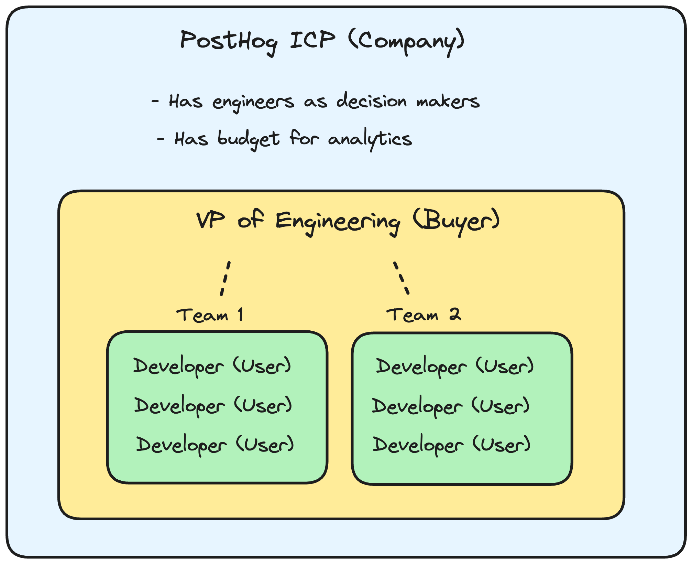
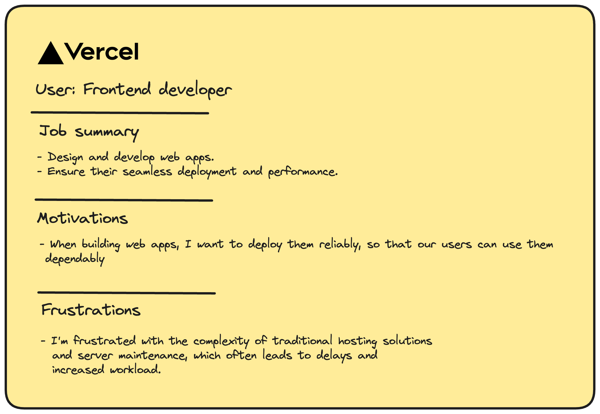
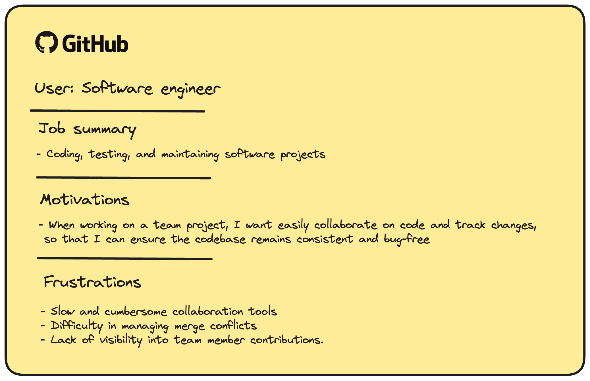
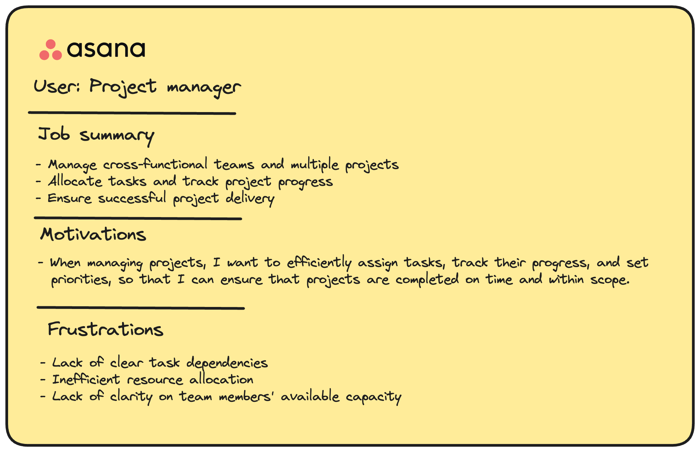
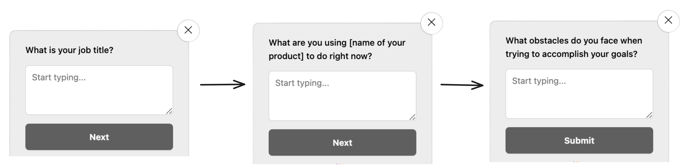

The best products are built by engineers that empathize with their users and deeply understand their problems. A great way to do this is by creating user personas, which enable you to visualize your user while you're building features for them.

## What are user personas

Personas are a generalized way of talking about your the user you are building for. Keeping personas in mind during development allows us to use the correct language, design, and make the best decisions to address their specific problems and pain points

User personas are people who are actually using your product. This is different from other personas, like buyer personas or ideal customer profiles (ICPs):

- **ICP:** Companies that buy your product.
- **Buyer:** The person who sign off on the purchase.
- **User:** The people who actually use your product. 

Using PostHog as an example, the below image shows an example of these different personas:

<Caption>The difference between PostHog's ICP, buyer, and users. Credit to [developer markepear](https://www.developermarkepear.com/blog/developer-personas) for the original image</Caption>

## What makes a good user persona

A good user persona enables you to clearly picture who your user is. To do this, your persona needs to highlight the following information about your user:

1. **Job Summary** – General description of skills and responsibilities. 
2. **Motivation** – what are their goals. A good format for this is `When [situation], I want [feature] so that I can [task]`.
3. **Frustrations** – what's blocking them from achieving their goals.

If it helps you visualize your user, you can also include other information such as workflows, tools, or jobs to be done.

Below are three examples of what user personas could look like for different well-known products:

If you're looking for more examples, GitLab has published the [16 different personas they use](https://about.gitlab.com/handbook/product/personas/).

## How to build a user persona: Step-by-step guide

### Step 1: Speak to your users

As mentioned above, a good user persona tells you who your users are, what motivates them and what their problems are. Here are three key questions you need to ask your users:

1. What is your job title?
2. What are you using [name of your product] to do right now?
3. What obstacles do you face when trying to accomplish your goals?

The quickest and easiest way to ask these questions is with an [in-product survey](/surveys).

You can also conduct interviews with your users. Good questions to dig into in interviews are:

- What are your main responsibilities in your current role?
- How do you define success in your role?
- Can you walk me through a typical task or project from start to finish?
- Why is [name of specific feature] important for you to complete specific tasks?
- What problem does our product solve for you? Which problems doesn't it solve?

> Need more tips on how to interview your users? We've written a guide on [how to uncover your users' real problems](https://newsletter.posthog.com/p/how-to-uncover-your-users-real-problems)

### Step 2: Distill your data

Once you have spoken to your users, the next step is to transform the qualitative data into something that's easier to understand. Do this by grouping responses into themes and tallying the counts of all themes. 

Here's an example:

| Question asked | Participant’s answer | Themes |
|--------------------------------------------------------------------|-----------------------------------------------------------------------------------------------------------------------|---------------------|
| What obstacles do you face when trying to accomplish the goals for your job? | I dislike having to use so many different apps to do my job. It causes me to often miss important information. I wish there was one app that did everything. | Missed information. App overload |
| | Notifications don't work properly, so I miss important updates. | Missed information |

What you're looking for are trends in your responses. Specifically, where 50% or more of users highlight specific themes.

Finally, compare your survey and interview results with actual product data. This helps you validate how users that match your key persona are using your product, and whether their stated problems and behaviors align with real-world usage.

Questions you should answer using your analytics:

- How often do they use your product?
- What are their most used features?
- Which features are rarely or never used?
- Are there common drop-off points or areas of friction?
- Which marketing channels drive the most engaged users?
- Which user cohorts are most valuable or have the highest lifetime value?

## HOW TO USE PERSONAS

ANything specific to engineering?

5–2. Stage Two — Use Personas to Explore Design Solutions

After we move on to product design, specific stories (sometimes called scenarios) become an excellent guide during the design process. To understand why prepare scenarios for our personas are useful for our design solutions, we can see how Lene Nielsen described the relationship between them:

“A scenario is a written story that describes the future use of a system or a Web site from a specific, and often fictitious, user’s point-of-view. …You can give each of your personas life by creating scenarios that feature them in the role of a user. Scenarios usually start by placing the persona in a specific context with a problem they want to or have to solve., ” — — Lene Nielsen

In other words, when scenario and personas are put together, we can clearly see how the product take impact on our target users. As Pruitt and Adlin mention that scenarios usually are assembled by these:

A specified person/user
A certain task or situation
User’s goal for that task
A time period
References to specific features/functionality the user will use.
Especially for the walkthrough scenario, which indicates what exactly the feature is and does. Furthermore, when target users are specific, the layout, color, and style choices are much clearer for visual designers.

5–3. Stage Three — Use Personas to Evaluate your solutions

It’s not the end after the overall product design is completed. Personas can also be used to evaluate whether the designs match the needs of users. We can use the same method mentioned in stage one — how we assess competitor’s products by using the personas to “walk through” the user experiences. (Pruitt and Adlin, 2008)

Not only do personas directly contribute their value to the design process, but also for starting other user researches, such as recruiting profile for usability testing. It can be used for the QA team and testers to create more holistic test cases.

5–4. Stage Four: Use Personas to Support the Release of Your Product

Personas are a common language between the marketing, sales department, and product development department. It perfectly makes up the gap between them ( in many companies, this problem always exists.) By using personas helps these teams understand how a product works and who will be using it. The marketing and sales team can use them as a guide to finding potential customers.

## Other?

  * User persona vs buyer persona

 ## FAQ

 How many personas should be used within a company? How many is too many?

 There is no “correct” number of personas that a company should have. In general, personas should be distinct enough from one another, so that one persona is not easily mistaken for another. The more personas you have, the greater the chance that team members will not remember distinct information about them. A simple way to determine the number of personas within a company is to identify the most important user groups that you want to target with your product and create personas based on those groups.

 * Dont Create a thousand personas. While it’s great to get really detailed with your personas, this doesn’t mean that you need to create one for every single actual user. If you’re a product built for everyone (rare, but go you!) stick with 4 or 5 ideal users who represent your most significant user segments. Imagine if Google created user personas for every single different type of person who uses the search bar.

Is a broader persona better or worse than a detailed one?

Personas should be detailed enough that they can be believable, but should be broad enough to represent specific types of user groups. The level of detail desired for personas will depend on the goal of the effort. Ideally, personas should be detailed enough to at least cover each of their goals, motivations, and frustrations.

(Maybe) How is user persona different from ICP?