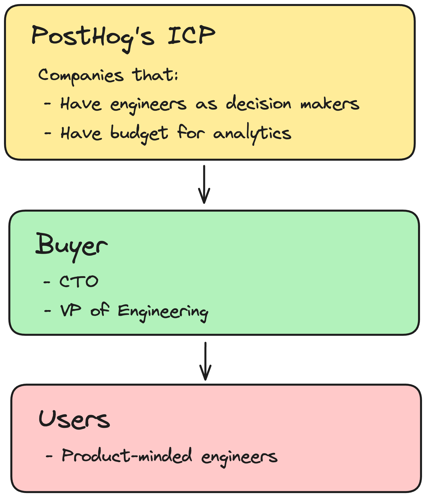
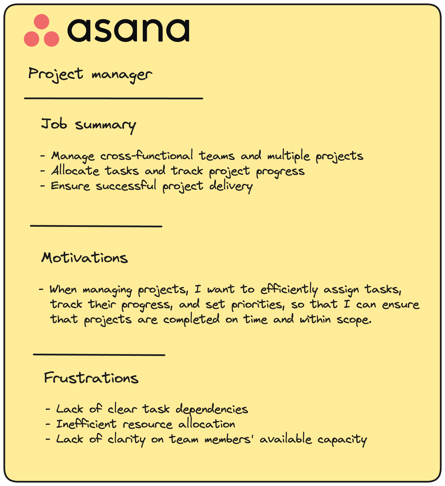
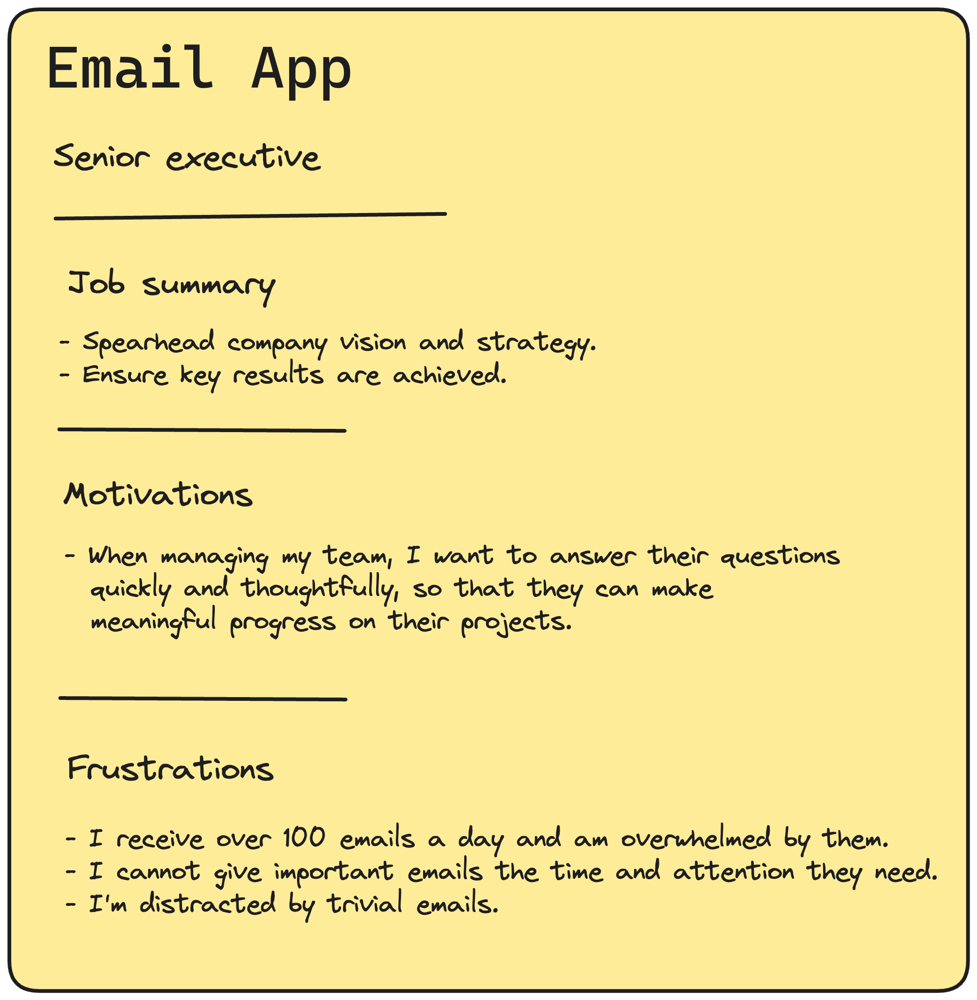

## What is a user persona? 

User personas are a generalized way of understanding and talking about the people using your product. This enables you to empathize with them and focus on their needs while you're building for them.

Users personas are not the same as buyer personas or ideal customer profiles (ICPs), who may not actually use your product. 

Here's a quick comparison:

- **ICP:** Customers (companies, teams, or individuals) that buy your product.
- **Buyer:** The person who sign off on the purchase.
- **User:** The people who actually use your product. 

As an example, here's how these different personas look like for PostHog (that's us!). We're an all-in-one platform created to help engineers to build better products:

## What makes a good user persona?

A great user persona needs three things:

1. **Job Summary** – your user's skills and responsibilities. 
2. **Motivation** – what their goals are.
3. **Frustrations** – what's blocking them from achieving their goals.

If it helps you visualize your user, you can also include other information such as workflows, tools, or jobs to be done.

Here are three, real-world user persona examples from well-known companies:

1. **Vercel's** primary user persona is a front-end developer who wants simple solutions to deploying and hosting apps.

2. **Github's** primary user persona is a software engineer who wants an easy way to maintain and collaborate on code.

3. **Asana's** primary user persona is a project manager who wants to track tasks and deliver successful projects.

If you're looking for more examples, GitLab has published the [16 different user personas they use](https://about.gitlab.com/handbook/product/personas/).

## How to define your user persona – step-by-step guide

### Step 1: Speak to your users

Here are three key questions you need to ask your users:

1. What is your job title?
2. What are you using [name of your product] to do right now?
3. What obstacles do you face when trying to achieve your goals?

This will tell you you who your users are, what motivates them, and what their problems are.

The quickest and easiest way to ask these questions is with an [in-product survey](/surveys):

If you need to go more in-depth, you can also interview your users. Good questions to dig into in these interviews are:

- What are your main responsibilities in your current role?
- How do you define success in your role?
- Can you walk me through a typical task or project from start to finish?
- What problem does our product solve for you? Which problems doesn't it solve?
- Why is [name of specific feature] important for you to complete specific tasks?

> Need more tips on how to interview your users? We've written a guide on [how to uncover your users' real problems](https://newsletter.posthog.com/p/how-to-uncover-your-users-real-problems)

### Step 2: Distill their answers

Once you've spoken to your users, the next step is to reshape their answers into something easier to understand. 

Do this by grouping responses into categories. What you're looking for are themes in their responses – specifically, where 50% or more of users highlight specific problems or needs.

For example, let's say you're building an email client. You ask your users what obstacles they face when trying to achieve their goals. Here's what they:

| Job title | Participant’s answer | Themes |
|--------------------------------------------------------------------|-----------------------------------------------------------------------------------------------------------------------|---------------------|
| **CTO** | I get distracted by too many non-priority emails at the top of my inbox. | Email overload, prioritization |
| **CEO** | Notifications don't work properly, so I miss important updates. I end up prioritizing the wrong work | Missed information, prioritization |
| **Founder** | I feel overwhelmed by the volume of emails I receive daily. It's hard to prioritize tasks. | Email overload, prioritization |
| **Developer** | The search function in my email client is too slow, making it hard to find old emails. | Slow search |
| **Head of Product** | Due to the high volume of status updates I get via email, it's challenging to understand the overall project progress. | Email overload, project management |

In the above, we see that your core users are **senior leaders**, and the two most common themes are **email overload** and **prioritization**. Thus you'll include this in your user persona.

### Step 3: Combine your data with product analytics

Now that you have your qualitative data, you can combine it with quantitative data to paint a clear picture of who your users are. 

Product analytics unlock key insights into how users that match your user persona are using your product. You can confirm whether their stated problems and behaviors align with real-world usage.

Continuing on our previous example of an email app, we could use product analytics to answer the following questions:

| Theme: Email Overload    |
|----------------------------------------------------------------------------------------------------|
| How many emails do these users receive every day?                                                          |
| How much time do they spend in the app compared to other users?                                    |
| Which folders or categories have the highest volume of unread emails?                              |

| Theme: Prioritization    |
|----------------------------------------------------------------------------------------------------|
| What percentage of users who mention "prioritization" use features related to sorting emails? |
| Are there features within the product they aren't using that could help address this problem?      |
| How frequently do these users set reminders or snooze emails?                                      |

For example, our data may show that users who complain about email overload receive over 100 emails a day – an excellent detail to use in a user persona! 

To help you brainstorm questions to ask for your own product, here's a list of insights to dig into:

- What percentage of your active users match your user persona?
- How often do they use your product?
- What are their most used features?
- Which features are rarely or never used?
- Are there common drop-off points or areas of friction?
- How do users from different job titles or roles use the product differently?

> 💡 **PostHog Tip:** If you're using PostHog, you can use filters to create a [cohort](/docs/data/cohorts) of users in your user persona. Then, you can easily break down your insights using this cohort.

### Step 4: Create a user persona with your findings

The final step is to use what you've learned about your user and create a user persona. Summarize your findings into the three key categories we mentioned earlier (job summary, motivations, and frustrations).

Make your summary detailed enough to show who your users are, but keep it short and simple so your team can understand it easily.

To illustrate this with an example, below is the completed user persona for our example email app. We created this persona after learning that:

- Our key users are senior executives.
- Email overload is their biggest pain point
- Prioritization is important to them.
- People who complained about email overload were receiving 100 emails a day.

## Next steps

Your user persona is the voice of your user. It should guide your product development and company strategy. 

Incorporate them into team meetings and encourage your team to always ask, "How will this benefit our key user personas?". By doing so, you build a culture of empathy for your users, ensuring that you make the best products for them.

For instance, at PostHog our product teams use our personas to create their team mission, values, and quarterly goals. Since our company handbook is public, you can view precisely how by visiting each team's page – e.g., our [Feature Success](/handbook/small-teams/feature-success#personas) and [Web Analytics](/handbook/small-teams/web-analytics#who-are-we-building-for) teams.

## Frequently asked questions

### How many user personas should I have?

There are two things to remember:

- The more personas you have, the greater the chance team members will not remember information about them.
- Your user personas should focus on your most important user groups — those people you really want your product to reach.

With this in mind, having only one user persona may be enough. You should have at most five, though.

### Can a user persona be a real person?

No, a user persona should not be a real person. If you model your persona on a single person, you're likely to end up over-optimizing your product for their needs while ignoring the needs of your other users.  

User personas should be based on research and insights gathered from many users, not just one. This way, they can guide decisions that benefit your entire target audience.

### What are the benefits of user personas?

Here the key benefits of having user personas:

1. **More empathy for your users**: User personas highlight their needs, goals, and frustrations. This ensures that your work is aligned with what they genuinely require, leading to better products.

2. **Better team communication**: By providing a common understanding of who your target users are, user personas enable clearer discussions about their needs and experiences.

3. **Strategic alignment**: A well-defined user persona acts as a north star for teams, guiding product development, marketing strategies, and customer outreach efforts.

## Further reading

- [10x engineers talk to users](/product-engineers/10x-engineers-do-user-interviews)
- [How to turn user interviews into actionable snapshots](/product-engineers/interview-snapshot-guide)
- [How to write great product survey questions (with examples)](/product-engineers/product-survey-questions)