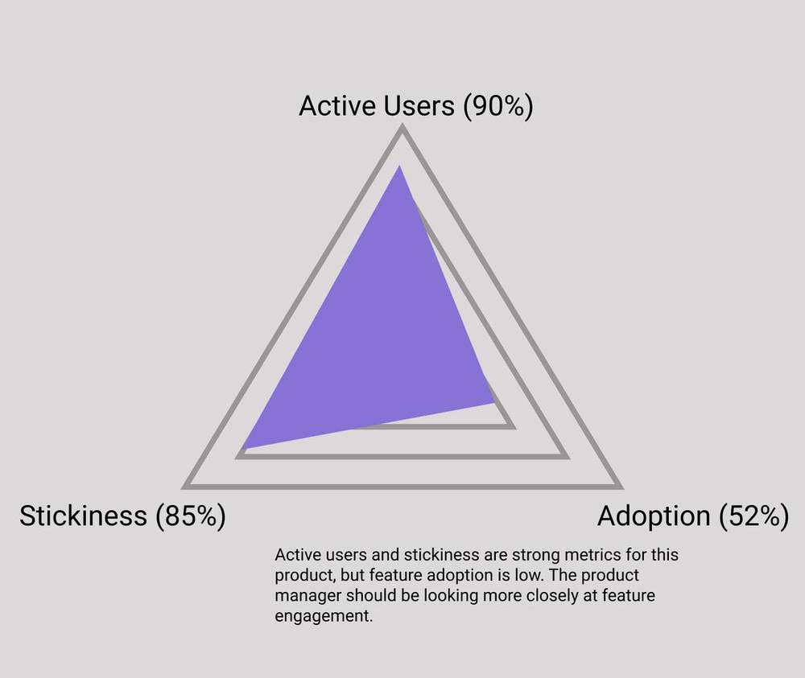
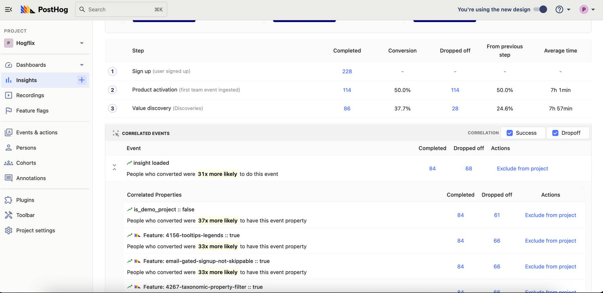

Product engagement is the most important factor when it comes to driving retention and revenue for your business. Though it seems easy to view success through a financial lens, revenue alone is rarely a clear indicator of a sustainable product. 

In this article we’ll take a look at why strong customer engagement metrics are vital to the success of your product, how to define engagement for your platform, and how to use analytics tools to measure and build on the results.

**Contents:**

- [What is product engagement?](#what-is-product-engagement)
- [What are product engagement metrics?](#what-are-product-engagement-metrics)
- [What is the best way to measure product engagement?](#what-is-the-best-way-to-measure-product-engagement)
- [What tools are good for tracking product engagement?](#what-tools-are-good-for-tracking-product-engagement)
- [Further reading](#further-reading)

> This article is part of our [PostHog Academy series](/tracks) where we explain the fundamentals of product analytics.

## What is product engagement?
The golden rule for any product manager: [listen to your users](https://posthog.com/handbook/product/user-feedback).

Product engagement metrics measure how active your users are and how they spend time with your product. They give valuable insight into what is resonating, and what’s not quite hitting the mark. Knowing more about the specifics of customer engagement can inform your product roadmap going forward, so you build more features that matter and don’t dilute your offering with ones that don’t. 

Churn is a metric we associate closely with customer satisfaction but alone it isn’t sophisticated enough to explain _why_ your customers do or do not stay. It’s also a lagging metric – it can take at least 30 days just to understand that a customer is not coming back, during which you’ve lost precious time.

Your users are constantly providing feedback through their actions; which features they interact with, how they scroll, where their mouse hovers. By interpreting those actions, you’ll better understand what keeps them on your platform and be able to build more of what they need and love.

Product engagement also makes a great [North Star Metric](https://posthog.com/blog/north-star-metrics), as it’s usually a reliable forecast for retention and can provide a strong foundation for product development.

## What are product engagement metrics?
The engagement metrics you need to track will depend on what your business looks like and what your product is.

In order to use the right product engagement metric for your organization you need a strong understanding of your customer personas. What does your ideal user look like? How do they interact with your platform? What are the revenue drivers attached to them?
By examining your personas and how their individual actions influence revenue and growth, you can select the most appropriate engagement metrics for your product.

### Common engagement metrics
If your product is an online service which users engage with regularly then **interactions** are a key metric. Social media platforms, for example, look at numbers of likes, comments and shares.

For gaming products **session duration** is likely to be a good indicator of positive user engagement. The longer users play, the better. 

If you're a business which delivers content then your key metric should be based on how that content is delivered. YouTube may base engagement metrics on **views**, for example, while Google may use the number of **search queries**.

The individual metrics are limitless. You’ll see **pageviews**, **bounce rate**, **page scroll depth**, **purchases** and many more used as KPIs for different business models. It’s important not to choose these glibly, but to make sure you’ve chosen the perfect fit for your product.

## What is the best way to measure product engagement?
Listening to users’ actions is important, but how can you track engagement metrics and translate them into actionable insights?

A good way to get started is to use some basic metrics to create a broad framework for engagement insight. The following metrics are very easy to track with the help of product analytics software such as PostHog (pictured above).

### Active users
Active users are those who perform valuable actions on your platform. 
Daily Active Users (DAU) is a key metric for subscription services and is expressed as a percentage of total users. High DAU is evidence that you’ve been successful in attracting customers. On PostHog, you can track this by [defining actions for key activities, such as daily sign-ins](https://posthog.com/docs/user-guides/actions).

This metric is particularly important if you’re working with an ad-based revenue model. The number of daily users you see is directly linked to your profitability, so you should be keeping a close eye on DAU.

### Stickiness
Imagine you’re a customer at a local hair salon. 

You like the cut you’re given, so you book to go back. That’s great for their business – at that salon you’re considered a sticky customer. 

The stickiness metric validates that your customers are happy and are likely to keep using your product. It’s a good demonstration of [retention](https://posthog.com/blog/introduction-to-customer-retention).

Again, the way you measure stickiness will depend on your business but many product managers calculate stickiness using this formula: 

> DAU ÷ MAU. 

This will show you what percentage of customers you’re retaining over a period of time. 

An easier way to track this is to use a tool such as PostHog, which has a dedicated stickiness tool which can be used to track the stickiness of any defined action and gives a granular view of how this correlates to engagement. 

### Adoption
Adoption represents the number of users using key features in your product.
Each new feature presents an opportunity for additional customer value. Low adoption implies that you’re offering something which users don’t need, or that there’s something wrong with the feature itself. High adoption means users are flocking to a new feature.

If users are paying for features they don’t use then it lowers the perceived value, so it’s essential to keep an eye on what isn’t working and rollback where necessary. That’s why PostHog offers tools like [feature flags](https://posthog.com/docs/user-guides/feature-flags), which help you to incrementally roll out new features and key an eye on adoption progress. If something isn’t working, you can roll it back instantly. 

[Flagging the use of specific features as a key event](https://posthog.com/docs/user-guides/events) per user type will also help you to track adoption.whether you’re successfully reaching the users they were intended for.

By comparing the values of these metrics against each other you can begin to get an idea of where you’re winning on product engagement, and where you might be losing out. 

## What tools are good for tracking product engagement?
Naturally, we think PostHog is the best tool for tracking product engagement. 

This is because, in addition to tracking the metrics above, PostHog enables you to understand their context through tools such as  [Session Recording](https://posthog.com/docs/user-guides/sessions), [Heatmaps](https://posthog.com/docs/user-guides/toolbar#inspecting-elements), [Cohorts](https://posthog.com/docs/user-guides/cohorts) and [Correlation analysis](https://posthog.com/docs/user-guides/correlation). You can also [create dashboards](/templates) to monitor engagement continuously.

Paying attention to engagement and building more of what your customers love is a sure way to turn them from regular users into fans and advocates. Stay on top of your user engagement, listen and respond, and you’ll turn casual customers into product champions.

## Further reading

- [Finding your North Star metric and why it matters](/blog/north-star-metrics): Successful products need actionable metrics. Here's how to find them.

- [What is user segmentation?](/blog/how-to-do-user-segmentation): A quick guide to user segmentation and how to apply it to your business

- [B2B Product Metrics 101:](/blog/b2b-saas-product-metrics): Everything you need to know about metrics for B2B SaaS products

> PostHog is an open source analytics platform you can host yourself. We help you build better products faster, without user data ever leaving your infrastructure.

<ArrayCTA />

