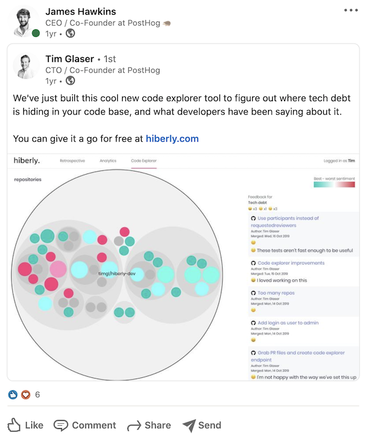

PostHog has pivoted so many times, I don't even try to explain it to people.

After 3 pivots in 6 months, we got into YCombinator last year, pivoted again whilst we were there and have now gone from the first commit to $12M raised, thousands of deployments and a team across 10 countries, in well under a year.

This is that story and what we learned from it.

##You'll feel silly

It goes something like this:

1. Convince yourself then your family, friends and colleagues you have some great idea.
1. Quit your job.
1. Build it. Listen to the soundtrack from The Social Network way too much.
1. Everyone thinks your thing is terrible. Hopefully you realize.

The nature of a startup is that you have to talk to users. Or so we've heard.

I spent every day, all day, trying to talk to potential users of something that wasn't useful. I went through everyone I knew professionally, and many, many more I didn't. 

My sole focus for weeks on end was just to get meetings with people that we felt may have the same problem we were "solving".

## It got good eventually, right?

In around 9 months, we built 6 products and did more than 100 meetings with potential users.

The range of ideas is weirdly broad, but that reflects our backgrounds.

I started as a mediocre developer, bootstrapped an online marketing company, and somehow wound up as a VP Sales at an enterprise software company. Tim, my co-founder, has always been a developer through and through.

### 1. sales territory management tool

It's galling that when you run a sales team, very typically over 90% of your pipeline will never close. The _majority_ of your time is spent getting nowhere. Sidenote: this is why product led growth is so much better.

As deals get older, after a while, the probability they close drops off a cliff. If you're not getting anywhere with a potential customer after a few weeks or months of trying, it's going to get worse not better. Yet systems that are the core products of [\$17.1Bn revenue companies](https://en.wikipedia.org/wiki/Salesforce) by default come with a manually selected arbitrary number for the percentage probability.

We pulled data from Hubspot or Salesforce, then used predictive analytics to work out how this curve looked based on historic data, then applied it to the current pipeline. Once a deal dropped below a certain threshold, we'd recommend you swap out that target company and pull a new one into the pipeline.

We confused a lot of people with this idea, because we ourselves were confused with whom we were targetting.

We got 15 VPs of sales to agree to trying this out, sent them 

With hindsight, it was way overpowered for tiny teams and we'd only have had a great fit for huge ones with a lot of data. The only people interested in smaller teams were, to use [Crossing the Chasm's framework](https://en.wikipedia.org/wiki/Crossing_the_Chasm), innovators, which doesn't represent most of the market. And doing _only_ sales into big companies would be really tough - slower sales, a better product required, and a longer cycle time so reduced learning.

### 2. CRM with predictive analytics

We kept getting asked for the above in the CRM versus standalone, so we integrated it, but then we saw very early users just using it as their CRM - they didn't need the complexity of Salesforce, so we just thought we'd provide a CRM for tiny companies.

This was a poor decision - there are many "lightweight CRMs" out there, so getting attention was very hard, and predictive analytics make more sense for those with more data. This was around the time that [Superhuman](https://superhuman.com/) was getting pretty popular; we got overexcited, and kept using words like "blazing", "gorgeous", "brilliant".

We didn't think through who we were building for. The market is also pretty saturated with noise, so we could have focussed more on our differentiation - a product may have made more sense than a platform here. We couldn't get people to agree to try it. From memory we got a single customer for $20/month, who then didn't actually pay the invoice.

### 3. 1:1 tool with predictive analytics

We felt that the actual problem we were solving was still prioritization of where to focus time.

We were both big believers in [Andrew Grove](https://en.wikipedia.org/wiki/Andrew_Grove)'s [High Output Management](https://www.amazon.com/High-Output-Management-Andrew-Grove/dp/0679762884/ref=sr_1_1?dchild=1&keywords=high+output+management&qid=1610712757&s=books&sr=1-1).

By this stage, we were thinking we just wanted to work with people that would at least try our stuff.

### 4. technical debt monitoring tool using surveys after each pull request

We finally started getting a little clearer over those we were build

It turns out everyone has problems with technical debt, but solving it involves changing how teams prioritize.

We just weren't the right people to run this business. Although Tim had struggled with technical debt first hand, neither of us had struggled with actually solving it. If one of us had managed an engineering team before, we'd have perhaps been better placed to understand this area.

Along the way though, we learned a lot about how developers and product managers work together. We'd also created a large list of

If you can't stop thinking of other ideas, you probably are building something you don't like. 

### 5. engineering retention tool using surveys after each pull request

Those capricious engineers coming and going like ships in the night.

This idea didn't really come from us, which probably doomed it before it even really started. Amusingly we had to do a demo day dry run for this in front of 500 people who made up the YC batch.

This lasted all of about 5 days. We had a bunch of meetings left over from (4).

We had a wildly unenthusiastic response. The lowlight was during one of the meetings that we resorted to asking the CTO of an 80 person start up what his biggest problem was, "I've not really got any". Cool, we'll just run out of food and shelter then.

### 6. open source product analytics platform

Things were about to get meta.

Along the winding journey above, we got frustrated having to send all our user data to 3rd parties. It felt wrong and it meant we'd lose a bunch of user data that would have been quite useful.

## Types of problems we came up against

###Local versus global maxima

The hardest pivot to make was when we had the most traction. For us, that was dropping our technical debt tool.

It is *crucial* to be really quick at moving on when it's time. If you're talking about pivoting, you must immediately pivot or dramatically change your approach. We realized the actual reason we had to pivot was we were the wrong people to build the right product. It was obvious our existing product wasn't working because our users told us as such.

It's easy to imagine a world where we just about scraped by with the tool, raised a small seed round from oversubscribed investors, and we'd still be struggling with someothing we weren't enjoying working on.

###This sucks, let's change it

We pivotted so much we developed a real knack for building an MVP and a new website in a single all nighter and getting meetings by the first day to show it to people. In the same way that a child could operate a car.

We implemented an important rule:

1. If you decide to pivot, you have to wait at least until the next day to do it.

Our inclination was to pivot _very_ frequently, whereas it's apparently more typical for people to really not want to do this. Know where you sit on this line. We had to add a small delay.

During YCombinator, we saw companies say they were pivoting almost every time we saw them, but without having built and tested things out.

## Experts are just that

For the pivot to open source product analytics, there were a few things that speaking to experts helped us clear up:

* We saw open source as a feature, not as fundamental to the strategy. We spoke to Dalton Caldwell
* We met with a bunch of founders of huge open source companies. We only knew about half of them through other people. They ended up becoming angel investors when they saw we'd incorporated their advice into our work and that helped us raise a ton of money later on, but only because we weren't trying to sell them.

## We did some things really well

We continuously spoke to users, and we continuously built to see if we could recruit them onto something real. What people did and what we though they'd do often diverged.

## Other stuff we weren't good at

We didn't think about the users or companies we were building for. This is easy to over-think, but just a few hours of thought could have cut down the number of times we pivoted.

## Let's end on a cliché

The nice thing about writing a post about startups is there are enough of these illustrate my points very well.

"The people who are crazy enough to think they can change the world, are the ones who do."

As we tried more and more ideas, we stopped caring about what people thought of us, and we started thinking harder about who would really benefit from our product.