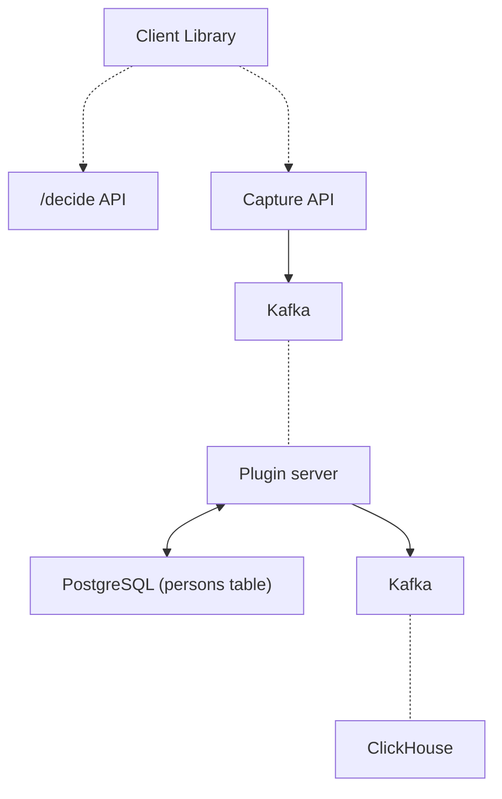

As a product analytics and data tool company, we ingest and process billions of events to help companies understand their products and build better ones. PostHog has many tools to help them do this such as customizable event capture, client and server libraries, data insights, and more.

We are constantly trying to help users do more with their data, but sometimes we can't build the customize solution they need. In this case, we aim to give users the tools to build it themselves. At one point, this thinking led us to realize users needed the ability to customize data processing. Many users wanted to add geographic data to events, get events from CRMs, export data to BigQuery, and more. Use cases were endless, so we needed to give them the ability to do this themselves.

To do this, we needed to add the ability to byukd and use apps integrated into our data pipeline where users send their events. The apps had to run tasks, process and modify events, and connect to external services. Users needed to be able to customize their data flows, creating solutions to their endless use cases.

Like many features, building this started as a hackathon MVP and developed into a service that now handles billions of events. Here are how we built it and the lessons we learned along the way.

## The three-day app MVP

Apps started as an MVP that came together in 3 days. Marius created it to scratch his itch for a world map that existed in Google Analytics but didn’t in PostHog. The map required location data from IP addresses. There were many services to do this, but connecting them to event data going was difficult.


The idea expanded to enable more modification of the events pipeline such as backing up data to S3, syncing GitHub stars, or getting customer feedback.

### Arbitrary app code in Python

The three-day hackathon led to the ability to write and run arbitrary Python code. It got downloaded from GitHub, extracted, and integrated into PostHog. It specifically required Python 3.9, because Python 3.8’s `zipimport` didn’t support the zip archives GitHub provides.

An app at this point looked like this:

```python
# exampleplugin/__init__.py
from posthog.plugins import PluginBaseClass, PosthogEvent, TeamPlugin
class ExamplePlugin(PluginBaseClass):   
    def __init__(self, team_plugin_config: TeamPlugin):
        super().__init__(team_plugin_config)
        # other per-team init code
    def process_event(self, event: PosthogEvent):
        event.properties["hello"] = "world"
        return event
    def process_identify(self, event: PosthogEvent):
        pass
```

Other features added included a plugin repository, an interface to configure the apps, and a CLI to preconfigure apps for custom installations. Two sample plugins were built with it: the currency normalizer (convert event properties to a single currency), and the coveted GeoIP app.

It didn’t take long for cracks to appear. First, it’s nearly impossible to manage Python dependencies via multiple `requirements.txt` files. There's no way to tell which dependencies your plugin's dependencies will install, without first installing them. There is [nothing like `pip --dry-run`](https://github.com/pypa/pip/issues/53). You need to install the `pip` package and run an `__init__.py` script inside the package to get its dependency tree.

What's more, all dependencies get installed together. This makes it just a matter of time before a plugin overrides an app dependency (e.g. `django`), and brings everything crashing down. This wasn’t going to work for us, so we needed to rebuild. 

## Rebuilding in JavaScript

After deciding to rebuild, the first attempt was using [PyMiniRacer](https://github.com/sqreen/PyMiniRacer) to generate JavaScript. PyMiniRacer is great for simple functions, but lacked support for async/promises and importing modules like `fetch` because it was raw v8, not Node. It also had a limited standard library. All of which led to the decision it also wasn’t going to work. 

### Another try in JavaScript with gPRC in Node

Marius also tried to develop and subsequently scratched a [gRPC](https://grpc.io/docs/languages/node/basics/) implementation in Node. He was able to call JS code from Python and get a response, but this approach left us with a lot of manual work. It raised questions such as "how many workers should respond to the gRPC calls?" and "how do we make sure no events are lost if the node gRPC server is down?” Apps needed to scale, so this also wasn’t going to work.

### Using Celery

In our main PostHog app, we use [Celery](https://docs.celeryproject.org/) to process events. When an event hits `/capture`, our API parses the request and queues the event into a job queue. Marius realized he could build a new server with the [Node port of Celery](https://celery-node.js.org/) and plug that in as another step in the existing pipeline.

This would solve all pending issues: we wouldn't have to worry about Python dependencies, we could potentially run untrusted code in a fast sandbox, there would be no process management for a gRPC link, and we could eventually rewrite the entire ingestion pipeline in Node to get a speed boost over Python.

Using celery required us to build a Node app that:

- Gets a stream of events from Python through a Redis queue (via [celery.node](https://celery-node.js.org/))
- Runs user-defined JavaScript on that stream of events.
- Sends them back to Python through the same queue for ingestion.

The first and last steps were easy enough with our app structure and Celery, but we needed to make sure the arbitrary, user-defined JavaScript code was securely run. 

### VMs to the rescue

The solution to the second step was to use VMs (Virtual Machines). Turns out Node. v14 has a [built-in VM module](https://nodejs.org/docs/latest-v17.x/api/vm.html) that enables running custom JavaScript in a separate context.

Using the VM module enabled Javascript code to be “compiled and run immediately or compiled, saved, and run later.” The downside was that “the VM module is not a security mechanism. Do not use it to run untrusted code.” This wasn’t unexpected. [Privilege escalation](https://en.wikipedia.org/wiki/Privilege_escalation) and [resource exhaustion](https://en.wikipedia.org/wiki/Resource_exhaustion_attack) attacks are real. We couldn’t avoid them, but we could build strategies to mitigate them.

Node's VM module also puts your code in an isolated context, has ~~limited~~ no support for secure communications with the host, and has holes like this:

```js
const vm = require('vm');
vm.runInNewContext('this.constructor.constructor("return process")().exit()');
console.log('Never gets executed.');
```

Thus we needed an abstraction. The two most popular are `isolated-vm` and `vm2` :

- [`isolated-vm`](https://github.com/laverdet/isolated-vm) is used by various big companies and claims to be secure. Each "isolate" runs in a new thread, with controllable CPU and memory limits. There are methods to copy data between the main thread and an isolate, and we can share objects and functions between the host and the isolate. It's not a perfect sandbox, but it's as close as we can get.
- [`vm2`](https://github.com/patriksimek/vm2) has a different isolation model. Each "VM" runs in an isolated NodeVM context, in the same thread as the rest of the app. There are no memory or CPU limits we can enforce. You run the code locally, but don’t share any variables with the host app.

While `isolated-vm` felt like a great fit because of its emphasis on security, its implementation [wasn't a success](https://github.com/PostHog/posthog/issues/6855#issuecomment-853879421).

> At the end of the day, I (Marius) would have had to implement some proxying code similar to vm2, just to get fetch working, and decided it's not worth the effort, considering the time budget and the extremely likely case that I'll leave in some security holes.

`vm2` didn't have this problem, as it had its own system of proxies that make sharing code between the host and the VM seamless.

Because of this, we decided to change our security model. On PostHog Cloud, we would vet the apps ourselves, before allowing everyone to use them. Self-hosted users were free to write and use as many [arbitrary apps](https://github.com/PostHog/posthog/issues/6855) as they please.

This maintains self-hosted users’ freedom, while still enabling Cloud users to benefit from community apps. Apps are all developed and tested in the open. We just need to do a final manual check before installing them. After launch, we found many of [our most used apps](/blog/the-state-of-plugins) came from our community, proving this decision’s success.

### What did we learn from all this?

- Python, which we wrote our ingestion pipeline in, wasn’t going to work. Dependency management was too difficult.
- Apps needed to scale while having access to some key JavaScript libraries. Using Node and Celery enabled us to integrate into our ingestion pipeline while providing the functionality we needed.
- We needed to make sure the code apps were running was secure and sandboxed. VMs were the answer to this, and Node had support for VMs.
- The default NodeVM wasn’t secure and couldn’t communicate with a host. `isolated-vm` was secured but needed proxying. `vm2` had the ability to proxy code, but was less secure. `vm2` and a review process for Cloud apps was the ultimate decision.

These learnings led to our current app structure.

## Evolving to the current app structure

After creating a basic MVP, and seeing the benefits of its usage, work continued on apps. They evolved and functionality grew over time. Where did they end up? Apps structure and features follow. 

### Structuring apps

The basic structure of an app has stayed the same since the JavaScript rebuild. Each app contains two key files:

- `index.js` (or `index.ts`) which contains key application logic, modifies events, connects with external services, and interacts with PostHog. It has an allowlist of libraries to use for utilities or interacting with other services. It also has access (through the VM) to meta information, storage, and logging.
- `plugin.json` contains configuration data for the app, what shows up in PostHog, and variables for end users to modify. The file contains the name, description, and other details that show up on the front end.

Here’s what a basic `index.js` looks like:

```js
// Some internal library function
async function getRandomNumber() {
    return 4
}

// Plugin method that runs on plugin load
async function setupPlugin({ config }) {
    console.log(config.greeting)
}

// Plugin method that processes event
async function processEvent(event, { config, cache }) {
    const counterValue = (await cache.get('greeting_counter', 0))
    cache.set('greeting_counter', counterValue + 1)
    if (!event.properties) event.properties = {}
    event.properties['greeting'] = config.greeting
    event.properties['greeting_counter'] = counterValue
    event.properties['random_number'] = await getRandomNumber()
    return event
}

// The plugin itself
module.exports = {
    setupPlugin,
    processEvent
}
```

And here’s a basic `plugin.json` that goes along with it:

```js
{
    "name": "Hello World",
    "url": "https://github.com/PostHog/posthog-hello-world-plugin",
    "description": "Greet the world with every PostHog event. An example plugin.",
    "main": "index.js",
    "config": [
        {
            "key": "greeting",
            "name": "What greeting would you like to use?",
            "type": "string",
            "default": "Hello world!",
            "required": false
        }
    ]
}
```

### App functions and processes

As you can see by reading the above examples, the index file exports functions that take objects PostHog provides (like configuration or event data). Specifically, our PostHog exports predefined functions that run on conditions like:

- event ingestion (`processEvent`)
    - useful for modifying incoming data, such as adding geographic data properties or dropping events matching a property filter.
- every minute, hour, day (`runEveryMinute`, `runEveryHour`, `runEveryDay`)
    - useful for triggering events based on updates to external services such as Stripe, HubSpot, or GitHub.
- once processing is complete (`exportEvents`, `onEvent`)
    - useful for exporting data to external services such as BigQuery, Snowflake, or Databricks.

These functions are exported when apps are uploaded to PostHog. From there they run as callable functions on VMs as part of our ingestion pipeline and also have access to extensions like storage, caching, and logging. Overall, it looks like this:


Structuring apps this way provides flexibility to users while maintaining scalability and security. Added features like scheduling and exporting added new functionality users wanted. Caching and improving the config object (enabling statelessness) helped apps scale effectively. Running apps in VMs helped ensure they were secure and isolated. The next step was to put these apps into production.

## Serving apps and managing data at scale

An app is no good if it doesn't integrate into PostHog. Apps needed to integrate with our ingestion pipeline. They needed to handle an inflow of data, scale, manage tasks, and update themselves. There are many parts needed to make this happen.

Below is a basic diagram of our ingestion pipeline. Most of what we care about is the plugin server and the Kafka data flow leading into it.



### Using Kafka and Redis

Kafka manages our data flows. It helps us batch, split, and manage parallel work for our apps. For example, Kafka helps us batch and retry events when apps call `processEvent`. We use a Kafka topic (which holds messages and events in a logical order) to continue the flow of data.

Another service we use is Redis to cache data and back the queue for apps. Many parts of the app are reusable and don’t need to be rebuilt each time we run the app. There is data we only need to keep around temporarily. Using Redis to cache data like this dramatically improved app performance and lowered the number of app servers we needed to run.

We also use a couple of Redis patterns. First, we use [Redlock](https://redis.io/docs/manual/patterns/distributed-locks/) for the scheduler and job queue consumer. Redlock ensures these processes are only run on one machine because we only want them to run once. If they ran more than once, we’d have duplication and issues. For example, we only need one scheduler to do the basic work of saying what to do at what time. Second, we use [Pub/Sub](https://redis.io/docs/manual/pubsub/) to check for updates to the apps.

We chose these because we used them elsewhere and they have a proven track record of working well at scale. They help the app server integrate with our existing infrastructure.

### Integrating into the plugin server

To ensure apps were connected into the rest of the ingestion pipeline, we decided to integrate apps into our plugin server. The plugin server runs processes for ingesting, formating, and writing data from users to storage. It runs on Node (because of the decision we made in the hackathon about speed and VMs).

To show you how we did that, here’s a complete overview of what the plugin server looks like (our app server only utilizes some parts):


The main thread routes incoming tasks to the right location. It receives data and starts threads to complete them. We decided to use [Piscina](https://github.com/piscinajs/piscina) (a node.js worker pool) to create and manage the threads. We choose Piscina because it abstracts away a lot of the management of threads we would need to do to scale. The main thread also handles the functionality of scheduling and job queuing. The result is created tasks being sent to worker threads to complete.

### Actually doing the work (in worker threads)

Worker threads receive tasks from the main thread and execute them. Some of the tasks, like `processEvent` or `runEveryMinute` use the callable functions (app code) we detailed above. Worker threads contain the VMs, as well as the ingestion logic and connections to extensions and libraries. Each worker thread can run up to 10 tasks at the same time.


When the worker thread finishes its task, it returns to the main thread for further processing. This could include more modification through apps, PostHog person processing, or writing to ClickHouse. A final `onEvent` task runs once all the processing completes, which is useful for functions like exporting or alerting.

This structure enables modularity. Many different types of tasks, including app-related ones, can run together. Work improving the code for the plugin server improves all of the processes. This also lowers the maintenance needed for having multiple systems.

## Making sure arbitrary code doesn’t break everything

The final piece to worry about is that apps are arbitrary code. When left unchecked, they can run whatever code they want, including code that tries to exploit or crash our servers. Allowing users to run arbitrary code can cause many security, infrastrcuture, and usability issues. We use VMs because they provide some solutions, but they don't offer total protection. We've done a bunch more work to prevent potential issues and make sure apps are secure and reliable.

First, there are limitless libraries for JavaScript, but we only [allow a small portion of them](/docs/apps/build/reference#available-imports). You can’t install and use whatever npm package you like. We include basic packages such as Node’s standard `crypto`, `url`, `node-fetch`, and `zlib` libraries. We also include libraries like `snowflake-sdk`, `@google-cloud/bigquery`, and `pg` to connect external services. This ensures that the code run by our users and servers uses libraries we trust.

Second, users can write a loop that loops forever and causes resource exhaustion. To prevent this, we set up a babel plugin that injects code into `for`, `while`, and `do while` loops (as described in [this article](https://medium.com/@bvjebin/js-infinite-loops-killing-em-e1c2f5f2db7f)). Whenever there is a loop, we set up a timer before we start it. If the loop runs for more than 30 seconds, the program errors.

Third, to prevent data loss, we added the ability to retry logic to our `processEvent` function. Kafka handles retries for us by batching events and adding failed ones into the dead letter queue. We added the ability to run functions on `RetryError`  to improve consistency. App developers can also run fetches with retry. Here’s an example of what it looks like:

```js
import { RetryError } from '@posthog/plugin-scaffold'

export function setupPlugin() {
    try {
        // Some network connection
    } catch {
        throw new RetryError('Service is unavailable, but it might be back up in a moment')
    }
}
```

Fourth, we made it easier to write high-quality apps. The biggest things we did here were creating an app [template](https://github.com/PostHog/posthog-plugin-starter-kit) and [scaffold](https://github.com/PostHog/plugin-scaffold) for users, including [Jest](https://jestjs.io/) to test the app, and the ability to write the app in TypeScript. Many more minor improvements added up to higher-quality apps getting written.

Finally, as mentioned before, although our self-hosted instances can run whatever arbitrary code they want, we still review apps before adding them for everyone to use on Cloud. This ensures a final quality and security standard for users.

All this work helped us create a secure and reliable app server. This allowed us to be more confident allowing users to build apps and users to be more confident using them.

## Unlocking customization and innovation through apps

We’ve seen users large and small write apps for all sorts of use cases. There are large companies writing apps to enhance events with critical data. There are also solo devs writing apps to scratch their own itch and end up used by thousands in our community. Apps unlocked more control over data flows as well as more innovation on the PostHog platform.

Building and scaling the app server fundamentally changed the way we think about our product and infrastructure. Work on apps helped our ingestion pipeline become more integrated and modular. Apps also made our product more customizable and open to permissionless innovation. As an example of this, see the release of [site apps](/tutorials/build-site-app), which were inspired by apps and provide similar customizable functionality in the front end. 

The ability to leverage PostHog to customize, control, and fully utilize your data will continue to improve. Apps, and many other features of PostHog, help with this. In the end, PostHog aims to help you understand your product and gives you the tools to build a better one.

## Further reading
- Feeling inspired? [Learn how to make your own app](/tutorials/build-your-own-posthog-app).
- More of a front end person? Check out our tutorial on [building site apps](/tutorials/build-site-app).
- Want to dive deeper into apps? [Check out our app docs](/docs/apps)
