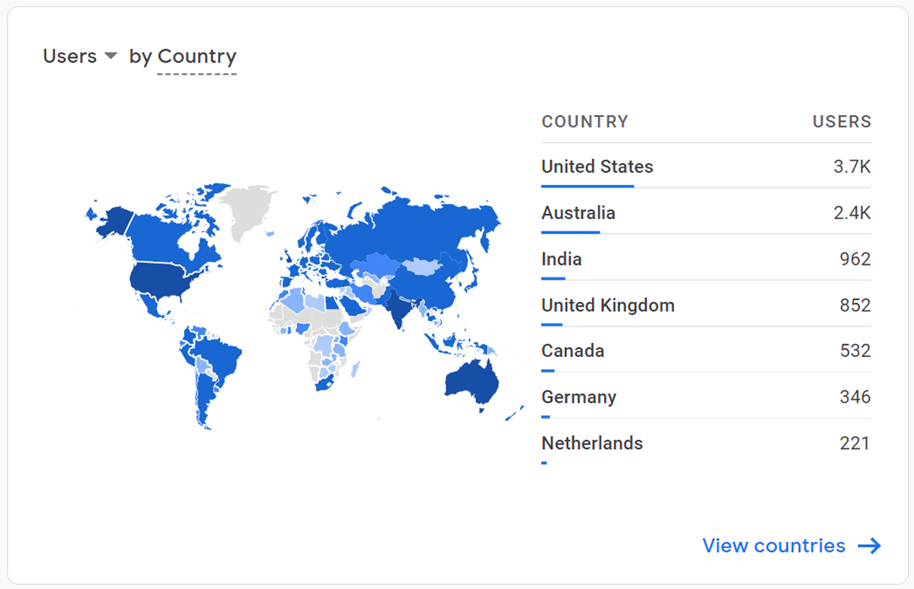
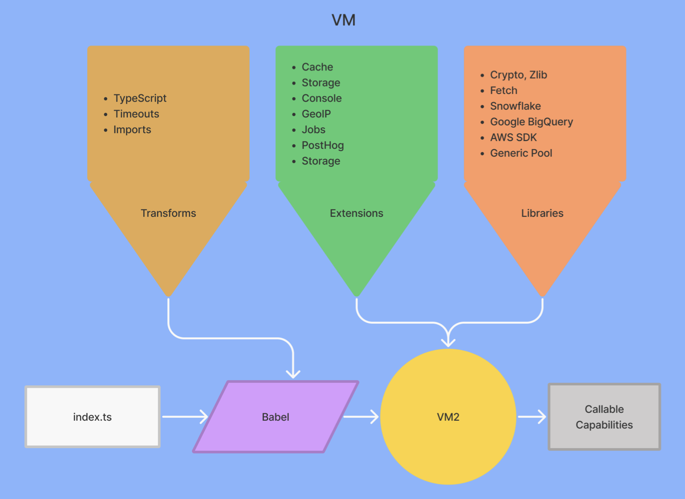
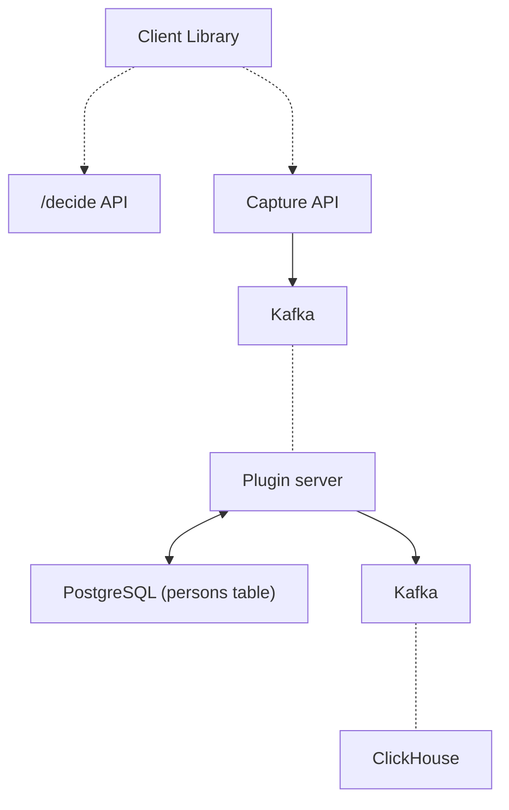
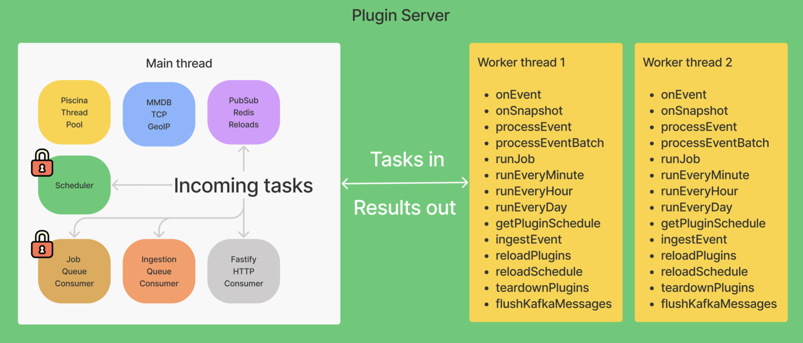
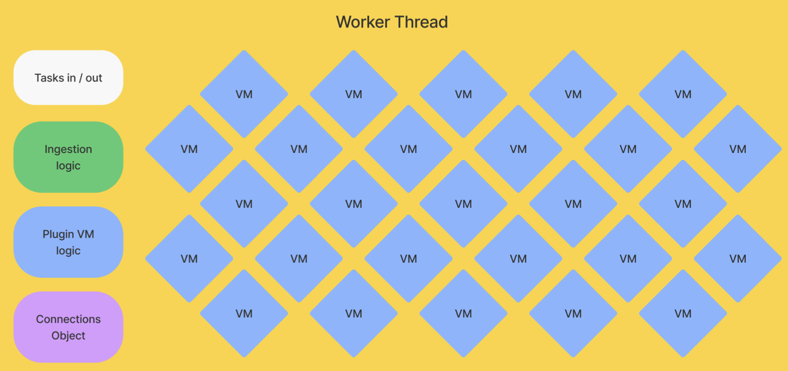

PostHog's mission is to increase the number of successful products in the world. To achieve it, we're building a comprehensive [suite of analytics and data tools](/product) (see [our roadmap](/roadmap) for what we're working on now). 

Earlier in our history, users frequently asked us for ways to enrich and do more with their data. They wanted to add geographic data to events, get events from CRMs, export and import data from other sources, and more. 

We couldn't build every solution ourselves, so we needed to enable users to customize their data flows, and create solutions to their endless use cases. We found the answer at our Tuscany offsite: an app platform that enabled users to build apps integrated into our data pipeline.

This is the story of how [PostHog apps](/apps) went from three-day MVP into a service that handles billions of events – and all the lessons we learned along the way.

## ✏️ Part 1: Building an MVP in three days

PostHog apps were an idea of mine (Marius). I wanted a Google Analytics-style world map view and that required location data from IP addresses. While there were many services to do this, connecting them to event data was difficult. I decided to work on solving this during our Tuscany offsite hackathon.



My solution was to build an app platform and the first ever PostHog app, [GeoIP](/apps/geoip-enrichment), but the project vision immediately expanded to enable more modification of the events pipeline, such as backing up data to S3, syncing GitHub stars, or getting customer feedback.

### Arbitrary app code in Python

The three-day Tuscany hackathon led to the ability to write and run arbitrary Python code on events in our pipeline. The app code got downloaded from GitHub, extracted, and integrated into PostHog. It specifically required Python 3.9, because Python 3.8’s `zipimport` didn’t support the zip archives GitHub provides.

An app, named "plugin" at this point, looked like this:

```python
# exampleplugin/__init__.py
from posthog.plugins import PluginBaseClass, PosthogEvent, TeamPlugin
class ExamplePlugin(PluginBaseClass):   
    def __init__(self, team_plugin_config: TeamPlugin):
        super().__init__(team_plugin_config)
        # other per-team init code
    def process_event(self, event: PosthogEvent):
        event.properties["hello"] = "world"
        return event
    def process_identify(self, event: PosthogEvent):
        pass
```

Other features added included a plugin repository, an interface to configure the apps, and a CLI to preconfigure apps for custom installations. I built two sample apps with it, including the coveted GeoIP app.

This was a promising start, but it didn’t take long for cracks to appear. 

First, it’s nearly impossible to manage Python dependencies via multiple `requirements.txt` files. There's no way to tell which dependencies your plugin's dependencies will install, without first installing them. There is [nothing like `pip --dry-run`](https://github.com/pypa/pip/issues/53). You need to install the `pip` package and run an `__init__.py` script inside the package to get its dependency tree.

Second, all the dependencies are installed together. This made it just a matter of time before a plugin overrode an app dependency (e.g. `django`), and brought everything crashing down. This wasn’t going to work for us, so we needed to rebuild. 

## 🛠 Part 2: Rebuilding in JavaScript

After deciding to rebuild, my first attempt was using [PyMiniRacer](https://github.com/sqreen/PyMiniRacer) to generate JavaScript. PyMiniRacer is great for simple functions, but lacks support for async/promises and importing modules like `fetch` because it was raw v8, not Node. It also had a limited standard library. It wasn’t going to work. 

Next, I tried to develop and subsequently scratched a [gRPC](https://grpc.io/docs/languages/node/basics/) implementation in Node. I could call JavaScript code from Python (which we wrote our pipeline in) and get a response, but this approach created too much manual work. It raised questions such as "how many workers should respond to the gRPC calls?" and "how do we make sure we lose no events if the node gRPC server is down?” Apps needed to scale, so this also wasn’t going to work either.

### Finding the solution with Celery

After these false starts, I found a solution in something we already used: Celery.

In our main PostHog app, we used [Celery](https://docs.celeryproject.org/) to process events asynchronously (we don't anymore). When an event hits `/capture`, our API parsed the request and queued the event into a job queue. I realized I could build a new server with the [Node port of Celery](https://celery-node.js.org/) and plug that in as another step in the existing pipeline.

The combination of Celery and Node solved all pending issues: we wouldn't have to worry about Python dependencies, could potentially run untrusted code in a fast sandbox, there would be no process management for a gRPC link, and could eventually rewrite the entire ingestion pipeline in Node to get a speed boost over Python (which we eventually did).

Using Celery required us to build a Node app that:

- Gets a stream of events from Python through a Redis queue (via [celery.node](https://celery-node.js.org/))
- Runs user-defined JavaScript on that stream of events.
- Sends them back to Python through the same queue for ingestion.

The first and last steps were easy enough with our app structure and Celery, but we needed to make sure the arbitrary, user-defined JavaScript code was securely run. 

### Virtual machines (VMs) to the rescue

The solution to the second step was to use virtual machines (VMs). Turns out Node v14 has a [built-in VM module](https://nodejs.org/docs/latest-v17.x/api/vm.html) that enables running custom JavaScript in a separate context.

Using the VM module let us run custom JavaScript code during event ingestion. The downside was that the docs stated “the VM module is not a security mechanism. Do not use it to run untrusted code.” This wasn’t unexpected. [Privilege escalation](https://en.wikipedia.org/wiki/Privilege_escalation) and [resource exhaustion](https://en.wikipedia.org/wiki/Resource_exhaustion_attack) attacks are real. We couldn’t avoid them, but we could build strategies to mitigate them.

Node's VM module puts your code in an isolated context that has ~~limited~~ no support for secure communications with the host, and has holes like this:

```js
const vm = require('vm');
vm.runInNewContext('this.constructor.constructor("return process")().exit()');
console.log('Never gets executed.');
```

Thus we needed an abstraction. The two most popular are `isolated-vm` and `vm2` :

- [`isolated-vm`](https://github.com/laverdet/isolated-vm) claims to be secure and various big companies use it. Each "isolate" runs in a new thread, with controllable CPU and memory limits. There are methods to copy data between the main thread and an isolate, and we can share objects and functions between the host and the isolate. It's not a perfect sandbox, but it's as close as we can get.

- [`vm2`](https://github.com/patriksimek/vm2) has a different isolation model. Each "VM" runs in an isolated NodeVM context, in the same thread as the rest of the app. There are no memory or CPU limits we can enforce. You run the code locally, but don’t share any variables with the host app.

While `isolated-vm` felt like a great fit because of its emphasis on security, its implementation [wasn't a success](https://github.com/PostHog/posthog/issues/6855#issuecomment-853879421). I would have had to implement proxying similar to `vm2` just to get fetch working, and that wasn't worth the effort.

`vm2` had its own system of proxies that make sharing code between the host and the VM seamless.

Because of this, we decided to change our security model. On PostHog Cloud, we would vet the apps ourselves, before allowing everyone to use them. Self-hosted users were free to write and use as many [arbitrary apps](https://github.com/PostHog/posthog/issues/6855) as they please.

This maintained self-hosted users’ freedom, while still enabling Cloud users to benefit from community apps. Apps are all developed and tested in the open. We just need to do a final manual check before installing them. After launch, we found many of [our most used apps](/blog/the-state-of-plugins) came from our community, proving this decision’s success.

### What did we learn from all this?

- Python, which we wrote our ingestion pipeline in, wasn’t going to work for apps. Dependency management for arbitrary code was too difficult.

- Apps needed to scale while having access to some key JavaScript libraries. Using Node and Celery enabled us to integrate into our ingestion pipeline while providing the functionality we needed.

- We needed to make sure the code apps were running was secure and sandboxed. VMs were the answer to this, and Node had support for VMs.

- The default NodeVM wasn’t secure and couldn’t communicate with a host. `isolated-vm` was secure but needed proxying. `vm2` had the ability to proxy code, but was less secure. `vm2` and a review process for Cloud apps was the ultimate decision.

These learnings led to our current app structure.

## 📈 Part 3: Building a mature app platform that scales

After creating a basic MVP, and seeing the benefits of its usage, work continued to add functionality and support greater scale. 

Before we get any deeper, it's worth recapping the structure and features of apps as they are now. 

### App structure

The basic structure of an app has stayed the same since the JavaScript rebuild. Each app contains two key files:

- `index.js` (or `index.ts`) which contains key application logic, modifies events, connects with external services, and interacts with PostHog. It has an allowlist of libraries to use for utilities or interacting with other services. It also has access (through the VM) to meta information, storage, and logging.

- `plugin.json` contains configuration data for the app, what shows up in PostHog, and variables for end users to modify. The file contains the name, description, and other details that show up on the front end.

Here’s what a basic `index.js` looks like:

```js
// Some internal library function
async function getRandomNumber() {
    return 4
}

// Plugin method that runs on plugin load
export async function setupPlugin({ config }) {
    console.log(config.greeting)
}

// Plugin method that processes event
export async function processEvent(event, { config, cache }) {
    const counterValue = (await cache.get('greeting_counter', 0))
    cache.set('greeting_counter', counterValue + 1)
    if (!event.properties) event.properties = {}
    event.properties['greeting'] = config.greeting
    event.properties['greeting_counter'] = counterValue
    event.properties['random_number'] = await getRandomNumber()
    return event
}

And here’s a basic `plugin.json` that goes along with it:

```js
{
    "name": "Hello World",
    "url": "https://github.com/PostHog/posthog-hello-world-plugin",
    "description": "Greet the world with every PostHog event. An example plugin.",
    "main": "index.js",
    "config": [
        {
            "key": "greeting",
            "name": "What greeting would you like to use?",
            "type": "string",
            "default": "Hello world!",
            "required": false
        }
    ]
}
```

### App functions and processes

As you can see by reading the above examples, the index file exports functions that take objects PostHog provides (like configuration and event data). Specifically, PostHog apps export predefined functions that run on conditions like:

- event ingestion (`processEvent`)
    - useful for modifying incoming data, such as adding geographic data properties or dropping events matching a property filter.

- every minute, hour, day (`runEveryMinute`, `runEveryHour`, `runEveryDay`)
    - useful for triggering events based on updates to external services such as Stripe, HubSpot, or GitHub.

- once processing is complete (`exportEvents`, `onEvent`)
    - useful for exporting data to external services such as BigQuery, Snowflake, or Databricks.

When users upload apps to PostHog, we import these functions from the files and run them through [custom babel transforms](https://github.com/PostHog/posthog/tree/master/plugin-server/src/worker/vm/transforms) for extra security. From there they run as callable functions on VMs as part of our ingestion pipeline and also have access to extensions like storage, caching, and logging. Overall, it looks like this:



Structuring apps this way provides flexibility to users while maintaining scalability and security. We continued to improve each of these aspects as apps developed:

- **Flexibility:** features like scheduling and exporting added new functionality that solve more use cases.
- **Scalability:** caching and improving the config object (enabling statelessness) helped apps scale effectively and use fewer resources.
- **Security:** running apps in VMs with babel transforms helped ensure they were secure and isolated. 

The next step is putting these apps into production.

### Serving apps and managing data at scale

An app is no good if it doesn't integrate into PostHog. Apps needed to integrate with our event ingestion pipeline. They needed to handle an inflow of data, scale, manage tasks, and update themselves. There are many pieces needed to make this happen.

The initial ingestion pipeline used Python, Celery to manage the job queue, and a Node "plugin server" that ran the functions from the apps on incoming events.

It has evolved significantly. A high-level version of the ingestion pipeline now looks like this:



The plugin server is now a core service that processes all events, updates related, models, and runs all plugins (including apps). Apps are only a small part of what the plugin server does now. 

The entire pipeline is now written in TypeScript and runs on Node. This saves sending processed data back to Python for writing to databases. We can just write it directly to ClickHouse or Postgres. We also now use Kafka to manage data flows and Redis for caching.

### Using Kafka and Redis

Kafka manages our data flows. It helps us batch, split, and manage parallel work for our apps. For example, Kafka helps us batch and retry events when apps call `processEvent`. We use a Kafka topic (fancy name for "queue") to continue the flow of data.

Another service we use is Redis to cache data for apps. Parts of the app are reusable and don’t need to be recomputed each time we run the app. For example, apps can cache details about the organization events belong to, instead of looking for those details for each processed event. Over billions of events, this saves a lot of compute.

We use a couple of Redis patterns. First, we use [Redlock](https://redis.io/docs/manual/patterns/distributed-locks/) for the scheduler and job queue consumer. Redlock ensures these processes are only run on one machine because we only want them to run once. If they ran more than once, we’d have duplication and issues. For example, we only need one scheduler to do the basic work of saying what to do at what time. Second, we use [Pub/Sub](https://redis.io/docs/manual/pubsub/) to check for updates to apps.

We chose these because we used them elsewhere and they have a proven track record of working well at scale. They help apps integrate with our existing infrastructure.

### How the plugin server works (apps and beyond)

As mentioned earlier, our plugin server expanded to encompass much more than apps. It now handles all plugins, including apps that validate, process, format, and write event data to databases. The plugin server looks like this: 



The main thread routes incoming tasks to the right location. It receives data and starts threads to complete them. We use [Piscina](https://github.com/piscinajs/piscina) (a node.js worker pool) to create and manage the threads. Piscina abstracts away a lot of the management of threads we would need to do to scale. The main thread also handles the functionality of scheduling and job queuing. The result creates tasks and sends them to worker threads to complete.

### Doing the work (in worker threads)

Worker threads receive tasks from the main thread and execute them. Some of the tasks, like `processEvent` or `runEveryMinute`, use the callable functions (app code) we detailed above. Worker threads contain the VMs, as well as the ingestion logic and connections to extensions and libraries. Each worker thread can run up to 10 tasks at the same time.



When the worker thread finishes its task, it gets another new event, process, or other scheduled task from the main thread. The main thread handles getting and rerouting events for further processing. A final `onEvent` task runs once all the processing completes, which is useful for functions like exporting or alerting.

This structure enables modularity, allowing us to run different types of workers and apps. On the small scale, workers can run individual app tasks can together. On a larger scale, we are working on decoupling types of tasks to improve efficiency.

### Making sure arbitrary code doesn’t break everything

The final piece of the story of apps to worry about is that they are arbitrary code. When left unchecked, they can run whatever code they want, including code that tries to exploit or crash our servers. 

Allowing users to run arbitrary code can cause many security, infrastructure, and usability issues. We use Node VMs because they provide some solutions, but they don't offer total protection. We've done a bunch more work to prevent potential issues and make sure apps are secure and reliable.

First, there are endless libraries for JavaScript, but we only [allow a small number of them](/docs/apps/build/reference#available-imports). Users can’t install and use whatever npm package they like. We include basic packages such as Node’s standard `crypto`, `url`, `node-fetch`, and `zlib` libraries. We also include libraries like `snowflake-sdk`, `@google-cloud/bigquery`, and `pg` to connect external services. This ensures that the code run by our users and servers uses libraries we trust.

Second, users can write a loop that loops forever and causes resource exhaustion. To prevent this, we set up a babel plugin that injects code into `for`, `while`, and `do while` loops (as described in [this article](https://medium.com/@bvjebin/js-infinite-loops-killing-em-e1c2f5f2db7f)). Whenever there is a loop, we set up a timer before we start it. If the loop runs for more than 30 seconds, the program errors.

Third, to prevent data loss, we added the ability to retry logic to our `processEvent` function. Kafka handles retries for us by batching events and adding failed ones into the dead letter queue. We added the ability to run functions on `RetryError` to improve consistency. App developers can also run fetches with retry. Here’s an example of what it looks like:

```js
import { RetryError } from '@posthog/plugin-scaffold'

export function setupPlugin() {
    try {
        // Some network connection
    } catch {
        throw new RetryError('Service is unavailable, but it might be back up in a moment')
    }
}
```

Fourth, we made it easier to write high-quality apps. We improved the [docs](/docs/apps/build) and added [tutorials](/docs/apps/build/tutorial). Apps were rewritten to use Typescript (we provide [types](/docs/apps/build/types)) and tested in [Jest](/docs/apps/build/testing). Many more minor improvements added up to higher-quality apps getting created.

Finally, as mentioned before, although our self-hosted instances can run whatever arbitrary code they want, we still review apps before adding them for everyone to use on Cloud. This ensures a final quality and security standard for users.

All this work helped us create more secure and reliable apps. This allowed us to be more confident in allowing users to build apps and users to be more confident using them.

## 🏆 Conclusion: The present and future of PostHog apps

Building and scaling PostHog apps fundamentally changed the way we think about our product and infrastructure. We started life as an open source product analytics tool. Now, we're a platform. 

Since launch, we've seen companies and solo devs create many useful, clever apps to solve problems or connect new services. There are [over 50 PostHog apps](/apps), including:

- "Data-in" apps connecting PostHog to [Hubspot](/apps/hubspot-connector), [Salesforce](/apps/salesforce-connector) (community built), [Stripe](https://github.com/PostHog/stripe-plugin), and [Shopify](/apps/shopify).

- "Data-out" apps for exporting PostHog data to [BigQuery](/apps/bigquery-export), [S3](/apps/s3-export), [Rudderstack](/apps/rudderstack-export) (community built), and [Intercom](/apps/intercom).

- Ingestion-filtering apps like [Property Filter](/apps/property-filter) (community built) and First Time Event Tracker that give users, even more, control over events and properties sent to PostHog.

Our vision for apps is to continue to enable more customizability for data flows. We want users to have access to the data they need to create better products, and apps are key to doing this. 

We also want to allow for more customization of the PostHog experience. As an example of this, see the release of [site apps](/tutorials/build-site-app), which provides similar customizable functionality in the frontend. Like how apps allow users to customize their data flows, site apps enable them to customize their products with frontend components. Users can add surveys, feedback requests, banners, and more through PostHog site apps.

The ability to leverage PostHog to customize, control, and fully utilize your data to improve your product will continue to progress. Apps, and many other features of PostHog, help with this. In the end, PostHog aims to help you understand your product and gives you the tools to build a better one.

## Further reading
- Feeling inspired? [Learn how to make your own app](/tutorials/build-your-own-posthog-app).
- More of a frontend person? Check out our tutorial on [building site apps](/tutorials/build-site-app).
- Want to dive deeper into apps? [Check out our app docs](/docs/apps)
