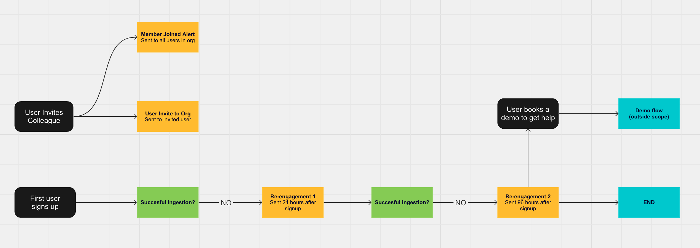
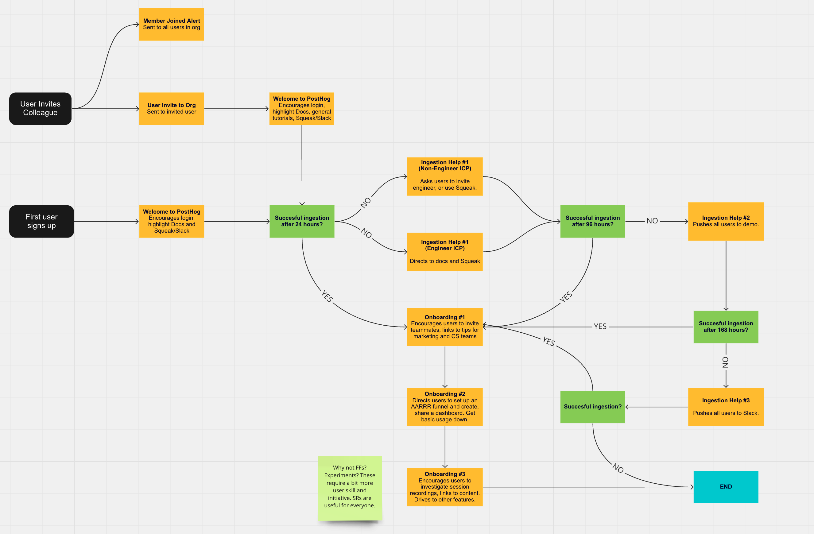
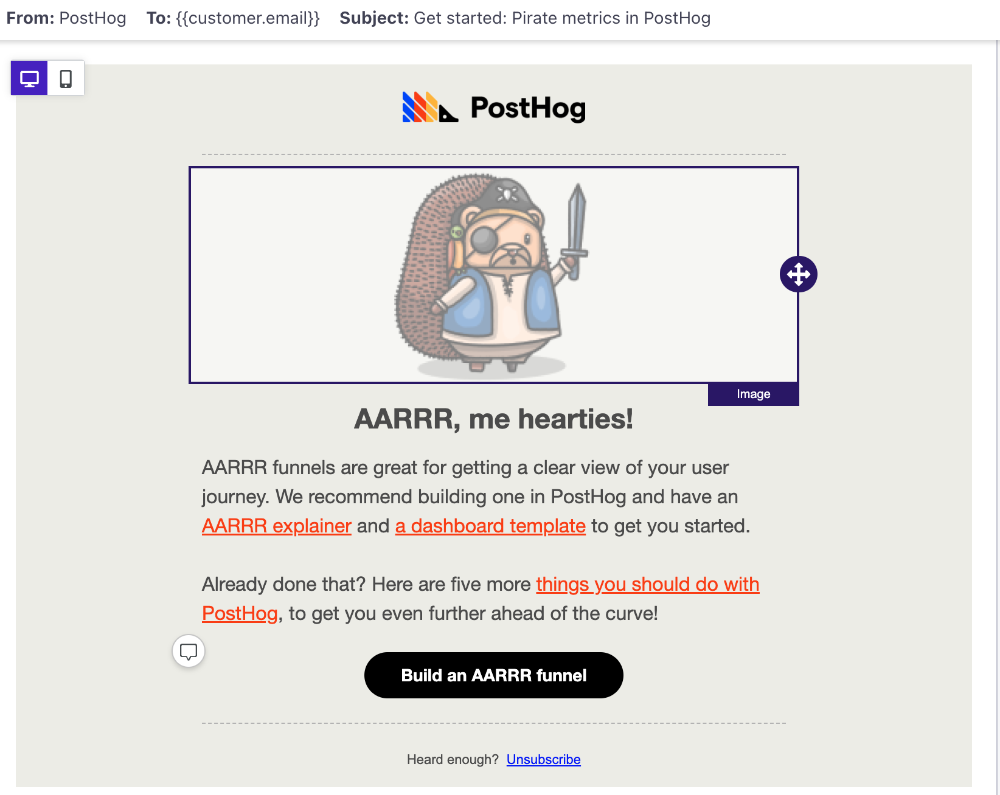
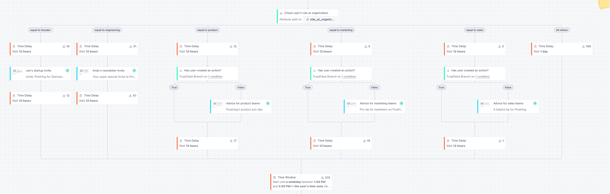

Email is a powerful tool for getting users to engage with your product, but it can be difficult to know how the best companies structure their onboarding email flows. You end up having to sign up to a bunch of them, then waiting and letting your inbox get flooded. 

Often, you end up getting awful sales rep outreach emails from them _months_ later too. That's important because it's probably the root cause for the conventional wisdom that developers do not respond well to email marketing. Turns out, they just don't respond well to _bad_ email marketing. 

We don’t do those sort of outreach emails. This is what we do instead, and how we got there over 5 major iterations. We think it works and we've included performance data so you can judge for yourself.

## Onboarding 1.0: The one where it started costing lots

Back in 2022, our onboarding flow was powered by Mailchimp and was _very_ simple. In fact, nobody actually knew what it looked like. So, I mapped it in [an RFC](https://github.com/PostHog/posthog.com/issues/3202).

<Caption>The first map we did of what our email onboarding flow looked like</Caption>

We didn’t do welcome emails for new users, and even our monthly changelog emails were only sent to 660 opted-in users. I decided to change this and imported 30,000+ users into that email list. The move was covered by our T&Cs and, because it was one email a month about actual product updates, we figured nobody would mind. The good news was that we were right and didn't get a single complaint and only a handful of unsubscribes.

The bad news is that it sent our Mailchimp costs skyrocketing. This is because Mailchimp's pricing is based on how many emails you send each month, which makes it entirely unsuited for a complex onboarding campaign and left us searching for a platform with more predictable and scalable pricing.

## Onboarding 2.0: The one where we chose a new email tool

Towards the end of 2022, we finally moved off of Mailchimp. We looked at tools such as Braze, Hubspot, and Customer.io, ultimately choosing the latter because it had [more transparent pricing](/blog/transparent-enterprise-pricing) and we had an existing app for pushing data to it. Signing the deal was arduous – Customer.io wanted almost ten separate meetings before they took our money, for some reason, but at least they didn't send any awful sales outreach emails!

I’d observed from other companies that we needed to at least add a welcome email for new users, and I wanted to add checks after 24, 96, and 168 hours to see if users had ingested events. If yes, we’d send them some basic usage advice. If no, we’d offer them help. This was the very least I felt we could do. 

<Caption>Onboarding 2.0 added more checks to try and validate ingestion and three simple introductory emails</Caption>

This didn’t perform as well as you’d think, however, mainly because the ingestion checks were unreliable. Users kept complaining about getting the wrong emails, so we threw this all out and moved to a new plan.

> 💡 **Tip:** Something we learned for our welcome email was not to send it immediately after sign-up. The email is meant to give users initial direction, but first they need to set up ingestion – we added a one hour delay so that users can get data to work with first. 

## Onboarding 3.0: The one where we started tracking data

By Q3 2023, we were adding more and more new products to PostHog. We wanted to feature these in our flow, but we were also worried about becoming spammy. Thankfully, now that we had Customer.io in place, we were able to judge this based on the data. 

<Caption>New emails for 3.0 tried to emphasize what was possible with PostHog, directing users to helpful blog content</Caption>

Our conversion event was a user log-in within one week of opening an email. We hadn’t yet thought of anything better. 

- **Open rate:** 56%
- **Click-through-rate:** 7.4%
- **Conversion rate:** 3%
- **Unsubscribe rate:** 0.6%

Based on this high open rate and low unsubscribe rate we felt that users didn't mind getting the emails, and the click-through rate suggested they liked what they read. So, we continued adding more messages. 

> **What does good look like for an email onboarding flow?**
> Benchmarks vary wildly by industry, implementation, and product. As a rule though, the guideline benchmarks I use from my experience in other startups are:
>
> - **Open rate:** Anything above 40% is OK. 50% is the goal.
> - **Click-through-rate:** Anything above 4% is OK. 6% is the goal. 
> - **Conversion rate:** Anything above 3% is OK. 5% is the goal. 
> - **Unsubscribe rate:** Anything below 1% is OK. 0% is the goal.

## Onboarding 3.1: The one where we added personalization

Data is important, but I strongly believe it doesn’t tell the whole story. You also need feedback and intuition. Most of the feedback on our emails came in [3.1](https://github.com/PostHog/meta/issues/127), when we started sending personalized recommendations to users from [my personal email](mailto:joe@posthog.com).

How this works is simple: when a user signs up, they can optionally tell us what their role is. If their `role_at_organization` = `engineer` we trigger an email from me telling them about [our Product for Engineers newsletter](https://newsletter.posthog.com/). 

<caption>Onboarding 3.1 was when we really started tailoring emails based on what we knew about users</caption>

This email performed very well, with a 68% open rate and a 16% CTR. Two emails into the flow and developers were already opting in to _more_ emails! 

Best of all, though, because it was personalized and came from me directly, it also earned a steady trickle of replies. I responded in kind and was able to feed in further improvements, including adding another option for `role_at_organization` = `founder`. 

## Onboarding 3.3: The one where we added experiments

In [3.3](https://github.com/PostHog/meta/issues/140), we started running a series of tests and experiments. We removed the `founder` targeted email, which invited teams to join [PostHog for Startups](/startups), because it was _too_ successful and cannibalised revenue.

Most of the tests we ran proved inconclusive, or outright failed. Subtle changes to subject lines or body copy had no noticeable impact. We learned that users did _slightly_ prefer [Lottie’s](https://posthog.com/community/profiles/227) hedgehog art over screenshots of the app, but the difference was a negligible 1-2% in CTR. 

One successful experiment we did roll out was adding more personalized emails for non-technical users. If `role_at_organization` = `marketing`, `sales` or `product` _and_ a user had not created an [action](/docs/data/actions) within 12 hours, I’d send them another personal tip. These emails averaged a steady 6% CTR and 54% open rate, so we kept them in, but interestingly I didn't see many replies on these messages.

## Onboarding 4.0: The one where we filtered by ICP

[4.0](https://github.com/PostHog/meta/pull/150/) was a massive step up in complexity as a result of our growing number of features. By late 2023 the flow had 28 separate emails, of which users would get a maximum of 6 over several weeks. We still worried this would be too many, but the low (0.4%) unsubscribe rate suggested otherwise.

<Caption>Onboarding 4.0 split high-ICP users out into their own email flow because our CS team would reach out directly</Caption>

By this point we’d also changed our conversion event to mean a user enabling billing for a new product within one week of opening an email. 

- **Open rate:** 52%
- **Click-through-rate:** 4%
- **Unsubscribe rate:** 0.4%
- **Conversion rate:** 6%

Around this point we also started filtering out teams in our [ideal customer profile](/newsletter/ideal-customer-profile-framework) (ICP) using a scoring system implemented in Hubspot. If a user scored over a certain threshold they’d be moved out of the usual flow so [our customer success team](/handbook/small-teams/customer-success) could reach out directly. We’ve since removed this check because it felt too salesy and didn’t perform well, however. 

## Onboarding 5.0: The current one

At the time of writing this is the current onboarding flow. It contains over 53 emails and 38 timed events and was, quite simply, a pain in the ass to explain to everyone internally.

The goal of this flow is to focus on improving activation, and build on some parallel improvements to our in-app onboarding flow. Now when a user signs up to PostHog we ask them to select a product to setup first: analytics, replays, flags, or surveys. [Onboarding 5.0](https://github.com/PostHog/meta/issues/172) builds off that selection by encouraging users to use that product, and then showing how other features can combine with it.

<Caption>Onboarding 5.0: Messy, complex, and highly personalized to user interests</Caption>

The hope was that this would improve in-app activation, which we roughly define as: 

**Product analytics:** Events ingested, 1 insight created, 1 dashboard created
**Session replay:** 5 recordings viewed
**Feature flags:** 1 feature flag created
**Surveys:** 1 survey launched

To avoid annoying users, we added a time block based on our activation criteria – if a user hasn’t activated after two emails, we stop sending them emails for six weeks. We also use an unsubscribe notice that tells users how many emails they can typically expect: one email per week, for six weeks. 

## What’s next?

At the time of writing, Onboarding 5.0 has been live just one week – it’s too early to judge any of the metrics because users will have only received the first email. The plan, however, is to keep an eye on the data (and user feedback) and find new ways to improve the flow even further. 

One way we’re already experimenting with this is by bringing back checks to see if users are ingesting events or not. We’re testing this with the session replay product by running the following flow for the first email after the welcome email: 

1. Check if a user has activated with session replays
    1. If YES, we invite them to subscribe to our newsletter
    1. If NO we check if they have ingested 10+ recordings since signing up
        1. If YES we know they have product configured, so we email them some tips about getting value out of session replays
        1. If NO we know they haven’t managed to install PostHog correctly and we send them one of two emails to help them get started

Hopefully we’ll see this test prove successful and we’ll be able to replicate these secondary checks across all products soon – in Onboarding 6.0!
