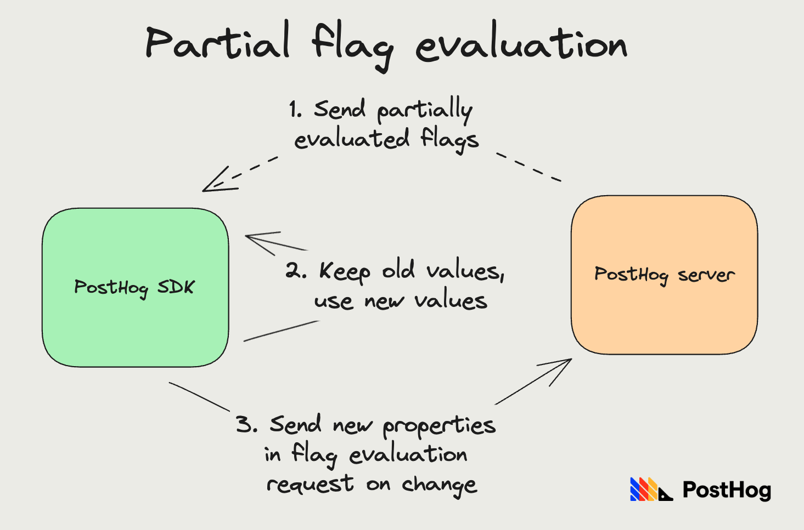
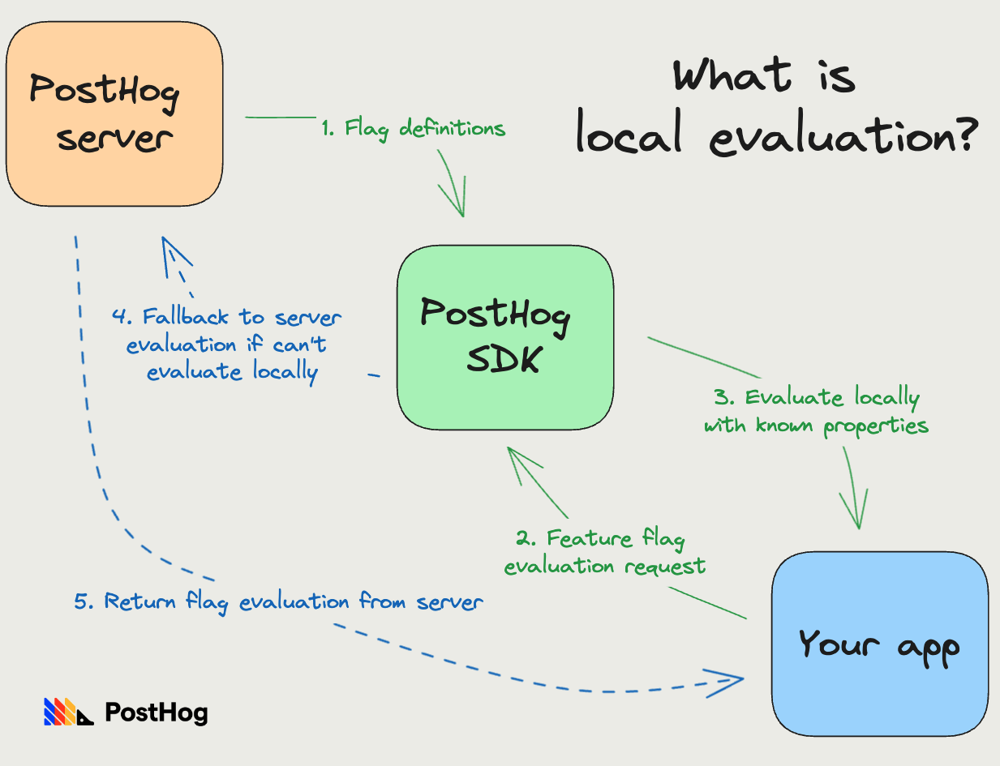
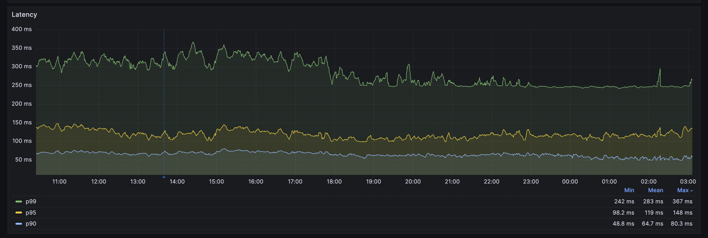

Feature-flags-as-a-service is an interesting space. If your service stops working, it affects both your customers *and* your customer's customers, since they rely on you to make sure their app works.

Contrast it with the PostHog interface not loading, where the problem is constrained to our customers. It's not great, for sure, but it's better than event ingestion and feature flags going down.

Further, flags are very sensitive to latency. If it takes 5 seconds for your flags to evaluate, that holds up your customer's application for 5 seconds. You can't wait to load them asynchronously, either, as you need this result to determine what to show. Your business logic depends on the flag.

This is why the [Feature Success team](/handbook/small-teams/feature-success) has spent the last few months making PostHog's feature flags fast and resilient. Our goal was to ensure that:

1. Neither the SDKs that query flags, nor the API interface, should go down if the PostHog interface does
2. Latency-sensitive flags resolve in 50ms or less. 

This post is about how we did it, and what we learned along the way.

## Special problem constraints

Before we jump into how we improved things, it's worth listing out constraints that we can use to create solutions that otherwise wouldn't be possible.

1. **Flags are deterministic:** If I roll out a flag to 30% of people, the person who's inside this window remains inside this window even if the rollout percentage goes up to 40, 80, or 100%. This is because we compute a hash of the user ID and the flag key, and use it evaluate.

2. **We don't always need a server:** As a result of (1), we need a server to determine whether a flag is enabled only if the flag depends on person properties, so we need to check against known properties.

3. **Flags are evaluated multiple times in a session:** For example, whenever properties change our flag might change, and the same for when the user identity changes. We can leverage this behavior in our solution.

4. **The caching problem:** It's not reasonable for us to cache the _results_ of flag evaluation for users because this:
    - Blows up the size of the cache.
    - Doesn't work for new people we are seeing for the first time.
    - Isn't flexible enough to leverage properties changing over time for users.

## Making feature flags fast

Since flags are deterministic, we technically don't need a server to evaluate them. This insight led to creating [local evaluation of feature flags](/docs/feature-flags/local-evaluation), where our SDKs download flag definitions, evaluate them locally, and only fallback to our servers when this is not possible.

As we saw in our problem constraint, local evaluation can fail when we don't know properties the flag depends on. To combat this, the SDK interface allows passing in properties that you already know of. We then use these passed in properties to figure out if flag computation is possible.

This optimization is great because it cuts out all network I/O _and_ makes evaluation CPU-bound, which reduces latency from 500ms to 10-20ms.

This only works on server-side libraries, however. Flag definitions can have personal identifiable information, like user email IDs, and require auth to download them, which means we can't expose these on the client-side libraries.

As a result, our client still has not-great latency. To combat this issue, we introduced [bootstrapped feature flags](/docs/feature-flags/bootstrapping). You can initialize a client-side PostHog SDK by passing in a client ID and flags. This ensures flags are instantly available, and unlocks creating cool features like redirecting on page load based on feature flags.

How do you get the flags to pass in to the client SDK? If you must call PostHog's servers manually to do this, it defeats the purpose. This is where _synergy_ between local evaluation and bootstrapping comes in: you use your server-side SDK to evaluate flags locally, then pass these along to your frontend to bootstrap flags.

Overall, this has been working well. There's growing pains of replicating every new feature in flags in all server-side SDKs, but other than that the core functionality is solid.

## Making feature flags reliable

We want feature flags to work reliably, even when our server is down, but there's no such thing as reliable-no-matter-what-happens. An asteroid wiping out data centers worldwide, or an AGI taking over are very unlikely, but if they do occur, there's not much we can do. You can't negotiate with the laws of thermodynamics.

Thankfully, asteroids don't hit us every week. PgBouncer issues, on the other hand, are a weekly annoyance – PgBouncer is a connection pooler for Postgres.

So, when thinking about reliability, we want to prioritize defending against things that happen frequently, or have a high chance of occurring over time. This includes things like Redis, Postgres, or PgBouncer going down. 

Then, if we have the resources and nothing better to prioritize, we can focus on defending against asteroids.

### Client-side handling: Partial flag evaluation

Since flags are evaluated multiple times in a session, sending a partial response when we can't access the database is preferable to retrying and not sending a response at all. Further, if a client is waiting for flag evaluation before loading their content, we don't want to slow this down. We want to return results as soon as possible.

So, we enable partial updates on our client side SDKs. Whenever there's an error computing all flags, we do a partial update: keep the old values for flags we failed to compute, and use the new value for flags we didn't fail to compute.

As we've noted before, the only flags that can fail evaluation are ones that depend on specific properties. Further, if a property change is triggering flag evaluation, the client SDK can send these new properties alongside the request, and we use these properties as overrides for flag evaluation. We automatically send these properties for all properties set via the SDK helpers.

This solution is special because flags that affect the most people will almost never go down. Flags affecting a small % (property based) can be unavailable more often. This is one reason we recommend creating flags that match all people when possible.

Since the server-side SDKs are stateless, this partial evaluation model doesn't really work. Local evaluation is the best way to maintain reliability, or sending known properties alongside requests to make evaluation of property based flags reliable.

### Server-side handling: Flag evaluation when databases are down

Now we can dig deeper into how exactly evaluation works when the database is down. One thing I've overlooked so far is that we need the database for multiple parts of flag evaluation:

1. To get person properties
2. To get the flag definitions.
3. Figuring out the right project for which to get feature flags (auth token-matching)

The database going down means all three functionalities go down. Without flag definitions, we can't know what flags to evaluate. Without the project auth, we don't know which project to get to.

The solution here is caching: we cache flag definitions per project, and also the mapping from auth token to project. This means we don't rely on the database for the critical components to return a response.

Caching person properties is unreasonable, as there can be billions of people with thousands of properties each that wouldn't fit in a cache. 

Since we don't need a server to determine which person belongs to which bucket, we just need to compute the hash of the person ID and the flag to determine evaluation for simple flags (see special problem constraint #1). This enables database-free responses.

However, note that if Redis (our cache), and Postgres (our database) both go down at the same time, we do end up unable to respond. This should be much rarer though, as these are both independent system deployments.

Is that all we need to do? Not quite. As we found the painful way, just because we can defend against the database going down, doesn't mean our responses will be fast.

### Different ways Postgres can fail

When you can't connect to the database, it's a quick operation: you tried connecting, you failed, you raise an error, and any system depending on you can quickly make a decision.

However, what if the database isn't down, but just painfully slow? For example:
- You're deadlocked in a transaction.
- You have several transactions running at the same time, slowing the overall system down.
- When a potentially infinite loop is hammering the database hundreds of time a second.
  
To us, a database that can't quickly respond is equivalent to a database that is down. To defend against this, we introduced statement timeouts of one second for flag evaluations. This helps us quickly catch if things are slow, and defends against timing out.

### Different ways PgBouncer can fail

PgBouncer manages connections to our Postgres database, and things can go wrong here too.

The most popular way PgBouncer fails is when there are too many clients waiting for a connection. In this case, you're connected to PgBouncer, but waiting for a database connection to free up, so you can make your query.

The default wait for this setting is two minutes, which is way too long for us. PostHog times out at 10 seconds, so we want flags to have a much smaller timeout here. Currently, this is globally set at one second for all our systems.

### Separating out deployment for feature flags

One other way to defend against the database being too slow is to have a dedicated read-replica for flag evaluation. We've set up a separate deployment for feature flags (so it doesn't go down with the app), and have created a separate read-replica, so it doesn't hit statement timeouts because something else is hammering the database.

This has made flags a lot more reliable.

## When things don't go as expected

One frustrating issue we found towards the end is that when the database is slow, even setting a statement timeout during a session can take too long, which means by the time we figure out the database is slow, it's too late.

Currently, we're thinking of introducing a separate PgBouncer pool for feature flags, which has these timeouts set on the connection itself.

In the long term, having this sync python service that can't handle app level timeouts well has been troublesome. We're considering rewriting this with an async paradigm that's more efficient and allows for easily setting timeouts in the app, so we don't have to rely on the database level settings, and can once again share the connection pool with the rest of the app, rather than creating separate sub-pools.

The next step is to make sure flags remain reliable with all the exciting features we have in the works. Our main goal is to ensure none of these new features detract from reliability, since when it comes to flag, reliability is a lot more important than that shiny new feature.

And if you are interested in shiny new features, you can see what we're working on via our [public roadmap](/roadmap) or [repo](https://github.com/PostHog/posthog/).

## Appendix: The metrics

This post would be incomplete without talking about the metrics.

Our p99 latency went down from about ~500ms to 300ms, while the p90 latency tanked to ~60ms.

As you can imagine, the p90 is so low because these requests don't touch the database at all, everything is handled in memory. What was surprising to me was that 90% of requests fall into this category.

When we are in incident mode, i.e. the app is down completely, feature flag p99 latency drops down to ~80ms as well, because we start skipping all database related flags where these properties weren't sent.

You can see a similar story on [our status page](https://status.posthog.com/uptime/1t4b8gf5psbc?page=3), where feature flags related incidents went down.
