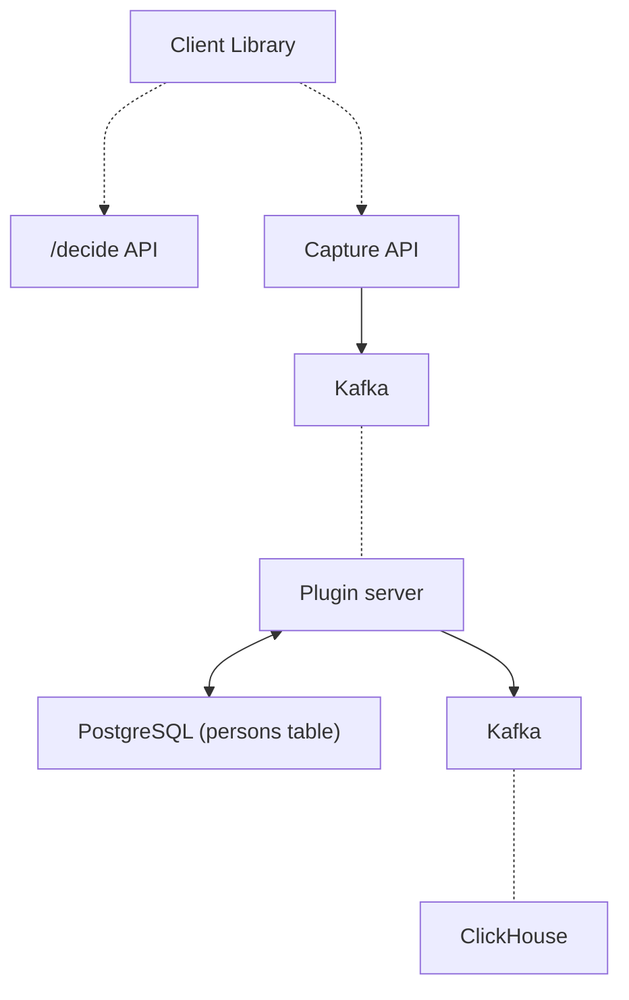

When PostHog was born in 2020, it was a simple Python application (Django + Celery) backed by a PostgreSQL datastore. Troubleshooting was easy, while the low barrier of entry meant fast adoption and more feedback on where to take the product.

This was great at the start, but it couldn't last. More customers meant more data to ingest and analyze. Our ingestion couldn’t keep up with the volumes of events we were receiving, and our event queries using PostgreSQL were slow. If we wanted PostHog to scale, we had to revisit our stack.

Introducing Kafka helped us to decouple our data streams and our processing pipeline, while [ClickHouse helped us to deliver very fast queries](/blog/clickhouse-announcement) on a large volume of data and more horizontal scaling capabilities. These additions helped us scale, but they came at a cost: complexity.

Here's how our ingestion pipeline looks like now:

While powerful, this new architecture has created the following challenges:

* We now have additional distributed services like Kafka, ClickHouse and Zookeeper to deploy and manage.

* Each additional dependency requires considerations in terms of monitoring, migrations, upgrades, durability among others.

* ClickHouse is a relatively new product. Whereas tooling around PostgreSQL is very mature, we need to do some of the heavy lifting ourselves with ClickHouse.

* Very few people know or have experience with managing a ClickHouse cluster relative to PostgreSQL. Our [partnerhship with Altinity](/blog/posthog-altinity-announce), which offers 24/7 technical support for ClickHouse, and bespoke training, is another way we're addressing this challenge. 

* Simple operations such as application deployments or database upgrades have become complex automations.

To address this complexity and make PostHog easier to deploy, maintain and use for anyone, we gave ourselves two goals: **improve our test framework** and **improve our built-in monitoring**.

> This article is part of our [A Universe of New Features launch week](/blog/launch-week-universe-of-new-features) series

## Goal 1: Improve test framework

While you can self-host PostHog using `docker-compose` for the evaluation stage, for production we offer an abstraction system built on top of the [Kubernetes](https://kubernetes.io/) platform via [Helm](https://helm.sh/).  

We’ve built on top of Kubernetes because although it's overkill for many scenarios, it allows us to focus on one abstraction but target any cloud provider that has a Kubernetes offerings. Currently we support AWS, Azure (alpha), DigitalOcean and Google Cloud Platform.

In order to give us confidence that every self-hosted installation is reliable and we iterate fast, we needed to significantly improve our testing frameworks. 

Kubernetes resources are usually represented as YAML objects, while Helm helps us to define, install, upgrade and package them via a template engine.

In order to make sure those resources are defined, installed and upgrade correctly across different cloud platforms, Kubernetes versions and deployment scenarios, we’ve introduced several layers of testing, each of which with a specific goal:

* lint tests (via [`helm lint`](https://helm.sh/docs/helm/helm_lint/)): to verify if the Helm templates can be rendered without errors
* unit tests (via [`quintush/helm-unittest`](https://github.com/quintush/helm-unittest)): to verify if the rendered Helm templates are behaving as we expect

* integration tests:

    * [`kubetest`](https://github.com/vapor-ware/kubetest): to verify if applying the rendered Helm templates against a Kubernetes target cluster gives us the stack we expect (example: are the disks encrypted? Can this pod communicate with this service?)

    * [`k6`](https://k6.io/): HTTP test used to verify the reliability, performance and compliance of the PostHog installation (example: is the PostHog ingestion working correctly?)

    * [`k3s`](https://k3s.io/): to verify Helm install/upgrade commands across different versions

    * [`e2e - Amazon Web Services`](https://github.com/PostHog/charts-clickhouse/blob/main/.github/workflows/test-amazon-web-services-install.yaml), [`e2e - DigitalOcean`](https://github.com/PostHog/charts-clickhouse/blob/main/.github/workflows/test-digitalocean-install.yaml), [`e2e - Google Cloud Platform`](https://github.com/PostHog/charts-clickhouse/blob/main/.github/workflows/test-google-cloud-platform-install.yaml): to verify Helm install command on the officially supported cloud platforms

Thanks to those layers, we can now detect scenarios like:

* template is invalid

* template is valid, but it didn’t get rendered as we expect

* template is valid and got rendered as we expect but doesn’t work on a specific Kubernetes version

* template is valid and got rendered as we expect, works on all supported Kubernetes version, but it doesn’t work on a specific implementation of a cloud provider

Those tests are helping us to identify and fix several bugs in our implementation, catching regressions before code gets released and enabling us to iterate faster than ever.

There's more information about the technical implementation [on our repo](https://github.com/PostHog/charts-clickhouse#testing).

## Goal 2: Improve built-in monitoring

Proper monitoring is vital for maintaining a successful installation.

To simplify this task for our self-hosting users, we’ve improved the built-in monitoring we provide as part of PostHog by leveraging best in class open source components like [Grafana](https://grafana.com/), [Prometheus](https://prometheus.io/) and various service exporters.

We create new templated dashboards when we identify better metrics to monitor, and techniques to debug an installation, and make them available to everyone in the next release.

Thanks to this work, you can now get critical insights about the majority of PostHog services by simply enabling the monitoring features in the Helm chart. You can read more about these in our [chart configuration docs](https://posthog.com/docs/self-host/deploy/configuration).

## What’s next?

Improving deployments for PostHog Cloud and our self-hosting customers is an effort we will keep investing in. Here's a sneak peek at some of the projects in our roadmap:

- keep improving our chart to align to Kubernetes best practices

- add support for more cloud platforms

- enhance our observability stack by integrating [OpenTelemetry](https://opentelemetry.io/) across all our components and systems

If you enjoyed reading this look at improving PostHog deployments, we recommend reading Karl's deep dive into the [secrets of PostHog query performance](/blog/secrets-of-posthog-query-performance).

> Interested on chatting about those topics? [Get in touch with our teams!](https://app.posthog.com/home#supportModal)

_Enjoyed this? Subscribe to our [newsletter](https://newsletter.posthog.com/subscribe) to hear more from us twice a month!_

