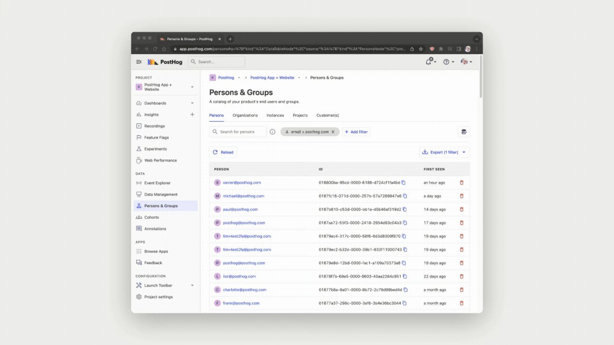

Today, we're excited to announce a major new feature that's now available for all users as a public beta on PostHog Cloud - the ability to directly query data stored in PostHog via SQL.

We've added several new ways to use SQL in PostHog - you can use expressions to enhance insights, you can use SQL to filter a revamped events list, and you can even use full SQL queries to analyze data in any way you want. 

We've even created [our own SQL dialect, called HogQL](/docs/product-analytics/hogql).

While PostHog's existing insights remain valuable for the vast majority of queries, HogQL gives them a massive upgrade for those times when off-the-shelf insights don't fit the bill. 

Speaking of bills... these features are free for all users while in public beta – all we ask is that you [share any feedback with us](http://app.posthog.com/home#supportModal). 

## What is HogQL?

Basically, HogQL is our take on SQL. 

Less basically, it's a transition layer over ClickHouse SQL that's intuitive for anyone familiar with SQL, but offers a few extra advantages and features.

Unique features to HogQL include simplified access to event and person properties, as well as automatically added joins when you query fields with data on a different table, such as `events.person.properties.$browser`.

You can also use subqueries, joins, table expressions, arrays, aggregations, lambdas and a whole host of other neat SQL features, including aggregations.

Whether you're a technical product manager who needs multi-property breakdowns, or an engineer wishing to dissect data in more nuanced ways, HogQL unlocks a whole new world of insights to PostHog users.

We recommend checking the docs for a more detailed [explanation of ClickHouse SQL functions which are supported in HogQL](/manual/hogql).

## HogQL breakdowns


<Caption>Using a `properties.$browser_version` HogQL expression to breakdown results</Caption>

A frequent request from teams using PostHog has been the ability to breakdown insight results across multiple properties. To accommodate this, we've added the ability to use HogQL expressions within a breakdown. 

In other words, you can now break down results however you like – including by multiple properties at once. Want to break down new signups by both pricing tier _and_ overall usage? Now you can.

> **Ready to get started?** Check out our tutorial about [how to use HogQL for running advanced breakdowns](docs/tutorials/hogql-breakdowns)

## HogQL filters


<Caption>Using a `properties.$screen_width < properties.$screen_height` HogQL expression as a filter</Caption>

Oh, look. You can use HogQL in filters too. Useful for _filtering_ by multiple properties!

## HogQL aggregations

<Caption>Using a `properties.$session_id` HogQL expression to aggregate by unique sessions</Caption>

_And_ you can use HogQL to aggregate results in a funnel too. Is there anything HogQL can't do? Probably, yes, but we'll enjoy finding out for sure. 

## SQL insights

<Caption>Using an SQL insight to run the query below</Caption>

If you're familiar with SQL, the easiest and most powerful way to leverage it within PostHog is via the new SQL insight type. This gives you direct SQL access to your data in PostHog, so you can create custom tables, visualization and more. 

SQL insights are especially useful for when you need to do exotic or novel analysis that isn't immediately possible with existing insight types. For example, while you can use a retention insight to discover which product features keep users coming back for more, you could use an SQL insight to find which users keep coming back and identify outliers. 

We can't wait to hear your feedback, and see what's possible with SQL access in PostHog. We're confident it will give engineers a unique edge, and better information, than other analytics tools.

To give you a sense of what's possible with SQL, here's an example query we use to summarize data from a survey we ran to determine which countries prefer pineapple on a pizza.

```
   select properties.$geoip_country_name,
          countIf(not properties.does_pineapple_go_on_pizza) > countIf(properties.does_pineapple_go_on_pizza)
            ? '🍅 Does not belong on pizza'
            : countIf(not properties.does_pineapple_go_on_pizza) = countIf(properties.does_pineapple_go_on_pizza)
              ? '🥦 It is a tie'
              : '🍍 Belongs on pizza'
          as Result,
          concat(
             repeat('🍍', countIf(properties.does_pineapple_go_on_pizza)),
             repeat('🍅', countIf(not properties.does_pineapple_go_on_pizza))
          ) as Answers,
          count() as `Number of answers`,
          concat(
            toString(round(countIf(properties.does_pineapple_go_on_pizza) / count() * 1000) / 10), '%'
          ) as `Percentage pineapple`
     from events
    where event = 'pineapple_on_pizza_survey'
 group by properties.$geoip_country_name
 order by count() desc
    limit 100
```

## The PostHog event explorer 
We haven't introduced HogQL in isolation – we've also bought it into existing parts of PostHog, supercharging them to deliver new functionality. 

The Event Explorer (previously the Live Events tab) is a great example of this. What was previously a stream of incoming events now offers wholly new ways to interact with your data and filter it into custom tables. 

The event explorer enables you to view and edit the JSON source behind the table, so you can create tables in PostHog and add them to dashboards. You can also use HogQL expressions (e.g. `properties.$screen_width * $properties.screen_height`) and aggregations (e.g. `sum(properties.price)`) as columns.

This is helpful not just for generating tables that summarize person and event information according to your needs, but also for exploring the data in new and totally custom ways. 

You could, for example, use HogQL to run currency conversions and normalize data into a single currency in its own column – or even extrapolate and project revenue and usage figures into the future.

## Custom insights


Finally, we're introducing custom insights, which enable you to create a very wide range of insights and visualizations. 

Custom insights basically turn any list of events or persons - almost every table in PostHog, basically - into an insight that can be added to a dashboard. 

You can add tables directly by hitting the new 'Open as a new insight' button (above) to reveal the source behind the table, and editing it to create new views. You can also use the 'View source' button on existing insights to accomplish the same. 

## The history (and future) of HogQL

We originally started thinking about HogQL back in January, while thinking about [a concept for universal search within PostHog](https://github.com/PostHog/posthog/issues/7963). Over time, that plan evolved into creating [new ways for users to explore data](https://github.com/PostHog/meta/issues/86) via direct queries. We wanted users to be able to run formulas powered by HogQL in what was then called the Live Events view, but is now the Event Explorer. 

However, while this work was underway we realized we could potentially take it a step further and [build full SQL support](https://github.com/PostHog/meta/issues/81) directly into PostHog as a new insight type. You'd simply write a new SQL query in PostHog, press 'Run' and get a table with your desired results. 

We're still actively developing these ideas, as well as the implementation of HogQL within PostHog. If you have any feedback, we'd love to here from you in [the PostHog Slack group](/slack).

<ArrayCTA />
