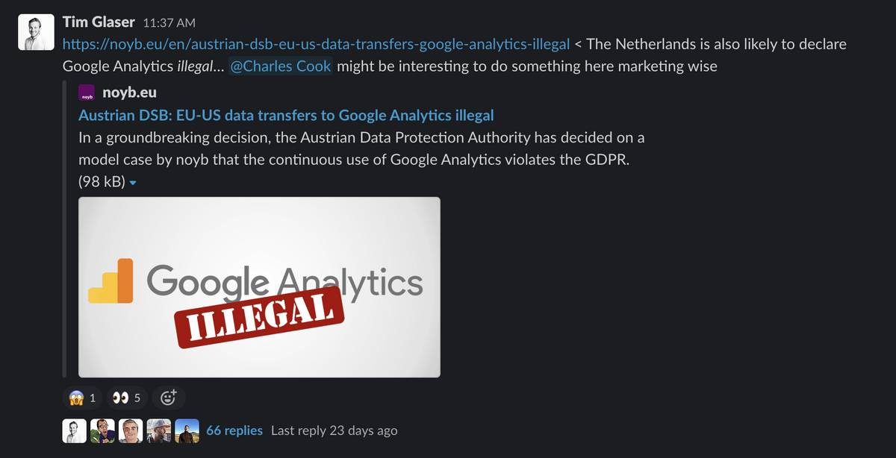
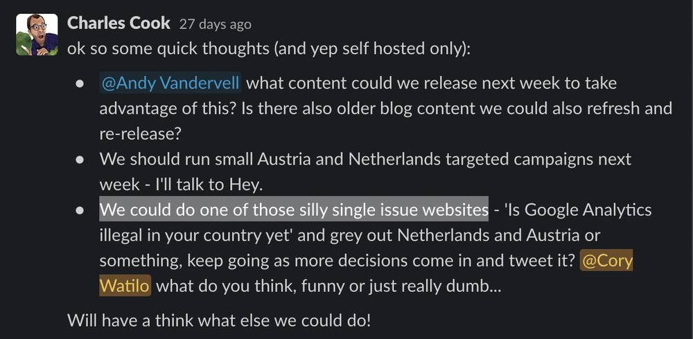
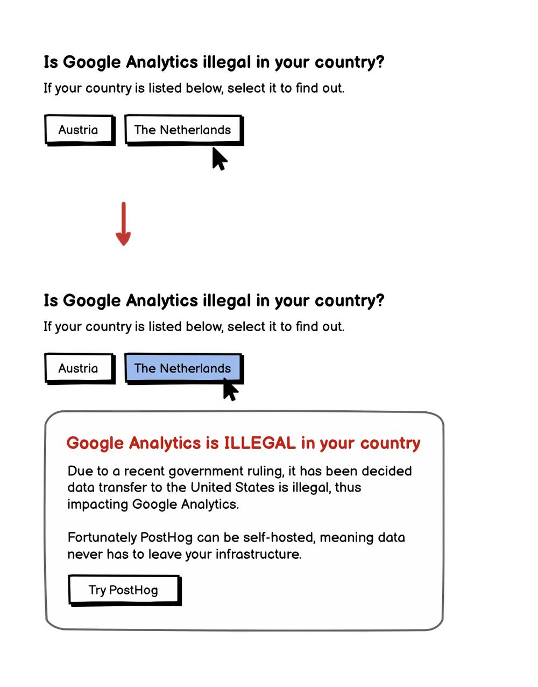
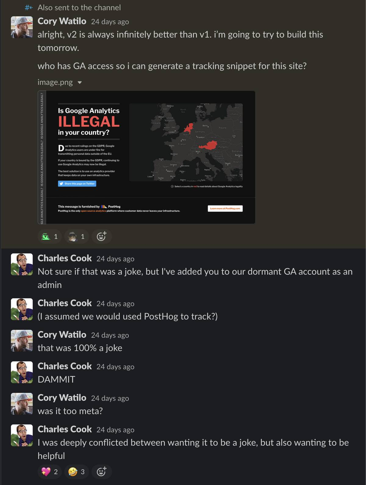
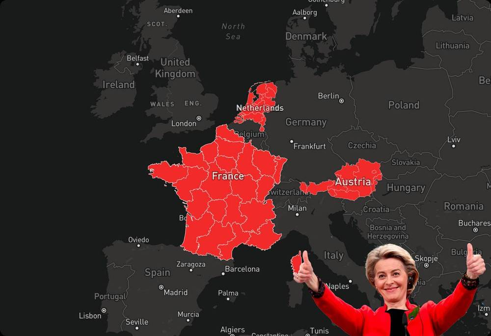
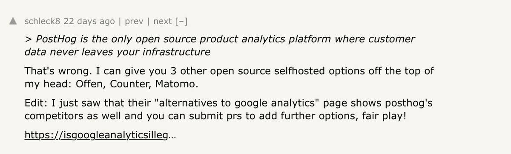
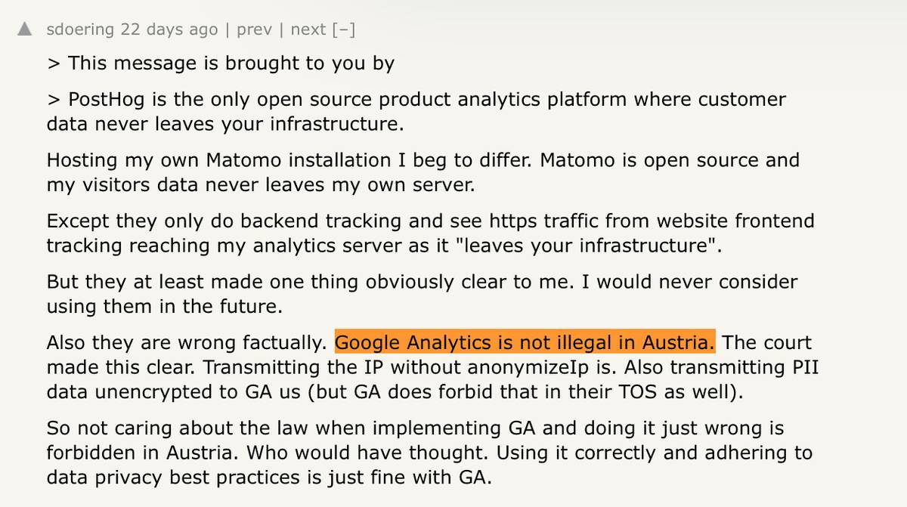

On January 14, 2022, the world learned that Austria had declared Google Analytics to be illegal (in its default form), since it transmits IP addresses to the United States. The Netherlands declared the same view only days later.

Given that PostHog is an open source, self-hostable analytics tool that eliminates the need to transmit data to *any* third party, this was obviously a perfect opportunity for us to capitalize on the news.

Within five days, we launched [IsGoogleAnalyticsIllegal.com](https://isgoogleanalyticsillegal.com) and shared it with the Hacker News community. Here’s the story of how we built it in two days, how it was received by the HN community, and our missteps along the way.

## A timeline

### It all started when our CTO shared the news on Slack



### Then our VP of Ops came up with an idea to launch a microsite



### Obviously this felt like a fun idea, so I put together a quick joke of a wireframe



### Soon we had a gimmicky domain name and the idea was born


### I remember being on a flight at the time. What better way to spend a couple hours in coach than to whip up a mock?



## How we positioned the site

We decided to share the site on Hacker News, a site that highly values authenticity. If a post has even the slightest whiff of self-promotion, you can be prepared to be torn to shreds.

Thankfully one of our marketing values is “No sneaky shit.” I can’t say it better than it’s already stated [in our Company Handbook](https://posthog.com/handbook/growth/marketing#no-sneaky-shit):

> Our focus customers are technical and acutely aware of the tedious clickbaity marketing tactics that software companies use to try and entice them. Stop. It's patronizing to both the customer and the marketing people creating the content.<br /><br />
> We will never try to trick someone into using PostHog through spammy marketing tactics. That's a great way to boost vanity signup metrics in the short term before the customer quickly churns out.

### Our challenges

How can we:

- have a little fun with this site concept
- provide real value to our visitors
- see an uptick in traffic to PostHog.com
- make it obvious we’re not trying to make this solely a marketing stunt?

### 1. Provide value: **Include our competitors and let anyone add to the list**

We seeded our [Google Analytics alternatives](https://isgoogleanalyticsillegal.com/alternatives) page with all of the competitors we could think of who would solve this problem for companies affected by this ruling:

- Open-source analytics tools
- Self-hostable analytics tools
- Analytics providers in the EU, where customer data isn’t transmitted to the United States

We also [published our codebase on GitHub](https://github.com/PostHog/isgoogleanalyticsillegal.com), where anyone can submit a pull request to add another competitor to the list.

### 2. Don’t take it too seriously

When you hover over the map of countries where Google Analytics has been deemed illegal, you’ll see a photo of Ursula von der Leyen, the President of the European Commission, indicating her enthusiasm about the rulings.

There’s also a giant scrolling news-style ticker posing the question, “Is Google Analytics illegal?”

We tried to find the balance between providing real value without trying to look like we’re scaring people into needing to use PostHog.



### 3. Make it abundantly clear who’s behind this

Like a cigarette pack that has to include a giant health warning, we tried to go over the top to disclose who was behind the site. (You can’t demonize a *little* self-promotion, right?)


## The response

Our [Hacker News post](https://news.ycombinator.com/item?id=29994183) jumped to the #2 spot on launch day, driving over 100,000 pageviews to the site. As with most posts, responses were mixed, though we did make some pretty silly gaffes (which we tried to rectify quickly).

### Maybe don’t use hosted Google Fonts on a website where you’re trying to point out Google tracking is bad

In our haste to get the site live, we used a hosted Google font. This was quickly pointed out by a commenter (and rightfully so). We [fixed it](https://github.com/PostHog/isgoogleanalyticsillegal.com/commit/66061d3e77902caf84482b11f888feea8dd615e9), but unfortunately that became the most popular comment, and is the top comment to this day. 

### Don’t use page URLs that get blocked by privacy tools

As it turns out, uBlock is allergic to the following slug:

```jsx
/google-analytics-alternatives
```

Since that page was inaccessible to uBlock users, we had to [change the path](https://github.com/PostHog/isgoogleanalyticsillegal.com/pull/7) to `/alternatives`.

### The difference between *website analytics* and *product analytics* isn’t as understood as we thought

We see a differentiation between:

- *Website analytics* - tool to analyze web-based traffic
- *Product analytics* - a larger, more in-depth toolset, designed for product teams and engineers to analyze and learn insights about in-app usage, whether web app or mobile

We were very specific in saying *product analytics* and not *website analytics*. Unfortunately some mistook our statement as the latter, and the claim we’re the only open source website analytics platform would be false!



### Some people liked the design, others didn’t (typical Hacker News!)

As the designer on this microsite, I’d like to extend a shout out to melissalobos for the design love. (As a designer with perpetual imposter syndrome, it’s always nice to hear!)

It was quickly followed up by the contrarian opinion, followed by a discussion about said opinions. (Would it really be a Hacker News thread if it *didn’t* go down this rabbit hole?)


### Consider how people will interpret what you’re *not* actually saying

On the site, we ask the question: “Is Google Analytics illegal?” We are not stating Google Analytics *is* illegal.

Countries required to follow GDPR can still use Google Analytics if they don’t transmit personal data like IP address.

Unfortunately, not everyone understood this distinction.



Given the fact that one of our values is to not use sneaky marketing tactics, I won't deny we pushed the boundaries here.

There's a risk that pitching the tagline the way we did could result in a negative perception with a certain userbase. Ultimately we decided to run with it, and we’ve been pleased with the outcome.

## Results

Ultimately our goal was brand awareness. In the 30 days following the site's launch, it resulted in 52,197 unique visitors to IsGoogleAnalyticsIllegal.com, which sent 1,791 unique visitors through to posthog.com.

## What’s next?

We continue to update the site as there are further developments across the EU. We also launched [PostHog Cloud EU](https://posthog.com/eu), providing a fully-managed [EU-hosted Google Analytics alternative](/blog/ga4-alternatives) for our customers.

More recently, France found Google Analytics to be illegal, so we recently [added that to the site.](https://isgoogleanalyticsillegal.com/france/) In fact, we saw a huge spike in traffic to the site around this time.

If this continues to become more of a trend, we’ll have to switch from manually creating graphics for the site and switch to an actual hosted mapping solution.

But if we get to that point, we’ll be sure to check that there’s no third-party tracking involved.

<GDPRForm />
