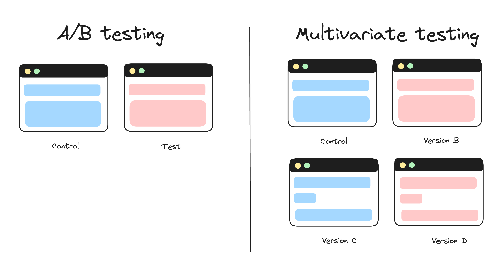
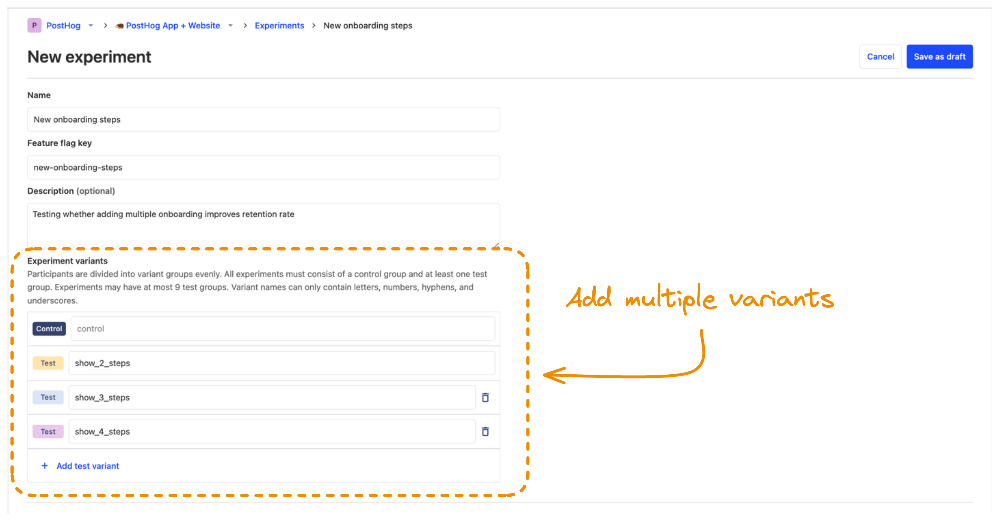

## What is multivariate testing

Multivariate testing is when you test different combinations of variables to determine which performs the best. 

For example, you want to test how the color and placement of a button affect your conversion rate. You would then create a test with four different variants:

1. The control variant.
2. The variant with only the color changed.
3. The variant with only the placement changed.
4. The variant with both the color and the placement changed.

The results from the multivariate test show not only which variant performs the best but also how each factor affected the outcome.

It's similar to [A/B testing](/ab-testing), except in A/B testing you're only testing two variants.

## Benefits

### 1. It saves you time

Testing multiple combinations at the same time means you don't have to wait for many consecutive tests to finish. If you ran each variant as an A/B test, you'd have to wait for each test to finish before starting the next one.

### 2. It uncovers interactions between variables

Multivariate testing is not just about looking at which variant is the best; it's about understanding the weight each factor had in that success. This provides insights into understanding your holistic user experience.

For example, let's say you're testing changes to the user dashboard of a B2B SaaS app. You decide to test how both the position of the navigation menu and the text of the buttons affect user engagement.

In isolation, changing the button texts might affect how well users understand your app. Similarly, moving the navigation menu from the top to the side could influence their ability to navigate it.

However, when you combine and test these changes together, you may discover that their combined effect is greater than each individual change.

Multivariate testing enables you to uncover insights like these.

## Drawbacks

### 1. You need a larger sample size

Since you split your participants into many groups, you need a larger sample size for a [statistically significant](/docs/experiments/significance) result. In practice, this means multivariant tests need to for run longer than a typical A/B test.

With this in mind, a good idea is to [calculate your required sample size](/product-engineers/ab-testing-guide-for-engineers#4-a-sufficiently-large-sample-size-of-users) before running your test so that you can ensure your test duration is reasonable.

If your duration is too long, but you'd still like to run a multivariant test, there are two potential solutions:

1. **Target proxy metrics** – e.g., if your goal is to increase conversion, instead target a metric higher up the funnel, like number of signups.

2. **Use [surveys](/surveys)** – It's often easier to ask your users about their experience instead of guessing it from metrics. Survey responses can help decision-making when statistical significance is difficult to achieve.

### 2. Multivariant tests require more work

Because you have many different variants, multivariate tests require more code, generate more data, and need more time to analyze results than A/B tests.

For example, if you have three properties and two possible variations for each, you need to create six different versions of your feature to test. Then, you need to analyze the results of each one. A huge effort!

Multivariate tests can generate great insights, but they also use up more of your team's resources.

## Multivariant vs A/B tests

Here is a table summarizing the differences between the multivariant and A/B tests:

| Situation | A/B Testing | Multivariate Testing |
|-----------|-------------|----------------------|
| **# of variants** | Two | Three or more |
| **Complexity** | Low | High
| **Sample size required**| Smaller  | Larger |
| **Duration** | Shorter | Longer |
| **Clarity of results** | Easier to interpret results. | Results may be more difficult to interpret due to multiple variables. |
| **When to Use** | You have a clear hypothesis about one variable.    Decisions need to be made quickly.     Test is straightforward. | You want to explore how multiple variables interact.    You can afford a longer test duration.    You have enough users to reach statistical significance. |

## How to implement multivariate tests in PostHog

Now that you know all about multivariate testing, here's how you implement one in PostHog:

1. Start by [creating an experiment](/docs/experiments/creating-an-experiment) in PostHog.
2. In the "Experiment variants" section, add your variant's by clicking "+ Add test variant"
3. Fill out the remaining fields, such as feature flag key, goal metric, and any other details.
4. Click "Save as draft".
5. Add the [experiment code](/docs/experiments/adding-experiment-code) to your app by customizing the user experience for each variant.
6. [Launch your experiment](https://posthog.com/docs/experiments/testing-and-launching).

## Further reading

- [8 annoying A/B testing mistakes every engineer should know](/product-engineers/ab-testing-mistakes)
- [Guardrail metrics for A/B tests, explained](/product-engineers/guardrail-metrics)
- [How YC's biggest startups run A/B tests (with examples)](/product-engineers/ab-testing-examples)
