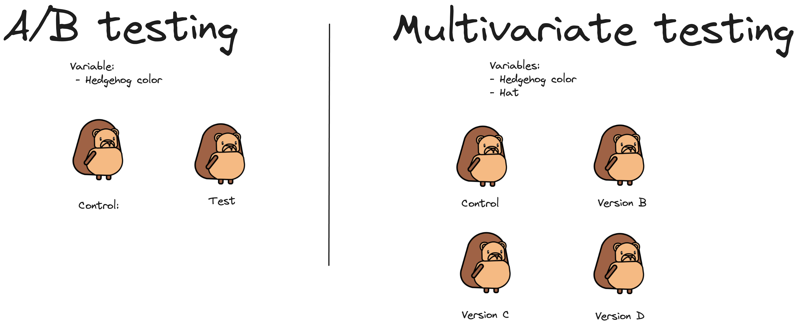

Multivariate testing is when you test multiple variables in a product or feature to determine which combination performs the best. It's similar to [A/B testing](/ab-testing), except in A/B testing you're typically only testing two different versions of your feature.

## Benefits

### 1. It saves you time

Test multiple combinations at the same time means you don't have to wait for many consecutive tests to finish. This would be the case if you were to run your tests using A/B tests, since you'd have to wait for each test before starting a new one.

### 2. It uncovers interactions between variables

Multivariate testing not only looks at the independent effect of each variable but also how they interact with each other. These interactions can be critical for understanding the holistic user experience.

It's not just about looking at which combination is the winner; it's about understanding the weight each variable had in that success.

For example, imagine you are testing changes to the user dashboard of a B2B SaaS app. You decide to test how the position of the navigation menu affects user engagement, as well as the color of your buttons.

In isolation, changing the color of the buttons might affect how quickly users can identify actionable items on the dashboard. Similarly, moving the navigation menu from the top to the side could influence the their ability to navigate efficiently.

However, when you test these variables together, you may discover complex interactions. For example, a certain color scheme could be more effective when the navigation menu is at the top of the dashboard but less so when the menu is on the side. The combined effect of the menu’s placement and the color scheme might lead to a significant increase or decrease in user task completion time.

## Drawbacks

### 1. You need a larger sample size

Since you split your participants into many groups, you need a larger sample size to gather enough data for a [statistically significant](/docs/experiments/significance) result. In practice, this means your multivariant tests will need to run for a longer duration than a typical A/B test.

A good best practice is to [calculate your required sample size](/product-engineers/ab-testing-guide-for-engineers#4-a-sufficiently-large-sample-size-of-users) before running your test, so that you can be sure your test duration is reasonable.

If your duration is too long but you'd still like to run a multivariant test, there are two potential solutions:

1. Target a proxy metrics – e.g., if your goal is to increase retention but you don't have enough volume for it, instead target a metric higher up the funnel, like number of sign ups.

2. Use [surveys](/surveys). It's often easier to ask your users about their experience instead of guessing it from metrics. Survey answers can help decision making when statistical significance is difficult to achieve.

### 2. Multivariant tests require more effort

Multivariant tests are more complex since they require more code, generate more data, and need more time to analyze results. This complexity can lead to a greater risk of errors, both in the setup and interpretation of the data.

For example, if you have three variables and two possible variations for each, you would need to create 6 different versions of your feature to test every possible combination. This increases the risk of code errors and requires careful planning, both in code setup and data interpretation

Multivariant tests can generate great insights, but they use up more of your team's resources.

Generates more data = more time to analyze, more resources , more code etc, more testing
Potential for Confusing Results / more time to analyze results

They are more complex
1. Too many combinations make result interpretation difficult. , mo

With so many variables interacting, teasing apart the influence of each variable on the overall outcome becomes a far more intricate task. It's not just about looking at which combination is the winner; it's about understanding the weight each variable had in that success. 

## Multivariant vs A/B tests

Here is a table summarizing the difference between the two:

| Situation | A/B Testing | Multivariate Testing |
|-----------|-------------|----------------------|
| Objective | To compare two versions (A and B) to determine which one performs better. | To understand how different variables interact with each other and impact the user experience. |
| Variables | Usually one variable is changed at a time. | Multiple variables are tested simultaneously to see their combined effect. |
| Complexity | Low to moderate — simpler to design and implement. | High — more complex to design, implement, and analyze. |
| Sample Size | Requires a smaller sample size than multivariate tests. | Requires a larger sample size due to the complexity of combinations. |
| Duration | Typically quicker to run as only two versions are compared. | Longer to run as it needs to account for multiple variations. |
| Precision | Good for determining the better of two versions. | Good for understanding detailed interactions between elements. |
| Clarity of Results | Easier to interpret results. | Results may be more difficult to interpret due to multiple variables. |
| Resource Intensity | Less resource-intensive. | More resource-intensive. |
| When to Use | When you have a clear hypothesis about one element. When decisions need to be made quickly. When the test is straightforward. | When you want to explore how multiple elements interact. When you can afford a longer test period. When you have enough traffic to reach statistical significance. |

## How to implement multivariate tests in PostHog

Now that you know all about multivariant testing, here's how you implement them in PostHog:

1. Start by [creating an experiment](/docs/experiments/creating-an-experiment) in PostHog.
2. In the "Experiment variants" section, add your variant's by clicking "+ Add test variant"
3. Fill out the remaining fields, such as feature flag key, goal metric, and any other details.
4. Click "Save as draft".
5. Add the [experiment code](/docs/experiments/adding-experiment-code) to your app by customizing the user experience for each variant.
6. [Launch your experiment](https://posthog.com/docs/experiments/testing-and-launching).

## Further reading

