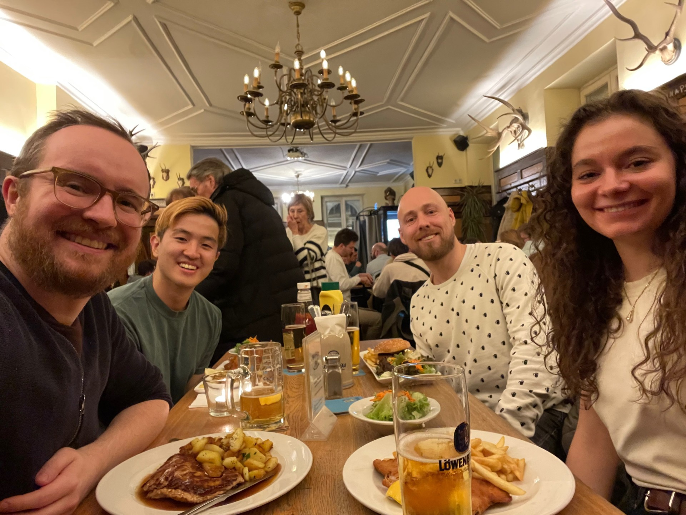
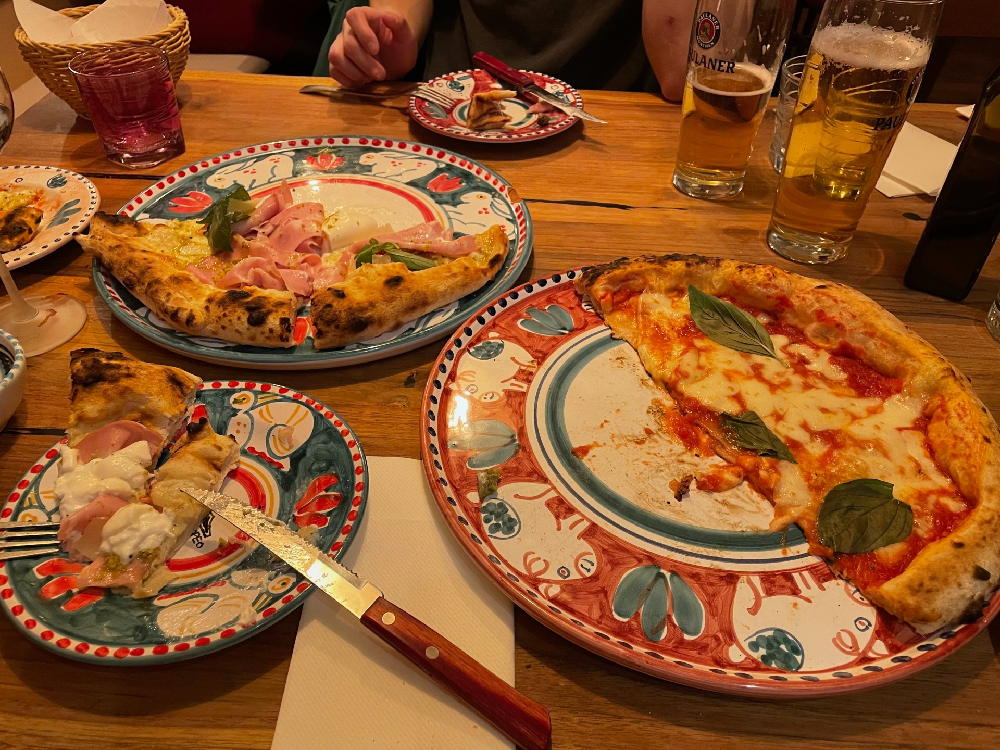

While PostHog is a fully-remote startup, we're constantly meeting up in-person. We have an annual company offsite and each small team will have at least one off-site each year, sometimes two. We also have budgets for impromptu visits.

Recently, the session recording team met up in Munich 🇩🇪 🍻 for their first ever get-to-know-you offsite. Inevitably they ran a hackathon and (inevitably) they built something **really** cool. 

## How it started

[Team Session Recording](/handbook/small-teams/session-recording) is Ben White and Alex Kim. They're both engineers and Annika, one of our product mamagers, joined them.

Here's a nice photo of them enjoying Schnitzel (probably) with Thomas Obermüller from the product analytics team, who happens to live in Munich. 

Weirdly, the team shared lots of photos of them drinking beer and eating nice food. I'm sure this is because they were too busy building awesome things to take photos at the time...

Here's some pizza they ate with truly industrial volumes of cheese and ham on it, but (thankfully) no pineapple. 

<caption>🍍 + 🍕 = 😰 (YMMV)</caption>

Anyway, Ben and Alex have worked in other PostHog teams in the past – product analytics and experiments respectively. Annika works across more than one product, too. This gave them a unique view on how insights, experiments, feature flags, and session recordings could come together.

While PostHog started out as "self-hosted Mixpanel", now we're a Product OS – a suite of tools that are great on their own, but **amazing** when used together. You can read more about this in the [strategy overview](/handbook/strategy/overview) section of our public handbook if you're curious.

This became the theme of their offsite. As Ben put it: "How can we make recordings better in a unique PostHog way?" 

Their answer? Well, they kind of built Notion **inside** PostHog.

## Say hello to notebooks

Notebooks are inspired by our [PostHog 3000 project](/PostHog/posthog/labels/posthog-3000] – a new user interface concept that's built for power users.

Here's the elevator pitch: 

> Notebooks enable PostHog users to collate any insight, feature flag, recording, or data point, into a single notebook you can share with your team or in public.

With notebooks you can:

Add text and formatting using markdown...

[GIF HERE]

Add insights at the click of a button...

[GIF HERE]

Add relevant feature flags...

[GIF HERE]

Add recording playlists and watch individual recordings...

[GIF HERE]

Add a table of persons who match a set of filters, and view them individually...

[GIF HERE]

There's a bunch more stuff, but I think you get the idea. How could you use notebooks? Let me count some ways:

1. To build a business case for a new feature or product
2. To save interesting insights to use later
3. To report on the performance of a new feature launch
4. To collaboratively troubleshoot a bug or user experience problem
5. To create interactive board reports
6. To build interactive presentation with real session recordings

You can probably think of more.

## What next for notebooks?

The team built notebooks in just a couple of days. It's already quite powerful, but it's just an MVP.

We're already excited about the ways notebooks could enhance the way people use PostHog. Right now, it's a potential mini-feature, but it could become so much more. 🚀

We want to hear what you think. To do so, comment on the [notebooks for PostHog RFC](link-to-github-when-it-exists), or vote for it on [our public roadmap](/roadmap).