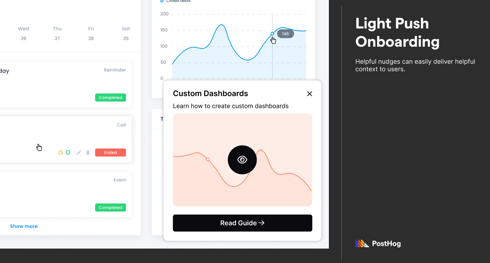
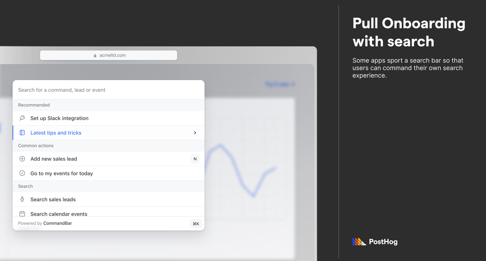
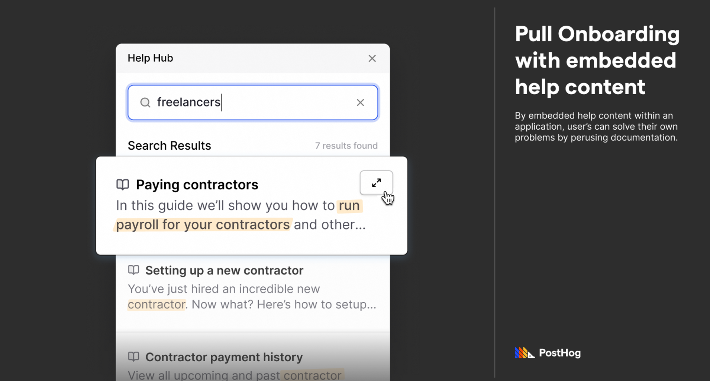
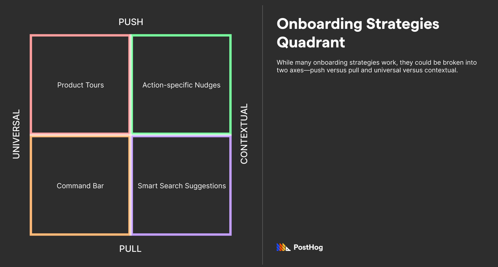

SaaS app onboarding strategies are changing. Better said, evolving. Sure, anything business-related is always in flux, but there has been a particular shift in SaaS onboarding in the last five years. Before, for the latter half of the past decade, onboarding was dominated by product tours—pop-up modals, checklists, lots of “Next” buttons, etc. And, for a while, these step-by-step tours were considered a [must-have](https://www.pitangoux.com/general/saas-product-tour-trends/) for any arbitrary SaaS app.

However, today, this interruption-heavy approach is competing with newer, user-driven onboarding models. In this piece, we’ll explore the chaos of the SaaS onboarding landscape in 2023, and then drill into why measuring feature success is the only sure-fire strategy for crafting the right onboarding strategy. 

## The application tour—the outgoing champ

WalkMe (founded 2011), AppCues (2013), and Pendo (2013) dominated SaaS onboarding in the late 2010s. These companies tout self-service application tours. You can use any of these tools to create lightbox sequences that highlight core features with helper text. They are fairly no-code to implement and easy to iterate on. 

Onboarding tours typically start immediately after a user signs up. Chances are, you’ve gone through one. Actually, chances are you’ve gone through many. Application tours grew pretty fast after their inception in the early 2010s. There was a lot to love about them. They enabled product designers to showcase relevant features in a classroom-like format. For self-serve companies that don’t have the bandwidth to manually onboard each customer, application tours provide a solid robotized alternative. 

However, around the dawn of the new decade, there was a growing push against product tours. It is a story of novelty turned bad habit. A great example of this sentiment is [this popular piece](https://userpilot.medium.com/everybody-hates-product-tours-why-you-should-hate-them-too-b4bb6ba7a54f) by Userpilot that underscores why users usually skip product tours. Userpilot dives into a few detailed reasons, but the general thesis is that product tours are akin to force-feeding the product through a syringe—it’s too much too quickly. Rather, experts argue lessons should happen via a tapered, digestible approach.

To make matters worse, product tour woes are self-perpetuating. Because many users have taken an unhelpful product tour before, the resulting cynicism means fewer and fewer users will opt to take them in the future. In fact, [according to Userpilot](https://useronboarding.academy/post/types-of-onboarding), product tours of over five steps are skipped by 80% of users. Eighty percent! 

To contest product tours, other strategies have evolved. The best way to discover them is to explore the various spectrums that onboarding advocates argue on. 

## Four overlapping strategies: push, pull, contextual, and universal.

There are different ways to split onboarding. One of the most common splits is differentiating [push onboarding and pull onboarding](https://www.commandbar.com/blog/saas-onboarding-best-practices). 

### Contender 1: push onboarding

Push onboarding interrupts the user’s existing path to steer them down a preferred path. An application tour is a quintessential example; when a user logs in, their app exploration is interrupted by a tour. Push onboarding could be forced (i.e. a non-skippable product tour) or gentle (i.e. a [notification-like nudge](/tutorials/react-popups) informing the user of something). 

### Contender 2: pull onboarding

Pull onboarding encourages users to solve their problems via available tooling. An actionable command bar is a great example of this; an application can extend its central search bar to navigate and execute certain actions, encouraging users to explore an application efficiently via search. 

In fact, CommandBar, a popular pull onboarding tool, grew in this space by natural accident. According to James Evans, CommandBar’s CEO, “We didn’t originally think of a search bar as an onboarding tool, but we started hearing customers say things like “we can’t optimize our UI for every type of new user, and the search bar solves for that.” We realized that search is the ultimate onboarding tool. Natural language search makes it especially great for new users since they don’t always know what keywords to use.” This nicely fits the general mantra of pull onboarding—users are driving the learning process by using their own vocabulary. 

Another great example of pull onboarding is shipping an expandable panel that can access help content in-app—it doesn’t force users to do anything, but it encourages them to answer their own questions as they see fit. 

### The issue with just push and pull

Companies don’t decide between push and pull; they are purely mechanical labels akin to “checkbox” versus “radiobox”. Yes, pull onboarding is hypothetically amazing at nurturing learning, but can result in slow activation. On the flip side, push onboarding is often irritating, but gentle strategies might be welcomed.

### A more purposeful split: contextual and universal

While I have personally broken onboarding into [push and pull](https://www.commandbar.com/blog/saas-onboarding-best-practices) in the past, today I think a more relevant breakdown is between _contextual_ and _universal_ onboarding.

### Contender 3: contextual onboarding

The mantra of contextual onboarding is that onboarding strategies—both push and pull—should heuristically happen at the right moments.

The push example is a bit obvious—an application could dispatch helpful nudges whenever a user first explores an often-confused feature. 

Pull strategies can be contextual, too. For instance, if an app has a search bar, actions related to the user’s current path could be recommended as dropdown options (e.g. if a user recently deleted a document, then a “recover document” feature should be suggested). 

Contextual onboarding can reduce frustration by onboarding users at the right times. But it needs to be done tactfully; a too-liberal definition of “contextual” will just busy-up interfaces—and, by extension, annoy users. 

### Contender 4: universal onboarding

Universal onboarding is the opposite of contextual onboarding: providing product assistance agnostic to the user’s app history. To be clear, universal onboarding isn’t inherently a bad thing! Some evergreen onboarding features are great for certain apps. A command bar, an always available actionable search bar, has a low UI profile and is a fantastic universal onboarding tool. Another is a button to explore help content in-app. Or an icon to fire off the product-tour. 

A pre-requisite, however, is that universal onboarding strategies are simply an **option** for the user. If they are forced, most of the user base will be annoyed. 

### The general point

Onboarding strategies are varied across two axes, but they all work in certain contexts and backfire in others. 

Quadrant of main onboarding strategies 

Unfortunately, all of this isn’t a proven science. Appcues, Pendo, WalkMe etc. conduct studies on product tours but, understandably, are biased. CommandBar, too, is biased. And, of course, so are we (evidenced by this article). 

Our argument, however, is that SaaS onboarding is complicated and niche, and all of the debate is based on heuristics and intuition, not hard numbers. And, even if credible studies eventually happen, app audiences are too varied to make confident actions strictly based on generalizable trends. Realistically, the only way to develop a good onboarding strategy is by **measuring** it. Measuring it diligently.  

And this is the perfect segue into our favorite topic, data-driven onboarding. 

## Data-driven onboarding

By actually measuring what works and doesn’t work, product designers can iteratively build and improve onboarding strategies, including any push, pull, universal, and/or contextual strategies. With data, onboarding strategies could focus on impacting the largest cohort of users. 

To clarify, this isn’t a simple flip-and-switch “collect all data” thing. Some companies might rely on measuring overall app performance, later-on aligning trends with historical onboarding changes. But such a broad approach leaves out crucial details that can expedite reaching onboarding near-perfection. Instead, data-driven onboarding is about intimately understanding which user paths actually result in better outcomes. 

This often comes down to focusing on two things: [feature success](/tutorials/feature-retention) and feature adoption. The former, feature success, is studying what features result in long-term adoption. After determining  those, product designers can develop onboarding strategies that target those sticky features.

For instance, if users showcase better loyalty if they create a template, then onboarding can steer users toward creating a template. That may be a **nudge** that indicates that templates can be created, an ever-present suggestion in the search bar to create a template, or an optional product tour centered around creating a template. In fact, any of these strategies can be viable, and by measuring which onboarding strategies actually work, product designers can craft a scalable onboarding strategy.  

## A necessary aside: a promising future of LLMs

If you’re like me, you are vaguely sick of hearing about GPT in _every possible context_. Sorry, but I’m about to loop GPT into onboarding. 

The thing is, LLMs will actually play a role in onboarding. Applications can feed LLMs context about a specific user, generating a relevant guide for what they user can and should use an app to accomplish. 

It’s already happening. CommandBar recently launched a GPT-powered product that summarizes help articles to answer user questions. We built an LLM product ourselves, which originally started as a fun project just to mess around with GPT. [MaxAI](/blog/aruba-hackathon#maxai-our-friendly-posthog-support-ai), a Q&A bot that integrates with Slack, generates onboarding analytics strategies based on the user’s goals. In other words, MaxAI tells you how to track user behavior in your application to build informative funnels. Sure, MaxAI is definitely early—it does hallucinate impossible strategies from now and then—but it showcases the promising future of LLMs + Onboarding. 

## Conclusion

Onboarding has dramatically evolved in the last five years. While there was an era reigned by application tours, new tactics such as command bars and low-profile nudges are diversifying onboarding strategies. All work in specific contexts, and some can backfire when implemented incorrectly. 

The best way to build a good onboarding strategy is to measure feature adoption and feature success intimately. Only then can product designers confidently design a successful onboarding funnel that generates long-term app loyalty. It’s a simple thing, really—by acutely understanding how users thrive (or struggle), app developers can best assist them.

## Further reading

- [Finding your North Star metric and why it matters](/blog/north-star-metrics)
- [In-depth: PostHog vs Pendo](/blog/posthog-vs-pendo)
- [Running experiments on new users](/tutorials/new-user-experiments)