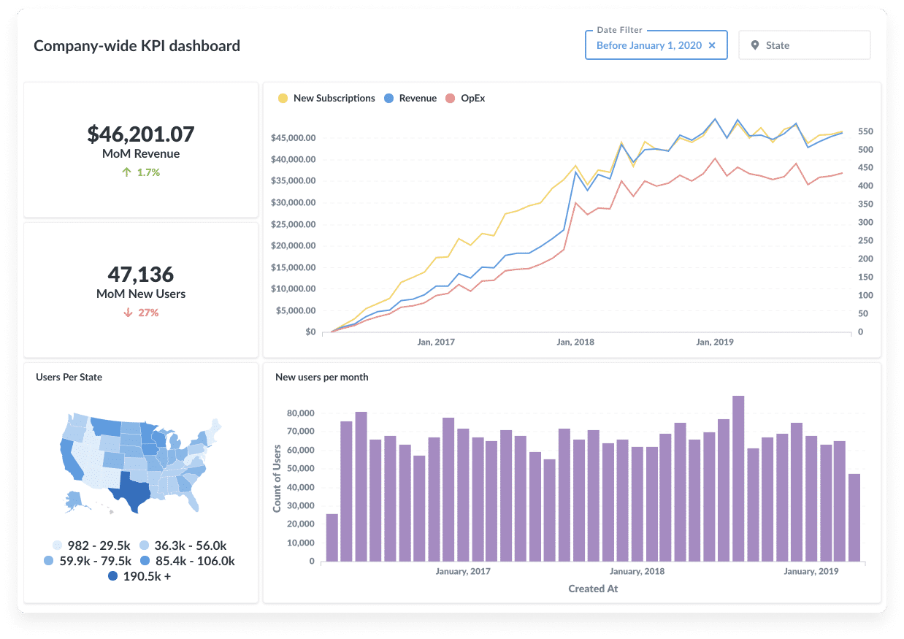
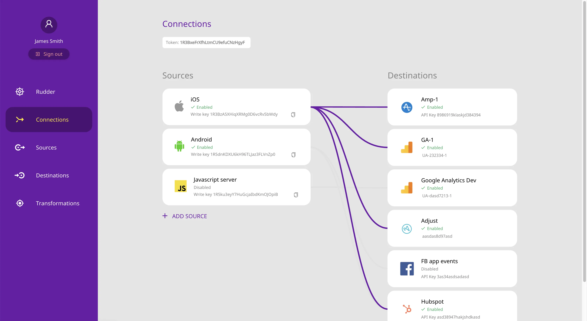
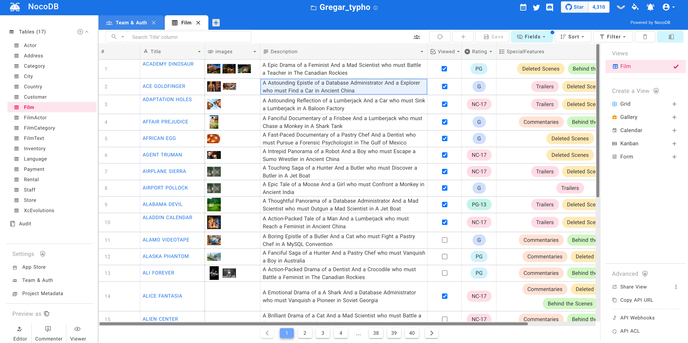
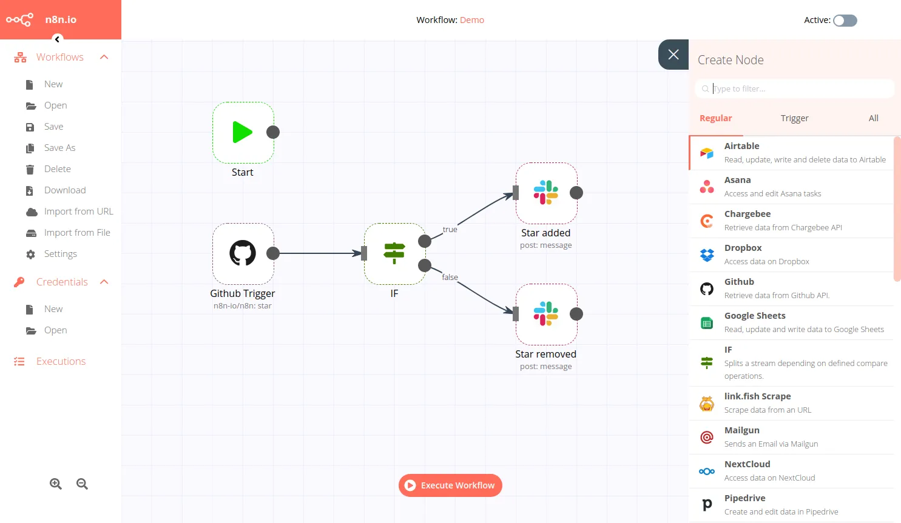
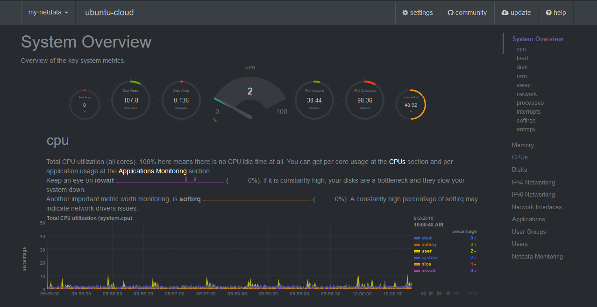
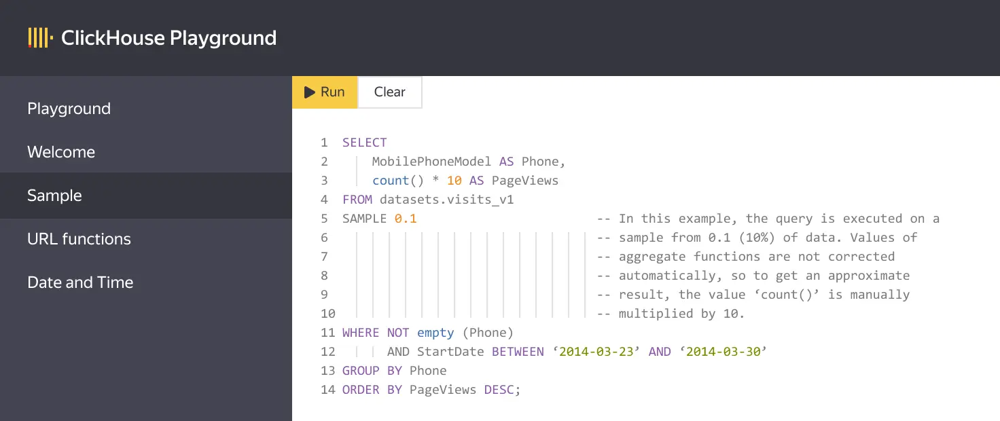

At PostHog, we believe an open source approach doesn’t just lead to greater growth; it also leads to better products. That’s what inspired us to make our platform open source, to adopt [a transparent company culture](/careers), and also why we try to use open source software wherever we can in our stack. 

We think the open source approach is best because it forces teams to be transparent, both in their decision making and also in their implementation. Then, because other teams have full visibility of the code, they can build on it and make it even better, faster and _stronger_. Often, they can do this for free.  

Of course, PostHog isn’t the only [open-source analytics platform](/blog/best-open-source-analytics-tools) out there. In fact, there’s such variety that it’s possible to build an entirely open-source stack — and here are some of our favorite open source alternatives for engineers.

> Not an engineer? Find other [open source alternatives on the PostHog blog](/blog/categories/open-source)!

## PostHog

- **Useful for:** Product analytics, session recording, feature flags 
- **Alternative to:** [Amplitude](/blog/posthog-vs-amplitude), [Mixpanel](/blog/why-i-ditched-google-analytics-for-posthog), [Matomo](/blog/posthog-vs-matomo) 
- **License:** [MIT](https://en.wikipedia.org/wiki/MIT_License) 

Of course, [PostHog](https://posthog.com) may not be the _only_ open source software useful to engineers, but it’s our (completely biased) favorite. 

PostHog’s all-in-one product analytics platform is a direct alternative to expensive, proprietary tools such as Amplitude, Mixpanel or Heap. It’s entirely self-serve, can be self-hosted or deployed in the cloud, and offers everything from funnel analytics and path analysis to cohort creation and user tracking. Best of all, because PostHog can be deployed on-prem, it’s more suitable for teams worried about [GDPR compliance](/docs/privacy/gdpr-compliance) and [HIPAA compliance](/docs/privacy/hipaa-compliance).

Unlike proprietary platforms such as Amplitude however, PostHog offers far more than just core analytics. Features such as session recording, feature flags and experimentation mean it can also act as an [open-source alternative to LaunchDarkly](/blog/best-open-source-feature-flag-tools), [HotJar](/blog/best-open-source-session-replay-tools), [VWO](/blog/best-open-source-ab-testing-tools) and more. This means PostHog isn’t just useful to engineers, but also to product managers and other teams which work closely with engineering.
 
### Strengths
- All-in-one product analytics
- Individual and group analytics
- Deploy to the cloud, or on-prem
- Unlimited feature flags
- Built-in session recording
- Multivariate experimentation suite
- Third-party apps to enrich and move data

## Metabase

- **Useful for:** Data visualization, business intelligence 
- **Alternative to:** Looker, Tableau, PowerBI 
- **License:** [AGPL](https://en.wikipedia.org/wiki/Affero_General_Public_License) 

We use Metabase for visualizing data in different ways and running complex business intelligence – it's powerful alternative to Looker, Tableua and PowerBI.

What makes Metabase so essential is that, like PostHog, you can accomplish a huge amount without needing to resort to SQL. Instead, you can create BI dashboards in just a few minutes without ever needing to write a line of code. Afterwards, these dashboards can be shared anywhere — internally, or externally. 

### Strengths
- Easy to use, no SQL required
- Interactive, drag and drop dashboards
- Deploy to the cloud, or on-prem
- Integrate with 20+ data sources

## RudderStack

- **Useful for:** CDP, Data pipeline 
- **Alternative to:** Segment, Tealium  
- **License:** [AGPLv3](https://en.wikipedia.org/wiki/Affero_General_Public_License) 

[RudderStack](https://www.rudderstack.com/) has two things in common with PostHog. Firstly, it can act as a data pipeline to funnel ingested events to other sources, such as a data warehouse or third-party platform. Secondly, you need _two_ capital letters to spell it correctly. 

Unlike PostHog however, RudderStack is completely focused on acting as a data pipeline. It can ingest data from more than 20 different sources, perform transformations in real-time and even perform version control operations via GitHub actions. 

RudderStack is perfect for teams which are concerned with regulatory compliance, as it can mask [PII](/blog/what-is-personal-data-pii) and filter out sensitive events with ease. This has helped it become wildly popular with users such as Stripe, Hinge and Allbirds to name a few. 

### Strengths
- Transport data to anywhere
- Transform data in real-time
- Pre-defined schemas for data warehouses
- SDKs track anonymous users and update downstream tools

## NocoDB

- **Useful for:** Database collaboration 
- **Alternative to:** Airtable, Postgres  
- **License:** [AGPLv3](https://en.wikipedia.org/wiki/Affero_General_Public_License) 

[NocoDB](https://www.nocodb.com/) isn’t just an alternative to database tools like Airtable — it can also act as a tool which sits on top of platforms like Airtable, converting complex databases into ‘smart spreadsheets’. 

Why would you want databases transformed into spreadsheets? Because that makes it easier to collaborate with others, especially if you’re collaborating with non-engineers. That’s why NocoDB is a no-code platform, with tools which make it easy to share spreadsheets with others (or not, via password protection).

If you are comfortable with code however, NocoDB has a few advanced features up its sleeve. Like other open-source solutions, NocoDB can be self-hosted easily, or extended further through REST APIs or an SDK. 

### Strengths
- No-code, built for collaboration
- Strong permissioning options
- Free and self-hostable

## n8n

- **Useful for:** Workflow automation, connecting services 
- **Alternative to:** Zapier, node-red  
- **License:** [Sustainable use license](https://github.com/n8n-io/n8n/blob/master/LICENSE.md) 

When you need to automate work, move data between platforms, or create basic bots there are generally two options: you can create a custom solution which you’ll then need to maintain and manage… or you can use [n8n](https://n8n.io/). 

With over 200 different integrations — or ‘nodes’, as n8n calls them — to choose from, n8n offers the best of both worlds. It’s simple enough that stakeholders can maintain workflows on a casual basis using a drag and drop UI, but powerful enough that it lets you delve into the code for more complex work. 

As with most open-source solutions, n8n can be self-hosted if you need to keep sensitive workflows or data off the cloud. Best of all, [n8n even integrates directly with PostHog](/docs/apps/n8n)!

### Strengths

- 200+ integrations with other platforms
- Deploy in the cloud, or on your own infrastructure
- Integrates with PostHog
-Simple UI for casual users; code editor for engineers

## Netdata

- **Useful for:** System monitoring  
- **Alternative to:** Datadog, Newrelic  
- **License:** [GPL 3.0](https://github.com/netdata/netdata)  

Compatible with almost any physical or virtual server, [Netdata’s](https://www.netdata.cloud/) open-source agent enables you to collect and visualize any available metric in real time. This means you can effortlessly track over 2,000+ metrics in graphs, as well as configure 200+ alerts to notify you when something goes awry. 

Going beyond this, Netdata also offers more advanced anomaly detection issues for when you really need to get into the weeds, all while making a minimal resource footprint. It’s just one of the reasons why we’re big fans of Netdata — and not just because [they use PostHog themselves](https://learn.netdata.cloud/docs/agent/anonymous-statistics/)!

### Strengths

- 1ms collection-to-visualization latency
- Single-line auto-deployment
- Anomaly detection powered by machine learning

## ClickHouse

- **Useful for:** Database management, powering PostHog 
- **Alternative to:** Redshift, Bigquery, Snowflake 
- **License:** [Apache 2.0](https://github.com/ClickHouse/ClickHouse/blob/master/LICENSE) 

We’re such big fans of ClickHouse that we not only partner with the team through [the PostHog Marketplace](/marketplace), we also [use it to power our own product](/blog/clickhouse-announcement)!

ClickHouse is a database system which is so quick that it’s an order of magnitude faster than other systems, such as Postgres, while also featuring a columnar structure which offers easy scaling (as long as you’re managing your tables correctly). It’s also popular with early-stage projects because of how efficient it is in terms of system resources, meaning that you can use less costly hardware and avoid more expensive software options. 

### Strengths

- Much faster than most other databases
- Efficient use of hardware; scales horizontally
- Columnar database structure; easily scales
- Deployed with a single binary; no need for multiple layers

<ArrayCTA />
