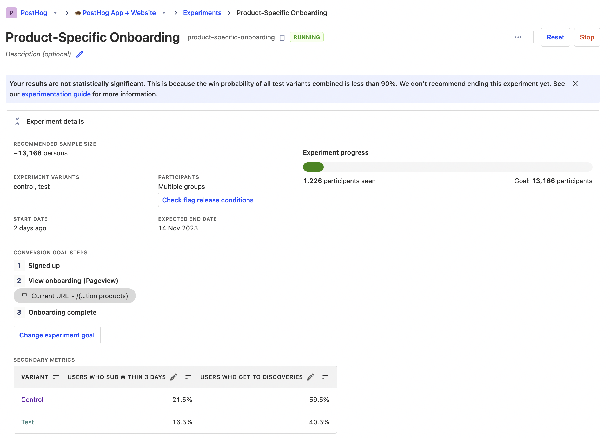
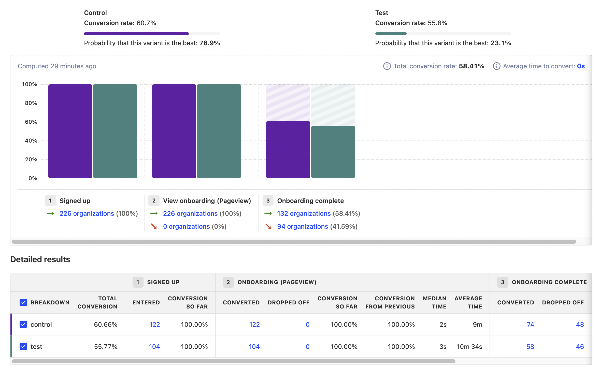

As is the case with many fan-favorite Google products, their A/B testing platform, Optimize, was recently sunset. 

PostHog is a great alternative that enables you to set up, run, and track A/B tests. It provides analytics built-in, along with a suite of product tools like feature flags, session replay, and surveys.

We wrote this guide to help you migrate from Optimize and make the most out of the tools PostHog has to offer. 

## Comparing Optimize and PostHog terms

Optimize talks a lot about experiences and personalization. This is because it is an ecommerce-focused tool. PostHog is built for developers, so focuses more on features, usage, and user behavior. 

The goal for Optimize experiments is often related to monetization, such as revenue, return on ad spend, or checkout conversion. The goals for PostHog experiments are often improving a funnel or increasing feature usage.

Beyond these focuses, many of the concepts between the two are the same, but use different words. Examples include:

| Optimize | PostHog | Description |
| --- | --- | --- |
| Account | Organization | Company or owner |
| Container | Project | Website or app |
| Experience | Experiment | The test you run |
| Objective | Goal | The metrics measured to judge test impact |
| Additional objective | Secondary metric | Non-goal metrics to track |
| Reports | Insights | Visualizations of metrics and test impact |
| Customer segment | Participant | Who you are running the test on  |

## Initial PostHog setup

Unlike Google Analytics and Optimize, PostHog uses a single script to manage A/B tests and capture usage data. There is no need to "link properties" like you do in Google.

After signing up for PostHog, you can get your script snippet in [your project settings](https://app.posthog.com/project/settings). With it, replace your Optimize script wherever it exists like this:

```html
<!-- PostHog snippet -->
<script>
    !function(t,e){var o,n,p,r;e.__SV||(window.posthog=e,e._i=[],e.init=function(i,s,a){function g(t,e){var o=e.split(".");2==o.length&&(t=t[o[0]],e=o[1]),t[e]=function(){t.push([e].concat(Array.prototype.slice.call(arguments,0)))}}(p=t.createElement("script")).type="text/javascript",p.async=!0,p.src=s.api_host+"/static/array.js",(r=t.getElementsByTagName("script")[0]).parentNode.insertBefore(p,r);var u=e;for(void 0!==a?u=e[a]=[]:a="posthog",u.people=u.people||[],u.toString=function(t){var e="posthog";return"posthog"!==a&&(e+="."+a),t||(e+=" (stub)"),e},u.people.toString=function(){return u.toString(1)+".people (stub)"},o="capture identify alias people.set people.set_once set_config register register_once unregister opt_out_capturing has_opted_out_capturing opt_in_capturing reset isFeatureEnabled onFeatureFlags getFeatureFlag getFeatureFlagPayload reloadFeatureFlags group updateEarlyAccessFeatureEnrollment getEarlyAccessFeatures getActiveMatchingSurveys getSurveys".split(" "),n=0;n<o.length;n++)g(u,o[n]);e._i.push([i,s,a])},e.__SV=1)}(document,window.posthog||[]);
    posthog.init('<ph_project_api_key>,{api_host:'<ph_instance_address>'})
</script>

<!-- Optimize -->
<script src="[https://www.googleoptimize.com/optimize.js?id=OPT_CONTAINER_ID](https://www.googleoptimize.com/optimize.js?id=OPT_CONTAINER_ID)"></script>

<!-- Google tag (gtag.js) -->
<script async src="https://www.googletagmanager.com/gtag/js?id=G-QCX3G7KSPC"></script>
<script>
  window.dataLayer = window.dataLayer || [];
  function gtag(){dataLayer.push(arguments);}
  gtag('js', new Date());
  gtag('config', 'G-QCX3G7KSPC', {'optimize_id': 'GTM-QCX3KSA'});
</script>
```

You can also install and initialize PostHog using one of our [13 SDKs](/docs/getting-started/install?tab=sdks) like [React](/docs/libraries/react), [Python](/docs/libraries/python), [Flutter](/docs/libraries/flutter), [Android](/docs/libraries/android), [Node](/docs/libraries/node), and more.

Once you install and initialize PostHog, it automatically starts autocapturing usage of your app and is ready for A/B tests. You don’t need more set up or link with other tools. 

## Creating an A/B test in PostHog

Creating an A/B test in PostHog is different from Optimize. You start by creating your experiment in the [experiments tab](https://app.posthog.com/experiments). Once you click "New experiment," you set up:

- **Name:** Metadata to help you identify your test.
- **Feature flag key:** How you reference this test in your app or website.
- **Goal:** The metric trend or conversion you want to improve.

Additional optional setup includes:

- **Description:** Metadata to share information about your test.
- **Variants:** Enables you to run [A/B/n tests](/tutorials/abn-testing) with more than 2 variants.
- **Participants:** By default, PostHog rolls experiments out to 100% of users, but you can also use groups.
- **Secondary metrics:** Non-goal metrics you want to monitor for your test.
- **Minimum acceptable improvement:** To help you know how long you should run your test.

After completing these, click "Save as draft." You can then implement your experiment in your app.

### How are creating PostHog experiments different than Optimize?

- PostHog doesn’t need an editor page URL. The same experiment can be set up on multiple pages.

- Instead of variant cards, you create experiments with variants and then implemented differently in your app or website.

- PostHog automatically splits the traffic evenly between variants. You can change this by editing the feature flag after creating the experiment.

- Experiments roll out to all your users. You can again adjust the targeting by editing the feature flag. Targeting can use person or group properties such as device, location, or custom properties.

- Optimize limits the number of experiments to 5. PostHog lets you run unlimited.

## Implementing your experiment

Unlike Optimize, PostHog does not have a visual editor. You must implement experiments in code, but it doesn’t need to be complicated. It is simple to set up on all types of sites and apps including basic [Python](/tutorials/python-ab-testing) or [Go](/tutorials/go-feature-flags) scripts and no-code platforms like [Webflow](/tutorials/webflow-ab-tests) and [Framer](/tutorials/framer-analytics#customizing-components-with-feature-flags).

As a basic example, you can add the experiment logic to your `<script>` tag as custom code. If you had an experiment testing the text of an `<h1>` element with the ID of `landing-header`, your script would look like this: 

```html
<script>
	!function(t,e){var o,n,p,r;e.__SV||(window.posthog=e,e._i=[],e.init=function(i,s,a){function g(t,e){var o=e.split(".");2==o.length&&(t=t[o[0]],e=o[1]),t[e]=function(){t.push([e].concat(Array.prototype.slice.call(arguments,0)))}}(p=t.createElement("script")).type="text/javascript",p.async=!0,p.src=s.api_host+"/static/array.js",(r=t.getElementsByTagName("script")[0]).parentNode.insertBefore(p,r);var u=e;for(void 0!==a?u=e[a]=[]:a="posthog",u.people=u.people||[],u.toString=function(t){var e="posthog";return"posthog"!==a&&(e+="."+a),t||(e+=" (stub)"),e},u.people.toString=function(){return u.toString(1)+".people (stub)"},o="capture identify alias people.set people.set_once set_config register register_once unregister opt_out_capturing has_opted_out_capturing opt_in_capturing reset isFeatureEnabled onFeatureFlags getFeatureFlag getFeatureFlagPayload reloadFeatureFlags group updateEarlyAccessFeatureEnrollment getEarlyAccessFeatures getActiveMatchingSurveys getSurveys".split(" "),n=0;n<o.length;n++)g(u,o[n]);e._i.push([i,s,a])},e.__SV=1)}(document,window.posthog||[]);
  posthog.init('<ph_project_api_key>,{api_host:'<ph_instance_address>'})
  
	posthog.onFeatureFlags(() => {
      // Check the value of the 'test-flag' feature flag
      if (posthog.getFeatureFlag('test-flag') === 'test') {
          // If the feature flag is enabled, change the text of the landing-header
          const landingHeader = document.getElementById('landing-header');
          if (landingHeader) {
              landingHeader.textContent = "Welcome to our site!";
          }
      }
  });
</script>
```

If instead, you wanted to test the color and size Tailwind classes of a button with the ID of `main-cta`, your script would look like this:

```html
<script>
	!function(t,e){var o,n,p,r;e.__SV||(window.posthog=e,e._i=[],e.init=function(i,s,a){function g(t,e){var o=e.split(".");2==o.length&&(t=t[o[0]],e=o[1]),t[e]=function(){t.push([e].concat(Array.prototype.slice.call(arguments,0)))}}(p=t.createElement("script")).type="text/javascript",p.async=!0,p.src=s.api_host+"/static/array.js",(r=t.getElementsByTagName("script")[0]).parentNode.insertBefore(p,r);var u=e;for(void 0!==a?u=e[a]=[]:a="posthog",u.people=u.people||[],u.toString=function(t){var e="posthog";return"posthog"!==a&&(e+="."+a),t||(e+=" (stub)"),e},u.people.toString=function(){return u.toString(1)+".people (stub)"},o="capture identify alias people.set people.set_once set_config register register_once unregister opt_out_capturing has_opted_out_capturing opt_in_capturing reset isFeatureEnabled onFeatureFlags getFeatureFlag getFeatureFlagPayload reloadFeatureFlags group updateEarlyAccessFeatureEnrollment getEarlyAccessFeatures getActiveMatchingSurveys getSurveys".split(" "),n=0;n<o.length;n++)g(u,o[n]);e._i.push([i,s,a])},e.__SV=1)}(document,window.posthog||[]);
  posthog.init('<ph_project_api_key>,{api_host:'<ph_instance_address>'})
  
	posthog.onFeatureFlags(() => {
    // Check the value of the 'test-flag' feature flag
    if (posthog.getFeatureFlag('test-flag') === 'test') {
      // If the feature flag is enabled, change the Tailwind classes of the main-cta button
      const mainCtaButton = document.getElementById('main-cta');
      if (mainCtaButton) {
        // Replace the existing classes with the new ones
        mainCtaButton.classList.remove('bg-slate-500', 'text-xl');
        mainCtaButton.classList.add('bg-red-300', 'text-2xl');
      }
    }
  });
</script>
```

Anywhere you can add script tags or custom JavaScript, you can implement PostHog A/B tests. You can also use any of our backend SDKs or even our API.

After implementing your experiment and testing that it works, click "Launch" in PostHog to start.

## Viewing your experiment results

The equivalent of Google Optimize’s reporting tab is PostHog’s experiment results. This shows two main sections

First, a summary of the experiment details, including its progress, goals, results, and impact on secondary metrics.



Second, the experiment results. This includes a side-by-side comparison of test variants, the winning variant probabilities, your goal metric visualization, and detailed results.



Beyond the preset experiment results, you can analyze related events with PostHog’s full suite of product analytics tools. Like how you can use variant ID and test names to analyze Optimize tests in Google Analytics, you can use feature flag properties to filter for relevant data in multi-insight dashboards, retention insights, and session replays.

## Dealing with flickering

Optimize made a big deal about preventing "flickering." The underlying reason for this is the site loading before the experiment data from Optimize loaded. Optimize solved this with an "anti-flicker" snippet which loads Optimize before the page loads. The problem with this method is that it hurts page performance needing to load an external service before the page loads.

PostHog solves the flickering problem in a different, but similar way. It relies on [bootstrapping](/docs/feature-flags/bootstrapping) the experiment's underlying feature flags. This enables experiments to be available as soon as the page loads. It also provides you control over the usage and implementation of the flags. 

To learn how to set up bootstrapping, check out these tutorials:

- [How to use Next.js middleware to bootstrap feature flags](/tutorials/nextjs-bootstrap-flags)
- [How to bootstrap feature flags in React and Express](/tutorials/bootstrap-feature-flags-react)

## Further reading

- [An intro to PostHog for Google Analytics users](/blog/google-analytics-to-posthog)
- [What to do after installing PostHog in 5 steps](/tutorials/next-steps-after-installing)
- [A non-technical guide to understanding data in PostHog](/tutorials/non-technical-guide-to-data)
