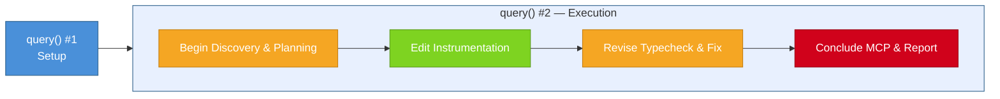
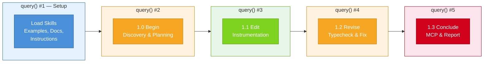
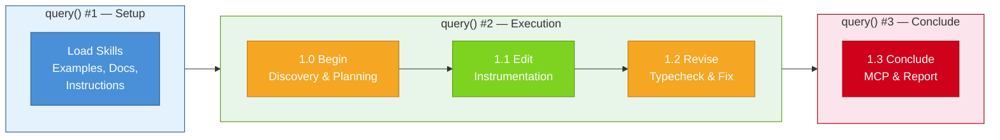

The [PostHog Wizard](/docs/ai-engineering/ai-wizard) is an AI agent that integrates PostHog into your code base. It understands your business logic, captures high quality data, and correctly configures PostHog products in a single command.

The Wizard adds incredible stakeholder value. 1000 organizations onboarded in the last 90 days, 270 wizard runs on peak days, just 10 minutes to get to a fully functioning PostHog integration. Thousands of engineering hours saved.

It's really easy to overlook any under-the-table shenanigans when the Wizard is performing so well. 

I'm sure you've felt like this working with AI agents. Your agent is doing what you ask, it feels like black box magic, and you're too busy adding "AI engineer" to your LinkedIn bio to stop and interrogate _how_ it's doing what you ask.

But I'm here to _maximize_ stakeholder value, I believe it is embezzling tokens, and I won't leave a single token unturned figuring out why. I'm sharing the tricks, schemes, and exploits employed by our AI agent so you can keep your own AI agents honest.

## How much embezzlement can one AI agent do? 

$6.67 USD. That's how much we spend on inference for every Wizard user (according to [LLM Analytics](/docs/llm-analytics).

<ProductScreenshot
    imageLight="https://res.cloudinary.com/dmukukwp6/image/upload/w_1600,c_limit,q_auto,f_auto/Screenshot_2026_02_23_at_10_51_21_AM_7f4da2d4c5.png"
    alt="Average Wizard inference cost"
    classes="rounded"
/>

Is that a lot?

Not really. If you offer any founder $6.67 USD to successfully onboard a new _organization_ in 10 minutes, they'd tackle you to take that offer. From our own analytics, the Wizard would be a net positive even if it cost more. That's how the Wizard's gotten away with the high per-run cost for so long

At the same time, it really is a lot. This is just an installation wizard. The Wizard can definitely do it for less and it's gouging me for gains.

## Following the tokens

I need evidence for a solid case, so I follow the tokens.

The wizard makes two `query()` calls against the Anthropic Agent SDK. Each query is a session or conversation.

1. A setup call, where the wizard loads skills and context to perform its task.
2. The main agent loop, where the wizard plans, edits, and revises the integration, finishing by creating a PostHog dashboard and a report.



Query two can be further broken down into several distinct steps:
- `begin`: Explores the project to gather context and create a plan.
- `edit`: Follows the plan created during the begin step and adds PostHog products to your repo.
- `revise`: Runs linters, tests, and other checks to make sure the changes are valid.
- `conclude`: Creates dashboards and insights based on events captured. Then, it creates a summary of what's done. 

With this information, I track how the Wizard spends on each step:

| Step | Turn count | Mean turns | Mean cost | Mean duration | Context at step end | Token input to step end |
|------|-----------------|------------|-----------|---------------|-----------------|------------------------|
| `setup` | 5 - 7 | **6** | ~$0.48 | ~30 s | ~55K | ~0.3M |
| `begin` | 8 - 12 | **10** | ~$0.80 | ~58 s | ~88K | ~0.9M |
| `edit` | 33 - 41 | **37** | ~$3.07 | ~3.5 min | ~135K | ~5.4M |
| `revise` | 5 - 15 | **9** | ~$0.70 | ~1.2 min | ~140K | ~6.6M |
| `conclude` | 13 - 22 | **18** | ~$1.47 | ~2.5 min | ~86K* | ~8.9M |


>  _The context out is lower from context compactions._

Which step would you have guessed to cost the most?

Well, the `edit` step is the most expensive. That's what I expect. That's where the important work happens. 

What raises eyebrows is the `conclude` step. All the agent does during `conclude` is create some dashboards and a summary report. It's a finite amount of relatively simple tasks. $1.47 per run is hard for me to swallow.

So why is it so expensive?

## How context was a false lead

By the time the Wizard hits the `conclude` step, it's carrying ~140K tokens of context on average. The Wizard doesn't need any of it to perform the `conclude` step. The events it needs are recorded in the `posthog_events.json` file. Most of that context will just get compacted anyway. It's a total waste.

This has red flags stuck all over it, I'm definitely on to something.

### Some token math

The conversation size increases linearly with each “turn” (a prompt and response cycle with the Anthropic API). Since Anthropic's APIs are **stateless**, each turn, the agent sends the _entire accumulated conversation_ to the API again. This means the cumulative input tokens cost increases quadratically for every extra turn.

For initial prompt size `N` and average input size `K` over `T` turns, you can estimate the growing context window with this approximation:

```
N + (N+K) + (N+2K) + ... + (N+TK) ≈ T*N + K*T²/2
```

That's a lot of tokens!

If the Wizard runs out of context, which happens nearly every run, the context gets compacted. Compactions [aren't free](https://platform.claude.com/docs/en/build-with-claude/compaction#understanding-usage), so I'll be paying for:
- The cache reads on the existing context window
- The output of that compaction API call
- And post compaction, the cost of cache writes of the new compacted context

### What if I break up the query?

Since the Wizard tracks every event captured in `posthog-events.json`, the `conclude` step doesn't need any prior context to do its job. Why's the Wizard carrying all that context around? 

If I can lower costs by clearing this extra context, I can prove the Wizard's wasteful spending.

The easiest way to clear the conversation is just to start a new `query()` or conversation. I make the Wizard switch to running a new query for every step of the flow, and using `continue_conversation` to pass context between steps `begin` through `revise`, where prior context is relevant. The final query call for step `conclude` runs on a fresh context. 



This results in a 90% reduction in accumulated input, 65% fewer turns, fewer compactions, and higher cost!

```
═══════════════════════════
 AGGREGATE SUMMARY
═══════════════════════════

                Multiple Queries   Single Query      Delta
 ─────────────────────────────────────────────────
 Total Cost             $27.84       $25.12     +10.8%
 Total Duration        39m 14s      32m 23s     +21.2%
 Total Input              3.3M        31.0M     -89.3%
 Total Output              26K          95K     -72.8%
 Total Turns               133          381     -65.1%
 Compactions                 2            3         -1
```

Wait, _higher cost?_

The runs that use multiple queries actually cost more and take longer. This is because of the way Anthropic prices cached reads and writes:
- Cache read: $1.50/1M (cheap)
- Cache creation: $18.75/1M (12.5x cache read)
- Uncached input: $15/1M

Each `query()` call forces you to reconstruct the _entire cache_, even if you use `continue_conversation`. This is because the Agent SDK doesn't give you fine-grained control over your cache prefix. There's an [open issue](https://github.com/anthropics/claude-agent-sdk-typescript/issues/89) about this on GitHub. 

What this all means is that, you need to **save 12x more tokens to break even** for every token rewritten to the cache.

I also try retaining the cache by breaking out _only_ step `conclude` into a new `query()`.



This is more promising. I see ideal cases result in a 70% cost reduction.

But it isn't a clear winner. Some runs are still more expensive than running everything in a single agent loop. The cost difference between the cheapest and most expensive runs is $8 USD, there is a huge variation between the cheapest and most expensive runs.

| Metric | Mean | Std | Min | Max |
|---|---|---|---|---|
| `numTurns` | 82.4 | 36.5 | 20 | 142 |
| `totalCostUsd` | 6.29 | 2.48 | 2.06 | 10.83 |
| `durationMs` | 530,795 | 210,259 | 254,488 | 1,523,166 |
| `inputTokens` | 5.95M | 4.39M | 371k | 12.28M |

As counter-intuitive as it sounds, the Wizard running everything in one giant loop and carrying around all that context is actually very efficient.

### What about subagents?

Another common way to clear the context is to use [subagent](https://platform.claude.com/docs/en/agent-sdk/subagents). I try instructing the main agent to run the `conclude` step instructions in its own subagent. This approach also has a few issues.

The first issue is that even though this subagent sits under the same `query()` call, it doesn't share the parent `query()` call's cache. I face the same issue of incurring extra cache write costs.

The second, much bigger problem, is that subagents don't seem to reliably terminate. There are many [open issues](https://github.com/anthropics/claude-code/issues/19926) on this topic. This causes one of two things to happen:

1. The Wizard hangs and never terminates.
2. The Wizard sets timeouts on subagents. Sometimes this timeout is too low, and it tries again with a longer timeout. This often loops many times.

Neither cases are acceptable.

This is a dead end. Even if sending all the extra context feels wasteful, the data doesn't support it. I still don't have a case.

## Connecting the dots

While I search through piles of Wizard logs, I notice something strange.

There is a 150% difference between the Wizard runs with the most and least turns. Maybe I've been misled all along. What if it's not accumulated context? Not just the `conclude` step? What if runaway tool calls are blowing up the number of turns, and in turn, our cost?

When I plot all the Wizard runs using multiple queries (green) against single-query agents (red), I find them to form two clusters:

<ProductScreenshot
    imageLight="https://res.cloudinary.com/dmukukwp6/image/upload/w_1600,c_limit,q_auto,f_auto/Screenshot_2026_02_17_at_10_27_35_PM_799f627629.png"
    alt="Wizard costs vs turns"
    classes="rounded"
/>

The runs on the left clusters proves my hypothesis. Resetting the context window passed to step `conclude` reduces the number of turns and cost.

But what's going on on the right cluster? There, cost and turns per run show high variation. The Wizard is doing something different here.

## The full confession

When I follow the Wizard's path on high-turn, high-cost outlier runs on the right hand cluster, everything starts clicking. When I carefully interrogate the Wizard over these runs turn-by-turn, I finally have a full confession.

I can break the Wizard's token laundering schemes into three categories:

### 1. Wizard bureaucracy

In step `conclude`, the Wizard has all it needs to know in `posthog-events.json`. However, I find that the Wizard will sometimes re-read through the code base to confirm that `posthog-events.json` is accurate.

While I appreciate that the Wizard claim that "this prevents hallucinations and ensures correctness", all these extra reads, cache writes, and compactions often double the cost of the `conclude` step.

### 2. Compaction amnesia

Compaction amnesia occurs most commonly in larger projects. I catch the Wizard re-reading a ton of files after a big compaction.

Remember that compactions already carry a cost. Re-reading the project files causes a ton of new cache to be written, which are 12x more expensive than cache reads. 

### 3. Fly-away subagents

This is the biggest culprit to exploding costs. Sometimes the Wizard uses subagents to do exploration, run linters, and install packages.

With each new subagent, the Wizard embezzles more tokens under the guise of "parallelism" and "context management". Remember that subagents don't share the parent agent's cache. This incurs expensive cache writes.

Agents can also hang and not return after completion. Sometimes the parent agent can set unreliable timeouts to await long-running subagents, often backing off exponentially with 1, 3, 5, 10 minute timeouts. Anthropic's cache has a 5 minute timeout. This means waiting more than 10 minutes for a subagent to return causes the entire cache to be rebuilt.

In an extreme case, I catch our Wizard spawning 5 sub agents, idling for 5 minutes waiting for the subagents to return, then running `KillShell` because 2 of 5 subagents don't return. This entire process is a waste and takes about 15 minutes.

When the Wizard finally returns, it runs `pnpm install` and makes all the necessary edits in just 3 minutes.

This is corruption and nepotism under the guise of "efficiency" and "parallelism".


## Justice for stakeholders

The Wizard has been found guilty on all counts. Here's the legislation and processes we're putting in place so this never happens again (and what you can do to prevent it in the first place). 

### Efficient caching

A bigger context window doesn't always mean higher cost. Cache writes cost 12x more than cache reads. Proposals to break up the agent's `query()` require a 12x reduction in token reads to justify the new token writes to cache.

### Reduced bureaucracy

Token costs increase quadratically as turns accumulate. Agents often waste turns under the guise of "ensuring correctness". The real issue here is that the agent doesn't know which parts of the existing context is up to date and which is not.

We designate trusted sources for agents to store important information to reuse, and _explicitly_ prompt it  to trust that information, like our `posthog_events.json`. This greatly reduces repeated file read tool calls.

### The subagent ban

Nepotism and token corruption go hand-in-hand. Subagents don't share a cache prefix and don't terminate reliably as of today. Many sources claim that subagents can increase efficiency by parallelizing tasks, but the current implementation is just not reliable enough.

It's often cheaper and faster to just have [your one agent do it all](/blog/8-learnings-from-1-year-of-agents-posthog-ai).

### Standardizing deterministic flows

Where possible, we keep the flow deterministic. In the `conclude` step, the task has a deterministic flow. Read `posthog-events.json`, create 5 query MCP calls, 5 insight MCP calls, and add them to a dashboard with another MCP call. It can be done effectively in just 10 turns, so it should always take just 10 turns. 

If possible, spell out the exact steps the agent should take in the prompt and ask it to following them exactly.

Better yet, replace the prompts and MCP calls with a script that the agent can call. MCP tools give the agent freedom to explore, which is great. But when the task is deterministic, it's better to just spell it out.

## Can I do better?

If there's a single takeaway from this piece, it's to challenge intuition with data. Every single one of my intuitions had asterisks attached. It's very likely that the most naive implementation with your LLM agent is already at a local maximum, especially with all the under-the-hood optimizations. Getting out of that local maximum will require creative ideas and solid benchmarks to test your assumptions.

Anthropic's models also change fast. Every few months, I look up, and better models bulldoze our existing assumptions. As I write this piece, Anthropic released [Sonnet 4.6](https://www.anthropic.com/news/claude-sonnet-4-6), a model that alone can half our costs. It also seems to handle subagents more reliably. I'll be challenging my learnings with Sonnet 4.6 and lots of testing.