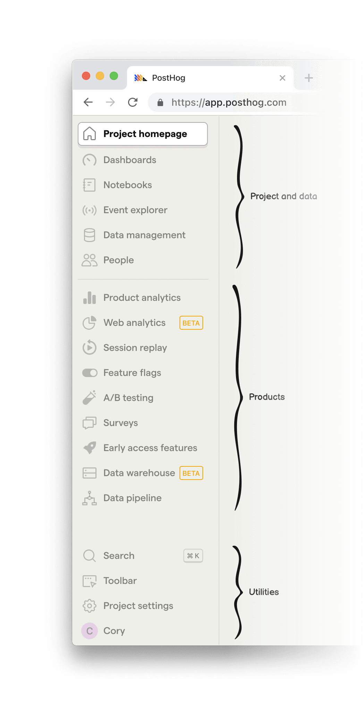
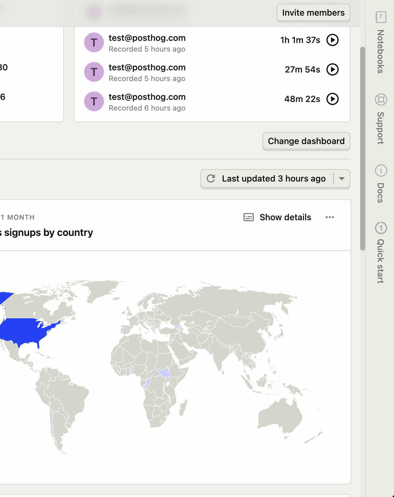
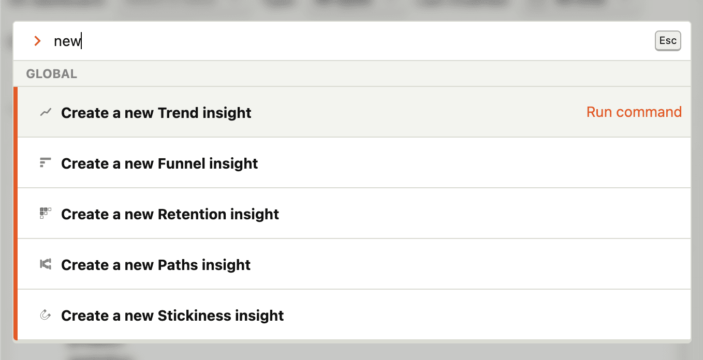
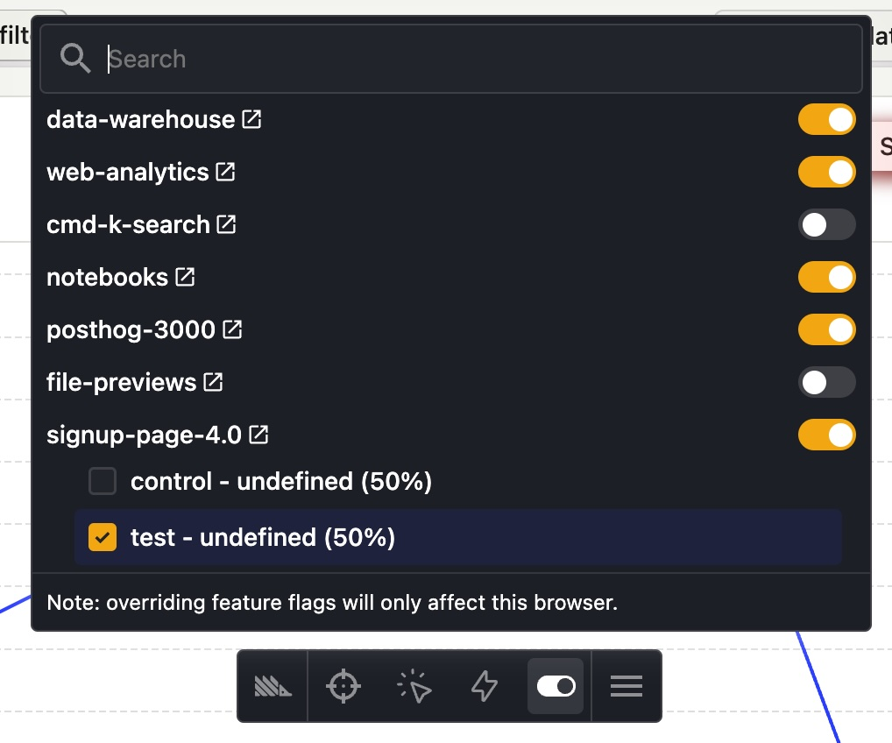
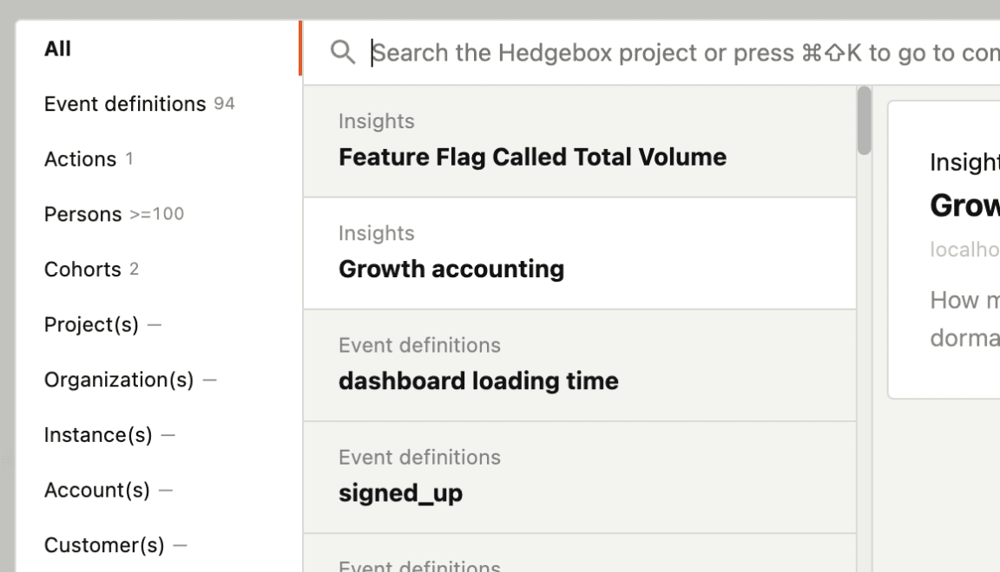
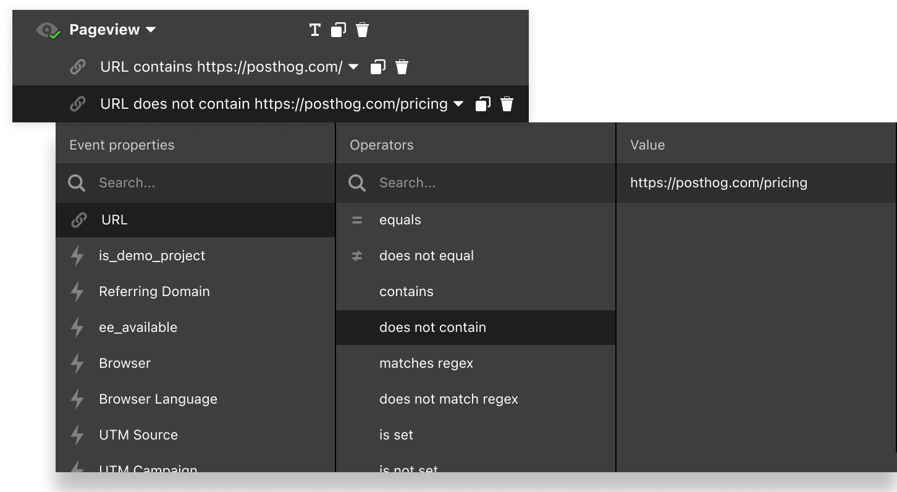
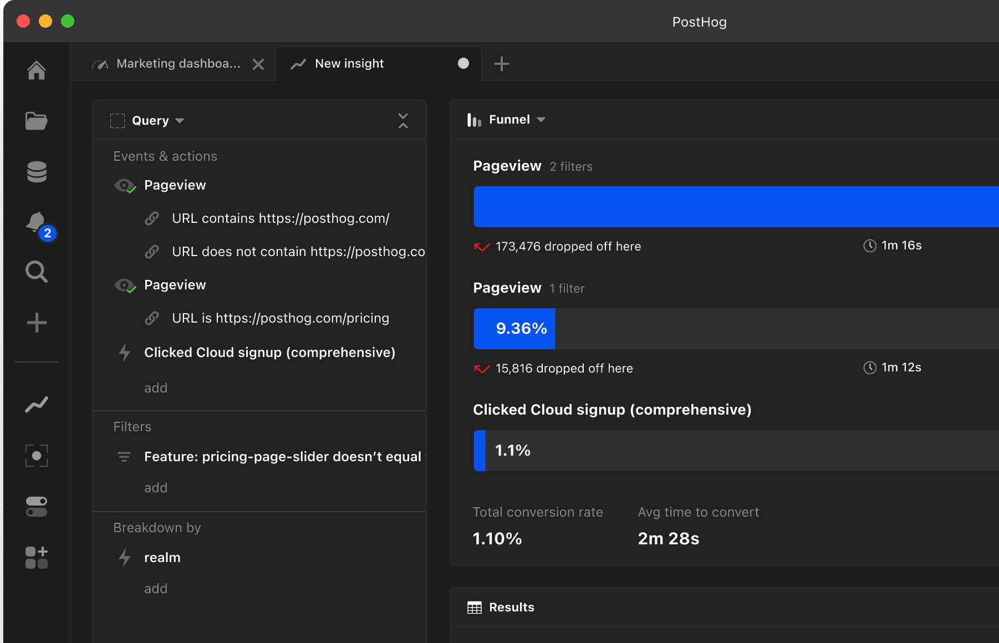
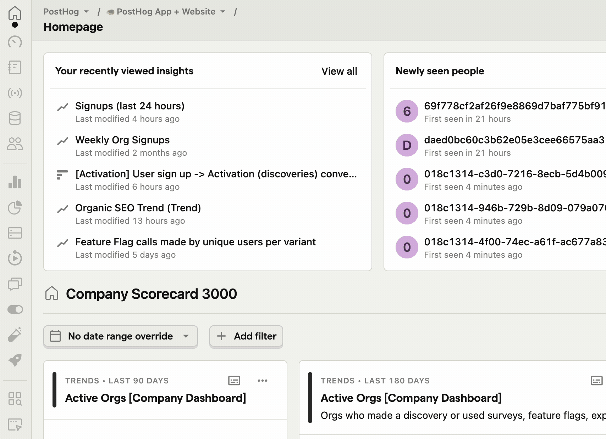
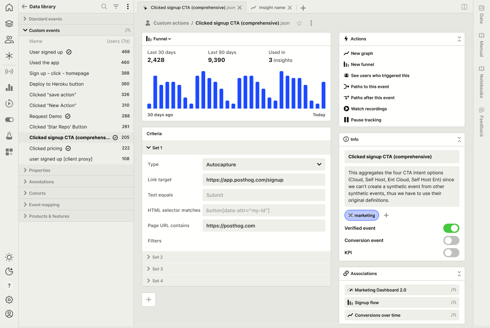

Last year, during a small team offsite in Austin, Texas, [James](/james) and I sat down in a coffee shop and had a discussion about what the future of PostHog could look like.

While nothing is “wrong” with our current UI, we knew we haven't hit the quality bar on the actual *experience*. (We have been focused on building features, without design being a blocker for shipping.) But for long-term success of PostHog, creating an experience that delights our customer base is critical.

This is even more important for a product like ours with a largely technical user base. Our ICP (ideal customer profile) is product engineers, an audience a high expectation for quality. They want their tools to “just work” the way they expect them to.

This means a shift in our design approach: **PostHog should feel less like a generic SaaS app and more like a dev tool.** (I’m using the term “dev tool” to include any product built for people with power users, not just tools where users write code.)

## SaaS app vs. dev tool

So what’s the difference between a SaaS app and a dev tool? It comes down to the experience.

| Typical SaaS app 	| Dev tool 	|
|---	|---	|
| Whitespace 	| Data density 	|
| Large titles 	| Smaller text 	|
| Whole page scrolls 	| Fixed panels & panes 	|
| Large buttons, nav menu 	| Keyboard-focused navigation 	|
| Web 2.0 	| Desktop-like layout 	|

It really comes down to making power users faster and more efficient at their jobs, as well as being flexible in terms of how a user can accomplish a task. Interfaces become less about fluff, more about getting out of the way.

Figma has nailed this for designers. VS Code has squarely accomplished this for engineers. Linear has perfected this for ~~product managers~~ everyone. And we’re going to do this for product engineers.

In essence, we want PostHog to release as much dopamine as when we’re using these other tools.

## Changes coming today

Starting today, we’re rolling out what we’re calling PostHog 3000. (Because we're no longer going from 0 to 1, we're going from 1 to 3000.) 🚀

It’s the first set of visual changes in a broader experience roadmap that will take us a year (or more?) to fully realize. When you get access to PostHog 3000 over the next month, here’s what you’ll notice:

### 1. Experience

#### Data density

As is useful in data-heavy applications, you can now see more information on the screen.

#### Dark mode

You may have noticed from the above screenshot that PostHog now has dark mode!

You can change between light, dark, and a mode that will match your system preference under the account menu.

#### Buttons & branding

There's always been a stark contrast between our website branding and the product. It's taken a while to nail, but I think we've come to a great spot that makes the product feel more like PostHog without sacrificing usability.

Excitedly, the buttons now match the website! (They're really fun to click on - don't take our word for it.) This was tricky to do, as buttons serve different purposes between a website and a product, but I'm very happy with the results.

(I'm not screenshotting them here because they really have to be experienced to be appreciated.) P.S. If you don't use PostHog yet, you should [sign up](https://app.posthog.com/signup)!

Light mode also uses the highly-~~acclaimed~~ controversial PostHog tan. ([I'm interested in hearing how you feel](https://twitter.com/ninepixelgrid) about it!)

#### Updated nav menu

The nav menu has now been organized into two main sections: **project & data** and **products**.

**Project & data** includes your dashboards and notebooks, along with the data you're sent to PostHog (like events, people, and properties), and metadata you've added on top (like actions, cohorts, and annotations) – and a live feed of incoming events.

**Products** is the ever-growing list of tools built on top of the PostHog platform.

Once the icons are familiar enough, you may want to hide the text labels. You can do this by dragging the dividing line to the left of the screen (or just double-click it).

In the future, we may add the [ability to customize the nav menu](https://github.com/PostHog/posthog/issues/18884) by re-ordering items or hiding products you don't use.

&nbsp;

#### Side panel

The new collapsible side panel is always available on the right side of the screen and is designed to help with whatever you're currently doing.

- **Notebooks:** Drag almost anything from the main workspace into a notebook so you don't lose it. It's designed to be a scratchpad for data exploration.
- **In-app docs (seen below):** Clicking any docs link in the product will now open in the side panel, keeping you in the flow of what you're doing.
- **Support:** Get in touch with support without having a model blocking whatever it is you were looking at.

The side panel may also open other panes as necessary – like quick access to settings, or an onboarding checklist if you're new to PostHog.

#### Command palette

Press `Cmd` + `Shift` + `K` to launch the new command palette. Navigate to most of PostHog's built-in features without ever touching your trackpad. (This includes things like generating an API key, creating a dashboard, or switching to dark mode.)

### 2. Data exploration/synthesis

[Notebooks](/blog/introducing-notebooks) lets you drag almost anything from the main workspace into a Notion-like document. You can add multiple types of insights or learnings, along with commentary, then share it with your team.

While Notebooks is a separate feature we're launching _with_ PostHog 3000, it's seamlessly integrated into the new UI in the side panel. Open it whenever you want to add an insight to it, and close it when you don't need it.

### 3. 3000-ify all the things

Some features just haven't been touched since they launched as MVPs. So we used this opportunity to 3000-ify them.

#### Toolbar

It's the same toolbar you know and love, except now it doesn't look like it was designed in 2020! (Oh, and it also has dark mode.)

#### Search

Search is being drastically improved. We may soon have insight previews within search results.

You can `Tab` between filtering options.

## Our UX roadmap

PostHog 3000 is far from complete. You may find a few things in the UI that don't feel quite perfect... and that's because we're not done yet!

We ship early and often - it's the PostHog way. As a designer, it can be hard not ship the full vision in its entirety (since there are a million small details I'd like to change), but we'll keep iterating over the coming months.

I hope you'll join us on this journey of making PostHog the best platform for building products. Please share your feedback with us on [GitHub](https://github.com/posthog/posthog/issues) or ~~Twitter~~ [X](https://twitter.com/posthog) - or [@ me directly](https://twitter.com/ninepixelgrid)!.

Here are some things we're considering for the future:

### 1. Unified filter experience

Right now, applying a filter requires a handful of clicks and keyboard entries. What if you could do it all in a fraction of time using only your keyboard? These are the types of experience improvements we're looking to make next.

Feedback? Share it [in this GitHub issue](https://github.com/PostHog/posthog/issues/19032).

### 2. Column-based query pane

In conjunction with the unified filter experience (seen above), we're exploring ways to make it easier to edit a query while simultaneously seeing the results. This can eliminate unnecessary scrolling, and would unify the interface between many places across products that share this functionality.

Feedback? Share it [in this GitHub issue](https://github.com/PostHog/posthog/issues/12883).

### 3. Explorer pane

There's currently no way to see a list of events while viewing the detail for one of them. It requires a click from an index view into a detail view.

So what if a side pane could let you jump into details without having to fully commit – then use the back button – or open a new tab?

Here's a preview of a concept we built (but aren't releasing quite yet). It works across the app everywhere that there's a list of items.

Feedback? Share it [in this GitHub issue](https://github.com/PostHog/posthog/issues/19033).

### 4. Tabs

Seen below with the explorer pane, here's a concept where we explored tabs! Though we're not working on these today, it's something we're definitely considering for the future. (The use case for tabs is a desktop app, which we don't have, and why there's no immediate work planned here.)

### 5. Panels: Actions, meta data, associations

Also in the above mockup, you'll notice the right column explores a few ideas:

- **Actions:** This pane would provide easy access to explore this event in PostHog products. Think of them like macros.
- **Info:** Metadata like the event name, description, tags appear here. The same concept would be used in insights, as well.
- **Associations:** Want to know where an event is used? Quickly jump to insights or dashboards that use it.

Feedback? Share it [in this GitHub issue](https://github.com/PostHog/posthog/issues/19034).

### 6. Keyboard shortcuts

This is a given, and will happen soon! (For now, check out the command palette with `Cmd` + `Shift` + `K`!)

### 7. Better mobile support

Rolled into what we're releasing today is slightly better mobile support for viewing insights. Though we don't ever intend for an entirely mobile-first experience for managing data or creating insights, this data should definitely be more accessible on mobile, and we're working toward that as well.

---

There's no shortage of ideas - it all comes down to prioritization, and making sure we're solving real problems.

## Help us decide what to work on next

If you liked this post, you may want to follow along with our [product roadmap](https://posthog.com/product-roadmap) or [GitHub](https://github.com/PostHog/posthog/issues?q=is%3Aopen+is%3Aissue+label%3Aposthog-3000) (with the `posthog-3000` label) where you'll find a lot of the original inspiration for what we're releasing today. Below, you'll find some other issues that contain some inspiration that have led up to what we're releasing today.

- [RFC: PostHog 3000](https://github.com/PostHog/posthog/issues/12923) - _Nov 2022_
- [Session replay UI in PostHog 3000](https://github.com/PostHog/posthog/issues/13360) - _Dec 2022_
- [UI improvements for running queries, doing deep dives](https://github.com/PostHog/posthog/issues/12883) - _Nov 2022_
- [Card view for PostHog 3000](https://github.com/PostHog/posthog/issues/17619) - _Sep 2023_
- [More condensed table view for Event Explorer](https://github.com/PostHog/posthog/issues/17614) - _Sep 2023_

You can also [follow me on X](https://twitter.com/ninepixelgrid) where I'll be sharing out some of our upcoming design work in progress. I'd love to hear what you think!
