Every Friday we update this page with the latest new features, fixes, and updates on PostHog Cloud in the last seven days. We also feature notable additions to the blog and docs. 

> Some new features you read about below may still be in beta, behind a feature flag, or only available to paying users. Want to see which betas are currently available? [Check the roadmap](/roadmap)!

## April 21, 2023

#### Support triage
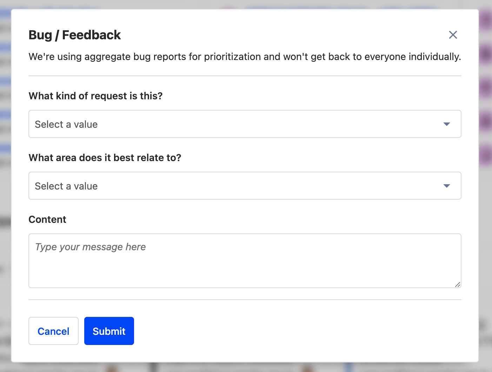

We've made a change to the way we handle support internally in order to give you a better experience. In the app this manifests through a new 'Report bug / get support' option on the help dropdown, which opens the modal above. 

Previously, we'd assign an engineer to be a [Support Hero](/handbook/engineering/support-hero) each week and they would mostly drop other work to focus on support. That worked well initially, but as PostHog has grown in breadth it's become harder for engineers to offer support outside of their usual focus. The new system automatically triages requests and assigns them to a Support Hero from the relevant small team - meaning our engineers can stay focused on shipping. 

#### PostHog is SOC 2 compliant
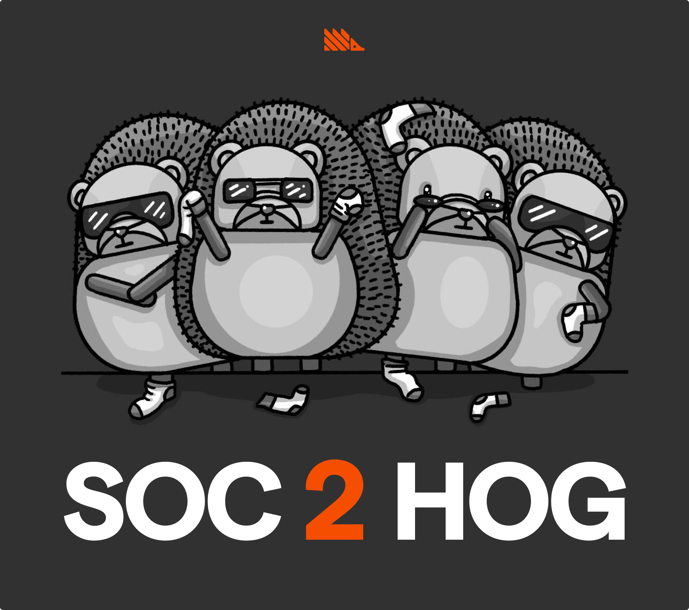

Following an audit, we've been approved as SOC 2 compliant. 

We're confident that nobody is _really_ interested in SOC 2 at a personal level. You either need it, or you don't. So... that's it. That's the update.

The image is our attempt to make SOC 2 seem cool. Maybe we've been listening to too much Boyz 2 Men?

## April 14, 2023

#### MaxAI PostHog Support AI
**Beta feature**
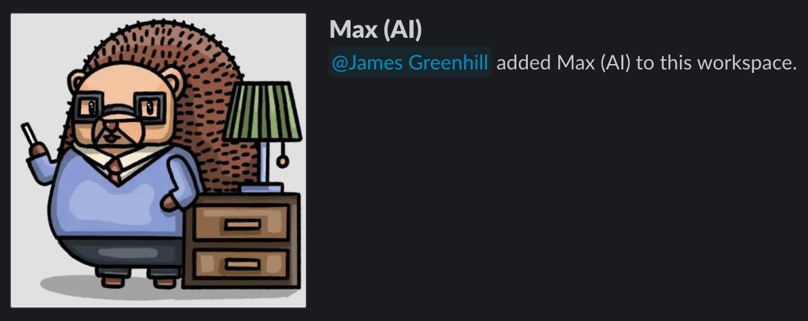

Another hackathon project from our recent offsite in Aruba has just launched, called [MaxAI](https://github.com/PostHog/max-ai). He's an open-source AI designed to help PostHog users and, [as mentioned on Twitter](https://twitter.com/posthog/status/1643266039839334400), we built the first version in just two days.

Max is currently in beta, and is deployed into our user [Slack](/slack) so he can provide help to support questions. In the future, we hope to release him onto the website, and into the PostHog app.

You can check out [the MaxAI repo README for a full explanation of how his AI works](https://github.com/PostHog/max-ai#readme) and how we trained him. The short version is that we'be built a vector database of context using [Weaviate](https://weaviate.io/), we use [Haystack](https://haystack.deepset.ai/) to connect that to prompts and questions, then feed that to GPT using the [OpenAI API](https://platform.openai.com/docs/guides/chat/introduction).

Currently Max pulls information from our docs, our GitHub repos, and our [Squeak](https://squeak.posthog.com/) questions. He can use these sources to answer questions about how PostHog works, what we're working on, how to solve common problems, and more. [He can also write poetry.](https://twitter.com/posthog/status/1643269734249406469)

Want to test him out? [Tag @Max-AI in the PostHog Slack, or send him a DM!](/slack)

#### PostHog Tracks
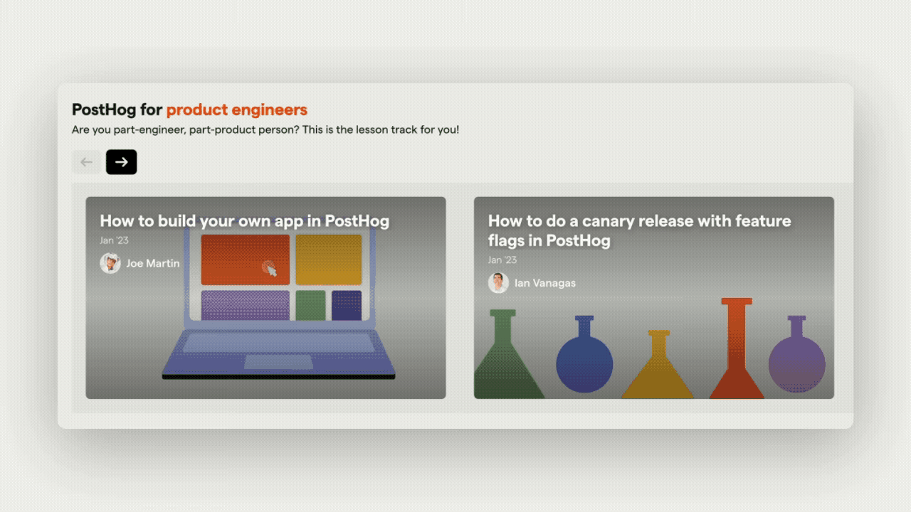

[PostHog Tracks](/tracks) is a series of curated courses of tutorials and other lessons which cover common uses for particular roles, as well as general advice for all users - and it's constantly expanding!

At the moment PostHog Tracks groups many of our existing tutorials together into role-based themes, but over time we plan to add to these tracks and form more robust learning opportunities. Let us know if you have any ideas for what could be included, in the [Slack](/slack)

## April 7, 2023

> There was no Changelog update last week because the team was away at our annual company offsite. We'll have some info on what we got up to on [the blog](/blog) soon!

#### Dashboard template library
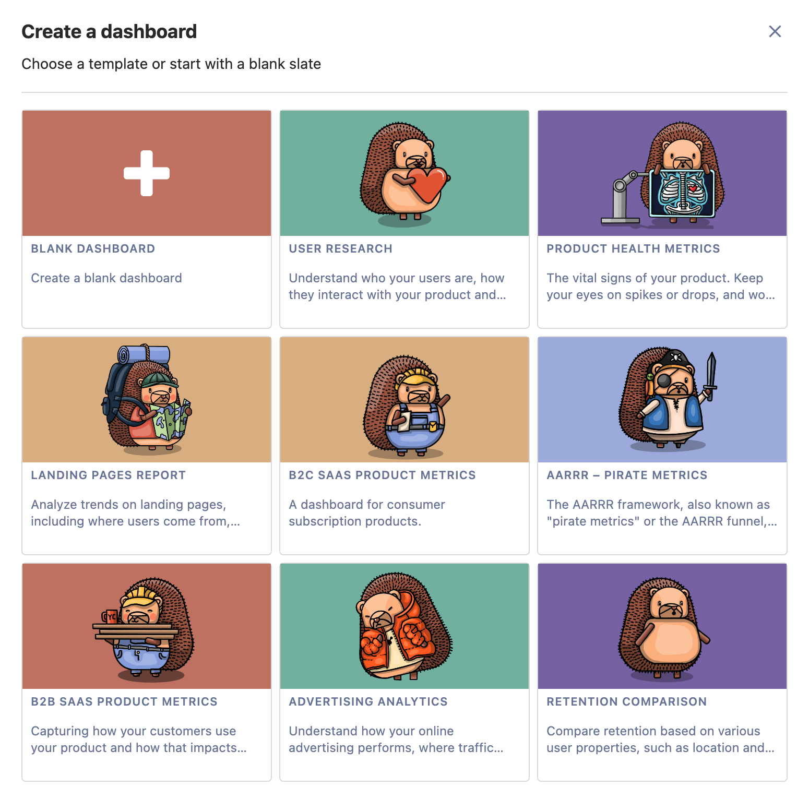

We've not only created a wealth of new dashboard templates to help you get started, but [a public library](/templates) to help you navigate and understand them. You can now effortlessly build [an AARRR dashboard](/templates/aarrr-dashboard), a Google Analytics-like [landing page report](/templates/landing-dashboard), or a centralized location for your [user research](/templates/research-dashboard), as well as other typical use-cases. There are now more than 10 templates to choose from!

These improvements came out of our company hackathon, which took place at our offsite in Aruba. Every year, we challenge everyone to pitch ideas and then develop them over a short period and present to the rest of the company. This idea was proposed by our technical content marketer, [Ian Vanagas](/handbook/company/team) - so be sure to let him know what you think of it in [the Slack](/slack)!

## March 24, 2023 

#### Autocapture toggle
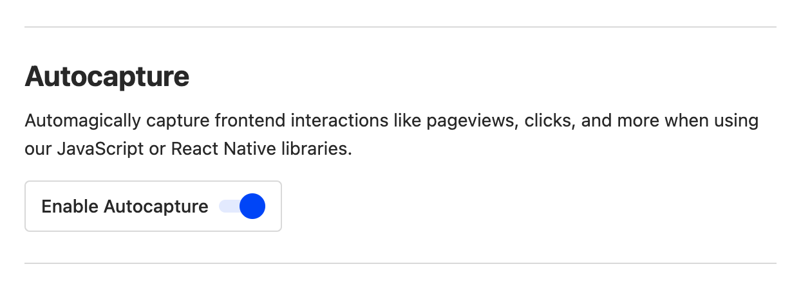

We very strongly believe that [autocapturing events is a good idea](/blog/is-autocapture-still-bad), but there are definitely situations when you may want to toggle it on/off – such as if you only want to ingest specific events.

In the past, if you wanted to toggle autocapture on/off, you'd need to access our JS snippet directly. That could be a bit of a pain, so we've added a new option for it in your Project Settings. 

#### Product for Engineers
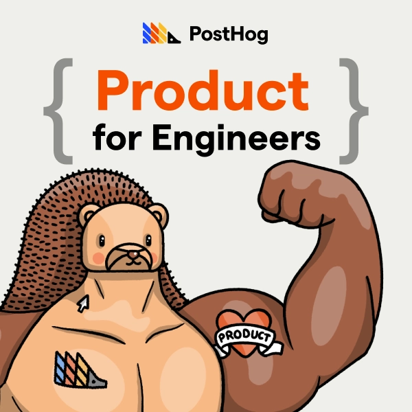

You may remember our old newsletter, HogMail. Well, now it's grown up and moved to Substack, renamed as Product for Engineers. It's a twice-monthly newsletter about helping engineers to build better products. You can [subscribe for free](https://newsletter.posthog.com/?triedSigningIn=true), today.  

Every issue of Product for Engineers has a theme which we explore through curated links, original commentary, tutorials and advice about the way _we_ work. The theme for the first issue? [Talking to users](https://newsletter.posthog.com/p/what-weve-learned-about-talking-to).
## March 17, 2023

#### Beta: Lightning mode
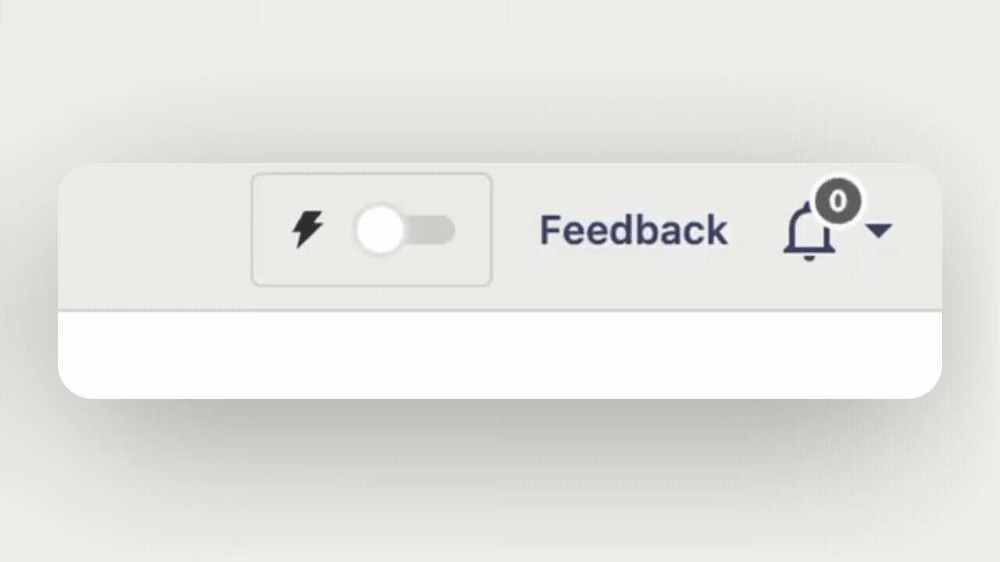

As [teased on Twitter last week](https://twitter.com/posthog/status/1633061945598148608), we’re currently trialing a new speed setting for PostHog which we call Lightning Mode. When enabled, insights will sample only 10% of your data, so you can get results faster when interrogating very large data sets. 

Lightning mode is currently in beta. Want to give it a go? Let us know in [the community Slack](/slack)!

#### Beta: Sampling selector
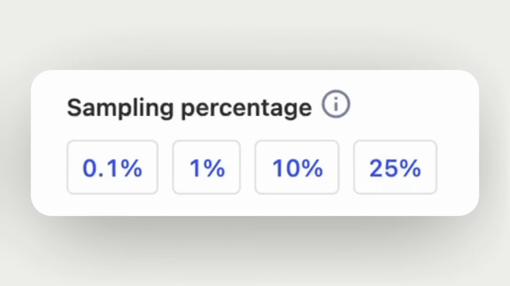

In addition to lightning mode, we’ve also added a more detailed sampling selector which works only at the per-insight level. The idea is that, while lightning mode is useful for when you need answers in a hurry, there are other times when you may want to choose a more delicate balance between speed and accuracy. That’s where the sampling selector comes in. 

Like lightning mode, sampling is currently available as an opt-in beta. [Raise your hand in the Slack if you want to try it out](/slack).

#### PostHog for Startups
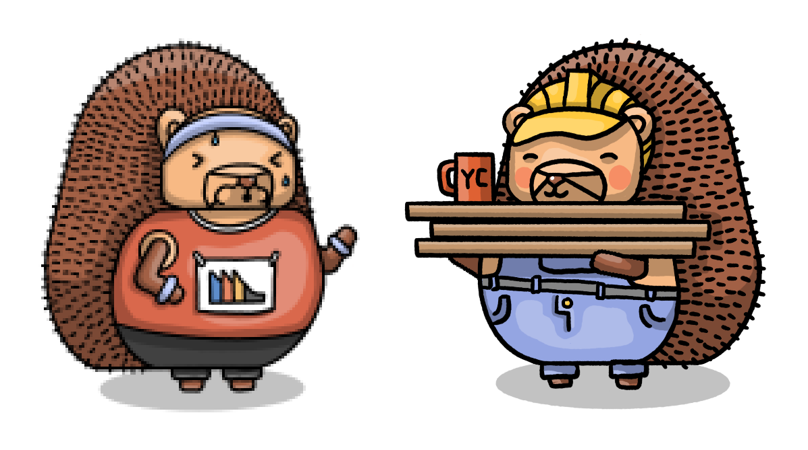

When we launched PostHog, we benefitted tremendously from the advice of other founders and teams in the Y Combinator programme. Now, we’ve launched our own programme to share our knowledge and help other startups grow. 

[PostHog for Startups](/startups) is open to companies that are less than two years old and have raised less than $2 million in funding. In addition to a $50k PostHog credit, you’ll also get access to exclusive ‘Office Hours’ events, promotion opportunities and free PostHog merch.

#### New docs navigation
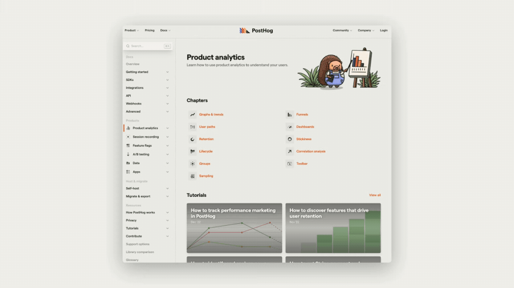

We've fully overhauled the PostHog navigation to make it easier to find the help you need, and especially make it easier to find feature-specific information and help for getting started. Every part of PostHog now has it's own feature-specific hub page, and we've pinned important content such as [how to get started with session recording](/docs/session-replay/manual#enabling-session-recording). 

#### What’s New?
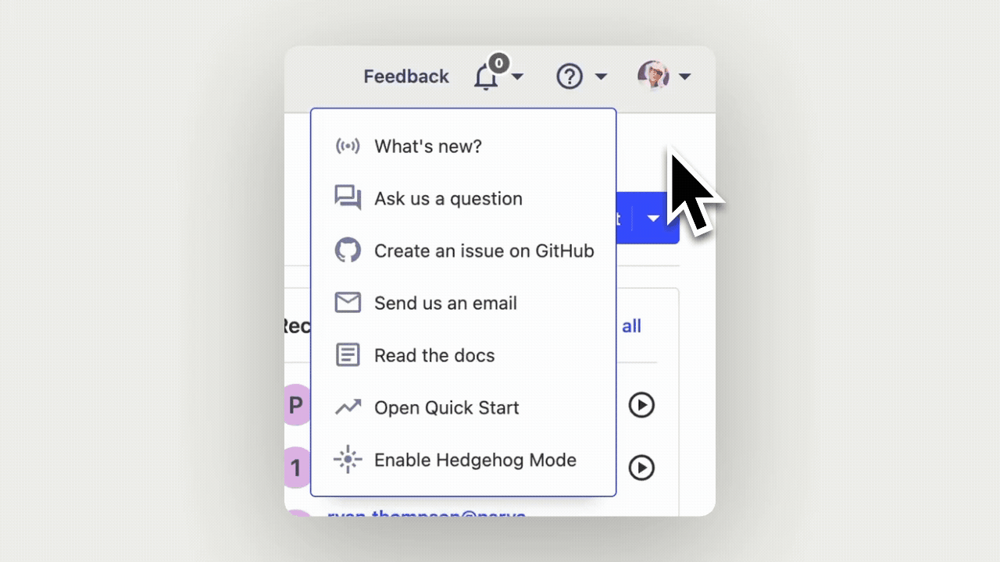

To make it easier for you to keep up to date on what’s happening in PostHog, and to stay informed about our latest releases, we’ve added a new button to the help navigation. It’s called ‘What’s new?’ and it brings you here, to the changelog, so you can find out what’s new. 

You can log into PostHog now to try it out, and be bought right back to this very paragraph!

## March 10, 2023 

#### Dashboard templates

We want to make it easier and faster for users to find useful information in PostHog — dashboards are a key part of that because they’re often one of the first things users build. So, we’ve added a new selection of [dashboard templates](/templates), as well as a new wizard that’s a little easier on the eye. 

We’ve added a few simple templates to start with, for getting insights into areas such as online advertising, website traffic and user research. Got other ideas? Let us know in [the PostHog Slack](/slack)!

#### Hedgehog Mode collisions
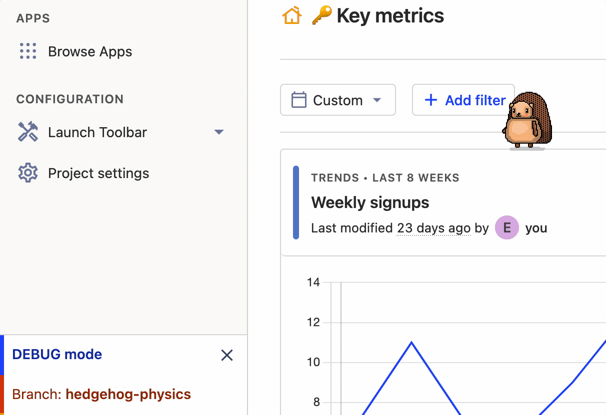

Hedgehog mode has had a frankly startling amount of improvements in recent weeks, but the latest is one of the most fun yet. We’ve now added collision detection, so that you can make Max ([that’s his name](/handbook/company/team)) jump around all over the PostHog UI. 

Is this important? Is it our defining feature? Is it the foundation for even crazier projects to come at our next hackathon? The answer to all of these questions is, yes, probably - and you can turn on Hedgehog Mode via the in-app drop down menu. 

#### Feature flags for Flutter
We always love adding user contributions into PostHog, especially when they have such a storied past as this one. In June 2021, we [asked for contributions](https://github.com/PostHog/posthog-flutter/issues/14) to our Flutter library, to extend feature flag support there. In August 2022, [Etienne Théodore](https://github.com/Kiruel) stepped up to the plate and took on the task. We were admittedly slow getting this PR approved, but can now happily say that our Flutter library includes feature flag support. 

#### Memphis Export app
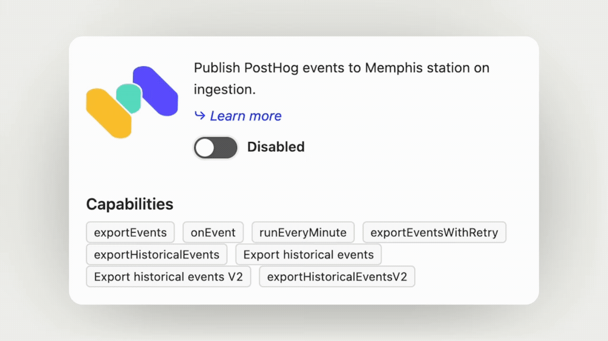

Memphis is an alternative to traditional message brokers, enabling you to build modern, queue-based applications. The team there recently created their own PostHog app, which enables you to publish events from PostHog to a Memphis station upon ingestion, so you use them as triggers. [Check the docs for more info](/apps/memphis-exporter)

#### Notification Bar app
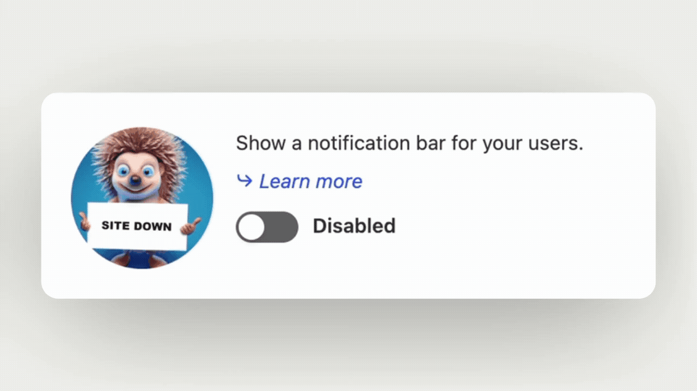

The notification app has actually been available for a while, but somehow missed getting an announcement at the time. It’s part of the site apps beta, which enable you to add features to your site via the PostHog JavaScript library — in this case, adding a notification bar for delivering important messages. [Check the docs for more info](/apps/notification-bar)!

> Want to make your own PostHog apps? Check the docs for tips on [how to use PostHog's in-app source editor](/tutorials/build-your-own-posthog-app). 

## March 3, 2023

#### 2FA authentication

Security is a big focus for us right now, as we work towards full SOC 2 authentication - and two-factor authentication is the latest element of that. 

Want to enable 2FA? Head to your Project Settings to get started. You'll then get your own QR code like the one above (which, don't worry, is for a test environment) to set it up with apps such as Google Authenticator. 

#### Hedgehog Mode

Let's get the biggest and most important updates out of the way first. We've updated our hedgehog mode, which you can access via the help menu in the app, to include some extra features. 

You can now control Max ([that's his name](/handbook/company/team)) using the WASD keys, and we've also added a physics engine to give him a proper sense of gravity and inertia. You can make him jump with `W`, or spin with `S`. 

#### React library

Our Head of Product, Luke, decided to stretch his engineering skills this week and added a new React library which makes it easy to use product analytics and feature flags with React and Next.js apps. This is available in `posthog-js` from version 1.50.

You can now integrate PostHog using the `PostHogProvider`. PostHog then provides a bunch of hooks including `usePostHog` to access the initialized client, and the feature flag hooks `useFeatureEnabled` and `useFeaturePayload`. Checkout [the React docs](/docs/libraries/react) or [the Next.js docs](/docs/libraries/next-js) for more information.

#### New toolbar element selector 

We've added a new element selector to [the PostHog toolbar](/manual/toolbar) so that it's easier to create actions in some circumstances. 

The new modal shows the HTML elements wrapping the selected element, so that your clicks build up a selection. Want to give it a go? We've updated [our toolbar tutorial](/tutorials/toolbar) with instructions.

#### URL query parameter converter app

Community member [Benjamin Werker](https://github.com/everald) has contributed a new app which [automatically converts URL query parameters into PostHog event properties](/apps/url-query). It's especially useful for analysing content and search performance in PostHog, and our marketing team are big fans of it. Thanks, Benjamin!

#### Outfunnel app

The folks at [Outfunnel](https://outfunnel.com/) have contributed a new app which enables you to [export data from PostHog to Outfunnel](/apps/outfunnel-exporter). This is mainly useful for scoring leads based on their behaviour, or using them as triggers for automations. 

> Want to make your own PostHog apps? Check the docs for tips on [how to use PostHog's in-app source editor](/tutorials/build-your-own-posthog-app). 

## February 24, 2023

#### Performance monitoring in session recordings
**Paid feature**

Thanks to Team Session Recording, you can now track network performance across a user session. Now you'll be able to see not only what your users are doing, but also how long each action takes, and if there were any issues that may have impacted their experience. 

Armed with this information, you can now get a better understanding of where you can improve the user experience and create a faster, smoother product — check [the Session Recording docs](/manual/recordings) to find out more. 

#### User interview app released

Curious how we gather user feedback at PostHog? We've automated it using the [User Interviewer app](/apps/user-interviews). The app enables us to target users based on their actions, cohort or properties, who we then invite to schedule an interview with our Product team via Calendly.

We find this works a lot better than trying to identify and schedule calls individually – we increased booking conversion from 3% to 16% using this app – so we’ve now made it available in [the PostHog app directory](/apps).

#### JSON feature flags released

We’ve rolled JSON feature flags out to make feature flags on PostHog even more flexible and reactive than ever before. You’re now no longer limited to using strings as flag keys, and can also send arbitrary data as a JSON payload. 

The ability to send arbitrary data is especially powerful, as you can use this to trigger UI changes for users — enabling you to make real-time changes to your product without the need to redeploy. Check [the feature flag docs](/manual/feature-flags) for more information!

#### UX and insight updates

We’ve released a small trilogy of minor UX and UI improvements this week...

- We now [show pie chart values against segments](https://github.com/PostHog/posthog/pull/14216)
- We now [automatically resize insight legends to be more readable](https://github.com/PostHog/posthog/pull/14210)
- We now prevent you from [hiding table rows in a dashboard view](https://github.com/PostHog/posthog/pull/14209)

Each of these UI updates came in response to a user suggestion. If you’ve got ideas for how we can make PostHog better, [please file a feature request on GitHub](https://github.com/PostHog/posthog/issues/new/choose)!

> **Featured Tutorial:** Find out [how to join the site apps beta, schedule interviews](/tutorials/feedback-interviews-site-apps) with your users to get feedback and build better products in Ian’s latest tutorial. 

_Want more updates? Follow us on [Twitter](https://twitter.com/PostHog) or [LinkedIn](https://linkedin.com/company/posthog) for more PostHog goodness!_

<ArrayCTA />
