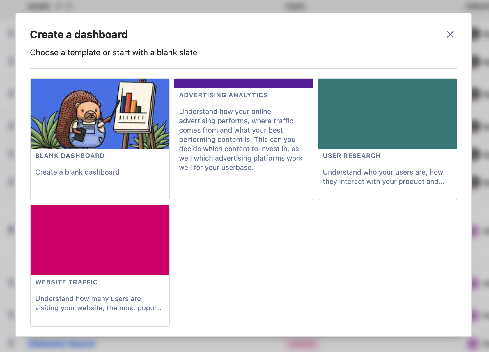
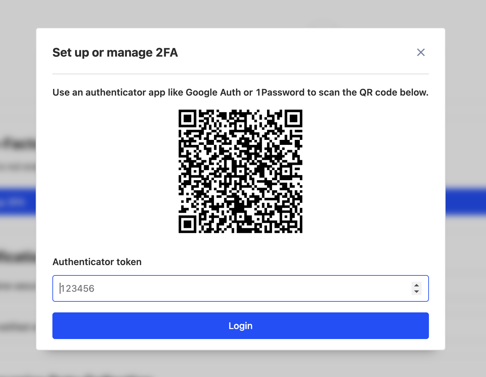
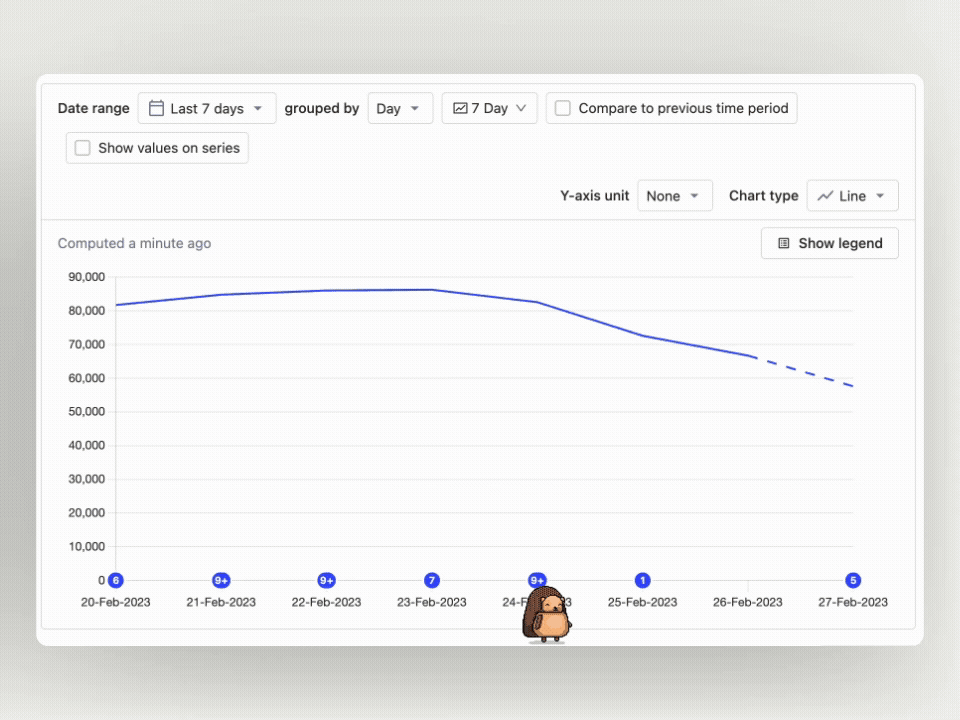
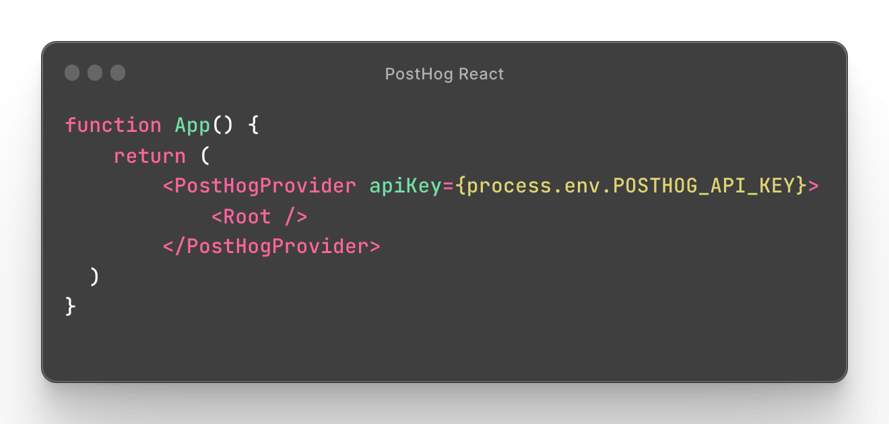
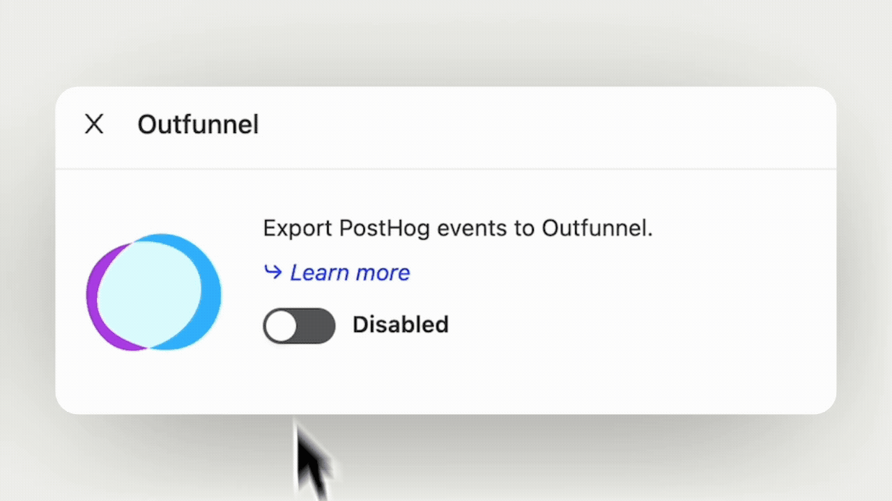
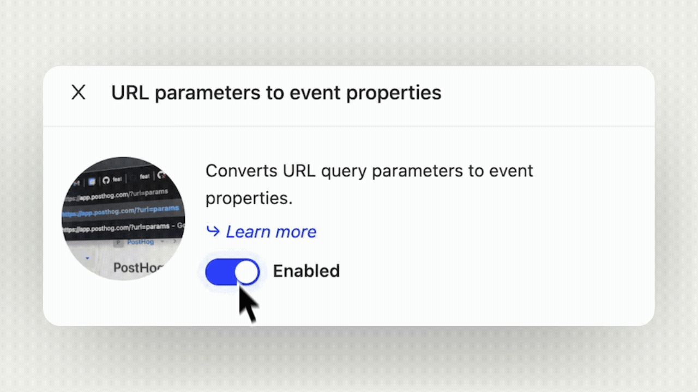
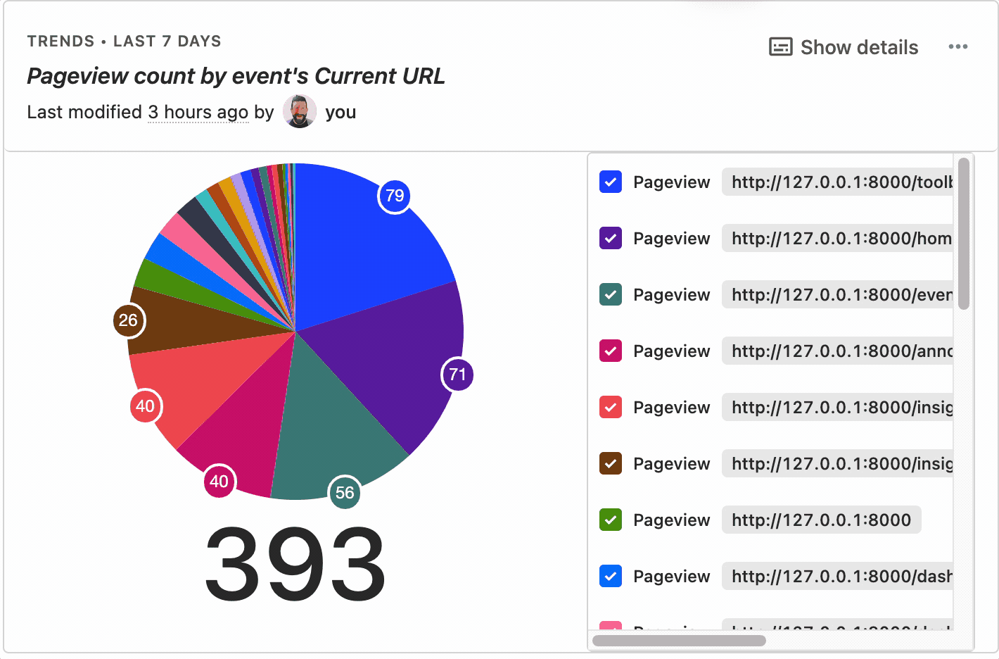

Interested in what new features, fixes and updates have just launched on PostHog Cloud? Every Friday we update this page with a look back over the last seven days, so you can get a fresh look at what’s launched and launching right now. We also feature notable additions to the blog and docs. 

> Some new features you read about below may still be in beta, behind a feature flag, or only available to paying users. Want to see which betas are currently available? [Check the roadmap](/roadmap)!

## March 10, 2023 

### Dashboard templates

We want to make it easier and faster for users to find useful information in PostHog — and dashboards are a key part of that because they’re often one of the first things that users build. So, we’ve added a new selection of dashboard templates, as well as a new wizard that’s a little easier on the eye. 

We’ve added a few simple templates to start with, for getting insights into areas such as online advertising, website traffic and user research. Got other ideas? Let us know in [the PostHog Slack](/slack)!

### Hedgehog Mode collisions

Hedgehog mode has had a frankly startling amount of improvements in recent weeks, but the latest is one of the most fun yet. We’ve now added collision detection, so that you can make Max ([that’s his name](/handbook/company/team) jump around all over the PostHog UI. 

Is this important? Is it our defining feature? Is it the foundation for even crazier projects to come at our next hackathon? The answer to all of these questions is, yes, probably - and you can turn on Hedgehog Mode via the in-app drop down menu. 

### Memphis Export app

Memphis is an alternative to traditional message brokers, enabling you to build modern, queue-based applications. The team there recently created their own PostHog app, which enables you to publish events from PostHog to a Memphis station upon ingestion, so you use them as triggers. [Check the docs for more info](apps/memphis-exporter)!

### Notification Bar app

The notification app has actually been available for a while, but somehow missed getting an announcement at the time. It’s part of the site apps beta, which enable you to add features to your site via the PostHog JavaScript library — in this case, adding a notification bar for delivering important messages. [Check the docs for more info](apps/notification-bar)!

## March 3, 2023

### 2FA authentication

Security is a big focus for us right now, as we work towards full SOC2 authentication - and two-factor authentication is the latest element of that. 

Want to enable 2FA? Head to your Project Settings to get started. You'll then get your own QR code like the one above (which, don't worry, is for a test environment) to set it up with apps such as Google Authenticator. 

### Hedgehog Mode

Let's get the biggest and most important updates out of the way first. We've updated our hedgehog mode, which you can access via the help menu in the app, to include some extra features. 

You can now control Max ([that's his name](/handbook/company/team)) using the WASD keys, and we've also added a physics engine to give him a proper sense of gravity and inertia. You can make him jump with `W`, or spin with `S`. 

### React library

Our Head of Product, Luke, decided to stretch his engineering skills this week and added a new React library which makes it easy to use product analytics and feature flags with React and Next.js apps. This is available in `posthog-js` from version 1.50.

You can now integrate PostHog using the `PostHogProvider`. PostHog then provides a bunch of hooks including `usePostHog` to access the initialized client, and the feature flag hooks `useFeatureEnabled` and `useFeaturePayload`. Checkout [the React docs](/docs/sdks/react) or [the Next.js docs](/docs/integrate/third-party/next-js) for more information.

### New toolbar element selector 

We've added a new element selector to [the PostHog toolbar](/manual/toolbar) so that it's easier to create actions in some circumstances. 

The new modal shows the HTML elements wrapping the selected element, so that your clicks build up a selection. Want to give it a go? We've updated [our toolbar tutorial](/tutorials/toolbar) with instructions.

### URL query parameter converter app

Community member [Benjamin Werker](https://github.com/everald) has contributed a new app which [automatically converts URL query parameters into PostHog event properties](/apps/url-query). It's especially useful for analysing content and search performance in PostHog, and our marketing team are big fans of it. Thanks, Benjamin!

### Outfunnel app

The folks at [Outfunnel](https://outfunnel.com/) have contributed a new app which enables you to [export data from PostHog to Outfunnel](/apps/outfunnel-exporter). This is mainly useful for scoring leads based on their behaviour, or using them as triggers for automations. 

> Want to make your own PostHog apps? Check the docs for tips on [how to use PostHog's in-app source editor](/tutorials/build-your-own-posthog-app). 

## February 24, 2023

### Performance monitoring in session recordings
**Paid feature**

Thanks to Team Session Recording, you can now track network performance across a user session. Now you'll be able to see not only what your users are doing, but also how long each action takes, and if there were any issues that may have impacted their experience. 

Armed with this information, you can now get a better understanding of where you can improve the user experience and create a faster, smoother product — check [the Session Recording docs](/manual/recordings) to find out more. 

### User interview app released

Curious how we gather user feedback at PostHog? We've automated it using the [User Interviewer app](/apps/user-interviews). The app enables us to target users based on their actions, cohort or properties, who we then invite to schedule an interview with our Product team via Calendly.

We find this works a lot better than trying to identify and schedule calls individually – we increased booking conversion from 3% to 16% using this app – so we’ve now made it available in [the PostHog app directory](/apps).

### JSON feature flags released

We’ve rolled JSON feature flags out to make feature flags on PostHog even more flexible and reactive than ever before. You’re now no longer limited to using strings as flag keys, and can also send arbitrary data as a JSON payload. 

The ability to send arbitrary data is especially powerful, as you can use this to trigger UI changes for users — enabling you to make real-time changes to your product without the need to redeploy. Check [the feature flag docs](/manual/feature-flags) for more information!

### UX and insight updates

We’ve released a small trilogy of minor UX and UI improvements this week...

- We now [show pie chart values against segments](https://github.com/PostHog/posthog/pull/14216)
- We now [automatically resize insight legends to be more readable](https://github.com/PostHog/posthog/pull/14210)
- We now prevent you from [hiding table rows in a dashboard view](https://github.com/PostHog/posthog/pull/14209)

Each of these UI updates came in response to a user suggestion. If you’ve got ideas for how we can make PostHog better, [please file a feature request on GitHub](https://github.com/PostHog/posthog/issues/new/choose)!

> **Featured Tutorial:** Find out [how to join the site apps beta, schedule interviews](/tutorials/feedback-interviews-site-apps) with your users to get feedback and build better products in Ian’s latest tutorial. 

_Want more updates? Follow us on [Twitter](https://twitter.com/PostHog) or [LinkedIn](https://linkedin.com/company/posthog) for more PostHog goodness!_

<ArrayCTA />
