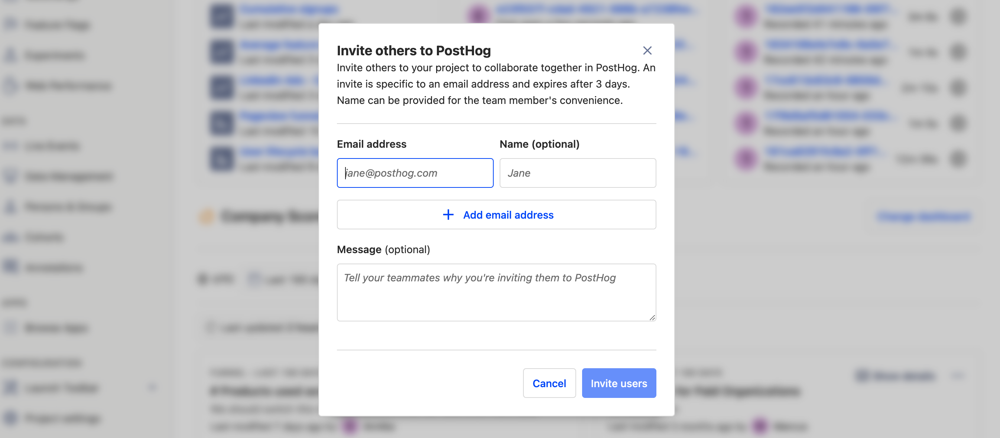
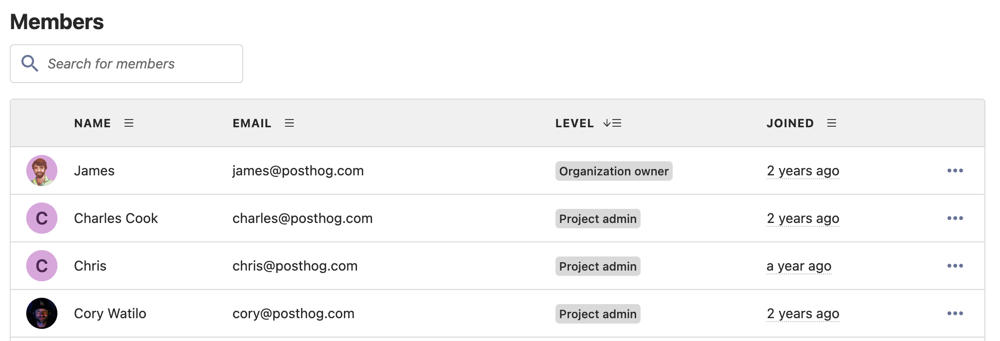

So, you’ve installed your snippet and started tracking data in PostHog. What’s next? 

Before forging ahead into the heady world of [insights](/manual/funnels), [session recordings](/manual/recordings), [experimentation](/manual/experimentation) and [feature flags](/manual/feature-flags), we suggest taking a second to invite your teammates to join you. After all, PostHog is better with friends and the more collaborators you have, the more value you can get from your data!

[Inviting teammates to join you](/manual/organizations-and-projects#adding-new-members) is easy, but because the data you’re dealing with may be sensitive it’s worth taking a second to learn about organizations, projects and user permissions first…

## Organizations
Starting at the top, organizations are the highest level of abstraction within PostHog — most commonly consisting of an entire company. Everyone who uses PostHog is part of an organization, even if the organization only has one person in it. 

Apart from the FOSS version, all versions of PostHog enable you to belong to and create multiple organizations. To collaborate with someone on PostHog, it’s best to invite them to join your organization. If you’ve joined multiple organizations, you can switch between them using the user setting menu accessed by clicking your profile picture in the top right corner of your PostHog instance.

### How to invite a colleague to your organization in PostHog

Everyone in an organization has the ability to add new members to that organization by sending them an invitation. To send an invitation to a colleague, simply log into your PostHog instance, select your user settings by clicking your profile picture in the top right and select ‘_+ Invite members_’. We’ll send them an email automatically.

> If you haven’t configured email on your PostHog instance, you’ll need to share invite links yourself.

## Projects
A step down from organizations, projects are where the real magic happens and is best defined as where PostHog groups data and queries. Any information in a project is limited to that project and can’t be accessed in another project. 

Projects are also nested within organizations and, while there are several [ways to organize projects](/manual/organizations-and-projects#ways-of-organizing-projects), the most common approach is to have one project per unlinked project within an organization. One exception to this however would be if you only have one product and one marketing website — in which case [we recommend compiling both into a single project](/blog/track-your-website-with-posthog).

### How to create private projects
Normally, when a user joins an organization they get access to all projects within it. But what if you want to keep some things a secret? That’s when private projects are useful. 

Users with Administrator or Owner permissions can make any existing project private via the _’Access Control_’ section of ‘_Project Settings_’. 

## User permissions
In PostHog, because of the sensitive data available, not all user permissions are created equally — and when you add a new user it’s important to consider how much power you want them to have. Every user is either a _Member_, _Administrator_, or _Owner_. 

Each organization can only have one owner, and new users are added as members by default.

|                                                                                       | Member (base level) | Administrator | Owner |
| ------------------------------------------------------------------------------------- | ------------------- | ------------- | ----- |
| Viewing and querying project data                                                     | ✅                  | ✅            | ✅    |
| Inviting new members                                                                  | ✅                  | ✅            | ✅    |
| Billing management                                                                    | ✅                  | ✅            | ✅    |
| Project creation and deletion                                                         | ❌                  | ✅            | ✅    |
| Project settings management (incl. [project-specific memberships](#private-projects)) | ❌                  | ✅            | ✅    |
| Organization settings management (incl. memberships)                                  | ❌                  | ✅            | ✅    |
| Leaving the organization                                                              | ✅                  | ✅            | ❌    |
| Transferring ownership                                                                | ❌                  | ❌            | ✅    |
| Organization deletion                                                                 | ❌                  | ❌            | ✅    |

### How to alter permissions and remove users in PostHog

Whether someone has left your (actual) organization or joined your (PostHog) organization, sometimes you’ll undoubtedly need to change access rights — or remove a user entirely. In such cases, just head to the _Project settings_ page of your PostHog instance, via the main menu. 

It’s worth noting that users with member-level access cannot make changes to other users and can only choose to leave an organization themselves. Deleting users entirely can only be done by those with administrator privileges, or above. 
