We learned an interesting fact recently: only 20% of our users track their marketing website **and** their product using PostHog. This is our fault. We market to engineers at PostHog, so it's not a surprise we're less used for marketing.

But here's another fact: all the things that make PostHog great for understanding your product also apply to your marketing website. To demonstrate, we're sharing how we use PostHog for marketing.

> Andy Vandervell is Content Marketing Lead at PostHog. He edits and writes the blog and runs our newsletter, HogMail. Prior to PostHog, Andy was a journalist and editorial strategist at WIRED, Time Inc. UK and others. He's all about them words and those SEO keywords, basically.
 
## The goals of our marketing team

To start, let's talk about our goals as a marketing team. In Q3 2022, these were:

- Average 420 weekly 'new organization signups'
 
- Increase Organic SEO traffic to 5,000 unique users per week

- Acquire 20 new reviews on our G2 profile

Of course, these are just top-level goals. We use PostHog to track them, but they're the output of dozens of others. To do so, we built dashboards... lots of dashboards. 

In fact, 'how we use PostHog for marketing' is really a story about all the dashboards we use. Let's start at the top.

## Marketing dashboard 

Our top-level dashboard tracks our most important metrics, like 'new org signups', as well as other important top-level ones, such as 'validated credit cards'. It also features a handful of circuit breaker metrics.

### Core KPIs

This dashboard is setup in a grid with two insights per KPI – that's key performance indicator if you don't speak "marketing". One is the total number with 'compare to previous period' enabled; the second is the same metric as a weekly trend. This gives us an at-a-glance view of the top-level number, and context around peaks and troughs.

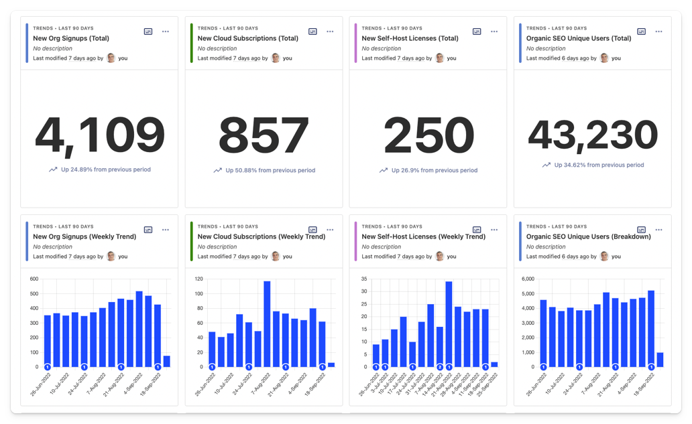

We look at the last 90 days by default, but you can change the date range of the whole dashboard whenever you like. We add annotations to denote important events – e.g. changes to landing page designs, or a blog article going viral.

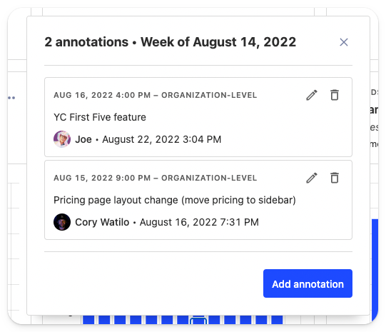

(Seriously, people, **use [annotations!](https://posthog.com/manual/annotations)** It's way easier than trying to remember the date you redesigned your pricing page six months ago.)

### Circuit breakers

We like to iterate our website quickly, which often means pushing new designs live without testing. As a fallback, we track various "circuit breaker" metrics on our marketing dashboard, such as the conversion rate on key landing pages.

In July, for example, we discovered a tracking bug between 'posthog.com' and 'app.posthog.com' which caused an obvious drop in conversions. Then, in August, we introduced a new pricing page experience. 

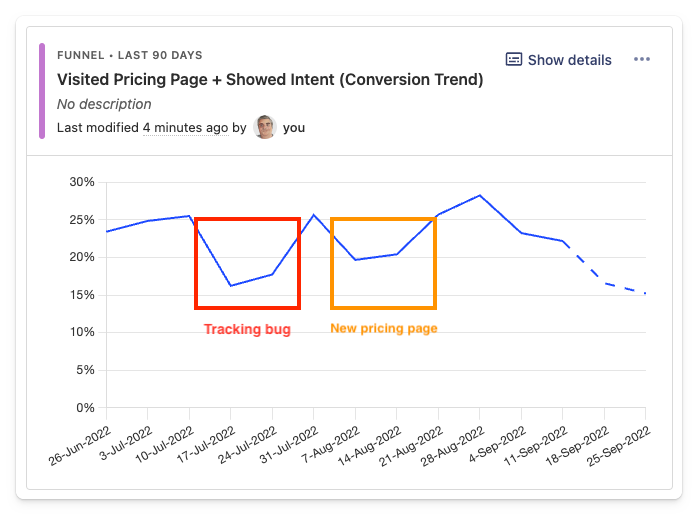

As you can see (above), our first iteration was a pretty dramatic failure. Users visiting the pricing page and "showing intent" (we'll get into what this means later) declined from ~25% down to ~10%. It was also obvious from watching session recordings that our new pricing wizard was simply confusing people.

This lead our Website & Docs team to iterate several new versions, which they then tested using feature flags and experiments. Conversions have since returned to normal and we've simplified our pricing as a result.

> 💡 **PostHog Tip:** Try using filters on dashboards! You can apply global filters to any dashboard based on event properties, person properties, feature flags, and cohorts. This is a great way to drill down into specific audiences (e.g. users by country, city, continent).

## Website dashboard

One level below we have our main website dashboard. This is less focused on conversion metrics and more on general traffic trends across posthog.com. Here, we're looking at things like:

- Total website users
- Organic SEO users
- Unique users reading the blog
- The most read pages in each website section
- A map view showing website users by country

This is all straightforward stuff, but it's still useful to us as a marketing team. Recently, for example, we identified a tutorial that was getting loads of SEO traffic but was in serious need of updating. We've built a [template for this dashboard](/templates/website-dashboard) for you to use too.

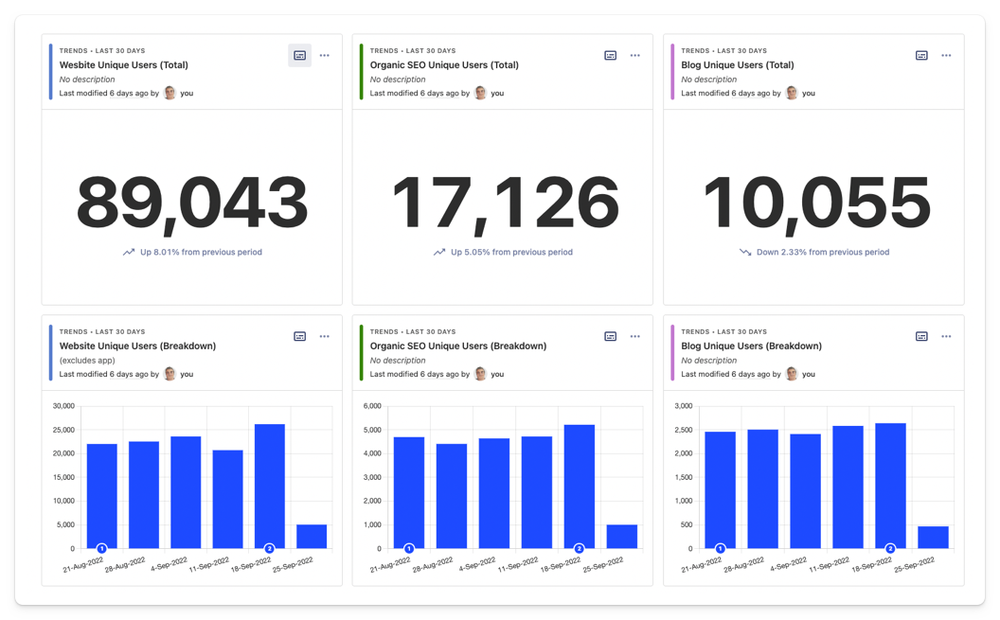

Again, we use a lot of `# Number` views here combined with weekly breakdowns to add further context. The top two rows of the dashboard (pictured above) combine both to provide a quick overview of website traffic.

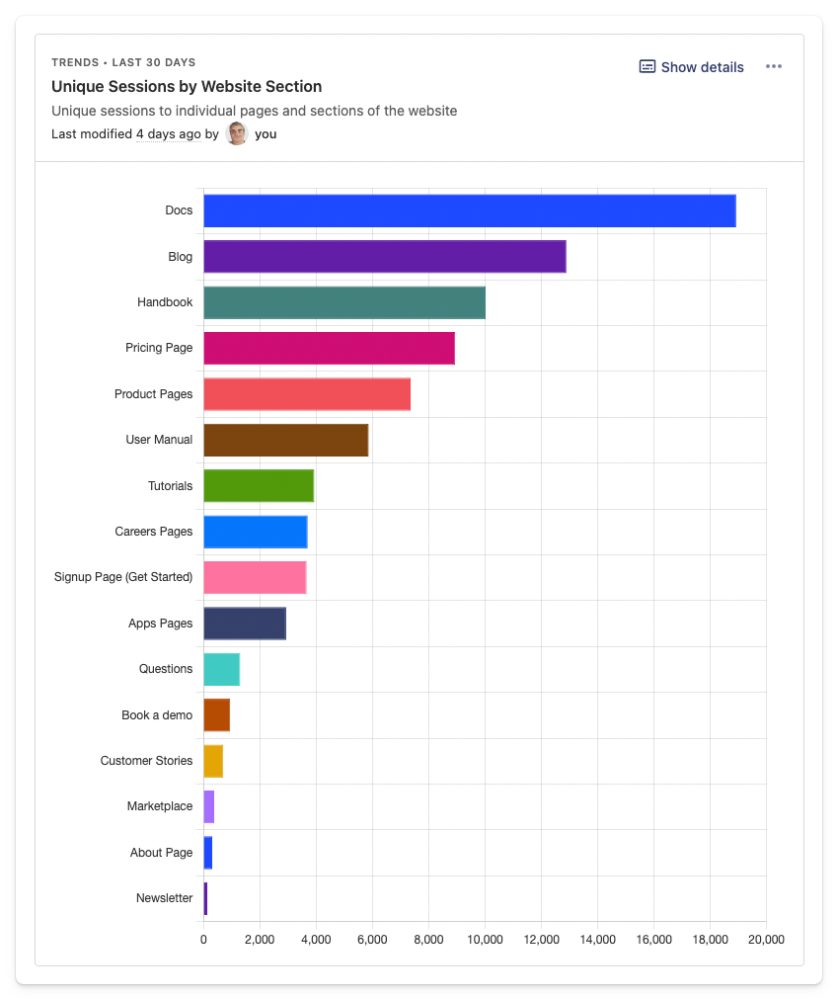

Drilling further down, we breakdown the unique sessions by website section (above). Given we're a developer tool first, our Docs pages are generally the most popular. You can do this by creating a trends insight with multiple graph series where `Current URL` contains your desired URL path.

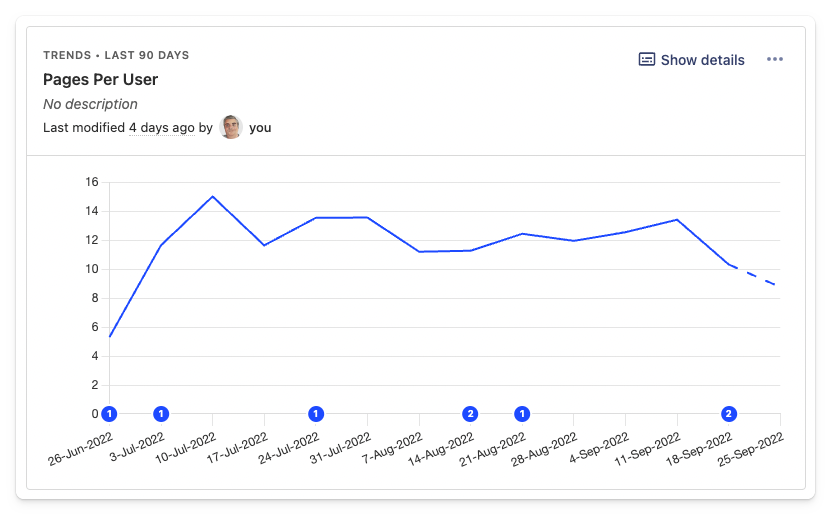

We also track `sessions per user` and `pages per session` here using trends insights. We're not looking to optimize these metrics, but they can be useful for comparative purposes. Here's how to track these metrics in PostHog:

1. Create a trends insight with two graph series – e.g. series 'A' as unique users and series 'B' as unique sessions. 

2. Use 'Formula' box under 'Filters' to calculate your desired metric. In this case, `B/A` would give you 'sessions per user'. 

Formulas are a great way to track all sorts of metrics, including conversion rates.

> 💡 **PostHog Tip:** You can resize and re-arrange your dashboard by clicking on the '...' menu and clicking on 'Edit layout' – you can also use the shortcut (E). We tend to use grids of smaller of insights, mainly because Charles (VP of Ops & Marketing) likes it when they fit easily onto a laptop screen!

### SEO performance tracking

SEO is an important channel for us – it's a signal of word of mouth growth and high intent traffic to SEO content.

As the below graphic from Google Trends shows, we've seen a consistent increase in brand searches (i.e. people searching for 'posthog') in 2022.

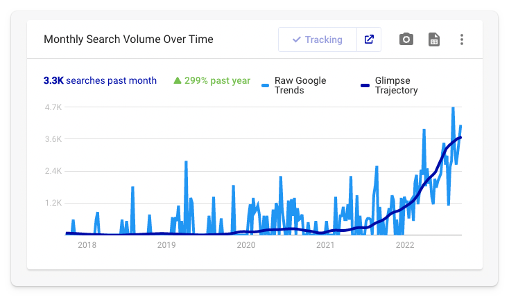

(For those interested, the trend line is generated using the [Glimpse Chrome extension](https://chrome.google.com/webstore/detail/google-trends-supercharge/ocmojhiloccgbpjnkeiooioedaklapap). I highly recommend it!)

We use insights to help isolate the impact of our SEO content efforts from this organic word of mouth growth. For example, the insight below shows the weekly cumulative growth of all our SEO content since the beginning of the year.

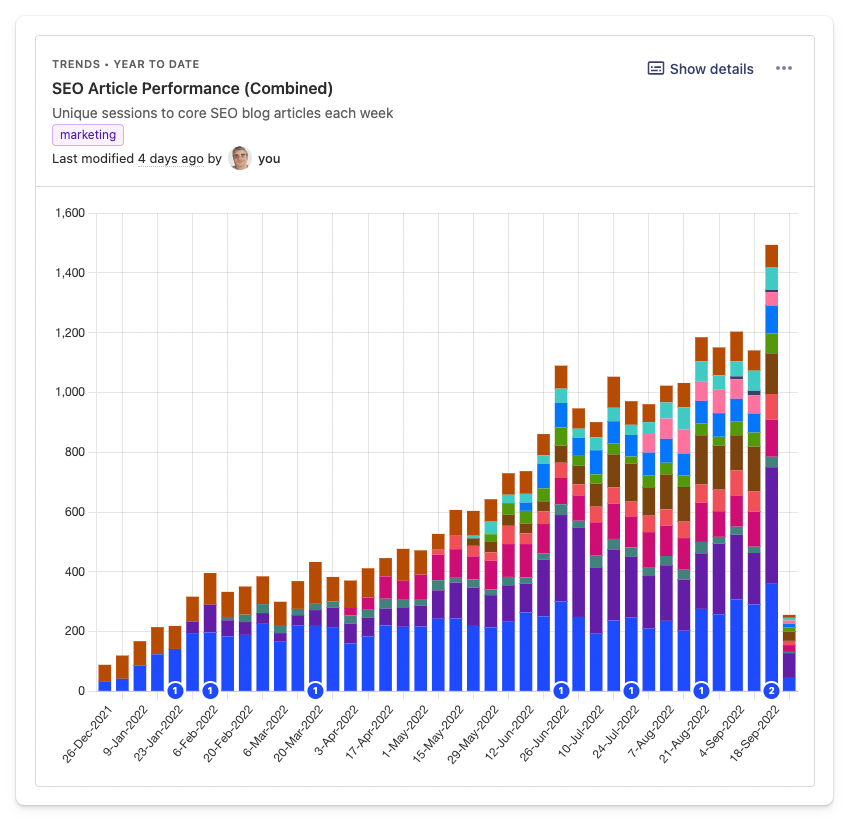
 
You can get this view by selecting the 'Time' option in the 'Chart type' dropdown. This, combined with multiple graph series, will stack the results so you can view the cumulative trend. The 'Value' chart type does the opposite.

This insight also helps identify when traffic to our SEO content is dropping off. This is normally a prompt to investigate further in SEMRush, where we track Google rankings for a few hundred different keywords. That said, a degree of fluctuation is normal, so it's best not to overreact to a couple of down weeks, or over-celebrate a really good one.

### Things we don't measure.

As much as possible, we like to measure outcomes, not activity. That's why we don't track bounce rate, for example – it's not a useful metric! Neither, to a lesser extent, are popular web metrics like 'time on page' or 'session duration'. Unless you're a social network or publisher, what does the time someone spends on your website actually tell you? Nothing, so we don't measure it. Instead, we measure outcomes, which is what our next dashboard is all about.

## Content marketing effectiveness

This dashboard dives deeper into the impact of specific pages. It's built around a metric we call 'Showed Intent', though you could rename this 'Engaged Users' or something you prefer. 

Let's dig into it a little more.

### What is 'Showed Intent'?

In a nutshell, 'Showed Intent' applies to any user who triggers an event we know indicates genuine interest in the product. These are things like:

- Visiting the [PostHog Cloud signup page](https://app.posthog.com/signup)
- Visiting the [self-host license page](https://license.posthog.com/)
- Visiting the [self-host section](https://posthog.com/docs/self-host) of our docs
- Booking a demo.

We track these by using an 'action' – a way of combining similar events into single event you can use in insights. You can create actions [using the PostHog Toolbar](/tutorials/toolbar) or via the Data Management tab in PostHog – it's dead easy.

Why do we use this and not just signed up users? There are a few good reasons:

1. Open source users don't trigger a sign-up event.

2. Signups are a much smaller number compared to total website visitors, making it hard to generate useful insights.

3. A user's consideration period can be several weeks or months, so the actual conversion event often falls outside the tracked period, or isn't easily attributed.

4. Even a user who doesn't end up signing up to PostHog might suggest it to a friend or colleague.

### Content + intent = effectiveness

The 'Showed Intent' action allows us to create funnel insights like the one below. It shows the percentage of all blog readers who 'Showed Intent'.

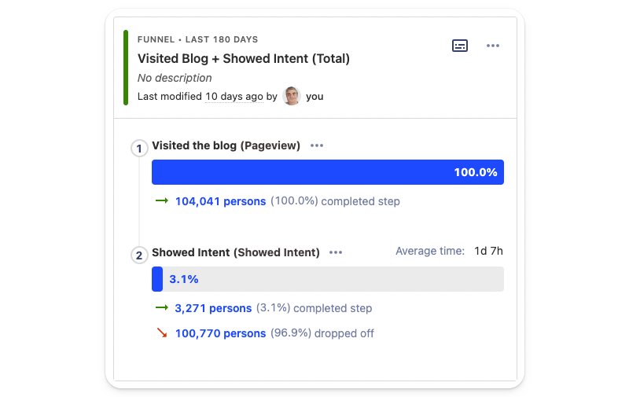

But... hold-up-a-minute, 3.5% seems like a very low number doesn't it? Fret not, this is why we also have a second insight on our dashboard showing the historical trend, see below.

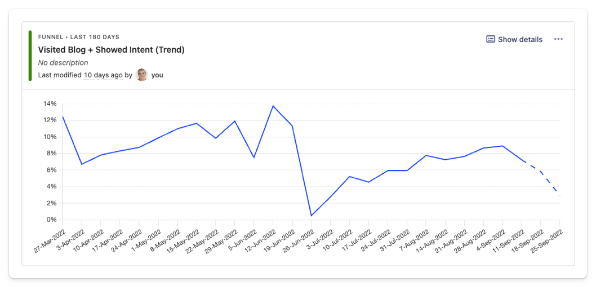

That massive dip? It's when '[The really important job interview questions engineers should ask (but don't)](/blog/what-to-ask-in-interviews)' went massively viral, generating upwards of 100k users to the blog. Few of those 100k users came to consider PostHog as a product (which is fine), but it's a good reminder of why you should always check these things.

Beyond this top-level metric, the Content Marketing Effectiveness dashboard (yes, it is a long-winded name!) allows us to compare the influence of different articles and content formats. Let's look at some examples.

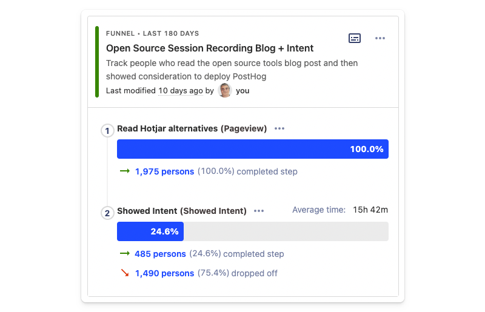

Above is a funnel analysis for one of our most successful blog posts, a guide to [open-source session recording tools](/blog/best-open-source-session-replay-tools). It converts to intent at nearly 23%, which is awesome.

At other end of the spectrum, we have our guide to [GDPR-compliant analytics tools](/blog/best-gdpr-compliant-analytics-tools). It only converts 6.3% of the time – perhaps the launch of [PostHog Cloud EU](https://eu.posthog.com/signup) will increase that figure? 🤔

Comparison articles, such as [PostHog vs Amplitude](/blog/posthog-vs-amplitude) convert very well – in the region of 25%. This makes sense given people coming into these articles are already in a consideration phase, but the confirmation is useful. We also use these insights to compare similar articles.

Overall, these are the kinds of insights that help us inform our content and SEO priorities, which is hugely important given we're a small team. We have a nearly identical dashboard for tracking the impact of [customer stories](/customers), too.

> 💡 **PostHog Tip:** Try experimenting with funnels insights. In addition to the default conversion steps graph, funnels can also be viewed as an historical trend graph and by 'time to convert'.

## How did we do in Q3?

So that's how we use PostHog in our marketing team, but how did we do in Q3? 

Overall, pretty well. Most pleasingly, we smashed our target 420 weekly new org. signups – we consistently hit over 450 per week in August and had our first 500+ week in September.

Progress on our organic SEO target (5,000 weekly users) has been steady rather than spectacular. We were at ~4,000 per week in July and have been hovering around the 4,700 mark until recently, where we hit 5,200 in a week. Time will tell if this trend will hold.

We achieved 14 of the 20 G2 profile reviews we aimed for in Q3 with an average score of 4.4. Not bad.

## What's next?

We're currently reviewing our objectives for Q4, but we're also looking to make improvements to what and how we track our marketing efforts.

### Quality signals for new users

We're currently working on a process for "quality scoring" signups. 

Our favored solution is based on [an Ideal Customer Profile](/newsletter/ideal-customer-profile-framework) (ICP) score created by our customer success team. Once we've got the process nailed, it'll give us a much better picture of which channels are most valuable to us. 

We're also considering several other supporting signals, such as new users who ingest events or invite colleagues. We're still debating the best approach here.

### Improving how we track attribution

Until recently, we weren't focused on attribution outside of UTM parameters on our paid marketing activities. Marketing attribution is notoriously hard, so we felt our time and energy was better spent elsewhere. That said, it's becoming more important as we scale.

We recently started collecting more information from users at signup – we've added an optional text field where people can tell us where they heard about us. We collect this data in PostHog, and manually export it for analysis. It's not the most automated process ever, but it's a start and something we'll evolve over time. 

### Marketing experiments

Thus far, we've focused on content and developing marketing channels that work. Eventually, we'll need to spend more time on website optimization and experimentation. We're not there yet, and we're wary of over optimization, but we have all the tools we need when we need them. 

## Final thoughts

In summary, there are a few important reasons why we use PostHog instead of traditional marketing tools:

1. **It does (almost) everything already:** Outside of a few edge cases, PostHog already does 95% of what we need. If (and when) we need more, we'll make the case for building that functionality, rather than resorting to some other tool.

2. **We're interested in outcomes, not activity:** We want to know "how does x impact y" and why, not just "how many people did x or y". This is where traditional marketing tools fall short. No marketing platform lets you go from viewing a funnel to watching session recordings of real users on your website.

3. **It eliminates guesswork:** Intuition and speculation have their place, but there's nothing more satisfying than knowing exactly why something is happening **and** having the tools to rectify the problem.

We hope this look at how we use PostHog will inspire you (and your marketing teams) to experiment with what's possible in PostHog. If you found this useful, here's some suggested further reading:

- [PostHog product manual](/using-posthog): Need to learn how to build an insight, a cohort, or how different insights work? This is the place to start.

- [Using the PostHog Toolbar to visualize behavior and create actions](/tutorials/toolbar): The PostHog Toolbar is a useful way to understand how users interact with your website. You can also use it to create actions.

- [How to build, analyze and optimize conversion funnels in PostHog](/tutorials/guide-to-funnels): An in-depth guide to building, analyzing and improving your conversion funnel.
