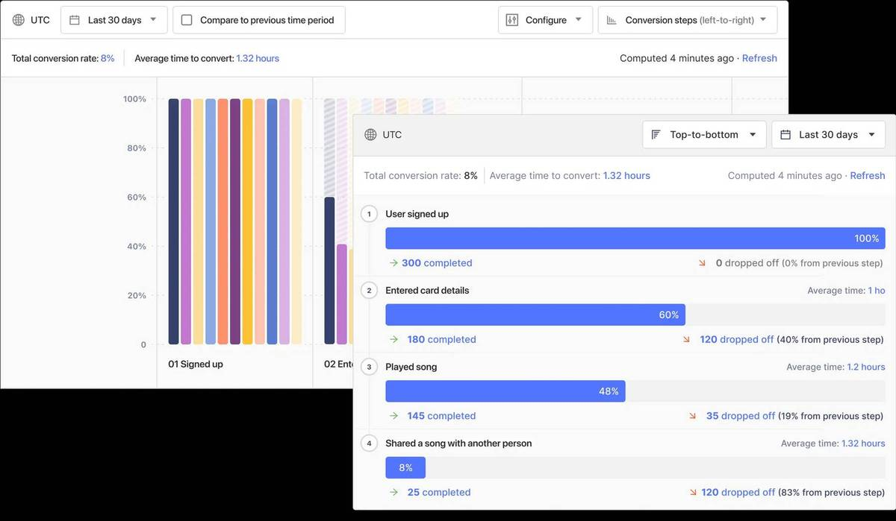

import { ComparisonTable } from 'components/ComparisonTable'
import { ComparisonRow } from 'components/ComparisonTable/row'
import { ComparisonHeader } from 'components/ComparisonTable/header'

**Contents:**

- [How is PostHog different to Amplitude?](#how-is-posthog-different-from-amplitude)
- [PostHog vs Amplitude feature comparison](#feature-comparison)
- [Integrations and data sources](#integrations-and-data-sources)
- [Strengths of PostHog](#strengths-of-posthog)
- [Strengths of Amplitude](#strengths-of-amplitude)

## How is PostHog different from Amplitude?

Over 10,000 companies already use PostHog, and many have switched from Amplitude. Here are a few reasons why.

### 1. It's an all-in-one platform
PostHog is more than a product analytics tool, it's an all-in-one Product OS that replaces multiple tools in your data stack. You could run Amplitude for analytics, [LaunchDarkly](/blog/posthog-vs-launchdarkly) for feature flagging, Hotjar for session recording, and Optimizely for A/B testing, or you could just use PostHog for everything. One platform, one price: seamless integration.

### 2. It's built for engineers
Unlike Amplitude, PostHog is built for software developers. PostHog autocaptures data, so you don't have to spend time instrumenting events every time you update your app or website – we also offer robust tools for capturing custom events and actions when you need to. Our pricing is transparent, and we're entirely self-serve. You can setup PostHog and start paying us without ever speaking to a sales rep, but we have an [awesome customer success team](/contact-sales) if you have questions.

### 3. It's open source
Our MIT License isn’t just for show. You can access [our source code](https://github.com/PostHog/posthog), raise your own issues and PRs, and use it to [build your own apps](/docs/apps/build) or even add extra functionality. You also benefit from the work of other teams who build their own apps. And we're not just an open-source tool; we're an open-source company. Our [company handbook](/handbook) is open to everyone, as is [how we pay people](/handbook/people/compensation).

> **Further reading:** [How Amplitude compares to other PostHog alternatives](/blog/posthog-alternatives)

## Feature comparison

This table compares the Amplitude Analytics 'Growth' plan to PostHog Cloud, our fully-managed SaaS offering.

<ComparisonTable column1="Amplitude Analytics" column2="PostHog">
  <ComparisonRow column1={false} column2={true} feature="Transparent pricing" />
  <ComparisonRow column1={false} column2={true} feature="Self-serve" />
  <ComparisonRow column1={true} column2={true} feature="Multi-site" />
  <ComparisonRow column1={false} column2={true} feature="Event autocapture" />
  <ComparisonRow column1={true} column2={true} feature="Funnel analysis" />
  <ComparisonRow column1={true} column2={true} feature="Cohort analysis" />
  <ComparisonRow column1={true} column2={true} feature="Conversion tracking" />
  <ComparisonRow column1={true} column2={true} feature="Retention tracking" />
  <ComparisonRow column1={true} column2={true} feature="Revenue tracking" />
  <ComparisonRow column1={true} column2={true} feature="UTM tracking" />
  <ComparisonRow column1={true} column2={true} feature="Event tracking" />
  <ComparisonRow column1={false} column2={true} feature="Feature flags" />
  <ComparisonRow column1={false} column2={true} feature="Heatmaps" />
  <ComparisonRow column1={false} column2={true} feature="Session replay" />
  <ComparisonRow column1={false} column2={true} feature="Experimentation" />
  <ComparisonRow column1={true} column2={true} feature="Predictive analytics" />
  <ComparisonRow column1={false} column2={true} feature="User surveys" />
  <ComparisonRow column1={false} column2={true} feature="Hedgehogs" />
</ComparisonTable>

## Integrations and data sources

Both Amplitude and PostHog integrate with a large number of data sources. The table below is a snapshot of what each platform offers – check out the [PostHog App Store](/apps) for a full list of what's available.

<ComparisonTable column1="Amplitude Analytics" column2="PostHog">
  <ComparisonHeader category="Export" />
  <ComparisonRow column1={true} column2={true} feature="Redshift" />
  <ComparisonRow column1={true} column2={true} feature="Google Cloud Storage" />
  <ComparisonRow column1={true} column2={true} feature="Snowflake" />
  <ComparisonRow column1={true} column2={true} feature="Amazon S3" />
  <ComparisonRow column1={true} column2={true} feature="Google BigQuery" />
  <ComparisonRow column1={false} column2={true} feature="Google Pub/Sub" />
  <ComparisonRow column1={false} column2={true} feature="RudderStack" />
  <ComparisonRow column1={true} column2={true} feature="Hubspot" />
  <ComparisonRow column1={true} column2={true} feature="Salesforce" />
  <ComparisonRow column1={false} column2={true} feature="Sentry" />
  <ComparisonRow column1={true} column2={true} feature="API" />
  <ComparisonHeader category="Import" />
  <ComparisonRow column1={true} column2={true} feature="Redshift" />
  <ComparisonRow column1={true} column2={true} feature="Google Cloud Storage" />
  <ComparisonRow column1={true} column2={true} feature="Snowflake" />
  <ComparisonRow column1={true} column2={true} feature="Amazon S3" />
  <ComparisonRow column1={true} column2={true} feature="Segment" />
  <ComparisonRow column1={false} column2={true} feature="Sentry" />
  <ComparisonRow column1={true} column2={true} feature="Zendesk" />
  <ComparisonRow column1={true} column2={true} feature="API" />
</ComparisonTable>

## Strengths of PostHog

### Integrated session recording
While Amplitude and PostHog share many features, PostHog has [Session Recording](/product/session-recording) built in as standard.

Session recording is an incredibly powerful tool for understanding what people are actually doing in your product. The tight integration within PostHog means you can go from viewing a funnel insight to watching real users interact with the funnel, making it easy to diagnose problems and find solutions.

Amplitude doesn't have session recording, so you have to run a third-party tool [like Hotjar or FullStory](/blog/best-open-source-session-replay-tools) as well – an added expense that lacks the tight integration afforded by a built-in app.

### Experimentation and Feature Flags

Feature Flags and Experimentation (A/B testing and multivariate tests) are core PostHog features, available for free for anyone generating fewer than 1 million events per month. Feature Flags are also free as part of [PostHog Open Source](/docs/self-host)

Amplitude Analytics doesn't include feature flags or experimentation by default, instead bundling them as part of a separate product, Amplitude Experiment, an additional cost on top of its core analytics product.

### Transparent pricing

All versions of PostHog are transparently priced – even the [Enterprise version](/pricing), which adds single sign-on (SAML), team training, instance monitoring, and more. Paid tiers (excluding Enterprise) are free up to 1 million events per month, and pricing calculators show exactly how much you'll pay when you go over 1 million. The more you use, the cheaper it gets per event.

Amplitude doesn't share its pricing publibly, so you have to speak to their sales team to get up and running, and negotiate a price based on your usage. It's a bit like a really expensive restaurant. It looks fancy and expensive from the outside, but you only find out just how expensive it is when you're already sat at your table.

## Strengths of Amplitude

### Personalization engine and machine learning

In addition to its analytics product, Amplitude offers Amplitude Recommend, a personalization engine powered by machine learning. It allows teams to create custom experiences, such as product recommendations or priority ordering, based on machine learning predictions. This is a potentially powerful tool for large e-commerce businesses who are looking to create an Amazon-style shopping experience.

Amplitude also uses machine learning to power what it calls predictive analytics, which estimates future outcomes (e.g. future conversion rate) based on current and historical data. This could be useful for performance forecasting, especially for marketing teams.

### Free up to 10 million events per month

Amplitude's entry-level tier is free to use up to 10 million events per month, which compares very favorably to rivals like Mixpanel (up to 100k monthly users), Pendo (up to 1,000 monthly users) and Heap (up to 10,000 sessions per month). Once you exceed 10 million events, you'll need to speak to Amplitude's sales team to proceed further.

PostHog Cloud and PostHog Self-Hosted are free up to 1 million events per month, but unlike Amplitude you get premium features like Experimentation, Correlation Analysis, Group Analytics and user permissions for free when you're under this limit.

PostHog Open Source is free for life, but is limited to one project. It includes all the core analytics features, such as Funnels, Trends, Cohorts, Paths, Feature Flags, and Session Recording, but doesn't have Experimentation or Correlation Analysis.

<ArrayCTA /> 
