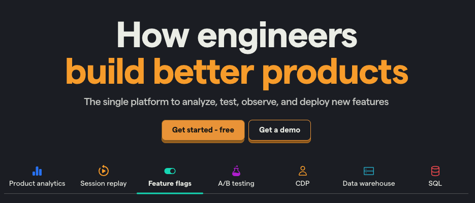
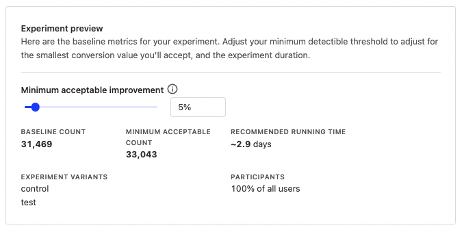
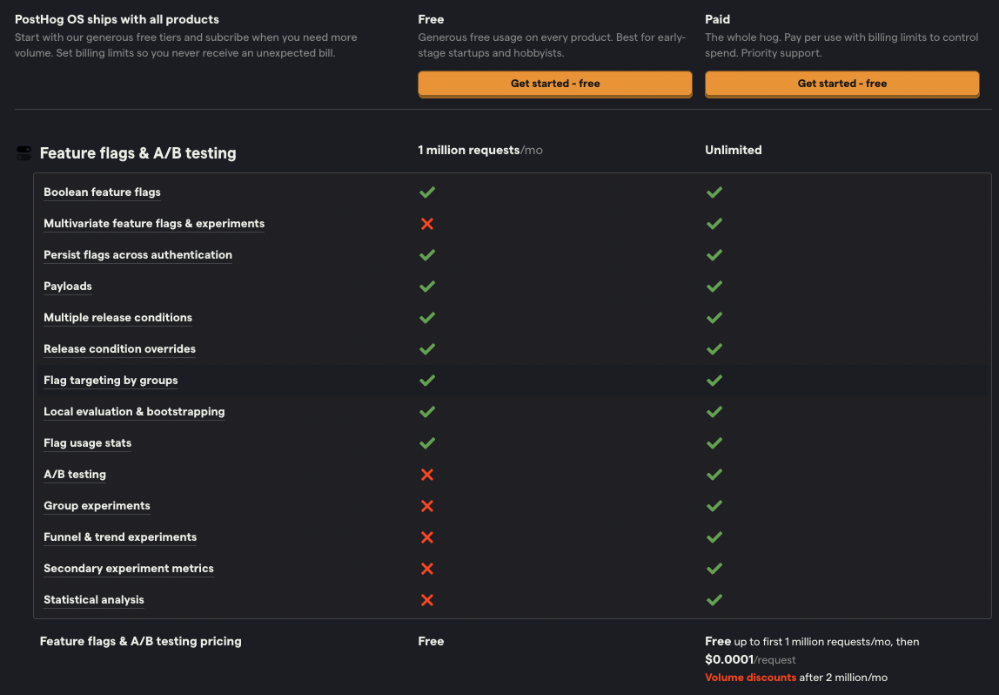
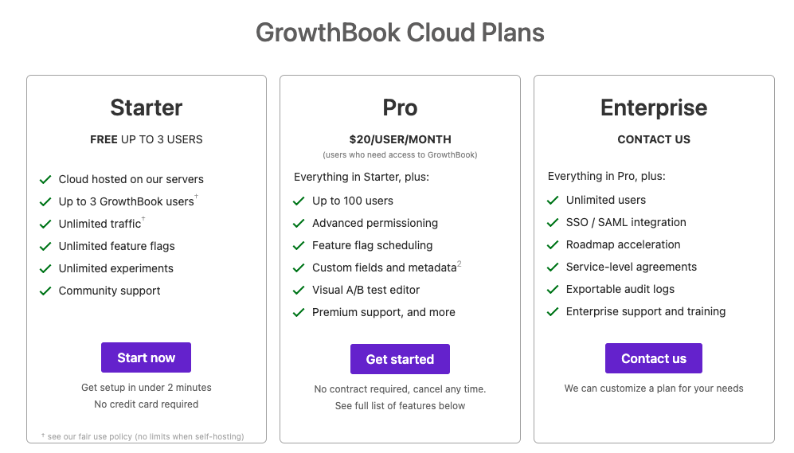

import { ComparisonTable } from 'components/ComparisonTable'
import { ComparisonHeader } from 'components/ComparisonTable/header'
import { ComparisonRow } from 'components/ComparisonTable/row'

PostHog and GrowthBook both provide open source, self-serve feature flags and experimentation, but they're different in two important ways:

- GrowthBook is a warehouse-native feature flag and experiments platform. It focuses on integrating with the product and data tools you already use.

- PostHog is an all-in-one product and data platform. Beyond [feature flags](/docs/feature-flags) and [experiments](/docs/experiments), it includes [product analytics](/docs/product-analytics), [session replay](/docs/session-replay), [surveys](/docs/surveys), [CDP](/docs/cdp), and more.

In this post, we'll cover these differences in more detail, and answer frequently asked questions about both tools.

## How is PostHog different?

### 1. PostHog is an all-in-one platform

PostHog brings together all the tools engineers need for testing, releasing, and measuring the success of new features. Feature flags and A/B testing are only part of a suite of tools PostHog offers.

PostHog combines usage, performance, and behavioral data with flags and experiments. PostHog’s [data warehouse](/docs/data-warehouse) also enables you to pull in data from external sources.

Having all these product and data tools together enables you to do better analysis of shipped features and make better decisions about what you are building next. 

### 2. PostHog is built for startups and engineers

PostHog is built for high-growth startups. This means it is simple for founders and engineers to implement themselves. There are many [SDKs](/docs/libraries), [tutorials](/tutorials), and [docs](/docs) to help you get started quickly with any type of app.

As startups scale, PostHog also provides the more advanced tools they need to succeed. These include advanced product analytics, [SQL querying](/docs/product-analytics/sql), [CDPs](/docs/cdp), and [data warehousing](/docs/data-warehouse).

GrowthBook, on the other hand, focuses only on later-stage, larger companies than PostHog. Many of their features, like their analytical A/B testing suite, are great for data teams which also come at a later stage.

### 3. PostHog is easier to setup

GrowthBook requires more setup than PostHog as it relies heavily on external tools and writing SQL:

1. To get data into GrowthBook, you must integrate a data source. 
2. To track data related to flags and experiments, you connect to an analytics tool.
3. To configure data sources and track events, you write SQL configurations in GrowthBook.
4. To set up goals and analysis, you write more SQL.

PostHog needs none of this. You use the same app and SDKs for managing and evaluating feature flags as tracking usage. There is no extra configuration needed. Creating flags, experiments, and insights doesn’t require writing SQL. This makes PostHog faster to get started and easier to use once set up.

## Comparing PostHog and GrowthBook

### Platform

Both PostHog and GrowthBook have the infrastructure to use flags and experiments effectively with your current app. PostHog has a wider range of product and data tools built in, while GrowthBook relies on third-party integrations

<ComparisonTable column1="PostHog" column2="GrowthBook">
  <ComparisonRow column1={true} column2={true} feature="Open source" description="Code publicly accessible" />
  <ComparisonRow column1={true} column2={true} feature="Self-service" description="No need to talk to sales" />
  <ComparisonRow column1="14" column2="11" feature="SDKs" description="Including JavaScript, Android, iOS, and Python" />
  <ComparisonRow column1={true} column2={false} feature="Native data sources" description="Compute metrics and results without integrations" />
  <ComparisonRow column1={true} column2={true} feature="Proxies" description="Reverse proxy to avoid blockers" />
  <ComparisonRow column1={true} column2={true} feature="Self-hostable" description="Host on your own infrastructure" />
  <ComparisonRow column1={true} column2="Beta" feature="API" description="Edit and evaluate flags with API" />
  <ComparisonRow column1={true} column2={true} feature="Local evaluation (aka streaming)" description="Faster flags by not having to rely on the server for evaluation" />
  <ComparisonRow column1={true} column2={true} feature="SQL" description="Query flag and product data directly via SQL" />
  <ComparisonRow column1={true} column2={false} feature="Session replays" description="Real user playback of flag session" />
</ComparisonTable>

### Feature flags

Both PostHog and GrowthBook offer all the functionality you expect from feature flags. 

<ComparisonTable column1="PostHog" column2="GrowthBook">
  <ComparisonRow column1={true} column2={true} feature="Boolean flags" description="Simple flags returning true or flag" />
  <ComparisonRow column1={true} column2={true} feature="Percentage rollouts" description="Target percentages of a group" />
  <ComparisonRow column1={true} column2={true} feature="Custom targeting" description="Target users based on user properties, custom contexts" />
  <ComparisonRow column1={true} column2={true} feature="JSON payloads" description="Flags return JSON" />
  <ComparisonRow column1="Partial" column2={true} feature="Environments" description="Manage flags for dev, stage, prod" />
  <ComparisonRow column1={false} column2={true} feature="Scheduling" description="Schedule flags to turn on or off" />
  <ComparisonRow column1={true} column2={false} feature="Early access management" description="Manage betas, test features" />
  <ComparisonRow column1={true} column2={false} feature="Bootstrapping" description="Flags available on frontend application load" />
</ComparisonTable>

- **Targeting:** GrowthBook's custom targeting using attributes must be set every session and defined in-app before use. It's also only available on the paid Pro plan. PostHog automatically sets its equivalent ([properties](/docs/getting-started/user-properties)) on users. You don’t need to pre-define them and unlimited custom values are free.

- **[Bootstrapping](/docs/feature-flags/bootstrapping):** PostHog’s JavaScript web SDK enables you to pass flags directly from the backend before the app loads. This ensures they're available immediately and prevents flickering. GrowthBook instead recommends moving the A/B test or flag logic earlier in the page load (server-side) to prevent this.

### Experimentation

Experimentation is where PostHog and GrowthBook’s functionality diverges. Both enable you to create [A/B/n tests](/tutorials/abn-testing) with custom goals and calculate statistical significance, but:

- GrowthBook’s A/B testing provides more potential statistical depth, such as Bayesian and Frequentist engines, value capping, regression adjustment, and testing corrections. These do require statistics expertise to use reliably, though.

- PostHog provides a simpler interface and no need to write SQL or connect to external services – a better experience for users without a background in data science.

<ComparisonTable column1="PostHog" column2="GrowthBook">
  <ComparisonRow column1={true} column2={true} feature="Custom goals" description="Customize metrics that test tracks" />
  <ComparisonRow column1={true} column2={true} feature="Secondary metrics" description="Monitor impact on unrelated metrics" />
  <ComparisonRow column1={true} column2={false} feature="Native goal tracking" description="Track impact on goals without external sources" />
  <ComparisonRow column1={true} column2={true} feature="Statistical significance calculation" description="Calculate if changes make a statistically significant impact" />
  <ComparisonRow column1={true} column2={true} feature="Split testing" description="Split participants into groups" />
  <ComparisonRow column1={true} column2={true} feature="Multivariate (A/B/n) testing" description="Test multiple variants of a change" />
  <ComparisonRow column1={true} column2={false} feature="Recommended run time" description="Calculate the recommended run time for your experiments" />
  <ComparisonRow column1={false} column2={true} feature="Namespaces" description="Avoid conflicts by assigning all users to a namespace" />
  <ComparisonRow column1={false} column2={true} feature="Visual editor" description="Create and edit experiments in your app" />
  <ComparisonRow column1="Bayesian" column2="Bayesian, Frequentist" feature="Statistics engine" description="How the success of an experiment is calculated" />
</ComparisonTable>

- **Recommended run time:** PostHog automatically calculates a recommended run time based on past data and minimally acceptable improvements. This helps you avoid the [peeking problem](/blog/ab-testing-mistakes) and end your experiment at the right time.

- **Visual editor:** GrowthBook’s visual editor is similar to PostHog’s [toolbar](/docs/toolbar). It enables you to select an element to modify using an A/B test. The editor is limited to server-side rendered apps.

- **Frequentist engine:** GrowthBook has an additional statistical analysis option. It enables you to compare the control with the experiment using p-values and confidence intervals.

### Reporting and analytics

GrowthBook offers no reporting or analytics tools other than the ability to query experiment reports with SQL. As a result, GrowthBook forces users to rely on external event tracking and visualization tools.

PostHog provides all the visualizations and product tools for evaluating the success of your features and app. These include trends, funnels, retention, SQL querying, and session replays integrated with your flags and A/B testing data. This enables you to do deeper analysis of their impact and combine them with other product and usage data.

<ComparisonTable column1="PostHog" column2="GrowthBook">
  <ComparisonRow column1={true} column2={false} feature="Analytics" description="Capture usage and calls related to flags" />
  <ComparisonRow column1={true} column2={true} feature="Experiment reports" description="Show the results of an experiment" />
  <ComparisonRow column1={true} column2={false} feature="Trends" description="Graphs of flag usage" />
  <ComparisonRow column1={true} column2={false} feature="Funnel visualization" description="Analyze impact of flags on funnels" />
  <ComparisonRow column1={true} column2={false} feature="Retention" description="User retention related to flags" />
  <ComparisonRow column1={true} column2={true} feature="Breakdowns" description="Breakdown reports by properties" />
  <ComparisonRow column1={true} column2={false} feature="Dashboards" description="Multiple customizable insights for a flag" />
  <ComparisonRow column1={true} column2={false} feature="Non-flag data" description="Combine flag data with other product data" />
</ComparisonTable>

### Pricing

<ComparisonTable column1="PostHog" column2="GrowthBook">
  <ComparisonRow column1="Per request" column2="Seat-based" feature="Pricing" />
  <ComparisonRow column1={true} column2={true} feature="Free plan" />
  <ComparisonRow column1={true} column2={true} feature="Free experiments" />
  <ComparisonRow column1={true} column2="3 seats free, then $20/seat/month" feature="Free collaboration" />
  <ComparisonRow column1={true} column2={false} feature="Fully transparent" />
</ComparisonTable>

PostHog’s [feature flag pricing](/pricing?product=feature-flags) is pay-per-request (and A/B tests use feature flags). There is a generous free tier of 1M requests per month with all features, add-ons, and integrations available.

Like PostHog, GrowthBook is free to self-host. GrowthBook Cloud is a seat-based model. It is free for up to 3 users, then $20/user/month. They claim this provides "unlimited traffic," but in reality, the limit is 10M requests per month, after which you need an enterprise plan.

Features, like flag scheduling, permissions, custom fields, and the visual editor are only available on the GrowthBook Pro paid plan. 

#### Example scenarios

To give you an idea of what pricing looks like in reality, here are some example situations and their estimated costs for both PostHog and GrowthBook. 

> **Note:** GrowthBook does not display their Enterprise pricing needed to go beyond 10M requests per month.

<table className="w-full mt-4" style="min-width: 600px;">
    <thead>
       <tr>
            <td><strong>Seats</strong></td>
            <td><strong>Requests</strong></td>
            <td><strong>PostHog cost</strong></td>
            <td><strong>GrowthBook cost</strong></td>
        </tr>
    </thead>
    <tbody>
       <tr>
            <td>3</td>
            <td>1,000,000</td>
            <td>$0</td>
            <td>$0</td>
        </tr>
       <tr>
            <td>5</td>
            <td>2,000,000</td>
            <td>$100</td>
            <td>$100</td>
        </tr>
       <tr>
            <td>15</td>
            <td>4,000,000</td>
            <td>$300</td>
            <td>$300</td>
        </tr>
       <tr>
            <td>20</td>
            <td>15,000,000</td>
            <td>$1400</td>
            <td>??? (Enterprise)</td>
        </tr>
    </tbody>
</table>

> **Notes:** 
> - Using [backend local evaluation](/docs/feature-flags/common-questions#backend-sdks) in PostHog lowers the amount of flag usage depending on the polling duration and active number of servers. If you use locally evaluated flags with one server polling every 30 seconds, this amount is under 1M requests (free). 
> - PostHog has volume discounts on flags over 2 million requests per month.

### Integrations

GrowthBook has integrations with data warehouses and analytics tools they rely on, but little beyond that. PostHog has a wider range of integrations. 

<ComparisonTable column1="PostHog" column2="GrowthBook">
  <ComparisonRow column1={true} column2={false} feature="Exports" description="Export data to other sources" />
  <ComparisonRow column1={true} column2={true} feature="Imports" description="Import data from sources" />
  <ComparisonRow column1={true} column2={true} feature="Slack" description="Alerts for Slack" />
  <ComparisonRow column1={true} column2={false} feature="Teams" description="Alerts for Microsoft Teams" />
  <ComparisonRow column1={true} column2={false} feature="Zapier" description="Trigger Zapier automations" />
  <ComparisonRow column1={true} column2={false} feature="Sentry" description="Connect to Sentry data" />
  <ComparisonRow column1={false} column2={true} feature="Datadog" description="Capture flag data in Datadog" />
</ComparisonTable>

PostHog’s event-based structure enables you to import data from anywhere for use with flags and experiments. The free API enables you to connect, edit, and capture from anywhere too. For example, you can import data from [warehouses](/docs/data-warehouse), [no-code site builders](/tutorials/webflow-ab-tests), [Segment](/docs/cdp/segment), and more.

### Security and compliance

Both PostHog and GrowthBook enable companies to remain secure and compliant with privacy regulations. Companies can customize the levels of user privacy related to these platforms to their needs. 

<ComparisonTable column1="PostHog" column2="GrowthBook">
  <ComparisonRow column1={true} column2={true} feature="User privacy options" description="Anonymize users, drop personal data" />
  <ComparisonRow column1={true} column2="Enterprise" feature="History, audit logs" description="Manage and view flag edits and related users" />
  <ComparisonRow column1={true} column2={true} feature="GDPR-ready" description="Can be compliant with GDPR" />
  <ComparisonRow column1={true} column2={true} feature="SOC 2" description="SOC 2 security certification" />
  <ComparisonRow column1={true} column2={false} feature="2FA" description="Enforce login with two-factor authentication" />
  <ComparisonRow column1="Enterprise" column2="Enterprise" feature="SAML/SSO" description="Use SAML or single sign-on authentication" />
</ComparisonTable>

## Frequently asked questions

### Who is PostHog useful for?

PostHog is built for startups and their engineers. It provides all the tools startups need to build successful products. The people who find PostHog most useful are founders, [product engineers](/blog/what-is-a-product-engineer), and growth engineers.

Companies that use PostHog feature flags and experiments include [Y Combinator](/customers/ycombinator), [Vendasta](/customers/vendasta), and [AssemblyAI](/customers/assemblyai).

### Who is GrowthBook useful for?

Larger organizations that want their feature flag and experimentation tools use GrowthBook. They often already set up data warehouses and analytics tools. GrowthBook is an added piece to their toolkit. In these organizations, it is used by a combination of engineering, data, and product teams.

Companies that use GrowthBook include Patreon, Deezer, and Pepsi.

### How much does PostHog cost?

Feature flags and experiments are free for up to 1M requests per month. Beyond that, it costs $0.0001/request (or $1 per 10,000 requests). There are discounts for high-volume users, non-profits, and [startups](/startups).

Other products, like product analytics and session replay, have separate but similarly structured pricing.

### How much does GrowthBook cost?

GrowthBook, like PostHog, is free to self-host. This doesn’t count infrastructure, implementation, or maintenance costs.

GrowthBook Cloud is free for up to 3 users and 10M requests per month. Its "Pro" plan is $20/seat/month and provides access to premium features. They also have an Enterprise plan that adds more security and compliance tools as well as a higher request limit. 

### Do GrowthBook or PostHog offer free trials?

GrowthBook is free to self-host and has a free cloud tier with unlimited flags and experiments for up to 3 users.

PostHog lets you use all its features for free. Once you upgrade to paid, you get 1M flag requests, 1M events, and 15,000 recordings for free each month. If your usage stays below this, PostHog remains free.

### How long does it take to implement PostHog?

Feature flags and experiments are simple. They are a few lines of code in any of your favorite languages. They can even be set up on no-code site builders like [Framer](/tutorials/framer-analytics) or [Webflow](/tutorials/webflow-ab-tests).

The process requires signing up for PostHog, installing the snippet or SDK in your app, creating the flag in PostHog, and implementing the flag evaluation and relevant logic in your app. Many of the SDKs handle important aspects like local evaluation and event capture for you.

You can reuse the PostHog implementation, like user identification, across products. Because PostHog is an all-in-one platform, analytics capture for targeting and A/B testing results doesn’t need set up or connection either.

### How long does it take to implement GrowthBook?

The basic GrowthBook implementation seems relatively similar to PostHog, but the need to define data twice as well as integrate external tools makes it longer.

To implement GrowthBook from scratch:

- Sign up or self-host.
- Create an SDK endpoint, install the SDK in your app, and initialize the SDK.
- Set up target attributes in-app and define them in GrowthBook.
- Set up an analytics tool to track events and integrate it with GrowthBook.
- Connect your data source (warehouse) and write SQL to configure it.
- Create a feature flag or experiment. Set up tracking metric(s) using SQL. Implement related logic in-app.

Although GrowthBook provides templates for integrating external tools, this whole process takes longer than PostHog.

<ArrayCTA/>
