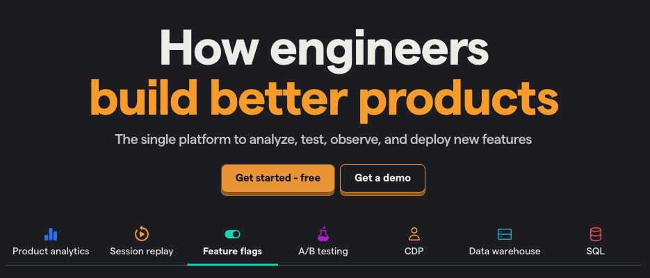
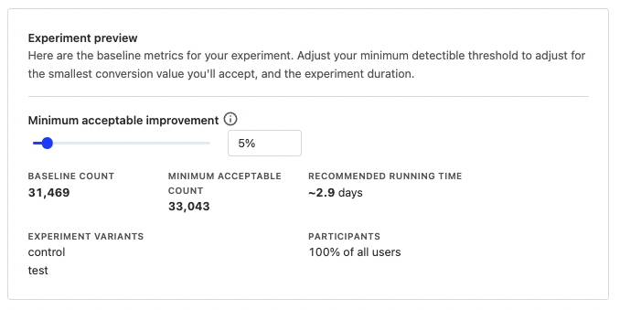
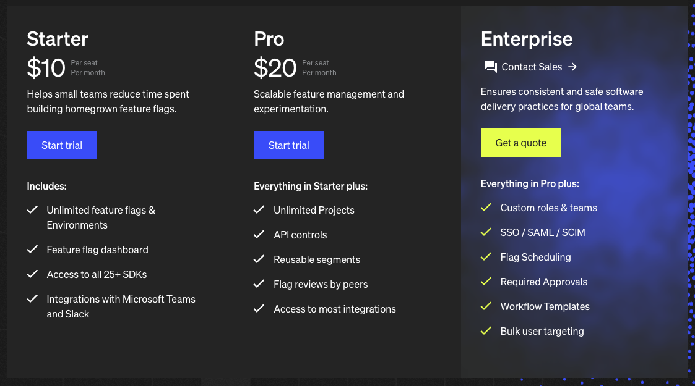

One glance at both PostHog and LaunchDarkly’s homepages explains a lot about each of them. It shows:

1. LaunchDarkly is an enterprise-focused feature management tool with feature flags, experiments, and related workflows.
2. PostHog is an all-in-one suite of product and data tools, including feature management and experimentation, but also extending to session replays, analytics and user surveys.

Both provide feature flagging and experimentation functionality. Using these features enable you to [de-risk releases](/blog/decouple-deployment-from-release), increase engineering velocity, configure your app remotely, customize experiences, and more.

This post goes over the differences, platforms, features, pricing, reporting, integrations, and frequently asked questions about both.

## How is PostHog different?

### 1. It is an all-in-one platform

PostHog brings all the tools engineers need for testing, release, and measurement the success of new features. Beyond the [feature flag](/docs/feature-flags) and [A/B testing](/docs/experiments) tools, this includes product analytics, session replays, surveys, and more.

These tools add an extra layer of analysis unavailable in LaunchDarkly. They enable you to make better decisions about features you’ve shipped and what you’re building next. They also enable you to combine data from multiple tools (such as user properties) for use in flags and experiments.

### 2. We’re transparent (in many ways)

PostHog is open source. Our code, culture, and strategy are public on GitHub and our [handbook](/handbook). While LaunchDarkly open sourced some code (like SDKs), most is closed-source.

On top of being open source, we are also self-serve. No need to "talk to sales" or "schedule a demo" if you don’t want to. You can sign up and try all the features PostHog offers for free.

Our [pricing](/pricing) is also transparent. It is a two-tier usage-based model, which we make easy to predict. This is simpler than LaunchDarkly’s multi-tier combination of charging for seats, monthly context instances, and add-ons. If you worry about overages, you can set up billing limits in PostHog too.

### 3. Built for startups and engineers

PostHog is built for high-growth startups. This means it is simple for engineers to implement themselves. We have many [SDKs](/docs/libraries), [tutorials](/tutorials), and docs to help you get started quickly with any type of app.

After setting up, PostHog aligns with startups as they scale up, providing tools like advanced product analytics, CDPs, and data warehousing to combine the tools they need into one. 

LaunchDarkly focuses on enterprise users, managers, and DevOps. This means more focus on governance and integrations. 

# Comparing PostHog and LaunchDarkly

### Platform

Both PostHog and LaunchDarkly built the infrastructure to use flags and experiments fast and effectively with your current app. PostHog does this more openly, both being open source and self-service. 

<table className="w-full mt-4" style="min-width: 600px;">
    <thead>
        <tr>
            <td className="w-3/12"></td>
            <td>PostHog</td>
            <td>LaunchDarkly</td>
            <td></td>
        </tr>
    </thead>
    <tbody>
        <tr>
            <td>Open source</td>
            <td className="text-center">Full</td>
            <td className="text-center">Partial</td>
            <td>Code publicly accessible</td>
        </tr>
        <tr>
            <td>Self-service</td>
            <td className="text-center">✔</td>
            <td className="text-center">✖</td>
            <td>No need to talk to sales</td>
        </tr>
        <tr>
            <td>All major SDKs</td>
            <td className="text-center">✔</td>
            <td className="text-center">✔</td>
            <td>JavaScript, Android, iOS, Python, and more</td>
        </tr>
        <tr>
            <td>Proxies</td>
            <td className="text-center">✔</td>
            <td className="text-center">✔</td>
            <td>Reverse proxy to avoid blockers.</td>
        </tr>
        <tr>
            <td>API</td>
            <td className="text-center">✔</td>
            <td className="text-center">Pro</td>
            <td>Edit and evaluate flags with API</td>
        </tr>
        <tr>
            <td>Local evaluation (aka streaming)</td>
            <td className="text-center">✔</td>
            <td className="text-center">✔</td>
            <td>Faster flags by not having to rely on the server for evaluation</td>
        </tr>
        <tr>
            <td>Bootstrapping</td>
            <td className="text-center">✔</td>
            <td className="text-center">✔</td>
            <td>Flags available on frontend application load</td>
        </tr>
    </tbody>
</table>

### Feature management

Both PostHog and LaunchDarkly offer all the functionality you expect for feature management using feature flags. 

<table className="w-full mt-4" style="min-width: 600px;">
    <thead>
        <tr>
            <td className="w-3/12"></td>
            <td>PostHog</td>
            <td>LaunchDarkly</td>
            <td></td>
        </tr>
    </thead>
    <tbody>
        <tr>
            <td>Boolean flags</td>
            <td className="text-center">✔</td>
            <td className="text-center">✔</td>
            <td>Simple flags returning true or flag</td>
        </tr>
        <tr>
            <td>Percentage rollouts</td>
            <td className="text-center">✔</td>
            <td className="text-center">✔</td>
            <td>Target percentages of a group</td>
        </tr>
        <tr>
            <td>Custom targeting</td>
            <td className="text-center">✔</td>
            <td className="text-center">✔</td>
            <td>Target users based on user properties, custom contexts</td>
        </tr>
        <tr>
            <td>Multivariate flags</td>
            <td className="text-center">✔</td>
            <td className="text-center">✔</td>
            <td>Flags with multiple customizable values</td>
        </tr>
        <tr>
            <td>JSON payloads</td>
            <td className="text-center">✔</td>
            <td className="text-center">✔</td>
            <td>Flags return JSON</td>
        </tr>
        <tr>
            <td>Environments</td>
            <td className="text-center">Partial</td>
            <td className="text-center">✔</td>
            <td>Manage flags for dev, stage, prod.</td>
        </tr>
        <tr>
            <td>Scheduling</td>
            <td className="text-center">✖</td>
            <td className="text-center">Enterprise</td>
            <td>Schedule flags to turn on or off.</td>
        </tr>
        <tr>
            <td>Workflows</td>
            <td className="text-center">✖</td>
            <td className="text-center">Enterprise</td>
            <td>Manage changes to flags</td>
        </tr>
        <tr>
            <td>Lifecycle management</td>
            <td className="text-center">✖</td>
            <td className="text-center">✔</td>
            <td>Display new and old flags</td>
        </tr>
        <tr>
            <td>Triggers</td>
            <td className="text-center">✖</td>
            <td className="text-center">✔</td>
            <td>Trigger changes based on metrics</td>
        </tr>
        <tr>
            <td>Unlimited targeting size</td>
            <td className="text-center">✔</td>
            <td className="text-center">Enterprise</td>
            <td>Target contexts of any size</td>
        </tr>
        <tr>
            <td>Early access management</td>
            <td className="text-center">✔</td>
            <td className="text-center">✖</td>
            <td>Manage betas, test features</td>
        </tr>
    </tbody>
</table>

LaunchDarkly’s enterprise plan unlocks advanced workflow features like scheduling, lifecycle management, triggers, and more. PostHog’s [API](/docs/api) enables you to mimic this functionality if needed, but it isn’t built into the UI.

### Experimentation

PostHog and LaunchDarkly have relatively similar experimentation feature sets, enabling you to run [A/B/n tests](/tutorials/abn-testing) with custom goals and calculate if they have a statistically significant impact.

<table className="w-full mt-4" style="min-width: 600px;">
    <thead>
        <tr>
            <td className="w-3/12"></td>
            <td>PostHog</td>
            <td>LaunchDarkly</td>
            <td></td>
        </tr>
    </thead>
    <tbody>
        <tr>
            <td>Custom goals</td>
            <td className="text-center">✔</td>
            <td className="text-center">✔</td>
            <td>Customize metrics that test tracks</td>
        </tr>
        <tr>
            <td>Secondary metrics</td>
            <td className="text-center">✔</td>
            <td className="text-center">✔</td>
            <td>Monitor impact on unrelated metrics</td>
        </tr>
        <tr>
            <td>Statistical significance calculation</td>
            <td className="text-center">✔</td>
            <td className="text-center">✔</td>
            <td>Calculate if changes make a statistically significant impact</td>
        </tr>
        <tr>
            <td>Split testing</td>
            <td className="text-center">✔</td>
            <td className="text-center">✔</td>
            <td>Split participants into groups</td>
        </tr>
        <tr>
            <td>Multivariate (A/B/n) testing</td>
            <td className="text-center">✔</td>
            <td className="text-center">✔</td>
            <td>Test multiple variants of a change</td>
        </tr>
        <tr>
            <td>Recommended run time</td>
            <td className="text-center">✔</td>
            <td className="text-center">✖</td>
            <td>Calculate the recommended run time for your experiments</td>
        </tr>
    </tbody>
</table>

PostHog automatically calculates a recommended run time based on past data and minimally acceptable improvements. This helps you avoid the peeking problem and end your experiment at the right time.

### Pricing

PostHog and LaunchDarkly price significantly differently. 

<table className="w-full mt-4" style="min-width: 600px;">
    <thead>
        <tr>
            <td className="w-3/12"></td>
            <td className="text-center">PostHog</td>
            <td className="text-center">LaunchDarkly</td>
        </tr>
    </thead>
    <tbody>
        <tr>
            <td>Pricing</td>
            <td className="text-center">Simple per request pricing</td>
            <td className="text-center">Based on MAU + seats + add-ons</td>
        </tr>
        <tr>
            <td>Free plan</td>
            <td className="text-center">✔</td>
            <td className="text-center">Trial only</td>
        </tr>
        <tr>
            <td>Free experiments</td>
            <td className="text-center">✔</td>
            <td className="text-center">✖</td>
        </tr>
        <tr>
            <td>Free collaboration</td>
            <td className="text-center">✔</td>
            <td className="text-center">✖</td>
        </tr>
    </tbody>
</table>

PostHog’s feature flag pricing is pay-per-request (and A/B tests use feature flags). There is a generous free tier of 1M requests per month with all features, add-ons, and integrations available.

LaunchDarkly’s pricing is more complicated. They charge by seat starting at $10/seat/month. On top of this, they charge based on "monthly context instances" (MCIs) also known as monthly active users. The pro plan only gets 1,000 frontend MCIs per month.

As mentioned earlier, many of the security, approval, and workflow features that differentiate them are only available at the opaque "Enterprise" level. 

### Reporting

LaunchDarkly features basic reporting but requires other platforms for more advanced analysis. PostHog builds in advanced analysis like SQL querying, conversion funnels, and dashboards and combines flag data with other product data.

<table className="w-full mt-4" style="min-width: 600px;">
    <thead>
        <tr>
            <td className="w-3/12"></td>
            <td>PostHog</td>
            <td>LaunchDarkly</td>
            <td></td>
        </tr>
    </thead>
    <tbody>
        <tr>
            <td>Analytics</td>
            <td className="text-center">✔</td>
            <td className="text-center">✔</td>
            <td>Capture usage and calls related to flags</td>
        </tr>
        <tr>
            <td>Basic visualizations</td>
            <td className="text-center">✔</td>
            <td className="text-center">✔</td>
            <td>Trends, conversion.</td>
        </tr>
        <tr>
            <td>Advanced visualizations</td>
            <td className="text-center">✔</td>
            <td className="text-center">✖</td>
            <td>Funnels, retention.</td>
        </tr>
        <tr>
            <td>Dashboard</td>
            <td className="text-center">✔</td>
            <td className="text-center">✖</td>
            <td>Analytics for a flag</td>
        </tr>
        <tr>
            <td>Session replays</td>
            <td className="text-center">✔</td>
            <td className="text-center">✖</td>
            <td>Real user playback of flag session</td>
        </tr>
        <tr>
            <td>SQL</td>
            <td className="text-center">✔</td>
            <td className="text-center">✖</td>
            <td>Interact with flag data via SQL</td>
        </tr>
        <tr>
            <td>Dashboards</td>
            <td className="text-center">✔</td>
            <td className="text-center">✖</td>
            <td>Multiple customizable insights for a flag</td>
        </tr>
        <tr>
            <td>Non-flag data</td>
            <td className="text-center">✔</td>
            <td className="text-center">✖</td>
            <td>Combine flag data with other product data</td>
        </tr>
    </tbody>
</table>

### Integrations

Both PostHog and LaunchDarkly have a range of integrations that enable them to import, export, enhance, and make use of data. 

<table className="w-full mt-4" style="min-width: 600px;">
    <thead>
        <tr>
            <td className="w-3/12"></td>
            <td>PostHog</td>
            <td>LaunchDarkly</td>
            <td></td>
        </tr>
    </thead>
    <tbody>
        <tr>
            <td>Free integrations</td>
            <td className="text-center">✔</td>
            <td className="text-center">✖</td>
            <td>Use integrations on the free plan</td>
        </tr>
        <tr>
            <td>Exports</td>
            <td className="text-center">✔</td>
            <td className="text-center">Add-on</td>
            <td>Export data to other sources</td>
        </tr>
        <tr>
            <td>Imports</td>
            <td className="text-center">✔</td>
            <td className="text-center">✔</td>
            <td>Import data from source</td>
        </tr>
        <tr>
            <td>Slack</td>
            <td className="text-center">✔</td>
            <td className="text-center">✔</td>
            <td>Alerts for Slack</td>
        </tr>
        <tr>
            <td>Teams</td>
            <td className="text-center">✔</td>
            <td className="text-center">✔</td>
            <td>Alerts for Microsoft Teams</td>
        </tr>
        <tr>
            <td>Zapier</td>
            <td className="text-center">✔</td>
            <td className="text-center">✔</td>
            <td>Trigger Zapier automations</td>
        </tr>
        <tr>
            <td>Sentry</td>
            <td className="text-center">Two way</td>
            <td className="text-center">One way</td>
            <td>Connect to Sentry data</td>
        </tr>
        <tr>
            <td>Edge tools</td>
            <td className="text-center">✖</td>
            <td className="text-center">✔</td>
            <td>Use edge networks</td>
        </tr>
    </tbody>
</table>

LaunchDarkly has more pre-built integrations, but some are only available on higher paid plans, and others replicate functionality which is built-in to PostHog as standard. These include environments as a service, observability tools, workflow management, and more.

PostHog’s event-based structure enables you to import data from anywhere for use with flags and experiments. The free API enables you to connect, edit, and capture from anywhere too.

PostHog’s [data warehouse](/docs/data-warehouse) is in private beta and will soon make outside data available for use in PostHog.

### Security and compliance

Both PostHog and LaunchDarkly enable companies to remain secure and compliant with privacy regulations. Companies can customize the levels of user privacy related to these platforms to their needs.

<table className="w-full mt-4" style="min-width: 600px;">
    <thead>
        <tr>
            <td className="w-3/12"></td>
            <td>PostHog</td>
            <td>LaunchDarkly</td>
            <td></td>
        </tr>
    </thead>
    <tbody>
        <tr>
            <td>User privacy options</td>
            <td className="text-center">✔</td>
            <td className="text-center">✔</td>
            <td>Anonymize users, drop personal data</td>
        </tr>
        <tr>
            <td>History, audit logs</td>
            <td className="text-center">✔</td>
            <td className="text-center">Pro</td>
            <td>Manage and view flag edits and related users</td>
        </tr>
        <tr>
            <td>GDPR ready</td>
            <td className="text-center">✔</td>
            <td className="text-center">✔</td>
            <td>Can be compliant with GDPR</td>
        </tr>
        <tr>
            <td>SOC2</td>
            <td className="text-center">✔</td>
            <td className="text-center">✔</td>
            <td>SOC 2 security certification</td>
        </tr>
        <tr>
            <td>2FA</td>
            <td className="text-center">✔</td>
            <td className="text-center">✔</td>
            <td>Enforce login with two-factor authentication.</td>
        </tr>
        <tr>
            <td>SAML/SSO</td>
            <td className="text-center">Enterprise</td>
            <td className="text-center">$10/seat/month or Enterprise</td>
            <td>Use SAML or single sign-on authentication</td>
        </tr>
        <tr>
            <td>Approvals</td>
            <td className="text-center">✖</td>
            <td className="text-center">Enterprise</td>
            <td>Require approvals to change flags</td>
        </tr>
        <tr>
            <td>Permissioning</td>
            <td className="text-center">✖</td>
            <td className="text-center">Enterprise</td>
            <td>Control who can edit and modify flags</td>
        </tr>
    </tbody>
</table>

Many of LaunchDarkly’s advanced compliance tools are only available on their enterprise plans. PostHog also features SSO and SAML in its enterprise edition.

## Frequently asked questions

### Who is PostHog useful for?

PostHog is built for startups and their engineers. It provides all the tools startups need to build successful products. The people who find PostHog most useful are founders, [product engineers](/blog/what-is-a-product-engineer), and growth engineers.

### Who is LaunchDarkly useful for?

LaunchDarkly is built for enterprises wanting to follow software development best practices. This means managing features, de-risking releases, experimenting with changes, and coordinating deploys. The people who find LaunchDarkly most useful are engineering managers, site reliability engineers, and product managers.

### How much does PostHog cost?

Feature flags and experiments are free for up to 1M requests per month. Beyond that, it costs $0.0001/request (or $1 per 10,000 requests). There are discounts for high-volume users, non-profits, and [startups](/startups). 

Other products, like product analytics and session replay, have separate but similarly structured pricing. 

### How much does LaunchDarkly cost?

LaunchDarkly starts at $10 per seat per month. This includes unlimited flags, server-side monthly active users, and 1,000 client-side monthly active users. More client-side monthly active users, also known as monthly context instances, cost more. 

Their pro plan doubles the cost to $20 per seat per month. It adds API, unlimited projects, and more integrations. Above that, their enterprise plan requires talking to sales. It includes custom roles, SSO, scheduling, workflows, and more.

### Does LaunchDarkly or PostHog offer free trials?

LaunchDarkly offers a 14-day free trial, but beyond that, all access and features are paid.

PostHog lets you use all its features for free. Once you upgrade to paid, you get 1M flag requests, 1M events, and 15,000 recordings for free each month. This means if you stay below this, PostHog remains free. 

### How long does it take to implement PostHog?

Feature flags and experiments are simple. They are a few lines of code in all of your favorite languages. They can even be set up on no-code site builders like [Framer](/tutorials/framer-analytics) or [Webflow](/tutorials/webflow-ab-tests).

The process requires signing up for PostHog, installing the snippet or SDK in your app, creating the flag in PostHog, and implement the flag evaluation and relevant logic in your app. In many of the SDKs, we handle important aspects like local evaluation and event capture for you. 

Much of the PostHog implementation, like user identification, is reused across products. Because PostHog is an all-in-one platform, analytics capture for targeting and A/B testing doesn’t need set up or connection either.

### How long does it take to implement LaunchDarkly?

Installing LaunchDarkly is relatively simple, depending on your needs and compliance requirements. The most basic form is starting your LaunchDarkly trial, installing their SDK, setting up a client or provider, identify users or contexts, calling flags, and capturing events. 

The differences with PostHog are needing to import user context data, set up context identification, capture the flag or A/B test usage, and import analytics into the platform.

<ArrayCTA />
