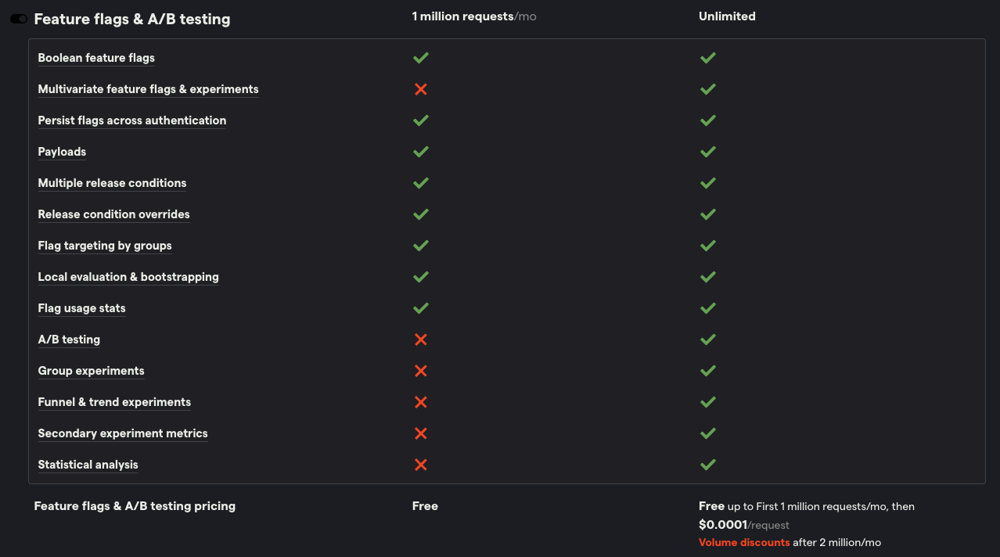

PostHog and Optimizely are both multi-product tools to help you improve your apps and websites. Two important products for each of them are experimentation and feature flags. Beyond these two, they diverge significantly:

- PostHog focuses on helping you build a better product. This means having product and data tools like [product analytics](/product-analytics), [session replay](/session-replay), and [surveys](/surveys).
- Optimizely focuses on being an all-in-one system for marketing. This means having marketing and ecommerce tools like content management, campaign planning, asset management, and checkout customizations.

This post compares their platforms, experimentation features, reporting, pricing, and more.

## How is PostHog different than Optimizely?

### 1. Product and startup-focused

PostHog is built for high-growth startups working to build the best possible products. It's easy to get started and provides all the tools you need at an early stage. There's a generous free plan and [startups](/startups) get free credits. 

Optimizely focuses on providing marketing, ecommerce, and content tools to massive enterprises. It has fewer product focused tools. 

### 2. Transparent, free, and self-service

PostHog is open source. Everything from our [code](https://github.com/PostHog/posthog) to [roadmap](/roadmap) to [strategy](/handbook) is open for everyone to see. 

Along with this, you can [sign up for PostHog for free](https://app.posthog.com/). You don’t need to fill out a contact form, add a credit card, or have a sales call. You can use PostHog for free forever if you want.

Optimizely is open about some areas, like roadmap and its SDKs, but you have to talk to sales before signing up.

### 3. Analytics and reporting built-in

PostHog links all its tools together. This means you get all the features and visualizations of product analytics for your feature flags and A/B tests. You can use them in [trends](/docs/product-analytics/trends), [funnels](/docs/product-analytics/funnels), and even directly query related metrics with [SQL](/docs/product-analytics/sql).

Optimizely has some analytics, such as web marketing, but largely relies on Google Analytics for tracking and reporting. This limits the analysis you can do related to your feature flags and experiments. 

<ArrayCTA /> 

## Platform

Although both Optimizely and PostHog provide experimentation and feature flags, their overall platforms are significantly different.

<div className="overflow-x-auto -mx-5 px-5 w-screen md:w-auto">
<table className="w-full mt-4">
 <thead>
 <tr>
 <td className="w-3/12"></td>
 <td class="text-center"><strong>PostHog</strong></td>
 <td class="text-center"><strong>Optimizely</strong></td>
 </tr>
 </thead>
 <tbody>
 <tr>
 <td><p class="!mb-0 pb-0.5 !leading-tight"><strong>Open source</strong></p><p class="!mb-0 !text-sm text-opacity-75 leading-none">Optimizely has open-source SDKs</p></td>
 <td className="text-center"><span className="text-green text-lg">✔</span></td>
 <td className="text-center"><span className="text-red text-lg">✖</span></td>
 </tr>
 <tr>
 <td><p class="!mb-0 pb-0.5 !leading-tight"><strong>Self-service</strong></p><p class="!mb-0 !text-sm text-opacity-75 leading-none">Start without talking to sales</p></td>
 <td className="text-center"><span className="text-green text-lg">✔</span></td> 
 <td className="text-center"><span className="text-red text-lg">✖</span></td>
 </tr>
  <tr>
 <td><p class="!mb-0 pb-0.5 !leading-tight"><strong>Experimentation</strong></p><p class="!mb-0 !text-sm text-opacity-75 leading-none">Run A/B tests</p></td>
 <td className="text-center"><span className="text-green text-lg">✔</span></td> 
 <td className="text-center"><span className="text-green text-lg">✔</span></td>
 </tr>
 <tr>
 <td><p class="!mb-0 pb-0.5 !leading-tight"><strong>Feature flags</strong></p><p class="!mb-0 !text-sm text-opacity-75 leading-none">Manage and rollout features remotely</p></td>
 <td className="text-center"><span className="text-green text-lg">✔</span></td> 
 <td className="text-center"><span className="text-green text-lg">✔</span></td>
 </tr>
 <tr>
 <td><p class="!mb-0 pb-0.5 !leading-tight"><strong>Product analytics</strong></p><p class="!mb-0 !text-sm text-opacity-75 leading-none">Native feature tracking</p></td>
 <td className="text-center"><span className="text-green text-lg">✔</span></td> 
 <td className="text-center"><span className="text-red text-lg">✖</span></td>
 </tr>
 <tr>
 <td><p class="!mb-0 pb-0.5 !leading-tight"><strong>Web analytics</strong></p><p class="!mb-0 !text-sm text-opacity-75 leading-none">Get web stats like pageviews</p></td>
 <td className="text-center"><span className="text-green text-lg">✔</span></td> 
 <td className="text-center"><span className="text-green text-lg">✔</span></td>
 </tr>
 <tr>
 <td><p class="!mb-0 pb-0.5 !leading-tight"><strong>Session replay</strong></p><p class="!mb-0 !text-sm text-opacity-75 leading-none">View real user sessions</p></td>
 <td className="text-center"><span className="text-green text-lg">✔</span></td> 
 <td className="text-center"><span className="text-red text-lg">✖</span></td>
 </tr>
 <tr>
 <td><p class="!mb-0 pb-0.5 !leading-tight"><strong>Surveys</strong></p><p class="!mb-0 !text-sm text-opacity-75 leading-none">Ask users questions and track responses</p></td>
 <td className="text-center"><span className="text-green text-lg">✔</span></td> 
 <td className="text-center"><span className="text-red text-lg">✖</span></td>
 </tr>
 <tr>
 <td><p class="!mb-0 pb-0.5 !leading-tight"><strong>CMS</strong></p><p class="!mb-0 !text-sm text-opacity-75 leading-none">Manage content</p></td>
 <td className="text-center"><span className="text-red text-lg">✖</span></td> 
 <td className="text-center"><span className="text-green text-lg">✔</span></td>
 </tr>
 <tr>
 <td><p class="!mb-0 pb-0.5 !leading-tight"><strong>Cart optimization</strong></p><p class="!mb-0 !text-sm text-opacity-75 leading-none">Optimize ecommerce checkouts</p></td>
 <td className="text-center"><span className="text-red text-lg">✖</span></td> 
 <td className="text-center"><span className="text-green text-lg">✔</span></td>
 </tr>
 <tr>
 <td><p class="!mb-0 pb-0.5 !leading-tight"><strong>Project management</strong></p><p class="!mb-0 !text-sm text-opacity-75 leading-none">Manage projects related to experiments</p></td>
 <td className="text-center"><span className="text-red text-lg">✖</span></td> 
 <td className="text-center"><span className="text-green text-lg">✔</span></td>
 </tr>
 </tbody>
</table>
</div>

- The big platform difference between the two beyond marketing vs product features is **analytics**. Optimizely relies on external analytics providers like Google and Adobe Analytics to track feature flags and A/B tests. PostHog has a full analytics suite built-in, including [autocapture](/docs/product-analytics/autocapture), [custom events](/docs/getting-started/send-events#2-capture-custom-events), direct SQL access, and more.

- Being a marketing-focused platform, Optimizely includes project and content management tools like request forms, asset libraries, and hypothesis briefs. PostHog leaves the planning to the other tools you are using but does include notebooks for analysis.

## Web experimentation

Optimizely splits its experimentation features into two separate categories, web and feature. We will compare both separately against PostHog. 

The core web experimentation features like traffic allocation, preview mode, cross-browser, dynamic website support, targeting, and more are available in both Optimizely and PostHog 

<div className="overflow-x-auto -mx-5 px-5 w-screen md:w-auto">
  <table className="w-full mt-4">
    <thead>
      <tr>
        <td className="w-3/12"></td>
        <td class="text-center"><strong>PostHog</strong></td>
        <td class="text-center"><strong>Optimizely</strong></td>
      </tr>
    </thead>
    <tbody>
      <tr>
        <td><p class="!mb-0 pb-0.5 !leading-tight"><strong>A/B/n tests</strong></p><p class="!mb-0 !text-sm text-opacity-75 leading-none">Do multi-armed bandit tests with multiple variants</p></td>
        <td className="text-center"><span className="text-green text-lg">✔</span></td>
        <td className="text-center"><span className="text-green text-lg">✔</span></td>
      </tr>
      <tr>
        <td><p class="!mb-0 pb-0.5 !leading-tight"><strong>Custom targeting</strong></p><p class="!mb-0 !text-sm text-opacity-75 leading-none">Target users with custom attributes</p></td>
        <td className="text-center"><span className="text-green text-lg">✔</span></td>
        <td className="text-center"><span className="text-green text-lg">✔</span></td>
      </tr>
      <tr>
        <td><p class="!mb-0 pb-0.5 !leading-tight"><strong>Custom goals</strong></p><p class="!mb-0 !text-sm text-opacity-75 leading-none">Set experiment goals to any metric</p></td>
        <td className="text-center"><span className="text-green text-lg">✔</span></td>
        <td className="text-center"><span className="text-green text-lg">✔</span></td>
      </tr>
      <tr>
        <td><p class="!mb-0 pb-0.5 !leading-tight"><strong>Single page app support</strong></p><p class="!mb-0 !text-sm text-opacity-75 leading-none">Use app frameworks like React and Vue</p></td>
        <td className="text-center"><span className="text-green text-lg">✔</span></td>
        <td className="text-center"><span className="text-green text-lg">✔</span></td>
      </tr>
      <tr>
        <td><p class="!mb-0 pb-0.5 !leading-tight"><strong>No-code experiments</strong></p><p class="!mb-0 !text-sm text-opacity-75 leading-none">Implement experiments without code</p></td>
        <td className="text-center"><span className="text-red text-lg">✖</span></td>
        <td className="text-center"><span className="text-green text-lg">✔</span></td>
      </tr>
      <tr>
        <td><p class="!mb-0 pb-0.5 !leading-tight"><strong>Low-code experiments</strong></p><p class="!mb-0 !text-sm text-opacity-75 leading-none">Implement experiments with a small amount of code</p></td>
        <td className="text-center"><span className="text-green text-lg">✔</span></td>
        <td className="text-center"><span className="text-green text-lg">✔</span></td>
      </tr>
      <tr>
        <td><p class="!mb-0 pb-0.5 !leading-tight"><strong>Funnel tests</strong></p><p class="!mb-0 !text-sm text-opacity-75 leading-none">Use funnels as a goal</p></td>
        <td className="text-center"><span className="text-green text-lg">✔</span></td>
        <td className="text-center"><span className="text-green text-lg">✔</span></td>
      </tr>
      <tr>
        <td><p class="!mb-0 pb-0.5 !leading-tight"><strong>Native analytics</strong></p><p class="!mb-0 !text-sm text-opacity-75 leading-none">Track experiments without third-party tools</p></td>
        <td className="text-center"><span className="text-green text-lg">✔</span></td>
        <td className="text-center"><span className="text-red text-lg">✖</span></td>
      </tr>
      <tr>
        <td><p class="!mb-0 pb-0.5 !leading-tight"><strong>Scheduling</strong></p><p class="!mb-0 !text-sm text-opacity-75 leading-none">Schedule experiments to run at specific times</p></td>
        <td className="text-center"><span className="text-red text-lg">✖</span></td>
        <td className="text-center"><span className="text-green text-lg">✔</span></td>
      </tr>
      <tr>
        <td><p class="!mb-0 pb-0.5 !leading-tight"><strong>Use external data</strong></p><p class="!mb-0 !text-sm text-opacity-75 leading-none">Use data from other platforms in experiments</p></td>
        <td className="text-center"><span className="text-green text-lg">✔</span></td>
        <td className="text-center"><span className="text-green text-lg">✔</span></td>
      </tr>
    </tbody>
  </table>
</div>

- In Optimizely, many features of web experiments, like scheduling, multi-armed bandits, [multi-variate testing](/tutorials/abn-testing), and advanced personalization are only available on the higher-tier "Accelerate" plan or as add-ons.

- PostHog doesn't offer a no-code experiment creator yet, but it does have a UI to create and manage experiments as well as snippets to make it easy to implement them. For example, you can add a basic experiment anywhere you can insert custom JavaScript like this:

```html
<script>
  !function(t,e){var o,n,p,r;e.__SV||(window.posthog=e,e._i=[],e.init=function(i,s,a){function g(t,e){var o=e.split(".");2==o.length&&(t=t[o[0]],e=o[1]),t[e]=function(){t.push([e].concat(Array.prototype.slice.call(arguments,0)))}}(p=t.createElement("script")).type="text/javascript",p.async=!0,p.src=s.api_host+"/static/array.js",(r=t.getElementsByTagName("script")[0]).parentNode.insertBefore(p,r);var u=e;for(void 0!==a?u=e[a]=[]:a="posthog",u.people=u.people||[],u.toString=function(t){var e="posthog";return"posthog"!==a&&(e+="."+a),t||(e+=" (stub)"),e},u.people.toString=function(){return u.toString(1)+".people (stub)"},o="capture identify alias people.set people.set_once set_config register register_once unregister opt_out_capturing has_opted_out_capturing opt_in_capturing reset isFeatureEnabled onFeatureFlags getFeatureFlag getFeatureFlagPayload reloadFeatureFlags group updateEarlyAccessFeatureEnrollment getEarlyAccessFeatures getActiveMatchingSurveys getSurveys".split(" "),n=0;n<o.length;n++)g(u,o[n]);e._i.push([i,s,a])},e.__SV=1)}(document,window.posthog||[]);
  posthog.init('<ph_project_api_key>,{api_host:'<ph_instance_address>'})
  
  posthog.onFeatureFlags(() => {
    // Check the value of the 'test-flag' feature flag
    if (posthog.getFeatureFlag('test-flag') === 'test') {
      // If the feature flag is enabled, change the text of the landing-header
      const landingHeader = document.getElementById('landing-header');
      if (landingHeader) {
        landingHeader.textContent = "Welcome to our site!";
      }
    }
  });
</script>
```

## Feature experimentation

Feature experimentation relates to releasing and testing feature changes in your product. Both Optimizely and PostHog have all the core features to do this safely and effectively.

<div className="overflow-x-auto -mx-5 px-5 w-screen md:w-auto">
<table className="w-full mt-4">
 <thead>
 <tr>
 <td className="w-3/12"></td>
 <td class="text-center"><strong>PostHog</strong></td>
 <td class="text-center"><strong>Optimizely</strong></td>
 </tr>
 </thead>
 <tbody>
 <tr>
 <td><p class="!mb-0 pb-0.5 !leading-tight"><strong>Flags</strong></p><p class="!mb-0 !text-sm text-opacity-75 leading-none">Use and evaluate feature flags</p></td>
 <td className="text-center"><span className="text-green text-lg">✔</span></td>
 <td className="text-center"><span className="text-green text-lg">✔</span></td>
 </tr>
 <tr>
 <td><p class="!mb-0 pb-0.5 !leading-tight"><strong>Rollouts</strong></p><p class="!mb-0 !text-sm text-opacity-75 leading-none">Control rollout of features remotely</p></td>
 <td className="text-center"><span className="text-green text-lg">✔</span></td> 
 <td className="text-center"><span className="text-green text-lg">✔</span></td>
 </tr>
 <tr>
 <td><p class="!mb-0 pb-0.5 !leading-tight"><strong>User targeting</strong></p><p class="!mb-0 !text-sm text-opacity-75 leading-none">Target specific users</p></td>
 <td className="text-center"><span className="text-green text-lg">✔</span></td> 
 <td className="text-center"><span className="text-green text-lg">✔</span></td>
 </tr>
 <tr>
 <td><p class="!mb-0 pb-0.5 !leading-tight"><strong>Logging</strong></p><p class="!mb-0 !text-sm text-opacity-75 leading-none">Log flag usage</p></td>
 <td className="text-center"><span className="text-green text-lg">✔</span></td> 
 <td className="text-center"><span className="text-green text-lg">✔</span></td>
 </tr>
 <tr>
 <td><p class="!mb-0 pb-0.5 !leading-tight"><strong>Audience builder</strong></p><p class="!mb-0 !text-sm text-opacity-75 leading-none">Known as cohorts in PostHog</p></td>
 <td className="text-center"><span className="text-green text-lg">✔</span></td> 
 <td className="text-center"><span className="text-green text-lg">✔</span></td>
 </tr>
 <tr>
 <td><p class="!mb-0 pb-0.5 !leading-tight"><strong>Custom attributes</strong></p><p class="!mb-0 !text-sm text-opacity-75 leading-none">Known as properties in PostHog</p></td>
 <td className="text-center"><span className="text-green text-lg">✔</span></td> 
 <td className="text-center"><span className="text-green text-lg">✔</span></td>
 </tr>
 <tr>
 <td><p class="!mb-0 pb-0.5 !leading-tight"><strong>UI controls</strong></p><p class="!mb-0 !text-sm text-opacity-75 leading-none">Configure experiments with UI</p></td>
 <td className="text-center"><span className="text-green text-lg">✔</span></td> 
 <td className="text-center"><span className="text-green text-lg">✔</span></td>
 </tr>
 <tr>
 <td><p class="!mb-0 pb-0.5 !leading-tight"><strong>Stats engine</strong></p><p class="!mb-0 !text-sm text-opacity-75 leading-none">Calculate the statistical significance of experiments</p></td>
 <td className="text-center"><span className="text-green text-lg">✔</span></td> 
 <td className="text-center"><span className="text-green text-lg">✔</span></td>
 </tr>
 <tr>
 <td><p class="!mb-0 pb-0.5 !leading-tight"><strong>Remote configuration</strong></p><p class="!mb-0 !text-sm text-opacity-75 leading-none">Config your experiments remotely</p></td>
 <td className="text-center"><span className="text-green text-lg">✔</span></td> 
 <td className="text-center"><span className="text-green text-lg">✔</span></td>
 </tr>
 <tr>
 <td><p class="!mb-0 pb-0.5 !leading-tight"><strong>Environments</strong></p><p class="!mb-0 !text-sm text-opacity-75 leading-none">Use contexts to manage flag values</p></td>
 <td className="text-center"><span className="text-red text-lg">✖</span></td> 
 <td className="text-center"><span className="text-green text-lg">✔</span></td>
 </tr>
 </tbody>
</table>
</div>

In Optimizely, many of the feature experimentation features, like multi-armed bandits and custom segmentation, are only available are the higher tier plans. These are all available for free in PostHog.

## Pricing

PostHog and Optimizely are very different here. Optimizely is sales-driven and completely opaque. PostHog is self-serve and transparent.

<div className="overflow-x-auto -mx-5 px-5 w-screen md:w-auto">
<table className="w-full mt-4">
 <thead>
 <tr>
 <td className="w-3/12"></td>
 <td class="text-center"><strong>PostHog</strong></td>
 <td class="text-center"><strong>Optimizely</strong></td>
 </tr>
 </thead>
 <tbody>
 <tr>
 <td><p class="!mb-0 pb-0.5 !leading-tight"><strong>Transparent</strong></p><p class="!mb-0 !text-sm text-opacity-75 leading-none">See pricing without talking to sales</p></td>
 <td className="text-center"><span className="text-green text-lg">✔</span></td>
 <td className="text-center"><span className="text-red text-lg">✖</span></td>
 </tr>
 <tr>
 <td><p class="!mb-0 pb-0.5 !leading-tight"><strong>Usage-based</strong></p><p class="!mb-0 !text-sm text-opacity-75 leading-none">Pay based on how much you use</p></td>
 <td className="text-center"><span className="text-green text-lg">✔</span></td> 
 <td className="text-center"><span className="text-red text-lg">✖</span></td>
 </tr>
 <tr>
 <td><p class="!mb-0 pb-0.5 !leading-tight"><strong>Free tier</strong></p><p class="!mb-0 !text-sm text-opacity-75 leading-none">Use for free forever</p></td>
 <td className="text-center"><span className="text-green text-lg">✔</span></td> 
 <td className="text-center"><span className="text-red text-lg">✖</span></td>
 </tr>
 <tr>
 <td><p class="!mb-0 pb-0.5 !leading-tight"><strong>Per-product pricing</strong></p><p class="!mb-0 !text-sm text-opacity-75 leading-none">Different pricing</p></td>
 <td className="text-center"><span className="text-green text-lg">✔</span></td> 
 <td className="text-center"><span className="text-green text-lg">✔</span></td>
 </tr>
 </tbody>
</table>
</div>

Both PostHog and Optimizely do per-product pricing. This means each product has its own pricing. Each PostHog product has free forever pricing as well as a generous free tier on paid plans.

Products with pricing for each include:

- Optimizely: content marketing platform, content management system, web experimentation, feature experimentation, configured commerce, customized commerce.

- PostHog: product analytics, session replay, feature flags, A/B testing, surveys.

For many Optimizely products, there are also paid add-ons like advanced personalization, the data platform, and their Salesforce integration. PostHog only has free and paid tiers for each product with a single addition enterprise add-on for SSO, dedicated support, and advanced permissions.



<ArrayCTA />

## Reporting

Although Optimizely has web analytics through its content marketing platform, it relies on Google Analytics or other third-party analytics providers for advanced tracking and reporting. 

PostHog’s product analytics suite shines here. It treats feature flags and experiments as usage, so you can analyze them like any other user behavior. On top of standard experiment results, you can use visualizations like trends, funnels, user paths, and even direct SQL access. 

<div className="overflow-x-auto -mx-5 px-5 w-screen md:w-auto">
<table className="w-full mt-4">
 <thead>
 <tr>
 <td className="w-3/12"></td>
 <td class="text-center"><strong>PostHog</strong></td>
 <td class="text-center"><strong>Optimizely</strong></td>
 </tr>
 </thead>
 <tbody>
 <tr>
 <td><p class="!mb-0 pb-0.5 !leading-tight"><strong>Native analytics</strong></p><p class="!mb-0 !text-sm text-opacity-75 leading-none">Track experiments without the use of third parties</p></td>
 <td className="text-center"><span className="text-green text-lg">✔</span></td>
 <td className="text-center"><span className="text-red text-lg">✖</span></td>
 </tr>
 <tr>
 <td><p class="!mb-0 pb-0.5 !leading-tight"><strong>Results</strong></p><p class="!mb-0 !text-sm text-opacity-75 leading-none">View experiment results</p></td>
 <td className="text-center"><span className="text-green text-lg">✔</span></td> 
 <td className="text-center"><span className="text-green text-lg">✔</span></td>
 </tr>
 <tr>
 <td><p class="!mb-0 pb-0.5 !leading-tight"><strong>Segment results</strong></p><p class="!mb-0 !text-sm text-opacity-75 leading-none">Break results down for segments</p></td>
 <td className="text-center"><span className="text-green text-lg">✔</span></td> 
 <td className="text-center"><span className="text-green text-lg">✔</span></td>
 </tr>
 <tr>
 <td><p class="!mb-0 pb-0.5 !leading-tight"><strong>Secondary metrics</strong></p><p class="!mb-0 !text-sm text-opacity-75 leading-none">Monitor non-goal metrics</p></td>
 <td className="text-center"><span className="text-green text-lg">✔</span></td> 
 <td className="text-center"><span className="text-green text-lg">✔</span></td>
 </tr>
 <tr>
 <td><p class="!mb-0 pb-0.5 !leading-tight"><strong>Winner</strong></p><p class="!mb-0 !text-sm text-opacity-75 leading-none">Calculate the winning experiment variant</p></td>
 <td className="text-center"><span className="text-green text-lg">✔</span></td> 
 <td className="text-center"><span className="text-green text-lg">✔</span></td>
 </tr>
 <tr>
 <td><p class="!mb-0 pb-0.5 !leading-tight"><strong>Custom insights</strong></p><p class="!mb-0 !text-sm text-opacity-75 leading-none">Query and customize analytics</p></td>
 <td className="text-center"><span className="text-green text-lg">✔</span></td> 
 <td className="text-center"><span className="text-red text-lg">✖</span></td>
 </tr>
 <tr>
 <td><p class="!mb-0 pb-0.5 !leading-tight"><strong>Trends</strong></p><p class="!mb-0 !text-sm text-opacity-75 leading-none">Visualize results as a trend</p></td>
 <td className="text-center"><span className="text-green text-lg">✔</span></td> 
 <td className="text-center"><span className="text-red text-lg">✖</span></td>
 </tr>
 <tr>
 <td><p class="!mb-0 pb-0.5 !leading-tight"><strong>Funnels</strong></p><p class="!mb-0 !text-sm text-opacity-75 leading-none">Visualize results as a funnel</p></td>
 <td className="text-center"><span className="text-green text-lg">✔</span></td> 
 <td className="text-center"><span className="text-red text-lg">✖</span></td>
 </tr>
 <tr>
 <td><p class="!mb-0 pb-0.5 !leading-tight"><strong>Confidence interval</strong></p><p class="!mb-0 !text-sm text-opacity-75 leading-none">Show confidence in results</p></td>
 <td className="text-center"><span className="text-red text-lg">✖</span></td> 
 <td className="text-center"><span className="text-green text-lg">✔</span></td>
 </tr>
 <tr>
 <td><p class="!mb-0 pb-0.5 !leading-tight"><strong>Session replay</strong></p><p class="!mb-0 !text-sm text-opacity-75 leading-none">View user sessions related to the experiments</p></td>
 <td className="text-center"><span className="text-green text-lg">✔</span></td> 
 <td className="text-center"><span className="text-red text-lg">✖</span></td>
 </tr>
 </tbody>
</table>
</div>

Another bonus of PostHog is the ability to view user sessions related to feature flags and experiments. You can see directly how they respond to new features and changes as well as how it affects the rest of their session.

## SDKs and API

PostHog and Optimizely both support similar languages and frameworks with SDKs, as well as provide an API for interacting with data. 

<div className="overflow-x-auto -mx-5 px-5 w-screen md:w-auto">
<table className="w-full mt-4">
 <thead>
 <tr>
 <td className="w-3/12"></td>
 <td class="text-center"><strong>PostHog</strong></td>
 <td class="text-center"><strong>Optimizely</strong></td>
 </tr>
 </thead>
 <tbody>
 <tr>
 <td><p class="!mb-0 pb-0.5 !leading-tight"><strong>Total count</strong></p><p class="!mb-0 !text-sm text-opacity-75 leading-none">Total number of SDKs</p></td>
 <td className="text-center">14</td>
 <td className="text-center">14</td>
 </tr>
 <tr>
 <td><p class="!mb-0 pb-0.5 !leading-tight"><strong>Client</strong></p><p class="!mb-0 !text-sm text-opacity-75 leading-none">JavaScript, React</p></td>
 <td className="text-center"><span className="text-green text-lg">✔</span></td> 
 <td className="text-center"><span className="text-green text-lg">✔</span></td>
 </tr>
 <tr>
 <td><p class="!mb-0 pb-0.5 !leading-tight"><strong>Server</strong></p><p class="!mb-0 !text-sm text-opacity-75 leading-none">Node, Python, Go, PHP</p></td>
 <td className="text-center"><span className="text-green text-lg">✔</span></td> 
 <td className="text-center"><span className="text-green text-lg">✔</span></td>
 </tr>
 <tr>
 <td><p class="!mb-0 pb-0.5 !leading-tight"><strong>Mobile</strong></p><p class="!mb-0 !text-sm text-opacity-75 leading-none">Android, iOS</p></td>
 <td className="text-center"><span className="text-green text-lg">✔</span></td> 
 <td className="text-center"><span className="text-green text-lg">✔</span></td>
 </tr>
 <tr>
 <td><p class="!mb-0 pb-0.5 !leading-tight"><strong>OTT</strong></p><p class="!mb-0 !text-sm text-opacity-75 leading-none">Over-the-top TV applications</p></td>
 <td className="text-center"><span className="text-red text-lg">✖</span></td> 
 <td className="text-center"><span className="text-green text-lg">✔</span></td>
 </tr>
 <tr>
 <td><p class="!mb-0 pb-0.5 !leading-tight"><strong>API</strong></p><p class="!mb-0 !text-sm text-opacity-75 leading-none">Access and update data through REST API</p></td>
 <td className="text-center"><span className="text-green text-lg">✔</span></td> 
 <td className="text-center"><span className="text-green text-lg">✔</span></td>
 </tr>
 </tbody>
</table>
</div>

## Integrations

PostHog’s integrations are free while Optimizely often requires a subscription to their data platform "enhancement."

<div className="overflow-x-auto -mx-5 px-5 w-screen md:w-auto">
<table className="w-full mt-4">
 <thead>
 <tr>
 <td className="w-3/12"></td>
 <td class="text-center"><strong>PostHog</strong></td>
 <td class="text-center"><strong>Optimizely</strong></td>
 </tr>
 </thead>
 <tbody>
 <tr>
 <td><p class="!mb-0 pb-0.5 !leading-tight"><strong>Google Analytics</strong></p></td>
 <td className="text-center"><span className="text-red text-lg">✖</span></td>
 <td className="text-center"><span className="text-green text-lg">✔</span></td>
 </tr>
 <tr>
 <td><p class="!mb-0 pb-0.5 !leading-tight"><strong>Salesforce</strong></p></td>
 <td className="text-center"><span className="text-green text-lg">✔</span></td> 
 <td className="text-center">Add-on</td>
 </tr>
 <tr>
 <td><p class="!mb-0 pb-0.5 !leading-tight"><strong>CDP</strong></p></td>
 <td className="text-center"><span className="text-green text-lg">✔</span></td> 
 <td className="text-center"><span className="text-green text-lg">✔</span></td>
 </tr>
 <tr>
 <td><p class="!mb-0 pb-0.5 !leading-tight"><strong>Zapier</strong></p></td>
 <td className="text-center"><span className="text-green text-lg">✔</span></td> 
 <td className="text-center"><span className="text-red text-lg">✖</span></td>
 </tr>
 <tr>
 <td><p class="!mb-0 pb-0.5 !leading-tight"><strong>Segment</strong></p></td>
 <td className="text-center"><span className="text-green text-lg">✔</span></td> 
 <td className="text-center"><span className="text-green text-lg">✔</span></td>
 </tr>
 <tr>
 <td><p class="!mb-0 pb-0.5 !leading-tight"><strong>Exports</strong></p></td>
 <td className="text-center"><span className="text-green text-lg">✔</span></td> 
 <td className="text-center"><span className="text-green text-lg">✔</span></td>
 </tr>
 <tr>
 <td><p class="!mb-0 pb-0.5 !leading-tight"><strong>S3</strong></p></td>
 <td className="text-center"><span className="text-green text-lg">✔</span></td> 
 <td className="text-center"><span className="text-green text-lg">✔</span></td>
 </tr>
 <tr>
 <td><p class="!mb-0 pb-0.5 !leading-tight"><strong>Snowflake</strong></p></td>
 <td className="text-center"><span className="text-green text-lg">✔</span></td> 
 <td className="text-center"><span className="text-green text-lg">✔</span></td>
 </tr>
 <tr>
 <td><p class="!mb-0 pb-0.5 !leading-tight"><strong>BigQuery</strong></p></td>
 <td className="text-center"><span className="text-green text-lg">✔</span></td> 
 <td className="text-center"><span className="text-green text-lg">✔</span></td>
 </tr>
 <tr>
 <td><p class="!mb-0 pb-0.5 !leading-tight"><strong>Slack</strong></p></td>
 <td className="text-center"><span className="text-green text-lg">✔</span></td> 
 <td className="text-center"><span className="text-green text-lg">✔</span></td>
 </tr>
 <tr>
 <td><p class="!mb-0 pb-0.5 !leading-tight"><strong>Teams</strong></p></td>
 <td className="text-center"><span className="text-green text-lg">✔</span></td> 
 <td className="text-center"><span className="text-green text-lg">✔</span></td>
 </tr>
 </tbody>
</table>
</div>

PostHog’s [data warehouse](/docs/data-warehouse) further expands these destinations by enabling you to use data from these sources directly in PostHog. 

## Privacy, admin, & security

Both PostHog and Optimizely have the privacy and compliance tools users expect.

<div className="overflow-x-auto -mx-5 px-5 w-screen md:w-auto">
<table className="w-full mt-4">
 <thead>
 <tr>
 <td className="w-3/12"></td>
 <td class="text-center"><strong>PostHog</strong></td>
 <td class="text-center"><strong>Optimizely</strong></td>
 </tr>
 </thead>
 <tbody>
 <tr>
 <td><p class="!mb-0 pb-0.5 !leading-tight"><strong>Change history</strong></p><p class="!mb-0 !text-sm text-opacity-75 leading-none">Trail of changes to data</p></td>
 <td className="text-center"><span className="text-green text-lg">✔</span></td>
 <td className="text-center"><span className="text-green text-lg">✔</span></td>
 </tr>
 <tr>
 <td><p class="!mb-0 pb-0.5 !leading-tight"><strong>SSO</strong></p><p class="!mb-0 !text-sm text-opacity-75 leading-none">Enterprise</p></td>
 <td className="text-center">Enterprise</td>
 <td className="text-center"><span className="text-green text-lg">✔</span></td>
 </tr>
 <tr>
 <td><p class="!mb-0 pb-0.5 !leading-tight"><strong>2FA</strong></p><p class="!mb-0 !text-sm text-opacity-75 leading-none">Two-factor authentication</p></td>
 <td className="text-center"><span className="text-green text-lg">✔</span></td>
 <td className="text-center"><span className="text-green text-lg">✔</span></td>
 </tr>
 <tr>
 <td><p class="!mb-0 pb-0.5 !leading-tight"><strong>Roles and permissions</strong></p><p class="!mb-0 !text-sm text-opacity-75 leading-none">Control who can do what</p></td>
 <td className="text-center"><span className="text-green text-lg">✔</span></td>
 <td className="text-center"><span className="text-green text-lg">✔</span></td>
 </tr>
 <tr>
 <td><p class="!mb-0 pb-0.5 !leading-tight"><strong>GDPR ready</strong></p><p class="!mb-0 !text-sm text-opacity-75 leading-none">Stay compliant with GDPR</p></td>
 <td className="text-center"><span className="text-green text-lg">✔</span></td>
 <td className="text-center"><span className="text-green text-lg">✔</span></td>
 </tr>
 <tr>
 <td><p class="!mb-0 pb-0.5 !leading-tight"><strong>Cookieless</strong></p><p class="!mb-0 !text-sm text-opacity-75 leading-none">Use product without cookies</p></td>
 <td className="text-center"><span className="text-green text-lg">✔</span></td>
 <td className="text-center"><span className="text-red text-lg">✖</span></td>
 </tr>
 <tr>
 <td><p class="!mb-0 pb-0.5 !leading-tight"><strong>DPA available</strong></p><p class="!mb-0 !text-sm text-opacity-75 leading-none">Enter into Data Processing Agreements</p></td>
 <td className="text-center"><span className="text-green text-lg">✔</span></td>
 <td className="text-center"><span className="text-green text-lg">✔</span></td>
 </tr>
 </tbody>
</table>
</div>

## Frequently asked questions

### How difficult is it to implement Optimizely?

At its most simple, Optimizely’s web experimentation product requires adding a single script to your app. Their feature experimentation product is similarly simple, only requiring installing an SDK in your product and setting up the experiment logic.

To get full usage data and reporting, Optimizely also requires the implementation and connection of a third-party analytics tool like Google Analytics. 

Optimizely’s other features are more complicated to set up, requiring a connection with your website, content system, or ecommerce software.

### How difficult is it to implement PostHog?

You can access all of the features of PostHog, including feature flags and A/B testing, by installing a single script or SDK. There is no need to set up multiple scripts or SDKs for the different products. 

Adding the specific logic for flags or A/B tests is as simple as a couple of lines of code. You can even implement them in no-code site builders like [Webflow](/tutorials/webflow) and [Framer](/tutorials/framer-analytics). 

### Who is PostHog useful for?

PostHog is useful for startups looking for all the tools they need to be a successful product. Companies like Y Combinator, AssemblyAI, and Contra use PostHog.

### Who is Optimizely useful for?

Optimizely is useful for large enterprises looking to optimize their content, website, and ecommerce experiences. Companies like AmeriPride, JW Player, and HP use Optimizely.

### Does Optimizely or PostHog offer a free trial?

PostHog offers a free forever plan as well as a generous free usage limit on the paid plan. This means you can access all of the features of PostHog for free as long as you stay under the free limits. It even provides billing warnings and limits to ensure you don’t go over the amount you want to spend.

Optimizely provides free trials for some of its products like feature flagging and content marketing, but most of its products (including web and feature experimentation) do not offer free trials.

<ArrayCTA /> 