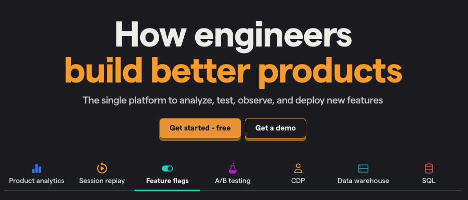
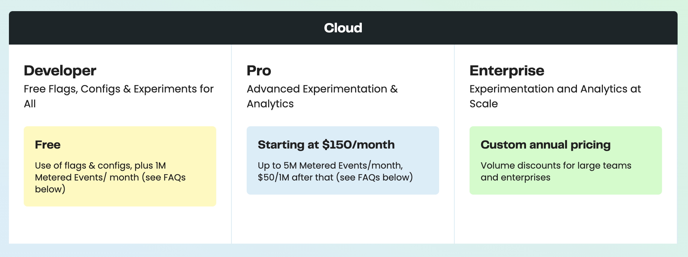
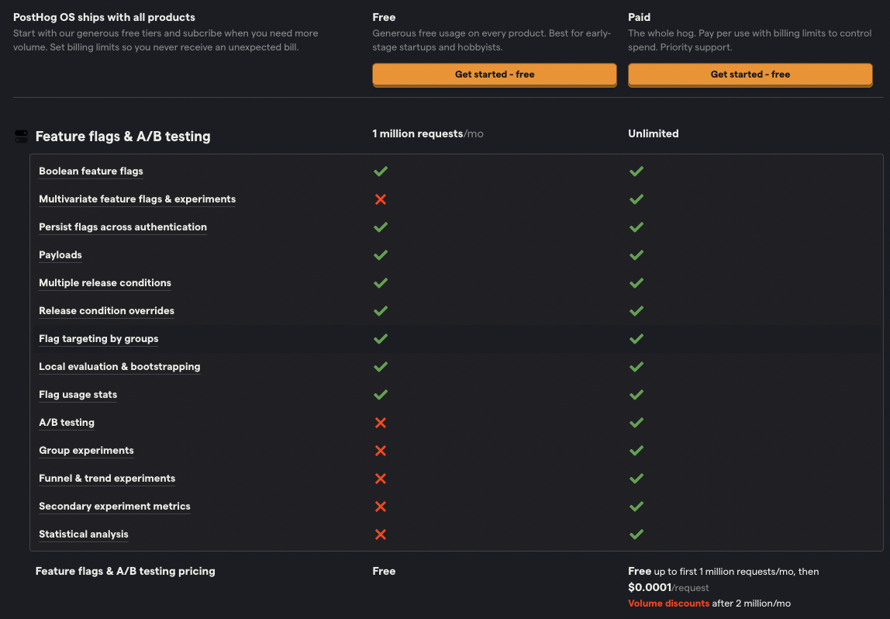

import { ComparisonTable } from 'components/ComparisonTable'
import { ComparisonHeader } from 'components/ComparisonTable/header'
import { ComparisonRow } from 'components/ComparisonTable/row'

PostHog and Statsig both offer A/B testing and feature flags, but they're different in two important ways:

- **Statsig** offers advance experimentation tools, such as multi-armed bandit and holdout testing. It's ideal for data scientists, product managers, and growth teams who need to conduct complex A/B testing.

- **PostHog** is an all-in-one platform built to help engineers understand users and create better products. Beyond [feature flags](/feature-flags) and [A/B testing](/ab-testing), it includes [product analytics](/docs/product-analytics), [session replay](/docs/session-replay), [surveys](/docs/surveys), and more.

This post compares their platforms, experimentation features, pricing, and more.

## How is PostHog different?

### 1. It is an all-in-one platform

PostHog brings together all the tools engineers need for testing, releasing, and measuring the success of new features. Feature flags and A/B testing are only part of a suite of tools PostHog offers.

PostHog combines usage, performance, and behavioral data with flags and experiments. PostHog’s [data warehouse](/docs/data-warehouse) also enables you to pull in data from external sources.

Having all these product and data tools together enables you to do better analysis of shipped features and make better decisions about what you are building next. 

### 2. PostHog is built for engineers

Anyone can use PostHog – just [ask our marketing team](/blog/posthog-marketing) – but PostHog is designed to meet the needs of engineers. Our goal is to help developers [be better at product](/blog/helping-engineers-to-product).

### 3. We’re transparent (in many ways)

PostHog is open source. Our code, culture, and strategy are public [on GitHub](https://github.com/PostHog/posthog) and our [handbook](/handbook). While Statsig open sourced some code (like SDKs), most is closed source.

We're also self-serve. No need to "talk to sales" or "schedule a demo" unless you want to – we're always [happy to chat](/book-a-demo). You can sign up and try all the features PostHog offers for free.

## Comparing PostHog and Statsig

### Platform

<ComparisonTable column1="PostHog" column2="Statsig">
  <ComparisonRow column1={true} column2={true} feature="A/B testing" description="Test changes and analyze impact" />
  <ComparisonRow column1={true} column2={true} feature="Feature flags" description="Roll out features safely; toggle features for cohorts or individuals" />
  <ComparisonRow column1={true} column2={true} feature="Product analytics" description="Track events and conversion; analyze user behavior" />
  <ComparisonRow column1={false} column2={true} feature="Dynamic config" description="Replace hard-coded values in your app with config values" />
  <ComparisonRow column1={true} column2={false} feature="Session replays" description="Watch real users use your product; debug behavior" />
  <ComparisonRow column1={true} column2={false} feature="User surveys" description="Ask users for qualitative feedback and gather responses" />
  <ComparisonRow column1={true} column2={false} feature="Open source" description="Code publicly accessible" />
  <ComparisonRow column1="In beta" column2={false} feature="Data warehouse storage" description="Store large amounts of analytics data" />
  <ComparisonRow column1={false} column2={true} feature="Data warehouse experiments" description="Run A/B tests natively in your existing warehouse" />
</ComparisonTable>

### Experimentation

Both tools enable you to run [A/B/n](/tutorials/abn-testing) and [multivariate](/product-engineers/what-is-multivariate-testing-examples) tests, set custom goals, and calculate statistical significance, but:

- **Statsig** offers some more advanced testing techniques, such as multi-armed bandit, mutually exclusive, and holdout tests. It also lets you choose between Bayesian and Frequentist engines, and supports Bonferroni correction.

- **PostHog** provides a more intuitive user interface and simpler setup process, making it ideal for teams who prefer a more straightforward approach to experimentation, and tight integration with its other powerful tools.

<ComparisonTable column1="PostHog" column2="Statsig">
  <ComparisonRow column1={true} column2={true} feature="Custom goals" description="Customize metrics that a test tracks" />
  <ComparisonRow column1={true} column2={true} feature="Secondary metrics" description="Monitor impact on unrelated metrics" />
  <ComparisonRow column1={true} column2={true} feature="Statistical significance calculation" description="Calculate if changes make a statistically significant impact" />
  <ComparisonRow column1={true} column2={true} feature="Split testing" description="Split participants into groups" />
  <ComparisonRow column1={true} column2={true} feature="Multivariate (A/B/n) testing" description="Test multiple variants of a change" />
  <ComparisonRow column1={true} column2={true} feature="Recommended run time" description="Calculate the recommended run time for your experiments" />
  <ComparisonRow column1="Bayesian" column2="Bayesian, Frequentist" feature="Statistics engine" description="How the results of an experiment are calculated" />
  <ComparisonRow column1="Partial" column2={true} feature="Holdout testing" description="Withhold multiple features to measure cumulative impact" />
  <ComparisonRow column1={false} column2={true} feature="Multi-armed bandit" description="Optimize tests automatically by allocating traffic to the best performing variant." />
  <ComparisonRow column1={false} column2={true} feature="Mutually exclusive experiments" description="Isolate user groups for simultaneous, independent experiments" />
  <ComparisonRow column1={false} column2={true} feature="Bonferroni correction" description="Includes α correction when tests are being performed simultaneously" />
</ComparisonTable>

- **Holdout testing:** It's possible to run a [holdout test](/tutorials/holdout-testing) across multiple A/B tests in PostHog. However, the process is more manual than Statsig's, which has built-in functionality to do this.
  
### Feature management

Both PostHog and Statsig offer most of the functionality you expect for feature management using flags. However, a key difference is that Statsig's feature flags are boolean-based. This means that they primarily support simple on/off toggling of features.

On the other hand, PostHog offers [multivariate flags with JSON payloads](/docs/feature-flags/creating-feature-flags#served-value) (in addition to boolean flags). This provides greater flexibility in testing and deploying different variations of a feature, making them more suitable for complex rollouts.

<ComparisonTable column1="PostHog" column2="Statsig">
  <ComparisonRow column1={true} column2={true} feature="Boolean flags" description="Simple flags returning true or flag" />
  <ComparisonRow column1={true} column2={false} feature="Multivariate flags" description="Flags with multiple customizable values" />
  <ComparisonRow column1={true} column2={false} feature="Payloads" description="Flags with string, number, or JSON payloads" />
  <ComparisonRow column1={true} column2={true} feature="Percentage rollouts" description="Target percentages of a group" />
  <ComparisonRow column1={true} column2={true} feature="Custom targeting" description="Target users based on user properties, custom contexts" />
  <ComparisonRow column1={false} column2={true} feature="Scheduling" description="Schedule flags to turn on or off" />
  <ComparisonRow column1="Partial" column2={true} feature="Environments" description="Manage flags for dev, stage, prod" />
  <ComparisonRow column1={true} column2={true} feature="Bootstrapping" description="Flags available on frontend application load" />
  <ComparisonRow column1={true} column2={false} feature="Early access management" description="Manage betas, test features" />
</ComparisonTable>

### Product analytics

Both PostHog and Statsig offer the functionality you expect from product analytics tools, such as dashboards, graphs, and funnels. However:

- **PostHog** provides deep insights into how users are interacting with your product. It includes features such as lifecycle, stickiness, correlation, and retention analysis.

- **Statsig** does provide some additional insights, such as retention analysis, but its main focus is to use product analytics to set up metrics to run A/B tests on. 

<ComparisonTable column1="PostHog" column2="Statsig">
  <ComparisonRow column1={true} column2={false} feature="Autocapture" description="Capture events without manual logging" />
  <ComparisonRow column1={true} column2={true} feature="Dashboards" description="Combine insights into shareable dashboards" />
  <ComparisonRow column1={true} column2={true} feature="Graphs and trends" description="Build custom insights and visualizations" />
  <ComparisonRow column1={true} column2={true} feature="Cohorts" description="Combine users based on properties and events for group analysis" />
  <ComparisonRow column1={true} column2={true} feature="Group analytics" description="Track metrics at a company level" />
  <ComparisonRow column1={true} column2={true} feature="Funnels" description="Track users through a sequence of events" />
  <ComparisonRow column1={true} column2={true} feature="Retention analysis" description="Visualize which users stay, for how long" />
  <ComparisonRow column1={true} column2={false} feature="User paths" description="Track user flows and where they drop-off" />
  <ComparisonRow column1={true} column2={false} feature="Correlation analysis" description="Suggested events and properties that lead to success or failure" />
  <ComparisonRow column1={true} column2={false} feature="Lifecycle analysis" description="Understand who is dormant, churning, and thriving" />
  <ComparisonRow column1={true} column2={false} feature="Stickiness insights" description="See how many times users perform an event in a period of time." />
  <ComparisonRow column1={true} column2={false} feature="Formulas" description="Use custom formulas to calculate unique insights" />
  <ComparisonRow column1={true} column2={false} feature="Query editor" description="Write your own queries in SQL" />
</ComparisonTable>

### Pricing

Both PostHog and Statsig offer simple, transparent pricing.

**Statsig** has a free plan for up to 1 million *metered events* (a metered event is any feature flag, A/B testing, or logging event). Thereafter, it's $150 per month for up to 5 million metered events, and then $50 per every 1 million events. 

**PostHog’s** prices A/B testing and feature flags separately from product analytics:

-  [A/B testing and feature flag pricing](/pricing?product=feature-flags) is: 
   -  free up to 1 million requests. 
   - **$0.000100** per request between 1-2 million requests – i.e., $100 for 1 million requests.
   - **$0.000045** from 2-10 million requests – i.e. $45 for 1 million requests
   - Progressively cheaper beyond 10 million requests.

-  [Product analytics pricing](/pricing?product-analytics) is: 
   -  free up to 1 million events. 
   - **$0.00031** per events between 1-2 million events – i.e., $310 for 1 million events.
   - **$0.00013** from 2-15 million events – i.e. $130 for 1 million events
   - Progressively cheaper beyond 15 million events.

So PostHog and Statsig are similarly priced for A/B testing and feature flags, although PostHog is more expensive for product analytics.

#### Example scenarios

To give you an idea of what pricing looks like in reality, here are some example situations and their estimated costs for both PostHog and Statsig. 

<table className="w-full mt-4" style="min-width: 600px;">
    <thead>
       <tr>
            <td><strong>A/B testing and feature flag requests</strong></td>
            <td><strong>PostHog cost</strong></td>
            <td><strong>Statsig cost</strong></td>
        </tr>
    </thead>
    <tbody>
       <tr>
            <td>**1,000,000**</td>
            <td>$0</td>
            <td>$0</td>
        </tr>
       <tr>
            <td>**5,000,000**</td>
            <td>$240</td>
            <td>$150</td>
        </tr>
       <tr>
            <td>**10,000,000**</td>
            <td>$460</td>
            <td>$400</td>
        </tr>
       <tr>
            <td>20,000,000</td>
            <td>$720</td>
            <td>$900</td>
        </tr>
    </tbody>
</table>

> **Notes:** You can significantly lower your number of feature flag and A/B testing requests by using [PostHog's backend local evaluation](/docs/feature-flags/local-evaluation), potentially saving you a good amount of money.

<table className="w-full mt-4" style="min-width: 600px;">
    <thead>
       <tr>
            <td><strong>Product analytics events</strong></td>
            <td><strong>PostHog cost</strong></td>
            <td><strong>Statsig cost</strong></td>
        </tr>
    </thead>
    <tbody>
       <tr>
            <td>1,000,000</td>
            <td>$0</td>
            <td>$0</td>
        </tr>
       <tr>
            <td>5,000,000</td>
            <td>$700</td>
            <td>$150</td>
        </tr>
       <tr>
            <td>10,000,000</td>
            <td>$1,350</td>
            <td>$400</td>
        </tr>
       <tr>
            <td>20,000,000</td>
            <td>$2,400</td>
            <td>$900</td>
        </tr>
    </tbody>
</table>

### Integrations

Both PostHog and Statsig have a range of integrations that enable them to import, export, enhance, and make use of data. However, a key difference is that since PostHog is open source, it's possible to [create your own integration](/docs/apps/build).

Below is a sample comparison of PostHog and Statsig's integrations. Be sure to checkout [PostHog's full list of integrations](/cdp).

<ComparisonTable column1="PostHog" column2="Statsig">
   <ComparisonRow column1={true} column2={true} feature="Imports" description="Import data from source" />
   <ComparisonRow column1={true} column2={true} feature="Exports" description="Export data to other sources" />
   <ComparisonRow column1={true} column2={false} feature="Zapier" description="Trigger Zapier automations" />
   <ComparisonRow column1={true} column2={false} feature="Sentry" description="Connect to Sentry data" />
   <ComparisonRow column1={false} column2={true} feature="Datadog" description="Capture flag data in Datadog" />
   <ComparisonRow column1={true} column2={true} feature="Slack" description="Alerts for Slack" />
   <ComparisonRow column1={true} column2={true} feature="Microsoft Teams" description="Alerts for Microsoft Teams" />
</ComparisonTable>

### Security and compliance

Both PostHog and LaunchDarkly enable companies to remain secure and compliant with privacy regulations. Companies can customize the levels of user privacy related to these platforms to their needs.

An advantage of Statsig is that it can be made HIPAA-compliant, while PostHog cannot. This makes Statsig better suited for healthcare companies.

<ComparisonTable column1="PostHog" column2="Statsig">
  <ComparisonRow column1={true} column2={true} feature="User privacy options" description="Anonymize users, drop personal data" />
  <ComparisonRow column1={true} column2={true} feature="History, audit logs" description="Manage and view flag edits and related users" />
  <ComparisonRow column1={true} column2={true} feature="GDPR-ready" description="Can be compliant with GDPR" />
  <ComparisonRow column1={false} column2="Enterprise" feature="HIPAA-ready" description="Can be compliant with HIPAA" />
  <ComparisonRow column1={true} column2={true} feature="SOC 2" description="SOC 2 security certification" />
  <ComparisonRow column1={true} column2={true} feature="2FA" description="Enforce login with two-factor authentication" />
  <ComparisonRow column1="Enterprise" column2="Enterprise" feature="SAML/SSO" description="Use SAML or single sign-on authentication" />
  <ComparisonRow column1={true} column2={true} feature="Approvals" description="Require approvals to change flags" />
  <ComparisonRow column1={true} column2={true} feature="Permissioning" description="Control who can edit and modify flags" />
</ComparisonTable>

## Frequently asked questions

### Who is PostHog useful for?

PostHog is built for startups and their engineers. It provides all the tools startups need to build successful products. The people who find PostHog most useful are founders, [product engineers](/blog/what-is-a-product-engineer), and growth engineers.

Companies that use PostHog feature flags and experiments include [Y Combinator](/customers/ycombinator), [Vendasta](/customers/vendasta), and [AssemblyAI](/customers/assemblyai).

### Who is Statsig useful for?

Statsig is for teams that require advanced experimentation capabilities and more sophisticated statistical methods. It's ideal for data scientists, product managers, and growth teams who need to conduct complex A/B testing.

Teams that frequently run multiple experiments on the same surface concurrently will appreciate Statsig's ability to handle mutually exclusive experiments and implement Bonferroni correction.

### How much does PostHog cost?

Feature flags and experiments are free for up to 1M requests per month. Beyond that, it costs $0.0001/request (or $1 per 10,000 requests). There are discounts for high-volume users, non-profits, and [startups](/startups). 

Other products, like product analytics and session replay, have separate but similarly structured [pricing](/pricing). 

### How much does Statsig cost?

Statsig is free up to 1M requests per month. Thereafter, it's $150 per month for up to 5 million metered events, and then $50 per every 1 million events thereafter.

### Does PostHog offer discounts for nonprofits and startups?

Yes, PostHog offers both. Nonprofit organizations can contact our team and are usually eligible for a 50% discount, while startups can sign up for $50,000 of free credit (and a host of other perks) in the [PostHog for Startups program](/startups).

<ArrayCTA />
