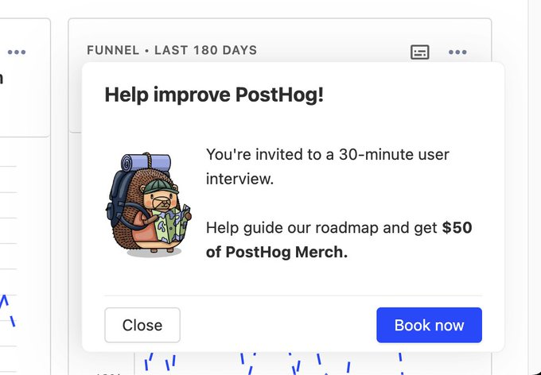
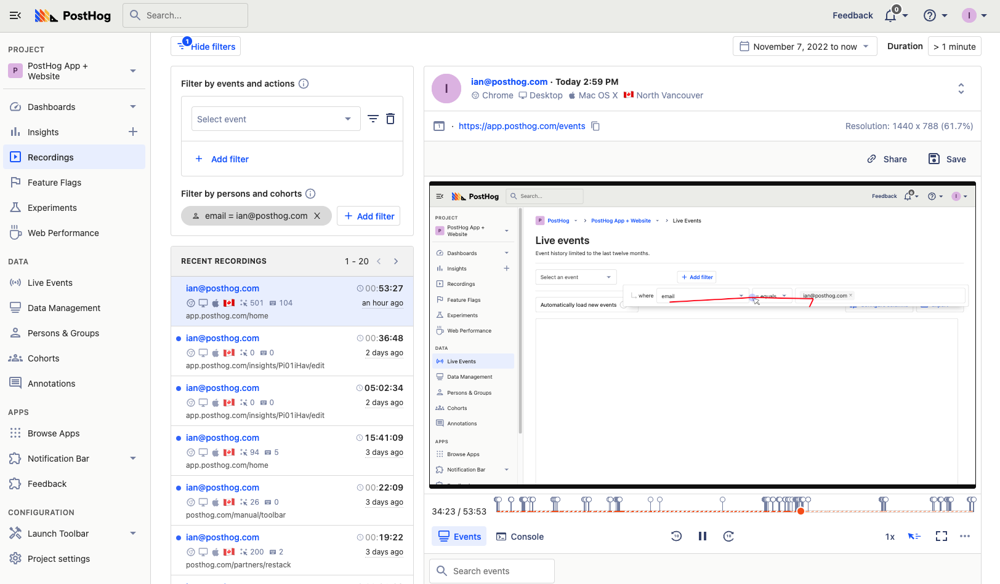
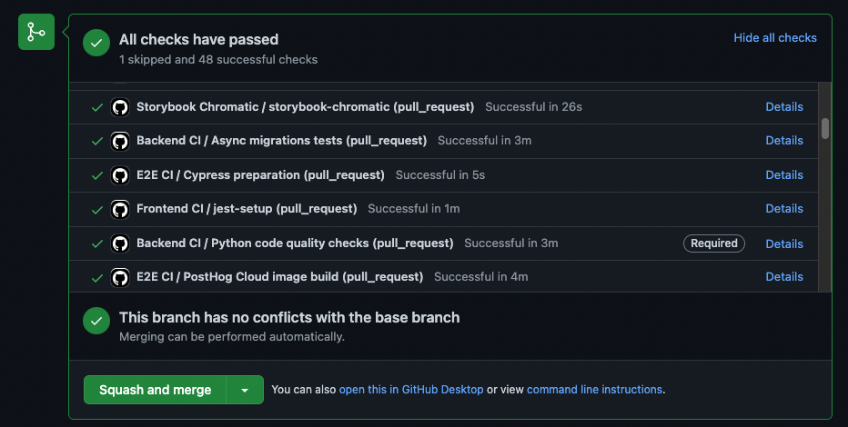
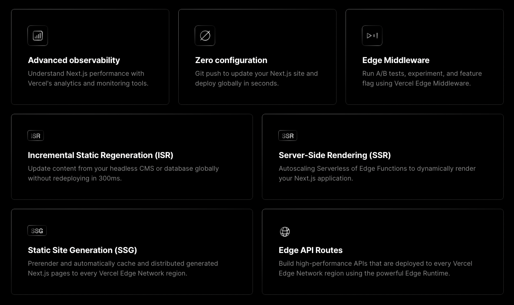
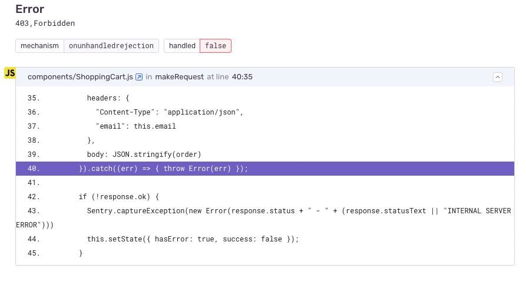

Like every role, [product engineers](/blog/what-is-a-product-engineer/) have a set of essential tools for their work. These tools are a mix of engineering and product, streamlined to their use case. They help get insights from users, ship improvements quickly and maintain quality along the way.

This post goes over the 6 essential tools product engineers use to accomplish their goals, from talking to users to ownership of issues in production.

## Tools for talking to users

Core to product engineers' success is a focus on users. This means they must talk to them. The tools for doing this aren’t groundbreaking, but they are useful for accomplishing the goal of building a product users' value.

To talk with users, product engineers use tools like Zoom, Google Meet, Slack (especially shared channels), [Superhuman](https://superhuman.com/), [Cron](https://cron.com/) (calendar), Calendly, and [SavvyCal](https://savvycal.com/). They also take advantage of automation by using tools like [customer.io](https://customer.io/), aha.io, [n8n.io](https://n8n.io/), and Zapier.

<Caption>We use a combination of Zapier, customer.io, Calendy, feature flags, and our <a href="https://github.com/PostHog/user-interview-app">interview app</a> to automate scheduling user interviews.</Caption>

Unlike product managers, survey tools aren't used by product engineers. The data received from surveys is too indirect to be useful. Getting general information about users is valuable to the product and marketing teams, but product engineers must focus on direct feedback on what they are building.

## Tools for understanding user behavior

Product engineers supplement talking to users with product analytics and usage data. This data enables the measurement of their work's impact and the discovery of areas for improvement. It is useful for setting goals, measuring key results, and prioritizing future work.

For example, a product engineer sets an OKR to increase feature usage by paid users. They need data to both measure the usage of the feature and the areas surrounding the feature. With this, they can analyze the feature usage conversion, retention, correlated behavior, and more.

[PostHog](/product#top-features) has a suite of product analytics tools that are perfect for this. Product engineers (like [Y Combinator’s](/customers/ycombinator)) use PostHog to capture, organize, analyze, and visualize product usage data. PostHog also has session recordings for going into the details of an individual’s experience with the product.

<Caption>PostHog's <a href="/product/session-recording">session recordings</a> visualize what users are actually doing in your product</Caption>

On top of PostHog, customer data platform or ETL tools like [Segment](/docs/integrate/third-party/segment), [Hightouch](/blog/hightouch-posthog-reverse-etl-integration), [Airbyte](/docs/apps/airbyte-export), Integrate.io, and Fivetran are often used to move and combine data between sources and storage locations. This allows product engineers to have the data they need, where they need it.

## Tools for organizing knowledge and priorities

Once insights are gathered from users and data, ideas should form on what is impactful to build. All this research and analysis is wasted if it does not lead to shipping better products.

Note-taking and task management tools help with this, but many can also weigh individuals and teams down. They introduce unnecessary work that gets in the way of shipping products that help users (**cough** Jira). The ones for product engineers ideally don’t do this.

An example specifically built for product engineers is [Linear](https://linear.app/). Linear is a task management app focused on helping teams build great products. It does this by having engineer-focused design and functionality, while still being a product tool. In practice, this means being keyboard first, streamlined for technical use cases, automations, and quick page speeds.

<Caption>The benefits of Linear built specifically for product engineers.</Caption>

Like the “talking to users” tools, many of these tools won’t be shocking to you. Other note-taking and task management tools product engineers rely on include GitHub, Google Docs, Trello, Notion, Asana, and Coda. 

## Tools for going fast with CI/CD and testing

Successful product engineers ship new features to users fast. This not only means writing code but integrating with existing code and deploying. Teams are often shipping multiple updates per day. They need a strong continuous integration and deployment pipeline (CI/CD) to ensure the transition from local development to production goes smoothly.

Tools used for this include GitHub, GitLab, CircleCI, Jenkins, Docker, [Depot](https://depot.dev/), [codefresh](https://codefresh.io/), and more. All of these tools help engineering teams ship code to end users faster, perfect for succeeding as product engineers.

Because they ship fast, product engineers also must make sure they aren’t breaking things. They likely don’t have the time or resources for a dedicated QA team so they rely heavily on automated testing in its place. Implementing test frameworks like [Jest](https://jestjs.io/), [Cypress](https://www.cypress.io/), and [Playwright](https://playwright.dev/) are all critical for product engineers to continue moving fast.

<Caption>We use GitHub Actions to run our Cypress, Jest, Django, and Storybook tests to ship fast while maintaining quality.</Caption>

Even with all this preventative work, breaking changes can still happen. Feature flags help prevent this. Luckily, if you’re using PostHog for analytics, you can also use it for feature flags to help roll out and roll back changes quickly.

## Tools for automating away infrastructure work

Along with CI/CD is the automation of infrastructure work. Product engineers want to ship fast, and dealing with optimizing infrastructure prevents this. They care more about spinning up new infrastructure quickly compared to optimizing it.

Many infrastructure-as-a-service companies exist, including the big ones like Google Cloud, AWS, Cloudflare, Heroku, and Azure. They are many alternatives to these that product engineers might prefer because of their deployment speed and tailored use cases. These include [Netlify](https://www.netlify.com/), [Render](https://render.com/), [fly.io](http://fly.io), [Vultr](https://www.vultr.com/), and [Railway](https://railway.app/).

A trend that appeals to product engineers is bringing the code framework and infrastructure closer together, optimizing both for each other. The best example of this is [Vercel](https://vercel.com/), which also develops the [Next.js](https://nextjs.org/) framework popular with product engineers. Vercel helps deploy highly performant frontend code fast and is tightly integrated with Next.js to maximize benefits from the framework's design.

<Caption>The benefits of integrating infrastructure and code from Vercel and Next.js.</Caption>

Other examples of these code and infrastructure combos include [Supabase](https://supabase.com/), [PlanetScale](https://planetscale.com/), and [Hasura](/customers/hasura). They abstract away infrastructure work while providing speed and tailored offerings. Software engineers and large teams might find their limited customization and options constraining, but product engineers love them.

## Tools for owning bugs and incidents

As Uncle Ben from Spiderman once said “with great product power, comes great product responsibility” (I’m paraphrasing). Ownership over the complete product experience is important for product engineers. This means they are responsible for bugs, issues, and incidents in their product.

They have tools to help them with this. These include:
- [Grafana](https://grafana.com/), [Better Stack](https://betterstack.com/), [Metabase](https://www.metabase.com/), and more provide observability into issues in your code. 
- [Sentry](https://sentry.io/welcome/) and [LogRocket](https://logrocket.com/) monitor errors. 
- [Incident.io](http://Incident.io) and [PagerDuty](https://www.pagerduty.com/) help teams respond to incidents when they happen.

<Caption>Sentry provides multiple tools (including stack traces) for monitoring errors and problems in your code.</Caption>

Product engineers are reliant on these tools because they are responsible for the products they ship. They don't have other members of the team dedicated to dealing with issues. Making sure they keep track of performance and deal with issues effectively is vital.

## What is the point of all these tools?

The point of all of these tools is to help product engineers ship better products that solve users’ problems and provides them value faster. If the tools aren’t helping product engineers do this, they aren’t doing their jobs.

Using all the tools we listed here is overkill. Product engineers shouldn't be product managers, and ensuring that is tied to is limiting the amount of time in these tools. The major of a project engineer's time must be dedicated to writing and shipping code.

Many of the tools trade customizability (and money) for speed and specificity. Software engineers, especially in large organizations, won’t accept this trade, but product engineers will. The process of shipping fast, iterating, breaking (and fixing) code along the way is core to what product engineers do. It is core to how successful products get built. 

## Further reading

- [What is a product engineer (and why they matter)](/blog/what-is-a-product-engineer/)
- [Startups, stop treating engineers like a different species](/blog/stop-treating-engineers-differently)
- [Product engineer vs software engineer: what's the difference?](/blog/product-engineer-vs-software-engineer)