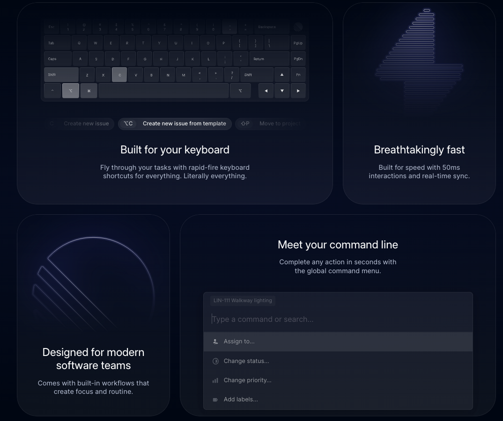

Building tools for [product engineers](/blog/what-is-a-product-engineer/) is a big trend right now. Every week brings a flashy launch of a new tool intersecting product and engineering. This is because building a great product users value is a proven way to succeed as a business. Helping product engineers make this happen is valuable.

Tools for product engineers differ from both the tools for software engineers and product managers. The engineering tools focus on speed and automation rather than the traditional customization and stability. The product tools are streamlined for technical users, rather than being an all-encompassing “business tool.”

This post will go over the tools built and used to help product engineers accomplish their work of building great products for users, from the beginning stages of talking to users all the way to maintaining ownership over issues and bugs in production.

## Tools for talking to users

Product engineers are more focused on users than traditional software engineers are. This means they must talk to them. The tools for doing this aren’t groundbreaking, but they are useful for accomplishing product engineers’ goal of building product users value.

To talk with users, product engineers use tools like Zoom, Google Meet, Slack (especially shared channels), [Superhuman](https://superhuman.com/), [Cron](https://cron.com/) (calendar), Calendly, and [SavvyCal](https://savvycal.com/). They also take advantage of automation by using tools like [customer.io](https://customer.io/), aha.io, [n8n.io](https://n8n.io/), and Zapier.

Unlike product managers, product engineers don’t use survey tools. The data received from surveys is too indirect to be useful. It might be valuable for product and marketing teams to get a general idea of users, but product engineers focus on direct feedback on what they are building.

## Tools for understanding user behavior

Product engineers supplement talking to users with product analytics and usage data. This data enables them to measure the impact of their work and discover new areas for improvement. It helps them set goals, measure key results, and prioritize future work.

For example, a product engineer sets an OKR to increase feature usage by paid users. They need data to both measure the usage of the feature, and areas surrounding the feature. With this, they can analyze conversion to using the feature, feature retention, correlated behavior to feature usage, and more.

[PostHog](/product#top-features) has a suite of product analytics tools that are perfect for this. Product engineers (like [Y Combinator’s](/customers/ycombinator)) use PostHog to capture, organize, analyze, and visualize product usage data. PostHog also has session recordings for going into the details of an individual’s experience with the product.

On top of PostHog, product engineers often use customer data platform or ETL tools like [Segment](/docs/integrate/third-party/segment), [Hightouch](/blog/hightouch-posthog-reverse-etl-integration), [Airbyte](/docs/apps/airbyte-export), Integrate.io, and Fivetran to move and combine data between sources and storage locations. 

## Tools for organizing knowledge and priorities

Once product engineers talk with users and analyze usage data, they should be starting to form ideas on what is impactful to build. All this research and analysis is wasted if it does not lead to shipping better products.

Product engineers use note-taking and task management tools to help them with this. Many of these tools can weigh teams down and introduce unnecessary work that gets in the way of shipping products that help users (**cough** Jira). The tools for product engineers ideally don’t do this.

An example specifically built for product engineers is [Linear](https://linear.app/). Linear focuses on helping teams build great products. It does this by having engineer-focused design and functionality, while still being a product tool. In practice, this means being keyboard first, streamlined for technical use cases, and fast loading and usage speeds.

Like the “talking to users” tools, many of these tools won’t be shocking to you. Other note-taking and task management tools product engineers use include GitHub, Google Docs, Trello, Notion, Asana, and Coda. 

## Tools for going fast with CI/CD and testing

Product engineers want to ship new features to users fast. This not only means writing code but integrating with existing code and deploying. Product engineering teams are often shipping multiple updates per day. This means they need a strong continuous integration and deployment pipeline (CI/CD) to ensure the transition from local development to production goes smoothly.

Tools used for this include GitHub, GitLab, CircleCI, Jenkins, Docker, [Depot](https://depot.dev/), [codefresh](https://codefresh.io/), and more. All of these tools help engineering teams ship code to end users faster, perfect for what product engineers are trying to do.

Because they ship fast, product engineers also must make sure they aren’t breaking things. They likely don’t have the time or resources for a dedicated QA team so they rely heavily on testing in its place. Test frameworks like [Jest](https://jestjs.io/), [Cypress](https://www.cypress.io/), and [Playwright](https://playwright.dev/) are all critical for product engineers to continue moving fast.

Even with all this preventative work, breaking changes can still happen. Feature flags help prevent this. Luckily, if you’re using PostHog for analytics, you can also use it for feature flags to help roll out and roll back changes quickly.

## Tools for automating away infrastructure work

Along with CI/CD is the automation of infrastructure work. Product engineers want to ship fast, and dealing with optimizing infrastructure prevents this. They care more about spinning up new infrastructure quickly compared to optimizing it.

Many infrastructure-as-a-service companies exist, including the big ones like Google Cloud, AWS, Cloudflare, Heroku, and Azure. Product engineers might be inclined to use services like [Netlify](https://www.netlify.com/), [Render](https://render.com/), [fly.io](http://fly.io), or [Railway](https://railway.app/) which focus on frontend and web products as well as the speed of deployment rather than depth of customization.

A trend that appeals to product engineers is bringing the writing of code and deployment of code closer together. The best example of this is [Vercel](https://vercel.com/), which also develops the [Next.js](https://nextjs.org/) framework popular with product engineers. Vercel helps deploy highly performant frontend code fast and is tightly integrated with Next.js to maximize benefits from its design.

Other examples of these code and infrastructure combo include [Supabase](https://supabase.com/), [PlanetScale](https://planetscale.com/), and [Hasura](/customers/hasura). They abstract away infrastructure work while providing speed.  Software engineers and large teams might find their limited customization and options constraining.

## Tools for owning bugs and incidents

As Uncle Ben from Spiderman once said “with great product power, comes great product responsibility” (I’m paraphrasing). Ownership over the complete product experience is important for product engineers. This means they are responsible for bugs, issues, and incidents in their product.

They have tools to help them with this. Tools like [Grafana](https://grafana.com/), [Better Stack](https://betterstack.com/), [Metabase](https://www.metabase.com/), and more provide observability into issues in your code. [Sentry](https://sentry.io/welcome/) and [LogRocket](https://logrocket.com/) monitor errors. [Incident.io](http://Incident.io) and [PagerDuty](https://www.pagerduty.com/) help teams respond to incidents when they happen.

Product engineers are reliant on these tools because they are less likely to have other members of the team dedicated to dealing with issues. Making sure they keep track of performance and deal with issues effectively is vital.

## What is the point of all these tools?

The point of all of these tools is to help product engineers ship better products that solve users’ problems and provides them value faster. If they aren’t helping product engineers do this, they aren’t doing their jobs.

We listed a lot of tools here, and using all of them is overkill. Ensuring product engineers don’t become product managers is important, and tied to that is limiting the amount of time spent in these tools. They must dedicate most of their time to writing and shipping code.

Many of the tools trade customizability (and money) for speed. Software engineers, especially in large organizations, won’t accept this trade, but product engineers will. The process of shipping fast, iterating, breaking (and fixing) code along the way is core to what product engineers do. It is core to how successful products get built. 

## Further reading

- [What is a product engineer (and why they matter)](/blog/what-is-a-product-engineer/)
- [Startups, stop treating engineers like a different species](/blog/stop-treating-engineers-differently)
- [Product engineer vs software engineer: what's the difference?](/blog/product-engineer-vs-software-engineer)