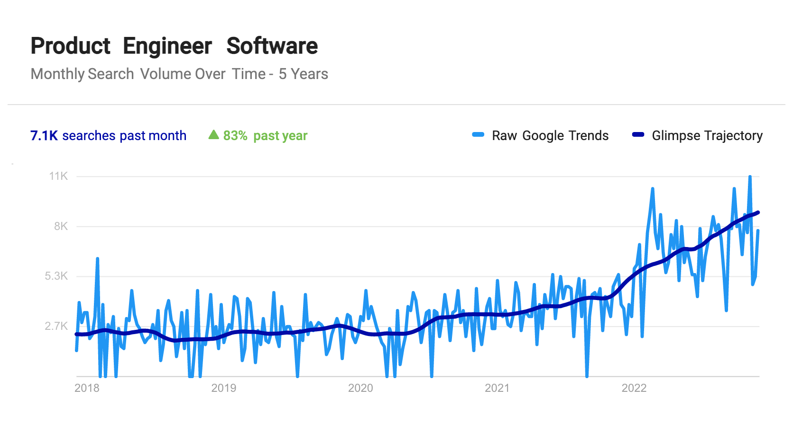

Software companies are changing. Where once product managers and software engineers dominated, now a new role is emerging: the [product engineer](/blog/what-is-a-product-engineer).

Want proof? Look at this graph:

Online searches for product engineers have grown over 80% in the last year and are 3x greater now than just two years ago.

Product engineers are changing the way companies think about engineering. To help explain why, we’ll compare the role of product engineer with the traditional (and still very necessary) role of full-stack software engineer.

## How are product and software engineers different?

Here's the TL;DR: 
- Product engineers focus on building great products.
- Software engineers focus on building great software.
- But they both write and commit code.

Let's break those points down a bit more.

Product engineers own the product and are responsible for its successes and failures. They're empathetic towards users and care about solving their problems. They build with the user in mind and create what users need for success.

In contrast, software engineers own the code they write. They care more about solving technical problems, optimizing systems, and writing clean, secure code. They have flexibility with implementation, but they aren’t making product decisions.

Product engineers are less focused on implementation and focus more on solving the users’ problems. In this way, they are pragmatic. They are willing to build fast, iterate, or even from scratch if needed.

Software engineers are more idealistic. They look for the best solution to the problem in front of them, focus on best practices, and build off prior work. Security, risk, and scaling weigh heavier in their minds.

## How do they spend their time?

Product engineers still spend the majority of their time coding, but they have responsibilities outside of coding that software engineers don't.

Product engineers also spend their time talking to customers, digging into usage data, and researching the competitive landscape. They test other products, build prototypes, and brainstorm experiments to make their product better.

They spend time communicating with users, their team, and other members of the company. They communicate what they learned in research, why their work relates to that research, and how to prioritize what to work on next. They own the product roadmap, and this comes with a responsibility to communicate it.

Software engineers focus on writing code, testing it, and maintaining it. They look for ways to optimize code, improve scalability, and solve bugs. They are deeply focused on specific areas of technology, whether that is databases, data pipelines, backend APIs, or client-side app frameworks. This means researching and reading documentation, updates, and code.

## What do their teams and companies look like?

Product engineers are often a part of smaller teams, where they must do more themselves. Startups, and earlier-stage companies that require people to do more, are often looking for product engineers (even if they don’t say it). They need people who can own large decisions and ship quickly. Product engineers fit this need.

Software engineers are part of larger teams, usually spread out across multiple teams. They have a team to support them, so they can specialize. Their team might include designers, product managers, and marketers. This allows them to think less about if what they are building is right, and more about the implementation.

At the end of the day, it’s up to the company and team to decide what roles they need. There are always debates about what the right structure and right roles are. Product engineers and software engineers both have their place in the tech world. It all comes down to the goals of the team and the needs of the customers.

## What’s right for you?

As a person, if owning a product and its roadmap as well as responsibility for its success or failure interests you, then product engineering might be for you. If you want to focus on solving difficult technical problems and optimizing existing technologies and processes, then software engineering might be a better choice.

There isn’t a right answer, and roles change as companies change. It is possible a product engineer to focus on a specific area and becomes a software engineer as a company grows. It’s also possible for software engineers to join new teams or companies and take on a product engineering role.

As a company, having software engineers appeals to companies with a large-scale or complex products. Software engineers can focus deeply on specific areas of technology and are great for optimizing systems.

Startups or companies that want to be agile and move fast, should look for product engineers. Product engineers have a holistic view of the product and the ability to move fast when the need arises.

Picking what is right is up to the company and its culture. If focusing on building great products is a priority, product engineers might be a better choice. If scaling and building expertise throughout the company is a focus, then software engineers are likely better. Companies with both types of roles have succeeded and more will continue to succeed.

## Further reading

- [What is a product engineer (and why they matter)](/blog/what-is-a-product-engineer/)
- [Startups, stop treating engineers like a different species](/blog/stop-treating-engineers-differently)
- [The really important job interview questions engineers should ask (but don't)](/blog/what-to-ask-in-interviews)