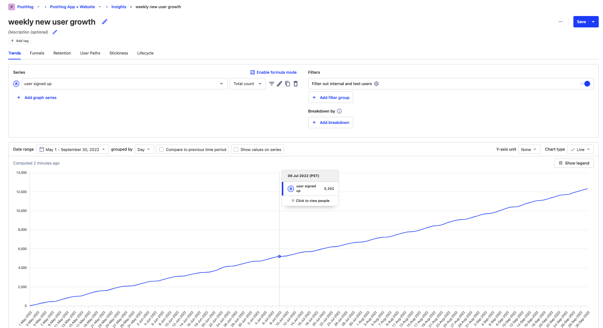
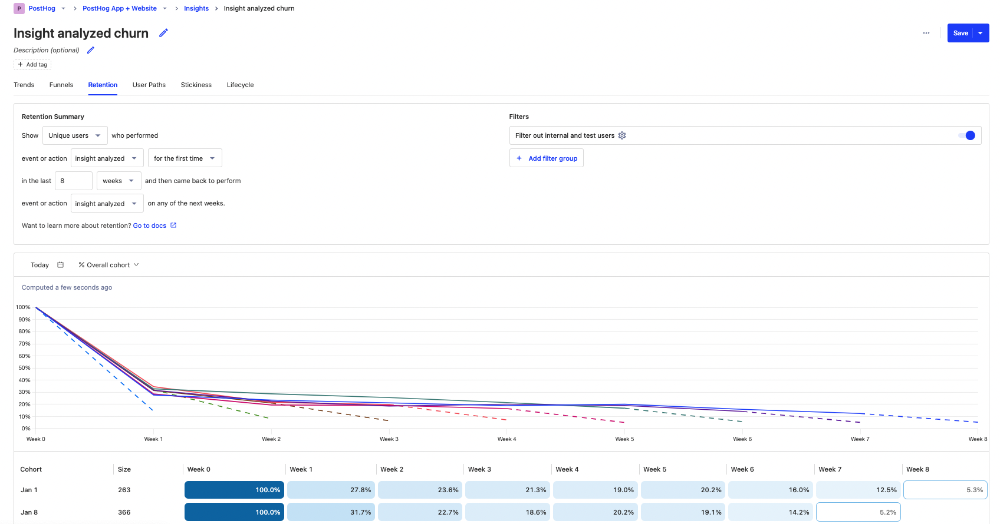
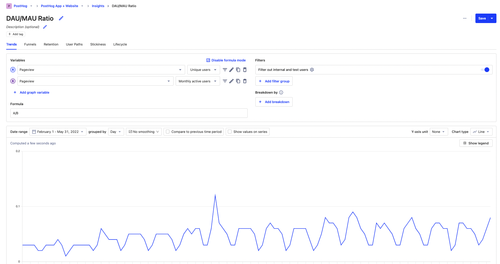
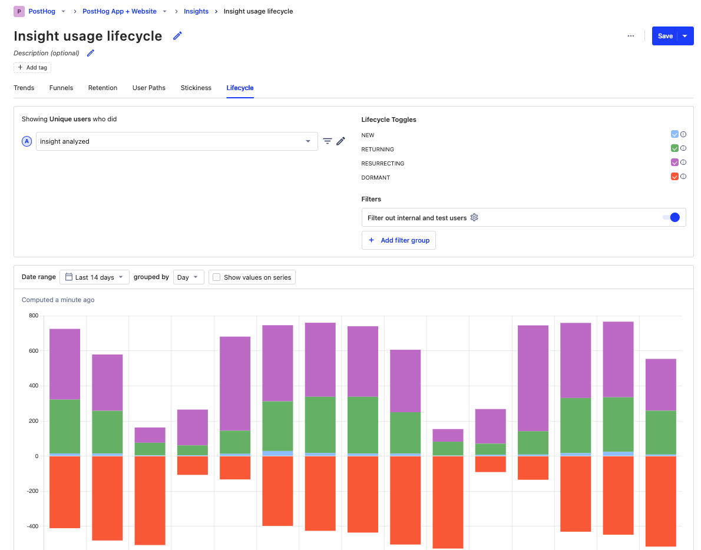
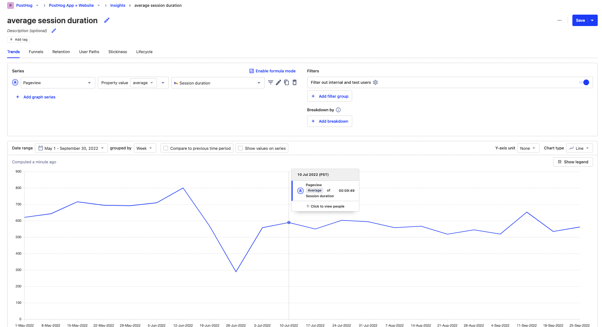

A product is a complicated system you want to keep healthy. Product health metrics help you understand what parts of your product are working as expected and what parts need interventions to make them healthy.

In this guide, I'll cover:

1. What is a product health metric?
2. Common product health metrics
3. How to choose the right product health metrics

## What is a product health metric?

If you think of a product like a human body, then product health metrics are the vital signs. They are the body temperature, blood pressure, pulse rate, and respiration rate of a product. They help you constantly judge how your product is doing and show the impact of changes, updates, and the environment.

Product health metrics are usually steady. Dramatic changes are a bad sign. Just like a spike in your body temperature means you are sick, a spike in a product health metric means there's a problem. If a dramatic change doesn't prompt a change in your development or strategy, your health metric isn't good. A doctor is useless if you never listen to them. A good product health metric is a summary of a product, so it must be abstract enough to remove unnecessary details, but detailed enough to provide actionable information.

Companies aim to improve product health metrics over the long term. Like how consistently exercising improves your pulse and respiration rates, adding enhancements and fixing bugs improve your product health metrics. Because of this, these metrics update in real-time with changes measured over days, weeks, or months. For example, a metric might be down for the week, which triggers a minor adjustment in focus for next week. It can at the same time be up for the month, which means your product is improving. 

Mature products generally care more about health metrics. [Early-stage companies](/blog/early-stage-analytics) are searching for product fit, which often necessitates big changes or pivots that require radically different product health metrics. It doesn’t mean the product is "sick," it means they haven’t figured out what "healthy" means yet, and are looking for ways to particularly those trying to [measure product-market fit](/blog/measure-product-market-fit).

## Common product health metrics

Product health metrics largely fit into three categories:

1. Adoption
2. Engagement
3. Retention

### New user growth (adoption)

A healthy product grows consistently. What "consistent" means depends on the industry. For example, a consumer app expects more users to signup than a complicated B2B SaaS platform. What’s true about both of them is they want the growth to continue. Like a body, if new cells stop being created, that has consequences for your health.

If growth is slowing, your product, positioning, or strategy might need to change. It is a sign:

- your product isn’t appealing enough to your target users
- you have the wrong features for your users
- you aren’t targeting the right users

### Churn rate (retention)

[Churn rate](/blog/customer-churn-analysis-guide) is the rate users stop using the product. When a user churns, it means they haven’t returned to use the product recently. As a product health metric, churn lets you know whether users are leaving your product. 

Churn rate is a key metric for many products and businesses. For SaaS or products relying on recurring usage (and revenue), churn might be the most important metric. This is because it is one of the key drivers of revenue and growth (along with new user growth).

Some products have a naturally high churn, so having a high churn rate isn’t always a bad sign. A dramatic increase in churn is a bad sign though. It means something has changed significantly with your product and should inspire an intervention.

### Daily, weekly, and monthly active users (engagement)

Between new user growth and churn rate is active users. This is a measure of users using your product calculated on a daily, weekly, or monthly basis.

Consistent growth in active users means:

- signups are continuing
- you are keeping users engaged
- users aren’t leaving

Doing a ratio of these values such as DAU/MAU can also be useful. This helps you understand how frequently people are engaging with the product and the "intensity" of this usage. You can use PostHog’s formula mode to calculate this. 

### Feature usage (engagement)

Having users is great, but you want them to actually use your product. Measuring feature usage helps you do this. This is tracking the usage of parts of your product, such as creating, analyzing, or sharing content. Feature usage is a more specific health metric than new user growth or churn rate. It shows the health of specific features, which enables it to be more actionable.

A way to do this is with the lifecycle insight. It enables you to see new, returning, and resurrected usage of the feature as well as how many users have gone dormant.

Feature usage helps you understand the health of individual parts of your product. Like the body, if you heal the "sick" parts, the whole is healthier. Feature usage improves prioritization by aligning development time with usage.

### Session duration (engagement)

Depending on the product, session duration, or its average, are useful product health metrics. It is a general measurement of user engagement. It shows if users are spending significant time in your product. If this changed significantly, something shifted in your app to cause users to spend less time there.

For products reliant on power users, the extremes of session duration can be more important. As average users are not your target users, the average session duration can be misleading. Improving power user session duration shows there is high demand for your product, people are reliant on it, and that can lead to more success.

For utilities, seeing the average session duration _go down_ can be a good sign. This is because your product is becoming more efficient at doing what users want it to do. Saving people time is worth money, and if this is your goal, then making sure your health metrics align helps make it happen.

## How to choose the right product health metrics

Picking the right product health metric goes back to what makes a good one. It must be something you want to:

- improve slowly, but a dramatic change would cause concern and intervention.
- monitor in the short run (daily, weekly) and improve in the long run.
- know and track because it makes a difference in the quality of the product and experience for users.

As examples, let's go over some types of products and look at what a good health metric might be for them:

- **Subscription B2C:** Need high growth in new user growth and always be aware of churn rate and cohort retention because both are likely to be high. If you see good signs in extreme session duration and daily and weekly active users, you're on your way to [product-market fit](/blog/product-market-fit-game).

- **Ad-based B2C:** The more time users spend in the app the better. It means more content created and ads shown. Average session duration, DAU/MAU intensity, and daily and weekly active users are all ways of monitoring this.

- **Marketplaces:** Need to see engagement on both sides of the marketplace, users don't matter as much as listing and sales do. Feature usage (listing, buying), supplier and buyer lifecycle (check both reoccur and return), and new supply growth all provide insights into a marketplace's product health.

- **B2B SaaS:** Care about organizations more than users, the bigger the organization the better. Should keep an eye on new organization growth, feature usage, and organization churn rate to ensure they are targeting and engaging the right organizations with their product.

- **B2B Usage/User-based:** When you are usage-based, you care more about feature usage, average session duration, and daily and weekly active users. Large users will drive a significant amount of the revenue, so ensuring they are happy is key.

Choosing the right level of detail is also important. 

- Too specific causes the metric to not be representative of the product’s health. For example, pricing page conversion likely has more to do with what's on the page than what's in the product.

- Too broad means the metric isn’t actionable and makes it unclear what interventions you can do to improve an issue. For example, it's unclear what you build now to raise pageviews or unique sessions.

Connecting health metrics to OKRs helps make them specific and actionable. It also creates ownership that helps the product improve. Improving the product, and users’ experience with it, is what health metrics should ideally do. If they aren’t, like a diet that doesn’t see results, it’s a sign to rethink your health regime towards something that helps your product improve.

## Further reading

- [The most useful B2B SaaS product metrics](/blog/b2b-saas-product-metrics)
- [Finding your North Star metric and why it matters](/blog/north-star-metrics)
- [What is real user monitoring (and how to set it up)](/blog/real-user-monitoring)
