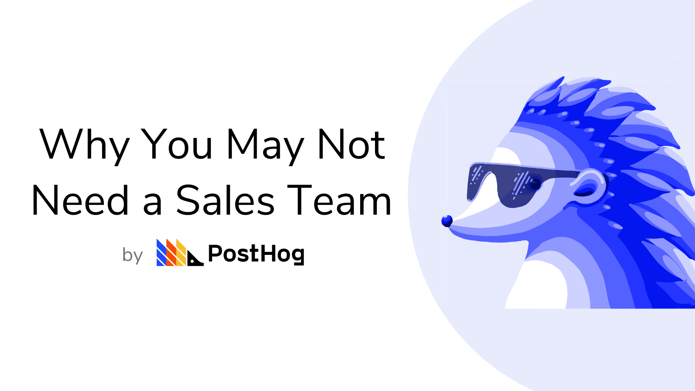

<!--  -->

Let's say you are the founder of a new tech startup. 

A few months back, you and a couple of friends (all developers) built an amazing tool and have now received some Seed funding. 

As a result, you're under some pressure to grow. You took a few million from some VCs here and there, and they want to see some results.

Since the realization of needing to grow hit you, you've started to lose some sleep. 

Before, you were just a group of friends working your ass off to build an amazing product. Now, you actually have to focus on selling it too.

You call in a founders meeting to discuss next steps, and a conclusion is reached: you can't spend all your budget on engineers, which is what you wanted to do. 

Instead, you need to hire some Sales people. Or some Marketing people. Or both. Whoever can get you some users that pay for your product. Or do you?

## Getting People to Pay You

VC funding or not, all startups will eventually need to get paid for what they do. 

Irrespective of how cool your idea is, or how helpful it may be, if you're not getting money in, you can't push it forward. 
You need customers.

Traditionally, there are two ways to do this: Sales and Marketing.

Let's take a quick look at how they work.

### Sales-led Growth 🤝
Sales involves actively going after potential customers and getting them on board with your product or service. This can be done in a variety of ways, from cold calls to leveraging leads. 

Essentially, the assumption is that there are people out there who are willing to pay you for what you do, so you need to do your best to find them and get them to pay you.

### Marketing-led Growth 📈
While often paired up with Sales, and sometimes even used interchangeably, Marketing is, in some ways, the opposite of Sales. 

A Sales strategy generally involves going out and finding the customer, while Marketing is, in many ways, about making sure the customer comes to you.

This involves a wide variety of aspects, from branding, to social media, and, of course, ads. The goal here is that your business is seen. But not just that - it's also about being seen by the right people and seen in a positive light.

With that sorted, the objective is that the customer will come to you, so you won't need to go after them.

### It's Not Black or White
Sales and Marketing are not mutually exclusive. In fact, they are often paired together. Marketing, for example, is a broad field and is essential for any business. 

Sales, on the other hand, doesn't necessarily need to be an aggressive outbound process. It may also consist of having people trained and ready to close a deal one the customer engages with you via an inbound request. 

Nevertheless, the point is that your company does not need to solely focus on one approach or the other, but it is good to know which strategy you expect to lead your actual growth.

To understand these traditional growth strategies, it may be useful to think of a funnel:

With Marketing, the goal is to increase the number of people going through the funnel, whereas Sales should improve the conversion rates from one step to another. 

## The Underrated Alternative

There are various benefits to Sales-led and Marketing-led growth strategies, and they are still widely used today. 

However, a new approach has been gaining traction in the past few years, called Product-led Growth (PLG).

### Let your product do the talking
With Product-led Growth, the idea is that rather than bringing users through an active sales team or aggressive marketing campaigns, you just focus on building your product - and ensure you make it great.

The concept is based on the assumption that if you build something that is useful and works well, the users will eventually come to you as result.

As such, your primary objective should be to make something truly amazing, rather than portray your product as amazing (which is what great Sales and Marketing people can do).

## The Key is in the DNA

While this "strategy" sounds more like common sense than a methodical approach, there's more to Product-led growth than meets the eye.

To truly succeed as a business that drives growth primarily through its product, this concept needs to be built into the company culture.

While Sales and Marketing can often work well as segregated teams that draw from the product but operate independently in practice, focusing on building a product is an organization-wide effort.

As PLGC put it, different teams often operate in different wavelengths, but with Product-Led Growth, you need everyone to converge into one single wavelength: user experience. 

At PostHog, we follow a Product-led Growth approach. And we'll tell you, this has implications for all areas of the company:

### Sales

Don't make a sale if your product is not a good fit for the customer. 

From the first paragraph of PostHog's Handbook Sales page:

<blockquote>
"Always focus on delivering what the customer needs. Sometimes that will mean sending them to a competitor or turning them down."
</blockquote>

Yes, this is literally an official guideline for doing Sales at PostHog.

### Team
If you're a software company, PLG might mean opting for more Engineers than Sales people, for instance. In our case, we still don't have a single person doing Sales or Marketing exclusively. Almost our entire team is made up of Engineers, including people not working day-to-day on our codebase. 

More than with other approaches, you also need to make sure your hires are individuals who understand and are passionate about the product, as well as are proactive in making it better. 

Your Sales people shouldn't cut corners to close a deal, and the Marketing team should focus on highlighting the product you built, not the brand you are. Your brand is the product.

### Communication
Listen to your users on everything.

Built something? Get feedback. New idea? Get feedback. Launched a release? Get feedback.

As one of our core devs put it following interviews with users about a new feature he built: "Your assumptions are mostly wrong. Talk to people to correct them".

When generating growth primarily through Sales or Marketing, the segregation between the people who are building the product and those selling it can lead to diversion between what users want and what is being offered to them.

When focusing on the product, you should always be touching base with your users, and be willing to drop features you love if they don't feel the same way.

### Priorities

At PostHog, our methodology is:

<blockquote>
"If we keep our team first and users second, then our investors will take care of themselves!"
</blockquote>

Users are key and should be a top priority.

However, you must remember that your team consists of the first users of your product, its main advocates, and its builders! 

Hence, since users are a priority, and the team takes care of the users, you need to take care of your team!

### Growth
Since you're not aggressively seeking out users with Product-Led Growth, you are likely to experience slower growth at first. 
Later on, however, if you did truly build something great, you may benefit from a network effect that skyrockets your userbase. 

Facebook and Slack are great examples of this. 

### Revenue 
Since the initial focus is on building a product rather than selling it, you will likely make less money in the short-run.

With the goal not being to hit a Sales metric, you might be turning down opportunities to generate revenue if they are not perfectly aligned with what you're building.

As such, you need to make sure your team and investors are aligned with this. It should be understood that it's okay to not be making money in the early stages.

## One Size Doesn't Fit All
Product-Led Growth is not a magic pill. It does have its shortcomings.

Primarily, how can you let your product speak for itself if you can't get anyone to look at it in the first place?

But rather than tell you when Product-led Growth might not work, I'll tell you what aspects can be beneficial to it.

### Funding
It's much easier to focus almost exclusively on building a product when you're already well-funded. This is our case at PostHog.

To build a great product, you need a great team. And to build a great team, you need money. 

Thus, if you're a company without a lot of money in the bank, you might just need to get some Sales done now, simply to fund your operations.

Not having funding shouldn't discourage you from trying a PLG approach, however. It can still work, just look at GitLab. They first raised money after already having 100,000 users and Sid (their CEO), claims they didn't even have a significant marketing budget until then. Wow. 

### Open Source Software
Being open source is a great characteristic for companies looking to follow a PLG approach. 

This is because you can get users excited not only about the usability of your product, but also how it's built.

Additionally, open source software projects by default encourage community participation, since anyone is able to suggest a change, raise an issue, or even contribute code. 

As such, you are more involved with your users and can gain better insight into how people feel about your product.

### Diversity
Having a team with diverse backgrounds can be extremely helpful for executing a growth strategy focused on the product. 

Diversity can come in various forms. One of them is breadth of professional experience, as opposed to depth. Depth refers to extensive experience in a specific field, whereas breadth means experience across fields.

Depth of experience is an essential characteristic of a world-class team. However, having some focus on breadth can also be beneficial. By having individuals able to cross role descriptions and wear many hats, it becomes easier to ensure that the product is reflected in the mentality of the various teams in an organization.

At PostHog, for example, we have people with Engineering backgrounds handling sales, marketing, content creation, customer support, social media, among other non-technical roles. 

As a result, we are able to perform non-technical tasks with a technical eye, and ensure our growth strategy converges with a focus on user experience across teams, especially since we are building a developer-focused product.

## The Product is the Company
Product-led Growth is more than just a growth methodology - it's a way of running a company.

Instead of having teams working on separate goals such as "build a great product" and "sell a great product", the entire company is united under the same goal: "build a great product". From that main goal, everything else is a by-product, or at least a secondary objective. 

This approach has its shortcomings, and is more likely to be a longer process. 

But, at a minimum, it's quite a fun goal to work towards, is it not?