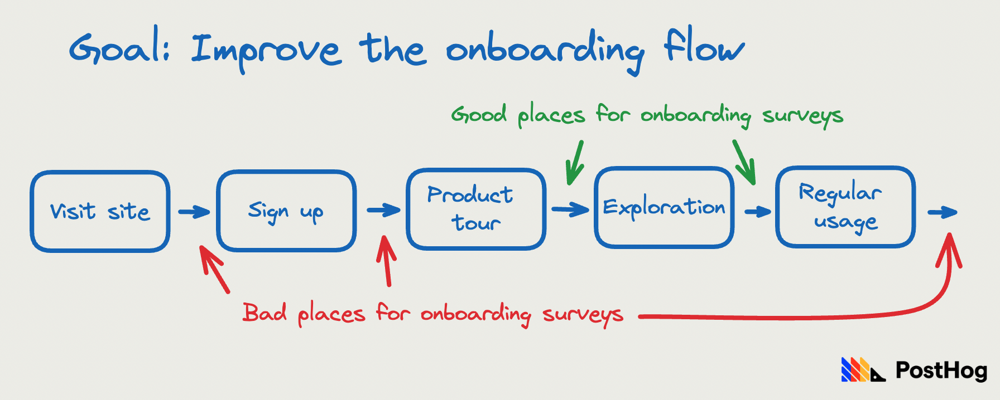
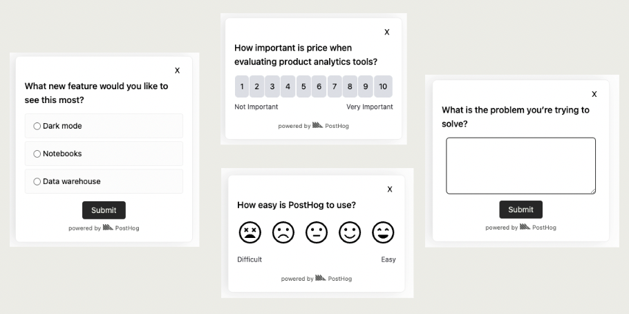

Product surveys help you understand what users are thinking and feeling. Getting to these thoughts and feeling require you to ask great questions.

To help you do this, this post goes over the importance of goals for product survey questions, the principles of great questions, question examples, the question real companies ask, and how to use responses. 

> **Want to run surveys?** See our tutorial on [how to create custom surveys](/tutorials/survey) with options like open text, multiple choice, or custom components.

## Start with a goal for your product survey

Like an [A/B test](/blog/ab-testing-guide-for-engineers), you should start your product survey process with a goal in mind. A product survey, by definition, has a goal related to the product. This could include improving a feature, prioritizing feature futures, or optimizing critical flows.

Because surveys provide open, qualitative feedback from users, goals don’t need to be specific. For example, they don’t need to be a single metric you aim to improve. The goal of an individual survey should align with broader goals for a product and ultimately work towards improving it.

Having a goal enables you to decide how the survey runs and who it targets. For example, if the goal is to improve the onboarding flow, it should run soon after users complete the flow. It shouldn’t run for long-time users who completely forget about the onboarding process or went through an entirely different process.

### Targeting users

To accurately target users for your goal, you need a way to send the survey to specific users directly. Sending a link to every user is not an accurate way of running a product survey.

The nice part about PostHog's [surveys feature](/docs/surveys/manual) is that connects to the user identification you've already set up. This means you can target users based on their properties and connect survey responses to usage data.

## Principles of great product survey questions

Once you have your goal, the next step is crafting your question. A good question helps you get the responses required to progress toward the goal. Asking a bad question prevents you from doing this and might hurt you by hiding the truth.

To help you craft a good question, here are some principles to remember:

- **Don’t ask questions you know the answer to.** Get insights from analytics if you can. For example, you can tell how often someone uses your product or feature by looking at usage metrics.

- **Be specific.** When you ask specific questions, you get specific answers. For example, "How was onboarding?" or "Any feedback?" leads to general responses or non-answers.  "What about the onboarding process was confusing?" leads to specific feedback.

- **Avoid leading users.** Your opinion can corrupt the true feelings of your users, and make results inaccurate. For example, "What do you love about our product?" likely gets positive responses. Use subjective language instead, such as "How do you use our product?"

- **Respect your users.** Ask questions at the right time, keep surveys short, and make it easy to respond. A top complaint about surveys is their length. Ask users for permission to follow up.

- **Use an appropriate format for your survey question.** Make it easy for the user to answer. For example, don’t use an open text box for a question you expect to be a yes or no. Avoid asking repeated multiple open text questions in a row.

## Product survey question examples

With those principles in mind, here are examples of product survey questions as inspiration. We broke them down into four categories based on the type of goals they help achieve.

### 1. Usage

**Goal:** Understand how users use the product in ways that aren’t clear from the data.

- How do you use X feature?
- What is your use case for X feature?
- What problem are you trying to solve?
- Why did you choose our product?

### 2. Opinion

**Goal:** Understand what users are thinking and feeling about your product or feature.

- What’s frustrating about X feature?
- What do you like/dislike about X feature?
- How would you feel if you could no longer use the product?
- [How likely is it that you would recommend the product to a friend or colleague?](/tutorials/nps-survey)
- How easy/difficult is the product to use?

### 3. Roadmap

**Goal:** Understand what to prioritize in your feature roadmap.

- What is missing from our product?
- How can we improve feature X?
- What prevents you from achieving your goal with our product?
- How useful would X feature be to you?
- What new features do you want to see the most?

### 4. Competitors

**Goal:** Gather qualitative data about your competitors to position your product better.

- Have you used a similar product to us?
- What factors are most important when you evaluate us with competitors?
- Why did you choose our product over the competitor’s?
- How happy are you with our product compared to the competitor’s?

> **Note:** Getting users to think about competitors could create negative comparisons.

## What product survey questions do real companies ask?

- [Amazon](https://www.eugenewei.com/blog/2018/5/21/invisible-asymptotes#:~:text=We%20had%20two,shop%20from%20Amazon) asked customers "Why didn’t you purchase more often from Amazon?" in a pop-up right after users placed their orders. They found that people hated shipping fees which led to the creation of Amazon Prime.

- [Superhuman](https://review.firstround.com/how-superhuman-built-an-engine-to-find-product-market-fit) asked "How would you feel if you could no longer use the product?" and measured the percent who answer "very disappointed" as a leading indicator of product-market fit.

- [Stripe](https://www.opinionx.co/blog/customer-problem-stack-ranking) asked questions like "What is frustrating about X?" to stack rank custom problems and prioritize improvements to their product.

- [Uber](https://uber.app.box.com/s/ilxsiqy0bkfhgum8o15n6k6bqi2rqn9c?uclick_id=4bd0d002-01d8-48cd-8064-3bb2af4847f2) asked a series of questions to all drivers including "Overall, how would you rate your driving or delivery experience with Uber in X areas" like app performance and features, then added an open text field for more details.

- [Zola](https://review.firstround.com/heres-why-zola-cherishes-its-nps-detractors-as-much-as-its-promoters) sent NPS surveys every month since its launch. They focused on feedback from detractors over promoters to guide product changes.

This shows the diversity of questions, companies, and use cases for product surveys. Each of these companies utilized surveys to prioritize future development, monitor user satisfaction, and ultimately, make data-informed decisions to improve their product.

## Using surveys to find product-market fit

The real companies listed above are big tech companies with product-market fit, but what about companies still searching for it? Product surveys are a critical part of the process.

In the search for product-market fit, surveys are often more helpful than stats:

- Stats show you what is happening, but surveys help you understand why it is happening. 

- Stats are often lagging indicators of product-market fit, they begin improve after you have it. Surveys are leading indicators, feedback will hint that you have it.

- Surveys help you identify and prioritize the next steps to improving your product. They are more actionable than stats at the early stage.

Using the middle three levels of [the product-market fit game](/blog/product-market-fit-game), we can identify example questions you would use to advance to the next level:

**Validate the problem by talking to users**

- What is the problem you’re trying to solve?
- What do you currently do to solve this problem?
- What are your frustrations with the current solutions?

**Get users to use your product**

- What's your use case for our product?
- What's missing from our product?
- What prevents you from achieving your goal with our product?

**Keep users coming back**

- What is painful/frustrating about our product?
- Why did you choose our product?
- How can we improve feature X?
- [How would you feel if you could no longer use the product?](/blog/measure-product-market-fit#indicator-2-pmf-survey)

## Utilizing your product survey results

Once you [implement your product survey](/tutorials/survey) and get all the data from it, you need to put it to work. Asking questions and collecting responses is useless if you don’t do anything with them.

First, you can use product survey data as a jumping-off point for more research. In PostHog, you can easily connect respondents to their usage data or look into usage trends based on responses. You can also use the responses to identify [users for interviews](/tutorials/feedback-interviews-site-apps) and dig into details further.

Second, you can monitor satisfaction with your product and features. Running repeated surveys asking the same questions can give you an idea of user perceptions over time. You can use this to track the impact of changes and identify areas requiring change.

Third and finally, you can prioritize future development and make data-driven decisions. Ultimately, the goal of product tools (and PostHog) is to help you build better products. Knowing what users think about your product and what they want to see next is a great way to do that.

## Further reading

- [In-depth: How to measure product-market fit](/blog/measure-product-market-fit)
- [How to measure your NPS score in PostHog](/tutorials/nps-survey)
- [10x engineers talk to users](/blog/10x-engineers-do-user-interviews)
