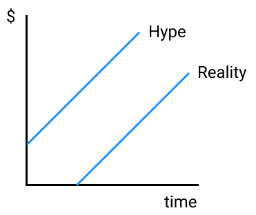
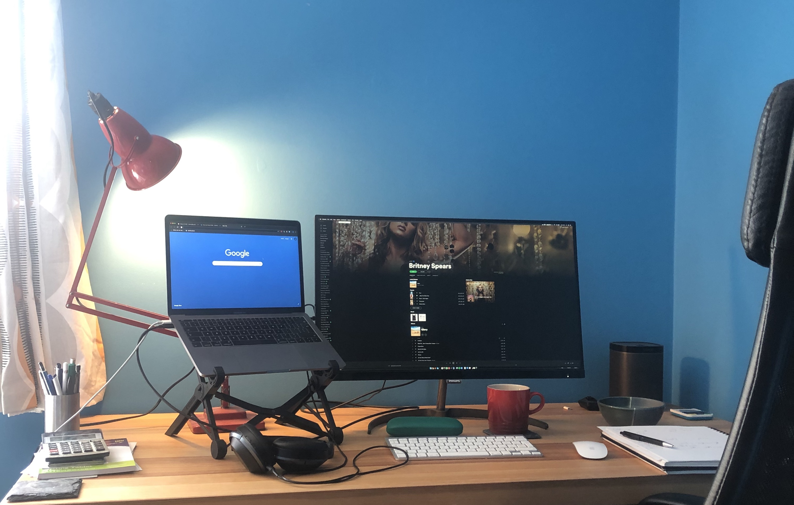

Open source projects have long battled with how to finance themselves. We're lucky to have significant funding and wanted to share what we did to help other cool projects take off.

For those who've not met us before, PostHog provide open source product analytics. We went through the YCombinator [W20 batch](https://www.ycombinator.com/companies?batch=w2020), which took place from January to March 2020. We have raised $3.025M since we started in January, and wanted to share what we did. We may well not be a typical company, but we would hope this gives some lessons learned regardless.

# Why raise money at all

Before you decide if you want to raise money, it's important to know what you are trying to achieve and to optimize for that.

Many projects don't ever want to become businesses - if it's just a hobby and you don't want to speed up, you should just keep doing that :)

We felt building a company around the project at the same time would let us build something really ambitious, so we did that.

So, what are your options for building a company around the project?

## Venture Capital (VC)

VC means revenue won't bottleneck your growth. That's pretty much the advantage. Depending very heavily on the firm, you may get a lot of support with meeting early customers, hiring and your strategy.

We felt personally the challenge of managing accelerated growth would be a lot more stimulating, and that has certainly been the case so far!

VC hype begets a bigger team, begets results (hopefully), begets hype:

Especially early, VC is buying into your potential value. This makes sense - if your company has a 1% chance of being worth $1Bn or more, it is rational for people to take that bet if the price is right.

The downside of course is that you risk hype<>reality disonance! If you can't achieve results with the money you raised, whilst increasing your burn rate, you are at the mercy of those funding you if you will survive. Not cool, but you took this route!

You also have investors, who have given you lots of money. It's important not to fall in love with them for this reason and to forget to prioritize the team and customers, hopefully in that order. Do that, and your investors will be very happy :)

Oh, and you can't pay yourself a huge dividend if you succeed as a way of taking money out of the company, although it might become possible to sell some shares later if you're rocketing (perhaps to help you keep taking risk), and in the short run, you can now probably afford to pay yourself something - hoorah. Going for VC means you are committing to an exit or a failure - you can't really change your mind later that you want to take things more steadily.

Turning your project into a VC backed company means you will have to spend a lot more time dealing with people. Investors, a larger team, probably more customers, and probably a larger community if you succeed in growing. Depending on your personality, this might be a good or a bad thing.

PostHog chose this route. When we're 80, we think we want to have taken a couple of big swings in our lives even if we don't own the whole pie. On the product side, we can build something open source that will outlast us if we get it wrong, and we think the skills and lessons it will give us will help us in our future careers anyway.

## Bootstrapping

By this we mean getting real customers to pay you money and fuelling your own growth at whatever pace you see fit! Basecamp have a great [philosophy](https://basecamp.com/books/calm) on this. 

You get complete control this way. That might make it easier to do the "right thing", or to be more creative in what you build since you won't have to be disrupting or creating a multi billion dollar market as a constraint. However, the financial pressure of payroll in the early days might make it tough to optimize for long run decisions. You need to feed yourself somehow!

We think there is also a lot of risk in this route too. Humans get tired and hungry. It takes a ton of drive to achieve a profitable company. Giving up would be the major risk. We felt this was a similarly high level of risk to inflating your burn rate above your revenue. That risk is likely worse with open source rather than SaaS - you'll have to manage to build a free product first, then a paid version (unless you go down the hosted/not hosted route, which can create competition from the cloud providers).

Tim and I both quit really good jobs to work on PostHog. We felt we could easily have spent 5 years getting back to a similar salary, which a lot more stress and uncertainty.

## Donations

If it's a side project and you have no need to support yourself, this lets you work at your own pace and see if you can make a little money doing it, unless you're exceptionally popular!

Realistically, it will be very hard to support yourself, let alone to grow a team if you want to build a big business and you have rent to pay. However, this could be a cool way to start before doing bootstrapping or VC in the future.

From this point on, we're going to explain how we raised venture capital in this post.

# How long it took

* August 2019: Tim and I quit our jobs.
* January 4th 2020: We started the YC batch, and that meant receiving our first $150K investment from YC. We worked on a different idea to start with but soon [pivoted](/blog/pivot-to-posthog).
* January 23rd 2020: We wrote the first line of code for PostHog
* February 14th: We did a mini launch for a few YC companies to get early feedback
* February 21st: PostHog [launched on HackerNews](https://news.ycombinator.com/item?id=22376732)
* March 6th: Day 1 of fundraising and first cheque ($10K!)
* March 12th: Left San Francisco due to covid and started working fully remote from the UK. We had around $350K total investment (including the YC money) at this point. Everything seemed to slow down at this point for 3 weeks.
* March 16th: Demo day. 
* April 26th: Seed round completed at $3.025M.

# The impact of coronavirus

Coronavirus' impact made fundraising harder. We had started raising as the virus was spreading in China, but before it had affected the US significantly.

During the raise, that changed and lockdown came into place. Suddenly, we were asking complete strangers, in a different country, for millions of dollars to fund our pre-revenue business, over the internet. The first three weeks after lockdown, the process came to a halt - no one seemed to move forward, and a couple of late stage firms with us pulled out for this reason.

Tim and I had been living together in [San Francisco](/blog/moving-to-sf) for the YC batch. When we saw the ban on flights from Europe to the US, we both decided to go back to the UK so we wouldn't end up getting stuck and overstaying our visas. We were both also worried about being stuck away from our families for a very long time. It was nice to be with family again, but the compromise was working West Coast US hours whilst living in a London timezone. It did at times feel like the fundraising cycle may never end - a bit like wrestling a bear, you're done when the bear is done. We promised ourselves that we would not use the virus as a reason to not raise not matter how tempting it was to stop and to come back later with more usage - it risked killing our momentum.

However, after a couple more weeks, it felt like the VCs had become used to this process - they do dozens of meetings every week, so it didn't take long to adapt to "over the internet" fundraising becoming the new normal. We stopped discussing how lockdown was affecting each other on calls, and started getting more people closer to investing in PostHog.

I'd add at this point, universally, we had lovely conversations 

# "You're too early"

It sounds obvious, but many of the most succesful open source companies start off with a really popular open source project.

The pattern we can most often see happening is that the open source product gets widely adopted first, then you work out some way to make money. Perhaps through services, perhaps through hosting it, or perhaps through premium features. The business models and their pros/cons is an entirely separate piece for another time.

The implication is that you're going to have to build something that gets popular first, then monetizes later, in most cases.

From a fundraising perspective, this means you can either be raising (i) off the back of lots of revenue, which seems unlikely or (ii) from a ton of growth in adoption.

It means you'll probably need a little more money than a SaaS company to get off the ground - you'll need to [find product-community fit](https://a16z.com/2019/10/04/commercializing-open-source/) first. You'll also need to make sure the people you speak with agree on this point. We took this stance more and more firmly through our pitches and realized it polarized investors - which is a good thing.

# The 'fundraising battlestation'

## Hardware

This is all pretty conventional, and it'd be easy to do a better job given how many video calls I ended up making. The physical notepad helps during calls - sometimes people ask "compounded" questions, so it can help to jot down areas you'll want to come back to. Other times, you may find yourself "pushing back" a topic to later in the call, so you can make sure you remember to loop back. It somehow feels less rude to be physically writing than typing - I guess since it's impossible to browse social media this way!

The lamp is there to help out with lighting a little, and the laptop stand is to prevent an unflattering angle on the video "you want to at least look like you have your **** together" - a YC Partner describing how to do video calls with investors.

The snack bowl is so I don't eat an entire bag of chips in one sitting.

## Software

### Investor CRM

I created a gigantic spreadsheet to track statuses of each potential investor. This stored:
* firm name
* individual partner / associate
* potential cheque size
* interest /10
* next step
* type
* added to [Pulley](#captable-management)?
* SAFE status (if applicable)? (sent / signed / money received)

You could use AirTable or a real CRM, but PostHog are default opposed to [introducing new software](/handbook/people/spending-money#software).

### Markdown notes

This was handy to store more context than is possible in as spreadsheet.

The format was a single long document, with more detailed notes that I stored as a private repo. I just had 5-10 bullet points about each person I was meeting and their firm, that I would generate during the [planning process](#plan-the-meeting).

### Captable management

We used [Pulley](https://pulley.com/) for this. [Captable.io](https://captable.io/) is a well known alternative. 

This software helps you model out how much of the company you are selling. You can experiment with different scenarios and their impact at series A stage.

We tried doing this on spreadsheets but it quickly became apparent we couldn't quite get the maths right. We found cap tables weirldy hard to do. That's probably just us.

### Legal doc management

We used [Clerky](https://clerky.com). It generates all the legal paperwork you need for raising money, and many other things. I'm a big fan.

## The process

Fundraising involves dozens or hundreds of meetings. You will find yourself brought to your administrative knees if you do not run an organized process!

### Get meetings

They came from two places. Either (i) I had to get introduced to someone or (ii) I had responded to inbound interest.

We only sent 1 cold message and got asked for a bunch of detail then ignored. It turns out, this isn't how VC really works. That said, I'm sure there are exceptions and perhaps we had a biased view because our network in San Francisco was strong from having been through YC out there.

Investors must miss out on so many deals because of this, yet it's a weird form of social proof that I guess must work even if it means missing some false positives. I imagine this is probably quite socially harmful - if you're network is weaker and further from the most decisive VCs, you will have a harder time raising money for your company.

It strikes me that [YC's application form process](/blog/before-yc) doesn't work that way at all.

Likewise, as it turned out, weirdly, not a single "cold outreach" email that we received turned into an investment, yet many investors who made the effort to reach out to us through another investor did end up making an offer.

### Plan the meeting

You should find out a reasonable amount of information about the person you are meeting. Beyond just looking at the portfolio for the firm, look for a couple of blog posts, and try to work out if the investor is on the board of any companies. That'll help the meeting run as a discussion and, bonus, will help you realize if there is a conflict (if an investor has competed in a direct competitor, you probably shouldn't talk to them let alone partner with them).

The portfolio itself can also be useful. Are there any similar companies you could compare yourself to?

### Do the meeting

So, the meeting will start. It should feel like you are driving this - you made it happen, after all.

Start by introducing yourself and having the investor do the same. There's some basic information that you should find out every time, if you can't work it out online beforehand. For example, do they follow on (you'll need that info later), what sort of cheque size they prefer to work with, and if they are a firm rather than an angel, do they have an ownership requirement, and are they comfortable leading a round. 

Later in the discussion, you should make sure to find out how they make decisions - angels may decide on the call, seed firms will often decide after another 2-3 calls with a couple of partners involved, multi stage firms may require a full partner meeting. Just get a sense of how long it normally takes too - some can make a decision in day, others take weeks or months.

You'll probably get asked where you're at in the process. 

We used the [YC seed deck](https://blog.ycombinator.com/intro-to-the-yc-seed-deck/). Some people get really into the quality and design. Ours was black and white with a logo copy pasted onto the front. I think we can get away with that as we're an engineering-focussed company and not in B2C. We didn't present the slides in the meeting, but we'd send them afterwards - we used this approach to structure how we talked about ourselves - there were a (tiny) handful of main points we wanted to make.

### Follow up

This usually involves sending slides and a demo video that we made, then follow up booking another meeting. We weren't perfect, but it's clearly obvious that if you can respond immediately after the meeting, you'll accelerate your own fundraising process and you've got the attention of the investor at that point rather than giving them time to get onto the next call.

Once that's done, take a moment to think if anything could have been better for next time. If you get rejected, we found investors were very helpful and nice with giving feedback - just bear in mind the reason for rejection may not be the real reason. Did they just walk out of a bad meeting with their LPs, or did they get burned by a similar company once before? There's an incentive for them not to tell you these things.

Do not underestimate how much pipeline you need to build. There is a lot of legwork. My investor spreadsheet ended up with 157 rows. That number doesn't reflect that we often had 2 - 5 meetings with the same person. I would estimate I did about 200 calls, each lasting about 45 minutes, in \~6 weeks, on top of all the booking meetings in. We probably had 30 rejections, usually due to us being "too early", often coming from investors who hadn't invested in open source companies before. At first, these felt disheartening, but after a while it became clear some people love what we're working on, and others don't, so we stoped caring!

It was very important that we kept the product getting better and our usage growing during this time. I focussed exclusively on the fundraising process, and Tim focussed exclusively on building the product with our kick ass team and helping out the community. It would have been much harder if we were solo founders. We kept growing during the fundraise process, which helped - some investors during the process of talking to us saw our user number double. ie our user numbers did this:

Eventually, after the first 4 weeks, we started realizing in the data that there was a clear trend for who seemed the most engaged: general investors < investors with many developer tools companies in their portfolio < investors with a significant open source portfolio. The close rates of the last category was astronomically higher.

If you close an investor, it is a _really_ good idea to make sure you then get introductions to whomever else they'd think your company could be a good fit for. We got the *majority* of our investment this way. You are not supposed to do this from investors that rejected you though (although that happened without us asking and also led to a lot of investment once or twice, but I would always decline offers to introduce us to others if an investor said no).

# Raising from a different country

The reason we chose to raise in the US and to correct a US company, even as UK residents, was that we believed it would give us the best swing for the fences.

Not all, but the majority of UK investors we spoke with, felt the valuation was too high. I'd hazard a guess that we'd have \$5M post money valuation in the UK (which would have meant we'd have needed to raise a lot less), whereas we ended up raising at \$15M post. We can see why investors can be more risk averse - they can get into more companies if each company has a lower price. However, from the company's perspective, more money means you have more resource to hit a homerun, which is what has to happen for the majority of VCs to be successful. There is some [interesting albeit old data](https://tomtunguz.com/seed-followon-rates/) on how raising more money increases your chance of success later (although perhaps this is correlation not causation), but only up to a certain point.

# The paperwork you'll need

If you're raising money in the US, we'd recommend you have a US parent company. You can "flip" your existing company to have a US parent - this cost us $10k, which was a frustrating expense, but a necessary one that was far outweighed by raising in a more competitive market.

Once the company was incorporated, we raised our entire round on [SAFEs](https://www.ycombinator.com/documents/). These allow investors to invest without you having to create a priced round which costs a minimum of \$25K, unless you use the [Series Seed](https://www.seriesseed.com/) paperwork. SAFEs are very quick to sign, with no legal work needed. We set a cap with investors. We started off with a \$12M post money cap, meaning that the first \$200K or so that we raised guaranteed those investors that if our eventual priced round went over \$12M valuation, they'd get a lower price as a reward for investing early thus getting a higher fraction of the company for the same money. After starting with angel investors on this basis, we decided fundraising was going well so we increased the cap to \$15M. We were originally going to increase it to \$20M, enabling us to raise more, but we felt given the economic uncertainty as covid hit that we should take the money as fast as possible. It's important to note that the downside of SAFEs is that if you have a down round at the next phase of fundraising, you'll get very diluted (if if the price is lower than the cap).

We're no affiliation other than friends, but in order to model how much of the company you're selling during this process, we used [Pulley](https://pulley.com). You put in all the SAFEs and you can model out a series A to check how much you've sold. [Sam Altman's advice](https://blog.ycombinator.com/dilution/) is to try to give up no more than 10-15% in a seed round and 15-25% in your A round.. although "it's far more important not to run out of money than almost anything else". We used [Clerky](https://www.clerky.com/) to generate the SAFEs and to send them for electronic signature.

If you have traction or a great vision, the world is what you make of it in fundraising. If you act meek and ask investors to make up the price, you'll land very low. Go in high and you'll polarize people - which is what you need... a definite yes or definite no! Just be careful if you set the bar too high, you will want to jump over it in the next round.

# Getting the first cheque

We started off by speaking to some friendly angel investors. These are generally wealthy individuals who fall into two categories. Some are just plain passionate and love the idea of what you're working on. Others angel invest full time and are like a mini fund.

To find angels, we thought about who we already knew and the founders of other companies similar to ours but much bigger. As we built the company, we got advice from many people along the way. We asked them. Some invested directly, others pointed us in the right direction. People were very responsive when we asked for specific help, and we will do our best to pay that forward.

The other thing that is worth doing is to make yourself easy to find and contact. Create a crunchbase profile, update your LinkedIn and Twitter. We were getting at least 1 inbound request from a VC per week. During YC, that climbed to nearly 1 per day. These converted poorly but we did get partner meetings from many of them.

# Getting the right investors

Many investors are very hands off, others will put a lot of resource into helping you.

If you have the luxury of choosing, which happens towards the end of your round when you've already raised enough to survive, it's worth thinking about this.

More hand holding is probably better if you have less experience or you need someone to push you. We were worried that some of the more supportive investors were so supportive we'd struggle to realize that the company/project's success or failure ultimately is our responsibility - not theirs. We are the ones speaking to users every day.

# CALL TO ACTION

We hope this post was useful. If you would like to follow our journey, add yourself to our newsletter. Better yet, [try out or star our repo](https://github.com/posthog/posthog).