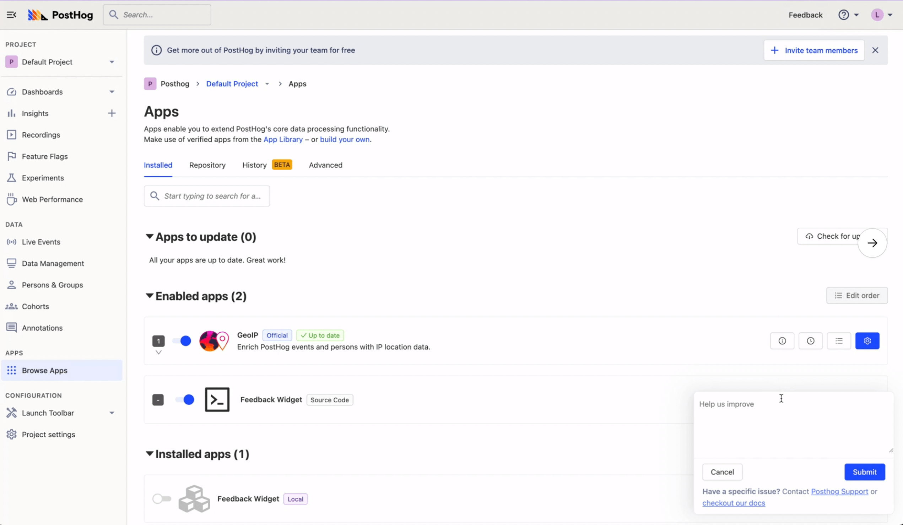
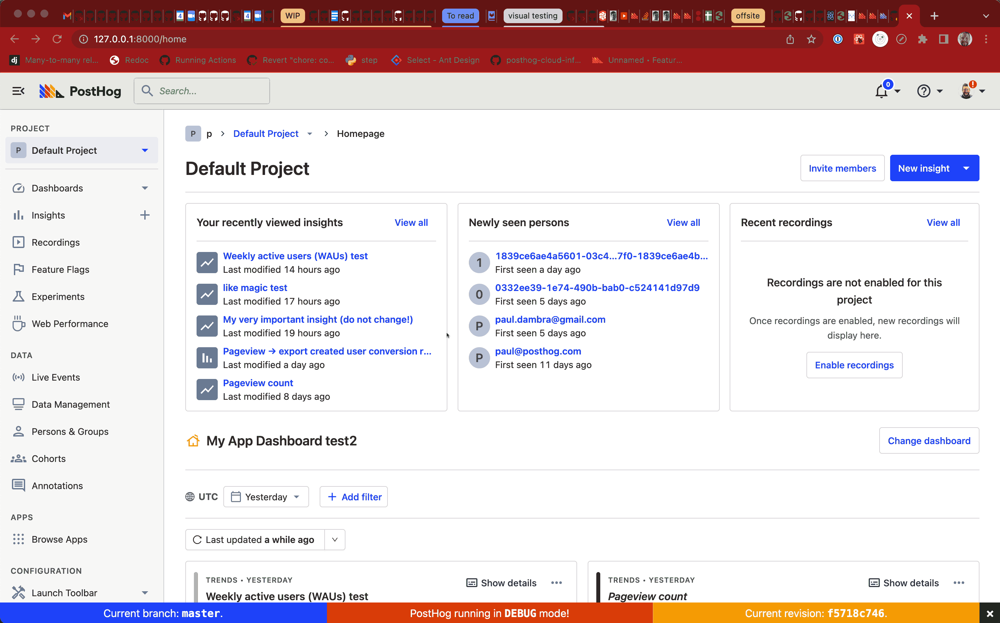
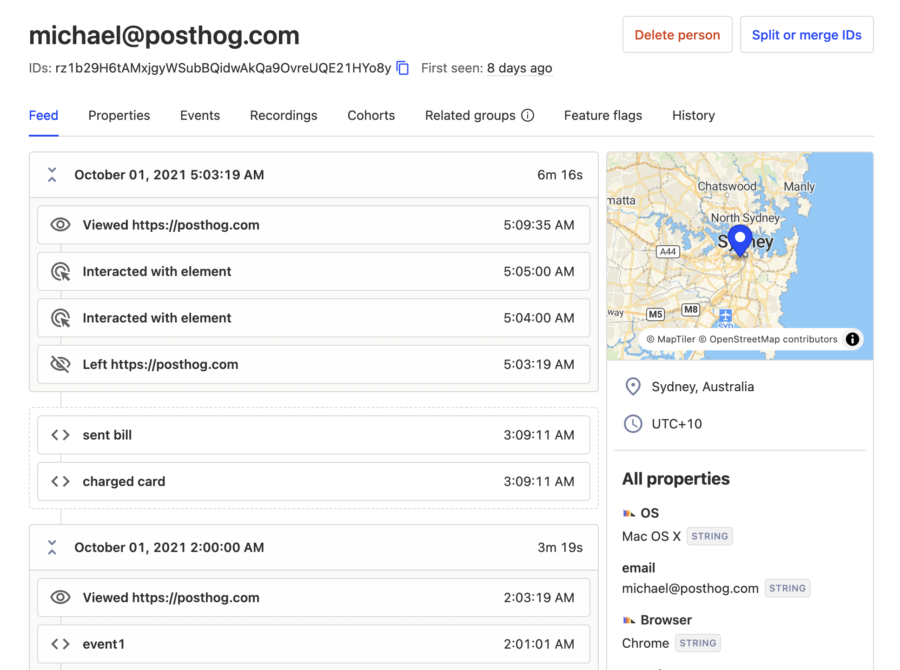
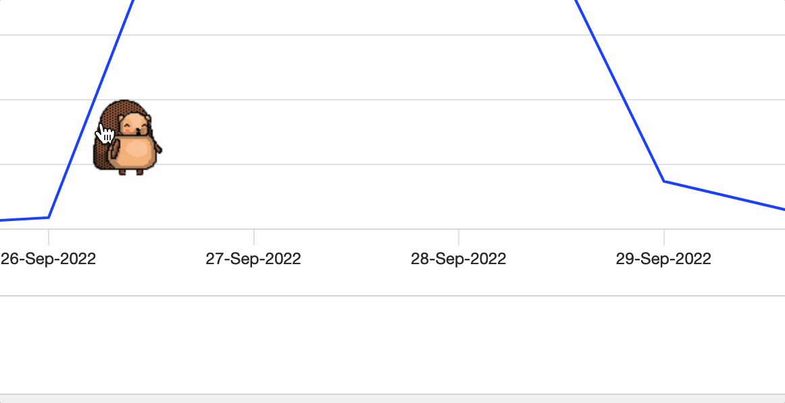
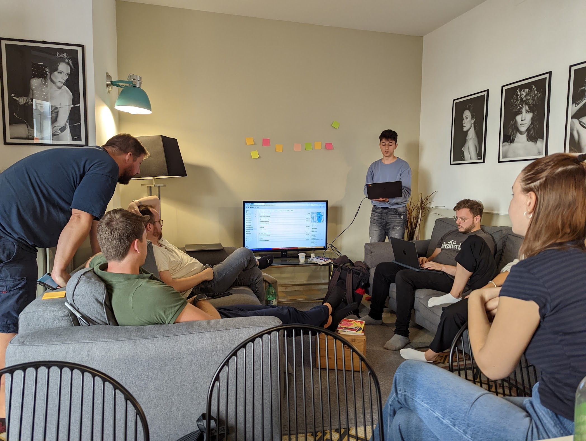

As an all-remote team, we know how important getting together in person is (we’ve [written about this before](/blog/asynchronous-remote-companies)). Our [product analytics team](/teams/product-analytics) (plus Luke, Annika, Cory, and Lottie) recently got back from an offsite in Rome – see also [how we plan a killer offsite in 8 weeks](/blog/planning-a-company-offsite). 

The team ate a lot of pizza and gelato, refocused and aligned current work, ran 360 feedback sessions, and more (see our engineer Paul's [summary thread here](https://twitter.com/pauldambra/status/1576257069766037506)). On top of all of this, they had a hackathon and built a bunch of new things.

We are showcasing them here. Some are sneak previews, others are works-in-progress, and they’ll likely change. We wanted to give you an idea of what our team actually does at an offsite hackathon, so here's what they built.

## Frontend injected apps

Have you ever wanted to add floating pineapples to every page on your site? Marius worked on a way to make this dream a reality. More specifically, he built the ability to inject code into your page through [posthog-js](https://posthog.com/docs/integrate/client/js).

To do so, PostHog app developers add a `web.ts` file with the code they want to inject through PostHog into their app. This enables them to add features like notification banners and custom forms (or pineapples). 

Read more details in the [PR here](https://github.com/PostHog/posthog/pull/12003).

## Feedback app

As a more serious example of what the frontend injected apps look like, Marius and Luke built a feedback app.

The feedback app is injected into your site through PostHog. It can be modified quickly by changing the `web.ts` file, without having to ship changes to your site. On your site, it takes input from users and delivers responses to their own tab in PostHog.

You can find the first PR for the feedback app [here](https://github.com/PostHog/feedback-app/pull/1).

## FaceHog (HogBook? Hoggr?) notifications

A problem some PostHog users face is others changing their carefully crafted insights and feature flags. They can mess these up or completely ruin them, and the original creator wouldn’t have any idea. Worse still, users could delete them without notice.

To limit this happening, Paul worked on “FaceHog”, a notification log of changes to insights, dashboards, feature flags, and experiments you have created.

Now if your evil twin decides to change or delete your insights or roll out your feature to more people, you’ll get a notification.

You can find more of the details in the [PR here](https://github.com/PostHog/posthog/pull/12037). 

## Person feed

The person page currently shows properties, events, session recordings, and more all in separate tabs. Michael and Cory felt it would be better to see all of that data at a glance. They designed and built the person feed to help achieve this.

The person feed is a chronological feed of a person’s behavior. It amalgamates sessions, recordings, events, and properties onto one page. PostHog users can see the events that constitute a session along with a session recording if it exists. They can see the properties of the person in the sidebar as they go, giving them context on that person's events.

Potential future improvements include pinning the most relevant property fields. This feature is still a work in progress, but you can see the [draft PR here](https://github.com/PostHog/posthog/pull/12053).

## Hedgehog mode

To increase the amount of fun in PostHog, Ben and Lottie worked on Hedgehog mode. Hedgehog mode spawns a hedgehog to hang out and walk around on your page. Internal testing shows it helps meet important team KPIs like increased joy, lower stress, and more hedgehog thoughts.

Some day the hedgehog might help you identify popular areas and potential areas for creating actions, but for now they are just hanging out. See the [PR here](https://github.com/PostHog/posthog/pull/12059). 

## Takeaways

One outcome of the offsite was a new focus on [nailing data exploration](/teams/product-analytics#objective-1-nail-data-exploration). The team felt they had good data visualization tools, but not enough for data exploration. For example, it is difficult to move quickly between different types of data (events, persons, groups), often requiring recreating the same filters for multiple queries.

Many of the projects related to this objective (on top of being fun and sparking joy).

We like to be transparent with what we build. The details are found in the linked PRs as well as more expansively on the teams page in [our handbook](/handbook/team-structure). We do this because we value feedback a lot. For example, users have been asking for better data exploration tools, which helped it become a priority. 

If you have more feedback about your use cases or what we're planning to build, let us know on [get in touch](https://app.posthog.com/home#supportModal) or [raise an issue](https://github.com/PostHog/posthog/issues) on our repo. 
