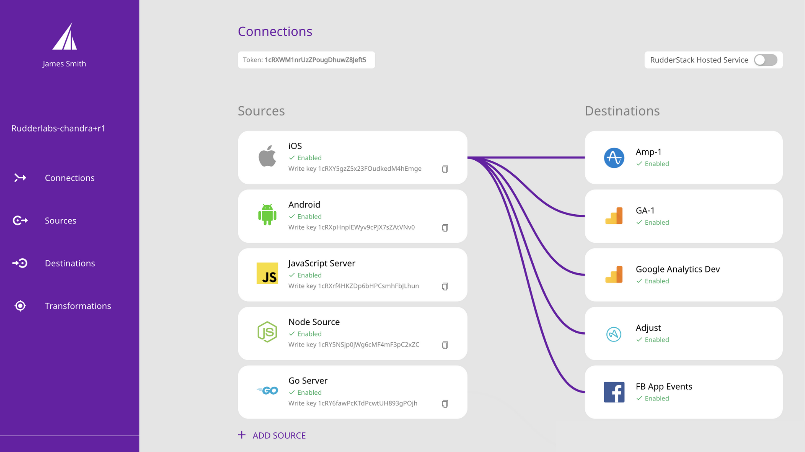

 

If you didn't already know, we're [big fans of open source](/blog/open-source-eating-saas).

As such, we're happy to announce an integration with yet another open source platform: [RudderStack](rudderstack.com).

RudderStack is an open-source, warehouse-first, customer data platform for developers. It allows you to collect and deliver customer event data to a variety of destinations such as data warehouses and analytics platforms.

The idea is that you can collect data from various sources and send it to one of their 70+ destinations with a single integration, making it easy to aggregate data from all services you use for data collection, as well as get the aggregated data into a data warehouse or sent to all the services where you need it to be. 

For example, **with a single SDK**, you can collect usage data from both your apps and websites and then send them over to:

- PostHog for product analytics
- Your data warehouse for bulk storage and data analytics
- Slack to trigger a message to your teams that a user performed an event (e.g. signed up)
- Salesforce to give your sales team access to relevant user data for their outreach
- Customer.io to trigger an email or push notification to a user

This is powerful to ensure that all your teams have access to the data they need, where they need it, and in the right format for their specific use-case. Beyond just relaying data from sources to destinations, RudderStack can also do powerful things like [transformations](https://docs.rudderstack.com/how-to-guides/adding-a-new-user-transformation-in-rudderstack), which let you "transform" your events by enriching, changing, or cleaning their data. As such, you have full control over what data goes where, and how that data is structured when it reaches the specified destination. 

And, once again, you can control all of this from a single dashboard, after integrating their SDK. 

Furthermore, just like PostHog, RudderStack can also be self-hosted, meaning you can deploy it in your own infrastructure, without having to send your data to a third-party. This makes PostHog and RudderStack a powerful combo, forming the foundation of a fully open-source and self-hosted enterprise analytics stack. 

To use this integration, check out our [dedicated docs page](/docs/integrations/rudderstack-integration) to get started.

Also, if you're already using RudderStack, you can connect to PostHog without having to move away from your current analytics stack, by simply adding us as a new destination in your pipeline. This is a great way to get started trying out PostHog without having to immediately commit to the change.

