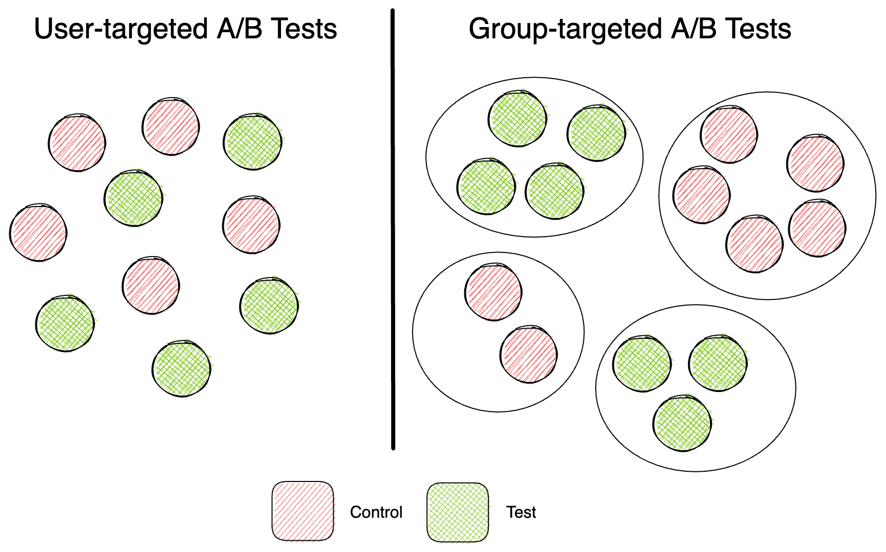
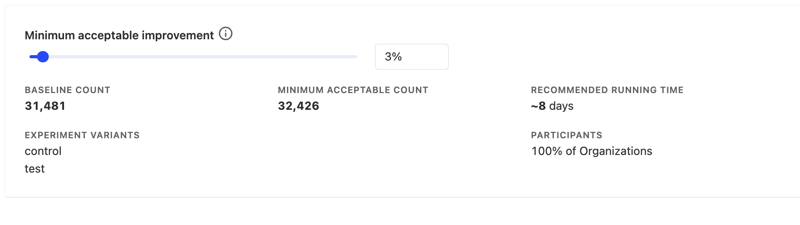

A/B tests are a powerful tool for measuring how product changes impact user behavior. However, sometimes changing how one user interacts with your product will affect how others use it too. For example, a change in the Uber app for drivers likely affects riders' experience too. In these scenarios, group-targeted experiments enable us to measure the impact of changes beyond an individual user and across a group of users.

## What are group-targeted experiments

In group-targeted experiments, the test applies to an entire group rather than individual users. This means that everyone within a specific group will experience the same conditions, for example, the control or test variant. This enables you to measure the impact of any changes on the group as a whole, rather than on individual users within the group.

Groups can be companies, geographic locations, or any other set of users with common characteristics.

## When to run group-targeted experiments

Run group-targeted experiments when:

* The change in how an individual user uses your product significantly affects the behavior of other users.

* You want to measure the impact of a change on an entire group of users. 

This is usually seen in the following types of products:

1. B2B SaaS apps, in order to test how a change will affect how an entire company uses your product.

   - For example, suppose Asana wants to test a new AI feature that automatically assigns tasks based on their urgency and importance. By conducting a group-targeted experiment, they can measure the impact on project completion rates across the entire company. 

2. Products with network effects, since a change for one user will likely affect how other users interact with the product.

   - For example, suppose Slack wants to improve the usage of a new video calling feature. Improving the feature's discoverability for a single user will increase their own usage with it, but since they use it with their coworkers, their coworkers will also discover it.

## How does running a group-targeted experiment differ from a user-targeted one?

There are three key differences to take into account when running a group-targeted experiment versus a user-level one:

### 1. Less statiscal power

Since you treat a group of users as a single data point in group-targeted experiments, you have less statistical power. For example, Slack has 20 million users, but only 600,000 companies using it.

In practice, this means that you'll usually have to run group-targeted experiments longer than you would user-targeted experiments. It also means that your results may be more susceptible to noise.

### 2. Higher randomization risk

Randomization risk can occur when groups are not properly randomized when assigned to the control or test variants. Since you have fewer data points in group-targeted experiments, the risk is higher that this will occur and it can distort results.

For example, say a B2B SaaS company wants to see if a new pricing plan helps retain customers. They split companies into two groups: one with the new plan and one with the old plan. However, the randomization process assigns more small companies to the new plan and more large companies to the old plan. This may skew the results because company size could be a factor in determining customer retention rather than the pricing plan itself.

### 3. Fewer user-level insights

Since group-targeted experiments provide insights on an aggregate level, they may not show insights on a user level.

For example, say a B2B SaaS tool wants users to invite coworkers to use the app. They add a big "Invite Coworker" button and test it in a company-targeted experiment. The results show an increase in invites sent, but it's hard to know how individual users used the button. For example, what are the roles or skill sets of team members who are most likely to interact with the button and send invites?

## Combining user-targeted and group-targeted experiments to reduce risk

To improve the quality of insights from group-targeted experiments and address the risks mentioned above, you may want to consider running an experiment with your change at a user-level before running it at a group-level. This can help you in the following ways:

### 1. Save time for changes that don't have an impact. 

As mentioned, lower statistical power in group-targeted experiments means you need to run your experiments longer. However, a change that does not impact behavior at a user-level will not likely translate into impact at a group-level. So you may waste time waiting for results from a group-level test that has no impact.

In this case, it may be worth running a user-targeted experiment first in order to see if there is any impact on individual user behavior (which should be quicker to gain insights from because of higher statistical power) before running a group-targeted experiment.

### 2. Gain user-level insights and identify randomization risks

By running a user-targeted experiment first, you'll gain insight into how individual users interact with your change and what characteristics they may possess. This will then give you an understanding of what results you can expect from a group-targeted experiment.

This can also help you identify randomization risks. For example, let's say a B2B SaaS app runs a user-targeted experiment and notices that users in large companies are more likely to interact with their new feature. In this case, when they run a group-targeted experiment, they can ensure to filter out small and medium-sized companies in their experiment in order to obtain more accurate results.

## How to setup group-targeted experiments on PostHog

First, ensure you have [set up a group](docs/product-analytics/group-analytics#getting-started) in PostHog. Next, go to your PostHog dashboard and create a [new experiment](docs/experiments/manual#creating-an-experiment).

In the New Experiment screen, select the Participant type. By default, it will show `Persons` (i.e. a user-level experiment). Click on the drop-down and select your new group.

Then set your experiment goal and secondary metrics as usual. A handy feature especially useful for group-level experiments is the Minimum Acceptable Improvement calculator at the bottom of the page. Since group-level experiments have lower statistical power, this will recommend a time for how long you should run your experiment in order to see results.

## Further reading

- [Running experiments on new users](/blog/new-user-experiments)
- [How to build, analyze and optimize conversion funnels in PostHog](/blog/frontend-vs-backend-group-analytics)
- [How to run Experiments without feature flags](https://posthog.com/blog/experiments)
