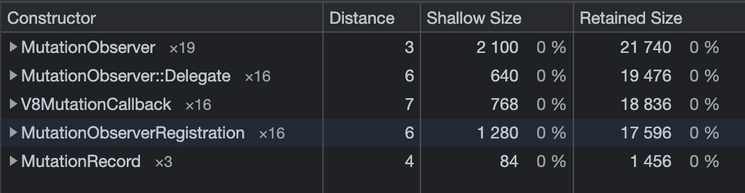
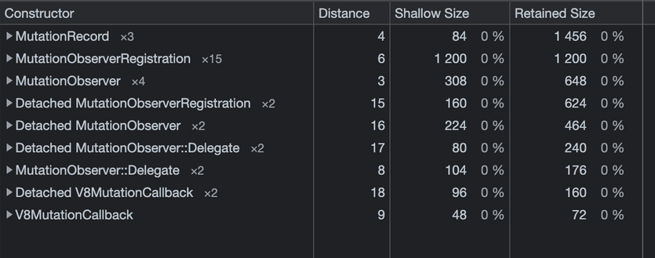
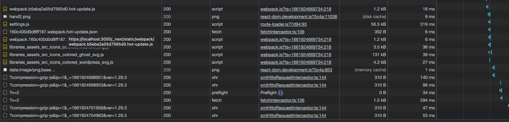
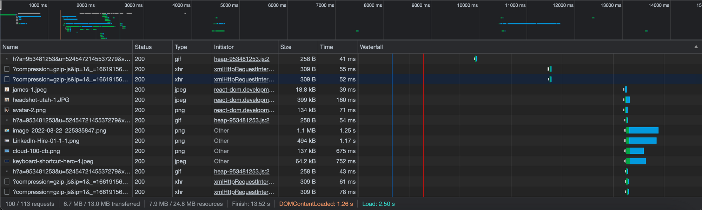
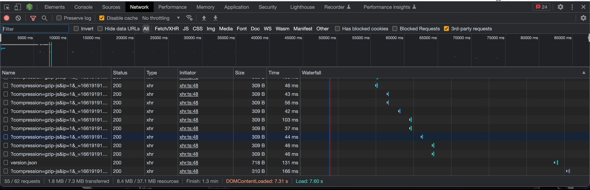
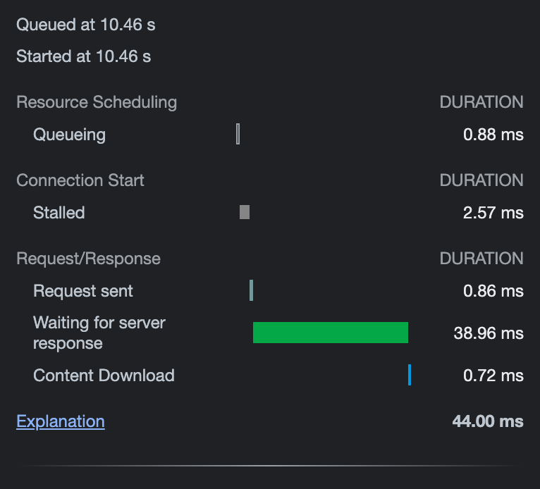

The 2010s were marked by an explosion of tools focused on data. One of the biggest was session recording – a screen-recording-like service that tracked a user’s activity. Typically, session recording (SR) was popular with marketers and product managers as a tool to learn more about a user’s experience. 

Today, SR is implemented across the internet, prompting various [privacy and ethical questions](https://blog.count.ly/the-dark-truth-behind-session-recording-339da48b0cae) alongside some tricky [technical problems](https://www.techrepublic.com/article/session-replay-scripts-are-disrupting-online-privacy-in-a-big-way/). 

One issue that’s been elusive is performance. Most SR providers will pledge that their products do not impact page performance whatsoever! But, I bet your gut says it does, even if your (hopefully) seamless online experiences contradict that. 

Today, we are going to scientifically explore if session recording impacts browser performance.

> author profile here

### A grounding rule: there is no such thing as no impact.

Some products in the SR space will boast that their platform incurs no performance impact. While these claims are presumably without malicious intent, it’s important to differentiate between **no performance impact** and **trivial performance impact**. 

Any script, no matter how lightweight, incurs *some* performance hit. The browser has to expend some (i) CPU and some (ii) Memory. And in the case of analytics software, some (iii) Network Bandwidth. 

Paul Buchheit, inventor of Gmail, famously claimed that interactions must stay under 100ms to be magical.

What matters is if the user can *notice* the performance hit. Paul Buchheit, the inventor of Gmail, famously [claimed](https://matthieuoger.com/2020/05/the-100ms-rule/) that interactions under 100ms are magic, while anything slower are sluggish. It’s an imperfect law, but serves as a decent heuristic. If a third-party script turns 90ms interactions into 110ms interactions, that’s noticeable. But 90ms to 92ms? That’s nothing.  

### A little history lesson

How does SR work? One might initially guess that the browser’s screen-share APIs play a role. Now, if you’ve ever shared your screen on a conference call, you’re likely familiar that screen-share compels your computer’s fan to purr like a turbine. Why? Because the screen-share API is trying to capture the *visual* pixels. Expensive work. 

Instead, SR uses DOM mutations – deltas at the HTML-level, instructions the browser needs to render, not the render itself. Specifically, SR was made possible in 2012 when the MutationObserver API was added to modern browsers, starting with Chrome 18.

Prior to the Mutation API, modern browsers had MutationEvents. When a button changed color, that was a MutationEvent. When a node was removed, that was a MutationEvent. Unfortunately, MutationEvents were slow—every single tiny, itsy-bitsy change fired a MutationEvent at every parent node. In the 2000s, SR would’ve been impossibly slow. 

The [MutationObserver API](https://developer.mozilla.org/en-US/docs/Web/API/MutationObserver) has a different approach. It batches node changes and dispatches a joint notification whenever it has capacity to. 

After Chrome 18 was released, commercial products such as [FullStory](https://fullstory.com) (2014), [Heap](https://heap.io) (2013), and [Hotjar](https://hotjar.com) (2014) flooded the market, offering a solution that boasted crisper granularity over old analytics software like Google Analytics. 

Platforms like [PostHog](https://posthog.com), which champion open-source, community driven software, are the latest evolution in this vertical. 

### Are there any more layers to this?

Sort of. PostHog is open source and is therefore transparent on its session recording implementation. PostHog’s frontend client, [posthog.js](https://github.com/PostHog/posthog-js), checks if session recording is enabled by the user; if so, it calls **recorder.js** from the PostHog host, which is a minified script of [rrweb](https://github.com/rrweb-io/rrweb), an open source SR library.

According to PostHog’s [Rick Marron](https://github.com/rcmarron), rrweb takes a DOM snapshot after initialization, then relies on the MutationObserver API to track future events. It only resorts to taking another DOM snapshot if there has been inactivity for over 30 minutes or the tab changes. 

### What to look for

There are *three* possible impacts of SR: (i) CPU performance, (ii) memory bandwidth, and (iii) network bandwidth. For SR, (ii) and (iii) are far more relevant – CPU is hardly impacted by JS-level subroutines and more user interactions; however, SR is a data product that’s relayed over the internet. 

### Where to measure this

Candidly, there is no perfect way to measure this. Websites with deep DOM trees may incur a bigger performance hit from SR than others; performance hits on the Google homepage will dramatically differ from Neopet’s GUI mania. Given the popularity of session recording in SaaS products, we’ll investigate SR’s impact on various components of a typical SaaS website. 

To simulate and measure the performance impact in the real world, I partnered with [Brevy](https://brevy.com), [CommandBar](https://commandbar.com), and [Explo](https://explo.com). Specifically, we implemented PostHog in Brevy’s internal app codebase, CommandBar’s Ghost/NextJS-powered [blog](https://commandbar.com/blog), and Explo’s React-engineered [auth page](https://app.explo.co/home).

<NewsletterForm compact /> 

## The Tests

### Memory: Short Term

Given SR begins with an initial snapshot of the DOM tree, I first wanted to judge if SR impacts memory at the beginning of a user’s journey. Using Chrome’s built-in developer-tools, I examined on Posthog’s SR impacted the memory heap. 

For each tool, the beginning of a user’s journey was slightly different: 

- For Brevy, a platform to manage corporate blogs, that meant starting a new post.
- For CommandBar’s blog, that meant opening a new post.
- For Explo’s auth page, that meant focusing on the first-name field.

In all three cases, MutationObserver, Mutation ObserverRegistration, and all relevant subroutines *reportedly* had … *drumroll* … 0% impact on memory. Of course, that’s Chrome’s rounding. We can see the exact byte usage below: 

**Simple Load: Brevy**

**Simple Load: Commandbar**

**Simple Load: Explo** 

>💡 **Shallow Side** is an object’s size 
> **Retained Size** measures the cumulative size of an object and all objects it > actively references. 
> **Retained Size** is more relevant when measuring an object’s heap impact.

Quite obviously, MutationObserver made near-zero impact. For reference, Commandbar’s total heap was over 60,000,000 bytes (60MB) large. That makes MutationRecord’s footprint a … **+0.00043%** addition to memory. **Nothing**. 

### Memory: Long Term

Now, let’s examine rolling use. Remember, session recordings grow with time. I re-ran each trial but with 120 seconds of active use per product. The results were … *drumroll* … the same. Roughly, at least. 

**Long Trial: Brevy** 

**Long Trial: Commandbar**

**Long Trial: Explo**

If you dig into the numbers, you’ll notice that there was a slight increase across the board. But just *slight*. Why? The deltas for MutationObserver are small, compressed representations of changes in the DOM tree. Even with heavy use, the allotted space barely moves. MutationObserver remains in zero-point-zero-zero territory. 

> 💡 **Verdict:** MutationObserver has **no** discernible impact to page memory.

### Network: Transmission

Network is the bigger metric to interrogate. After all, computers have gotten faster, memory has gotten cheaper, but bad internet is still… pretty damn common. How badly does SessionRecording impact your internet speed? 

Let’s take a look at the Network tab on all three apps. 

**Network Tab: Brevy**

Average Packet Size: 310 bytes

**Network Tab: Commandbar:** 

Average Packet Size: 309 bytes

**Network Tab: Explo:** 

Average Packet Size: 309 bytes

All of the gzip-compressed transmissions? That’s **rrweb** / **PostHog** relaying the mutation data to a Posthog host for storage. 

You will notice two things. 

- These packets are **tiny** in comparison to anything else—300 or so bytes. Bytes, not kilobytes. That’s it!
- These packets are transmitted often. Very, very often.

Let’s dig into one of the requests. All were quite similar numerically to the below: 

One of the packets from a CommandBar trial. 

> 💡 **Queuing** — how long it took to add the request to the request queue.
>
> **Stalled** — how long the request waited in the queue before being dispatched, either due to other higher priority requests or the CPU being idle. 
>
> **Request sent** — how long it took to send the request 
>
> **Waiting for server response** — how long it took for the server, in this case [app.posthog.com](http://app.posthog.com), to reply over the internet. 
>
> **Content Download** — how long after the initial packet did it take to download the response, in this case, an acknowledgement of receipt.

You should remember that these requests are dispatched asynchronously, so the leading contributor to the request speed – the ~40ms wait from [app.posthog.com](http://app.posthog.com) – isn’t blocking the page from operating. For the *most part*. 

Technically, [Chrome only permits 10 parallel connections](https://blog.bluetriangle.com/blocking-web-performance-villain) at once. Imagine **three** SR requests were dispatched in parallel (which appears to happen on rare occasion). By extension, only **seven** other requests can be made during that (very short) period. 

So, hypothetically, there *is* a performance impact. A ~44ms wait is long enough to break Paul Buchheit’s earlier UI/UX test. But why aren’t I fretting over this? Because this performance hit only happens if the following conditions are met:

- Multiple SR requests were made in parallel
- The page needed to make 8+ additional requests at the same time
- The request(s) that were delayed actually impact the user’s interactions.

Practically... this (almost) never happens. A lot of coincidence has to happen for SR to actually clog the pipes. More often, you’ll attribute a slow load or sluggish action to your mediocre WiFi router, and you would be likely right. 

> 💡 **Verdict:** Session Recording **might rarely** impact browser network performance*.* But for all practical purposes, **it does not**.

## Conclusion

Session Recording – albeit the perceived intensity of the data captured – has no discernible impact on your browser’s performance. This is entirely thanks to the MutationObserver API, introduced in 2012 underneath Anne van Kesteren, Aryeh Gregor, Ms2ger, Alex Russell, and Robin Berjon. 

Marketers and product managers can continue to enjoy the benefits of Session Recording while remaining confident that their app’s performance isn’t suffering.

<NewsletterForm compact />