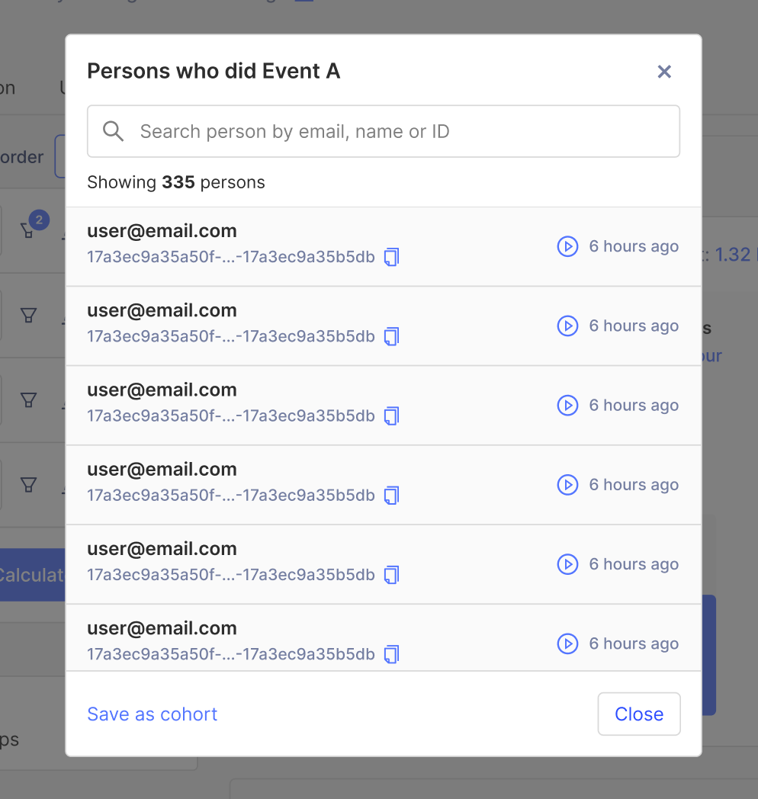

This blog post explains why we're removing the "Sessions" page in PostHog. This page used to contain a daily list of all sessions by your users, separating them by periods where inactivity lasted longer than 30 minutes. In addition, this is where you would be able to access [recordings](/docs/user-guides/recordings).

Now, you will see a **Recordings** tab on the main menu in its place.

## Why?

We got continuous reports from users that this page was causing confusion (e.g. "missing recordings", sessions definition not fitting all use cases, inability to filter properly), which led us to question the purpose of this page and sessions in general at PostHog. 

We found two main session analytics use cases:
1. Run session-based behavioral analytics. Useful for products with certain types of engagement where interactions over time are important and natural. Examples: Netflix, Slack, Notion.
2. Explore, debug, deep dive to answer _why_ users are behaving a certain way.

We realized we don't currently support the first use case fully. The only session-based analysis you can do is session duration distribution and even then it has the fundamental problem of how sessions are computed. Not all products define sessions the same way, and further, we had edge cases such as server-side events being sent asynchronously for a user.

For the second case, sessions is not the best way to solve the problem. Further, all the work we are doing around Paths and Quantitative Analysis (see [Diagnosing Causes](/handbook/strategy/overview#milestone-2-early-august-onwards)) will actually solve for this use case and provide significantly more value. In particular, you'll get the same useful qualitative information, but the quantitative overlay will greatly reduce bias (and effort).

### What's new?

From the context above, we decided to take the following actions:
- We have removed the Sessions page. It introduced significant confusion and provided limited value. Less than 3% of pageviews in the app in the last month were on the sessions page for users with no recordings enabled (proxy metric).
- We introduced a recordings list page instead. This page is mostly intended for finding specific recordings you want to watch (e.g. customer support or recordings with exceptions). This page also includes filtering tools geared towards that. _Funnels will be the starting point for other use cases._
- On the Person modal you get when clicking on a data point in an insight graph, and particularly in Funnels, you now get a direct link to relevant recordings for the specific users in the data point. 
    

- On a Person page, recordings are now shown first (if enabled) and events as a secondary tab.
- We've renamed the "Sessions recordings" feature into just "Recordings" to make it clear these are separate features, with different use cases.
- We're evaluating getting rid of the "Sessions" insight. The functionality is quite limited (only a time distribution with scant visualization) and confusing (e.g. the events/actions that compose a session). Further, only 1.5% of insights analyzed in the last month were on "Sessions". Please [reach out](https://app.posthog.com/home#supportModal) if you have any thoughts.

In addition to the changes above, we're also significantly improving recordings ingestion and the playback experience. This will make sure more sessions are captured and that you can seamlessly find the relevant parts of a recording.

> 💡 **Not seeing these changes yet?** We're A/B testing some of these changes in PostHog Cloud, you may still not be in the release group. Please [contact us](/posts) if you'd like to be included. If you're on a self-hosted deployment of PostHog please keep an eye out for the next release.

## What's next?
We are considering full support for session-based [behavioral analytics](/product-engineers/behavioral-analytics) and want to gather more context on the use cases for this. In particular, we want to make sure users have flexibility around their own concept of sessions, support a full range of analytics (e.g. session count, duration, multi-device sessions), etc.

> PostHog is an open source analytics platform you can host yourself. We help you build better products faster, without user data ever leaving your infrastructure.

<ArrayCTA />
