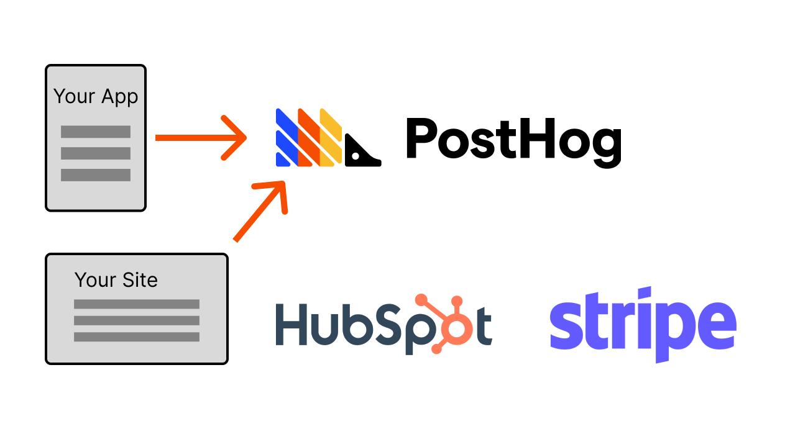
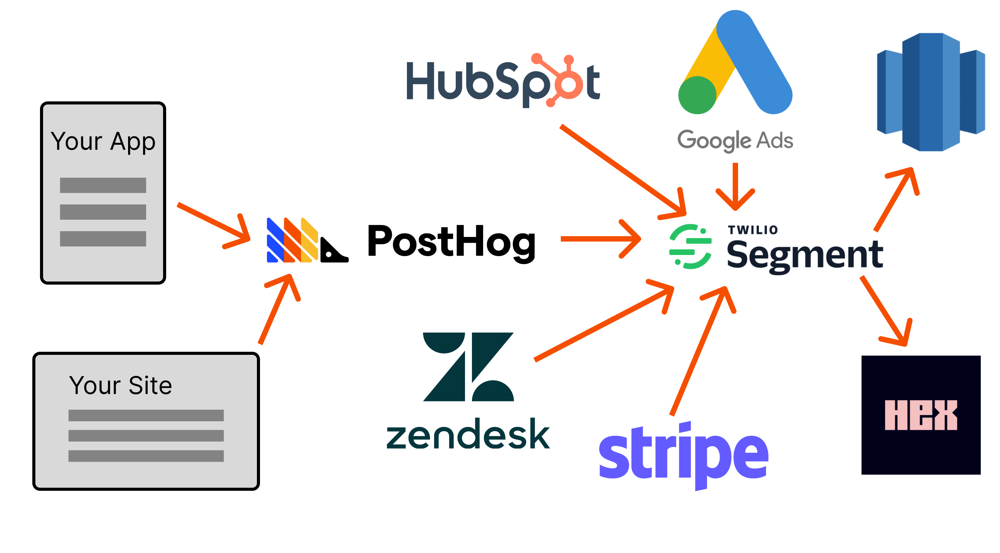
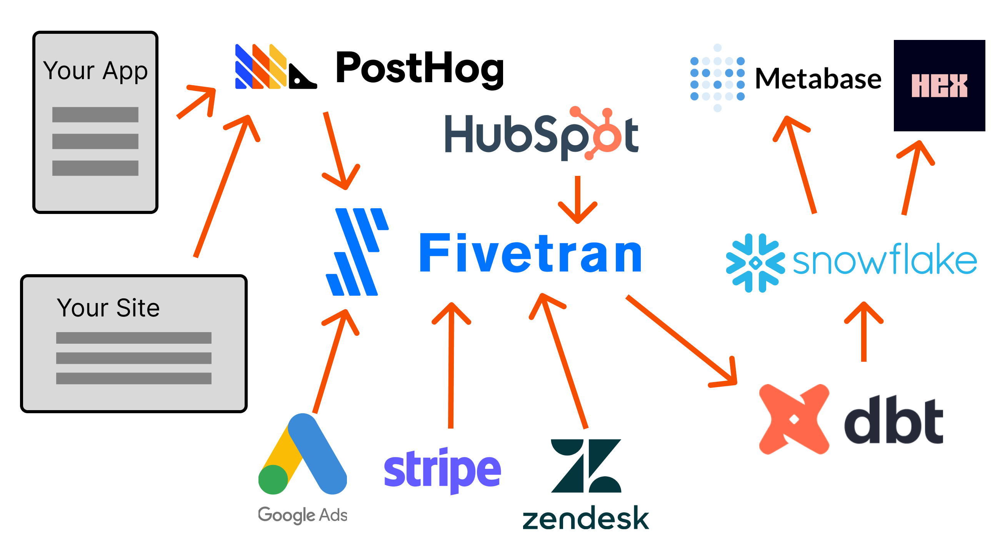
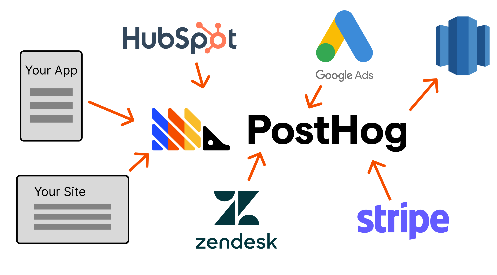

The goal of data is to help startups build a better product. To help them with this, startups use all sorts of tools, known as the startup data stack. 

To help you understand the startup data stack, and be better able leverage it, this post will go over:
- What the startup data stack looks like from MVP to Series B and beyond
- Examples of tools used and the problems they solve
- PostHog's vision of the future for the startup data stack

This comes from working with hundreds of startups at all stages, conducting user interviews, researching the data stack landscape, and being part of the data stack ourselves.

## The MVP data stack

The goal of the MVP data stack is to get a signal if what you are building is working. Teams don’t want to spend time setting up complicated products this early, because their data needs aren’t large. They want something quick and proven to give them data like:

- Site visitors
- Leads, signups
- Product usage
- Revenue

To do this, they need:

- Website and product analytics
- Customer relationship manager (CRM)
- Revenue, payments, subscription tracking

To choose these products, they usually go with the "popular" choice, as they are [boring technologies](https://mcfunley.com/choose-boring-technology) that work for other people. The goal of the data stack at the MVP stage is to get basic data to find out if [what you are building is working](/blog/early-stage-analytics). Complicated solutions aren’t needed for this.

## The Seed stage data stack

Once the MVP has initial traction and you enter the Seed stage, the data needs become more advanced. This is because what to work on become less obvious. Startups need data to figure out how to spend their time and resources. Some questions asked at this stage include:

- What features should we prioritize developing?
- How do we best serve our [ideal customer](/blog/creating-ideal-customer-profile)?
- How do we optimize our [conversion funnel](/tutorials/funnels)?
- What channels should we [be advertising on](/blog/dev-marketing-for-startups)?

To answer these questions, teams pull data from a growing number of sources like product analytics, CRM, help desk, and ad platform. They also utilize more of the features of these platforms, such as customer engagement and session recordings, generating more data.

Bringing all this data together and managing it often requires a [customer data platform](/docs/integrate/cdp) (CDP). CDPs collect the data from different sources and send it for use in destinations. For example, it might collect product data from PostHog, advertising data from Google, and revenue data from Stripe, and send it back to those same tools, a warehouse, or a business intelligence tool like Hex.

The goal of the stack at this stage is to give insights into how the product and specific features are doing. Teams want the ability to answer questions about the product and get basic KPI reporting. The data coming in just needs to be good enough, it doesn't need to be 100% perfect. This strikes the balance of giving engineers enough data to know what to prioritize while giving them plenty of time to build it.

## The Series A data stack

Series A is where data begins to get serious, and by serious, I mean the startup makes someone responsible for owning the data stack. This person is often a head of data, data engineer, or backend engineer focused on data. They will implement the "modern data stack" at this point, which contains four tools:

1. A data warehouse stores all the data and act as a single source of truth. Options include Snowflake, BigQuery, and RedShift.
2. An ETL pipeline to extract data from different sources, transform it, and load it into the warehouse. Options include Fivetran, Integrate.io, and Airbyte.
3. A data transformation tool to model data, clean it up, and make it usable. dbt is basically the only option.
4. A business intelligence or visualization tool to get insights from the data you’ve collected. Options include Metabase, Looker, and Hex.

Startups need this because managing and accessing individual sources of data becomes unsustainable. Teams need a single source of truth, and the modern data stack gives them that. This creates trust in the data and greater accuracy.

The downside of this stage is that engineers start to get further away from the data important to them. They must learn the modern data stack tools or rely on the data team for insights. The analytics tools set up earlier become inaccurate, and are used less. This becomes a much larger issue in the next stage.

## The Series B and beyond data stack

With a data team led by the head of data squarely in place, their goal is to empower engineers to evaluate the success of what they are building. They attempt to use their data stack to make this happen.

It requires a lot of work because engineers are now further away from the actual data than ever. They are reliant on the data team to bridge this gap and create data sets and insights. Engineers are largely unable to "self-serve." There are many reasons for this:

- The complexity of data and tools requires specialization.
- Data security, safety, and privacy requirements.
- Lack of knowledge of data available or how to use it.

As data sizes continue to grow, there are growing pains. For example, team members might need to write optimized SQL to access specific data they want. This is because everything revolves around the data warehouse. Everything adds, accesses, or transforms data from the warehouse.  The costs of hosting the warehouse as well as querying and processing data from it can become significant.

Tools set up earlier, such as product analytics or the CDP, are locked in and forgotten. These tools now only send data which eventually makes its way into the warehouse. If budget becomes a problem, these tools are likely the first ones to get cut.

New tools, such as machine learning, are introduced to gain insights from "big data." The data team also grows to fulfill the needs of other teams for data. This does add maintenance, cost, and complexity. A larger data team is needed to manage the complexity at this scale.

## PostHog’s vision for the future of the startup data stack

Being a part of this evolution, we have thoughts on where PostHog fits into this. [Our mission](/handbook/strategy/overview) is to increase the number of successful products in the world, and we do this by helping engineers be better at product. This means helping them gather and analyze data at the earliest stage of their product, and integrating more of the parts of the startup data stack as they scale up.

To make this happen, we are improving the ability to use PostHog as a [customer data platform (CDP)](https://github.com/PostHog/posthog/issues/13126). We have built the key functionality, such as the ability to:

- Receive data from your app(s) and site(s) with our [SDKs](/docs/integrate?tab=sdks)
- Receive data from sources like [Stripe](/apps/stripe-connector), [Hubspot](/apps/hubspot-connector), [Intercom](/apps/intercom)
- Export to destinations such as [Snowflake](/apps/snowflake-export), [BigQuery](/apps/bigquery-export), or [RedShift](/apps/redshift-export)

Improving reliability, integrations, and UX is critical for success here. Being a CDP enables startups to have more of their data and tools in one place with PostHog. More data also improves the depth of insights engineers can get from PostHog.

We are also working on figuring out what PostHog would look like as [a data warehouse](https://github.com/PostHog/posthog/issues/14406). Data accuracy and reporting flexibility matter at scale. Being a warehouse enables PostHog to provide this to startups, while still using the tools PostHog offers. With PostHog as a warehouse, startups don’t need to migrate or set up many of the modern data stack tools.

PostHog wants to make it quick to evaluate whether products are working or not. The ability for engineers to find and analyze the metrics they want, along with tools like experiments and session recordings, are key to this. The late-stage data stack of a pipeline, warehouse, and business intelligence tool creates complexity and silos that make figuring out what to work on and what’s working difficult.

Integrating more of the parts of the startup data stack into PostHog enables engineers to continue to access the data, insights, and tools they need to build a great product. This current data stack evolution becomes large, complicated, and siloed quickly. Building a more ideal data stack for engineers is what PostHog aims to do.

## Further reading

- [Our simpler goal: Help engineers to be better at product](/blog/helping-engineers-to-product)
- [The 80/20 of early-stage startup analytics](/blog/early-stage-analytics)
- [What is a product engineer (and why they're awesome)](/blog/what-is-a-product-engineer)
