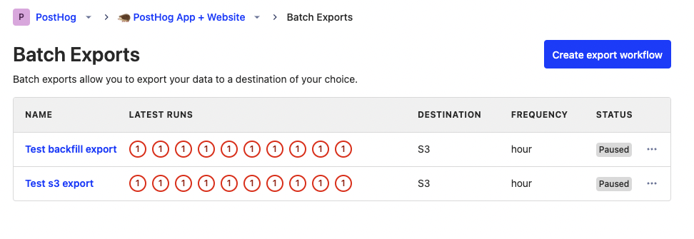

Letting users maintain ownership of their data is a key value of PostHog. Although we aspire to become the single source of truth for all your data needs, we realize we don’t fulfill everything everyone wants to do (yet). Also, we know that even if we were the single source of truth, users still want to use their data on other platforms.

Export apps provided the ability to maintain ownership of all of your data in PostHog and move it where you like. Unfortunately, it didn’t scale as well as we wanted. Luckily for you, we recently launched our [newly upgraded exports system](/docs/cdp/batch-exports), built using Temporal. This post covers why and how we made the change to Temporal.

## The trouble with export apps

Although exports worked well most of the time, they were causing trouble for some customers. They were failing, erroring, duplicating, and dropping data. Fixing these issues was taking up a significant amount of the pipeline team’s time. 

Although stateless plugins (like GeoIP) worked well with our [plugin service structure](/blog/how-we-built-an-app-server), **stateful** plugins (like export apps) didn’t. This is because they depended on external resources that can degrade or fail. Dealing with this required timeout and retry logic that was difficult to build into the existing structure.

Export apps scaled as far as possible. They worked well for smaller users, but as the export requirements grew, it started to show issues. Chiefly among them was that they were:

### 1. Unreliable

The export manager had no way of reliably detecting whether an export had failed or was simply taking too long, and it would eagerly retry after a timeout.

This caused multiple copies of the same export job with the same state to run at the same time. This created a race condition where whenever a new copy started, it would reset the progress to zero, and other copies would resume from the beginning again. This caused duplication in the exported user data, high infrastructure load, and database locks and conflicts.

Another big issue was needing to run entire batches again if they failed. It wasn’t possible to restart from where we left off. Our team would often need to manually trigger resets. Exports couldn’t pause or run simultaneously either. 

### 2. Opaque

On top of unreliability, we didn’t have a clear picture of what was happening in the export apps. Throughout our codebase, we had multiple different work queues like Celery, Kafka, and Graphile each running separately in different contexts without full visibility into those contexts.

We didn’t have logs or reports for export apps. For example, we didn’t know how much data was being exported or when duplicate runs were happening. When issues happened, we relied on users to tell us. This led to a lot of firefighting and often manual restarts of exports.

### 3. Expensive

The final nail was that export apps were expensive. This wasn’t because we were charging a lot for exports – in fact, we weren’t charging anything. It was because they were expensive on the destination side. 

The unreliability led to larger amounts of data processing on the destination side, all of which come with costs. For example, if your export failed 75% through and you needed to reset, you end up paying ingestion fees of 175%. We were also paying for more processing than needed because exports were failing repeatedly.

On top of extra processing time, export apps were taking up large amounts of our team’s time. Reliability needed fixing before we worked on performance, and firefighting always focused on reliability. More importantly, our team was spending large amounts of time firefighting and "babysitting" exports. They had to be reactive, rather than proactive.

Simply, we outgrew the export apps and needed a more reliable, transparent, and cost-effective system if we wanted to scale further.

## Temporal to the rescue

Early in 2023, one of our engineers, [James](/community/profiles/90), opened an [RFC recommending using Temporal at PostHog](https://github.com/PostHog/meta/pull/99). Temporal is a workflow engine abstracting away the details of failure modes, retry logic, and timeouts. This enables developers to build and deploy rock-solid business logic. It is used by big companies with large amounts of data flows – like Uber, Coinbase, Doordash, and Hashicorp.

In Q2, we set a goal of "rock solid-batch processing" and [chose Temporal](https://github.com/PostHog/meta/pull/99) to build it because it helped solve issues like:

- Retry, resume, cancel, and timeout logic per activity and workflow.
- Provides assurances about running exactly-once.
- Visibility into the status of workflows, including errors and logging.
- Scheduling. 

Instead of building all this functionality ourselves, Temporal takes care of it for us. After some debate, we felt building a workflow engine would not be a competitive advantage for us. Nothing about what we build on Temporal is novel enough to justify an investment into a competing runtime (as satisfying as it would be to write).

## How we built our new export system with Temporal

We didn’t completely rebuild our export system; many of the pieces still worked, we just needed to modify them to work with Temporal’s scheduling and execution capabilities. This meant building a batch export abstraction layer on top of Temporal. Specifically, the abstraction layer has three models:

- `BatchExportDestination`: How users configure where to export data and the configuration for that destination.
- `BatchExport`: Defines the configuration to export data to a destination, either on a schedule or manually by a backfill. Maps to a [Temporal Schedule](https://keithtenzer.com/temporal/temporal_schedules/) and contains a `BatchExportDestination`.
- `BatchExportRun`: An instance of `BatchExport` for each triggered workflow. Users aren’t meant to create these, only Temporal. They mostly report on the progress and status of individual workflow executions.

Users create a `BatchExport` that includes a schedule and a destination (stored as a `BatchExportDestination`). Temporal then triggers the workflow execution to read data from PostHog, export data to the destination, and return results to the user. You can read a full description of [how batch exports work in our docs](/docs/cdp/batch-exports#how-do-batch-exports-work).

With this structure in place, we began working on improving reliability, transparency, and performance.

### Improving reliability and adding retries

We prioritized improving reliability. As mentioned, Temporal has support for retry and timeout logic per activity and workflow which made a big difference. What we needed to do was tune this to our system and destinations. We needed to tune four main pieces:

1. **ClickHouse** - [spaced out retries](https://github.com/PostHog/posthog/pull/15558) when reconnecting to prevent failures if in use by another query, retry [connection errors](https://github.com/PostHog/posthog/pull/16574) which are likely network failures rather than outages, use [offline ClickHouse cluster](https://github.com/PostHog/posthog/pull/16470) to improve performance and allowable query length, and sacrificed some performance to [de-duplicate batches](https://github.com/PostHog/posthog/pull/16354) by adding `DISTINCT ON` clause (because ClickHouse handles de-duplication asynchronously so it isn’t guaranteed at query time).

2. **Postgres** - [health checks](https://github.com/PostHog/posthog/pull/16079) to ensure it is healthy before running workflows and [retry forever](https://github.com/PostHog/posthog/pull/16703) because we control everything related to those activities so failures are transient (other than bugs).

3. **Destinations** - define which destination errors are [retriable and which aren’t](https://github.com/PostHog/posthog/pull/16814) (rule of thumb: user errors aren't, service errors are), [reset the iterator when a `JSONDecodeError` happens](https://github.com/PostHog/posthog/pull/16473) to keep the workflow going, and handle [query output](https://github.com/PostHog/posthog/pull/16247) errors from Snowflake.

4. **Temporal** -  add [max retries and errors](https://github.com/PostHog/posthog/pull/15399) so it doesn’t retry forever, add [heartbeat API to track activity](https://github.com/PostHog/posthog/pull/16494) because we lose state on deployment causing exports to reset, and create an [endpoint](https://github.com/PostHog/posthog/pull/16181) for resetting a `BatchExportRun`.

All of this and future improvements are possible because of the framework and services Temporal provides.

### Making exports transparent (internally and externally)

The second part of the move to Temporal was making processes transparent both internally and externally.

As mentioned in the last section, Temporal creates transparency into the completions, errors, and latency of workflows. We also track bytes and records exported. These enable us to improve the export system further and faster than the old system.

For users, the old system hides runs. Exports now [have their own page](app.posthog.com/batch_exports). On this page, users can:

- Configure, start, [pause, unpause](https://github.com/PostHog/posthog/pull/16050), reset, [edit](https://github.com/PostHog/posthog/pull/16869), and [delete](https://github.com/PostHog/posthog/pull/16066) exports.

- See the status, frequency, destination, and latest runs of each export.

- Create historic exports (backfills) using [date range](https://github.com/PostHog/posthog/pull/16286).

The work to make exports transparent required us to improve encryption too. This included adding an [encryption codec](https://github.com/PostHog/posthog/pull/15566) because Temporal imports aren’t encrypted by default and our inputs can contain credentials. We also changed `BatchExportDestinations` to an `EncryptedJSONField` to ensure no encrypted credentials in the database and no credentials (neither encrypted nor unencrypted) in the logs.

### Improving performance

Finally, with improved reliability, we can put effort into improving performance. Based on our work so far, we’re confident there are many potential gains here. We know this because we repeatedly bumped up the timeout time or number of retries during development. We learned some exports took longer than initially expected ([over 30 minutes](https://github.com/PostHog/posthog/pull/16507)).

A big performance gain was [implementing our own ClickHouse async client](https://github.com/PostHog/posthog/pull/16583), and then streaming results in Apache Arrow format. This helped us move away from the inefficient `JSONEachRow` form which takes ClickHouse 25-30 minutes to stream 800k rows (total of 5GB). The same 800k rows stream in 300MB and less than a minute with Apache Arrow.

Other improvements also include running `BatchExportRuns` [simultaneously](https://github.com/PostHog/posthog/pull/16678) by scheduling them together and buffering backfills to prevent larger ones from starving all other workflows.

## Our new export system

We needed this work for exports to be a "first-class" feature in PostHog. With this structure in place:

1. More work can go into improving the performance of exports. 

2. Less time spent on firefighting. 

3. We have better visibility into how workflows are failing or lagging and can target solutions to these problems. 

Having a reliable, transparent, and performant export system enables us to further improve our customer data platform and warehouse functionality which is key for us to succeed in the long term.

## Further reading

- [How PostHog built an app server (from MVP to billions of events)](/blog/how-we-built-an-app-server)
- [The modern data stack sucks](/blog/modern-data-stack-sucks)
- [In-depth: ClickHouse vs Snowflake](/blog/clickhouse-vs-snowflake)