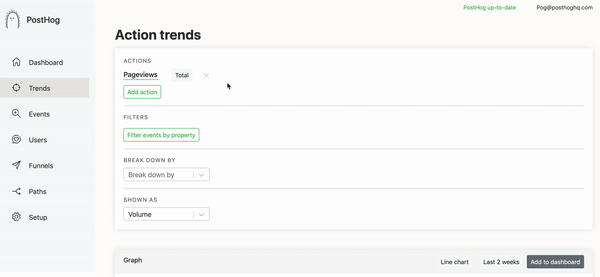
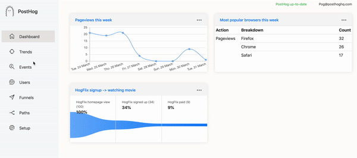

Like what you see and self-hosting? [Update](/docs/runbook/upgrading-posthog) your instance.

First our updates and new features.

## Release notes

### Users in Trend Graphs

Whilst we have progressively built in Total volume of users, DAUs and Stickiness into our graphs this change lets you identify the unique users performing those actions. 

This is super exciting for us as a big pain we had using product analytics in the past was the aggregated nature of most tools (which is necessary if you have millions of users).

There were a ton of scenarios in which we wanted to see the breakdown of the users performing an action giving us greater context around their user behavior.

(The gif is showing a lot of fake emails – those aren’t real people, it’s related to our new demo data, see below) 

### Adding demo data to HogFlix

We wanted to make our demo site a little more complete, if you are self hosting when you set up a fresh instance and navigate to /demo we’ll add a bunch of demo data. This can then be removed easily by going to /setup

Aaron was still getting responses that suggested it wasn’t clear how to utilize the features best. 

Adding more data like random users and more actions, helps us show how funnels, trend graphs, users and paths relate to each other – we hope this encourages new users to see how using PostHog in production can help them understand the impact of their work.

## Performance updates

* We built a [Helm Chart for PostHog](https://github.com/PostHog/posthog/pull/407) – making it simple to package and deploy PostHog on Kubernetes. This is somewhat related to [an issue](https://github.com/PostHog/posthog/issues/343) last week but also so we can integrate PostHog as a [managed app into GitLab](https://github.com/PostHog/posthog/issues/401).
* [Funnel fix](https://github.com/PostHog/posthog/pull/408) to correct incorrect ordering.
* Everything is now ordered by [timestamp](https://github.com/PostHog/posthog/issues/421) over id, this fixes ordering bugs if you explicitly set a “timestamp” in an event.

## Favorite issue

### [Allow Trend break downs by DOM element properties/attributes](https://github.com/PostHog/posthog/issues/419)

Thank you [alex-ketch](https://github.com/alex-ketch) for excellent formatting of your issue as well as bringing to mind how to improve Trends – this has been top of mind in recent weeks so it’s great to capture new ways of utilizing data in Trends.

## PR of the week

### [Clicking on live actions opens multiple actions](https://github.com/PostHog/posthog/pull/409)

This PR fixes a small bug that had been open for a little while. 

We obviously prioritize bug fixing but what was cool was that the issue created a discussion between Tim and [SanketDG](https://github.com/SanketDG) on the solution which led to the PR – this is one real benefit to OSS in that we can be guided and helped to create the most optimum fixes no matter the size of the problem.

## Repo round up

* [Zoom redirector](https://github.com/arkadiyt/zoom-redirector#whats-it-for) (When joining a Zoom meeting, the “join from your browser” link is intentionally hidden. This browser extension solves this.)
* [Intro to Python](https://news.ycombinator.com/item?id=22669084) (Aaron mainly found this cool as it’s an angle for people who haven’t studied CS)
* [Dolt](https://github.com/liquidata-inc/dolt) (It’s Git for data, although there have been a fair few options in this space we thought this was interesting.)

## Share your feedback
We'd love to hear anything you have to say about PostHog, good or bad. As a thank you, we'll share some awesome [PostHog merch](https://merch.posthog.com).

Want to get involved? [Email us to schedule a 30 minute call](mailto:hey@posthog.com) with one of our teams to help us make PostHog even better!

## PostHog news

If you follow [our Twitter](https://twitter.com/PostHog), you may have seen us posting about hiring – we are keen on growing the PostHog team so we can build new features even faster – if you’re an engineer who is interested (or knows someone who maybe is) you can find out more on our [careers](/careers) page.

<ArrayCTA />
