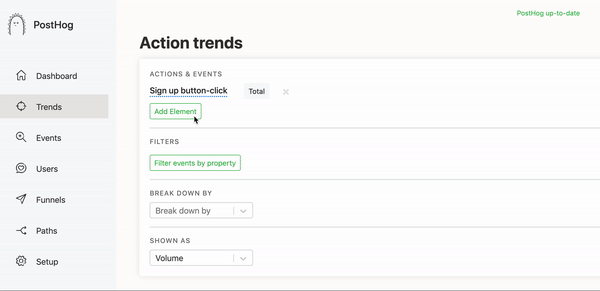
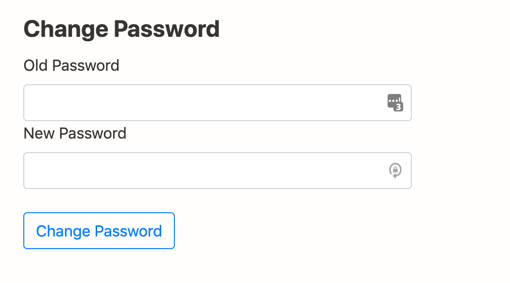
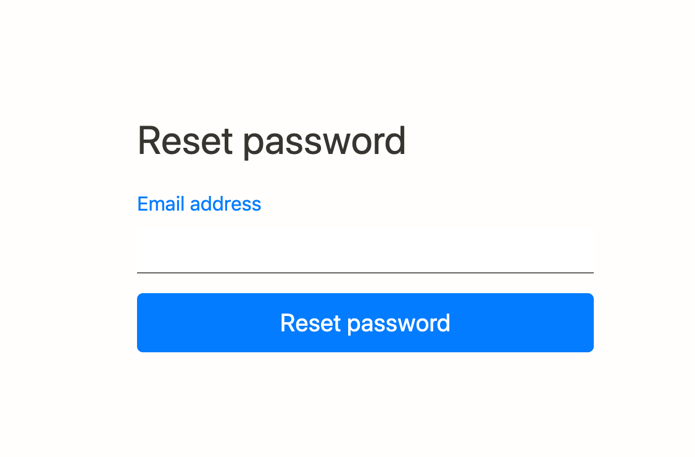
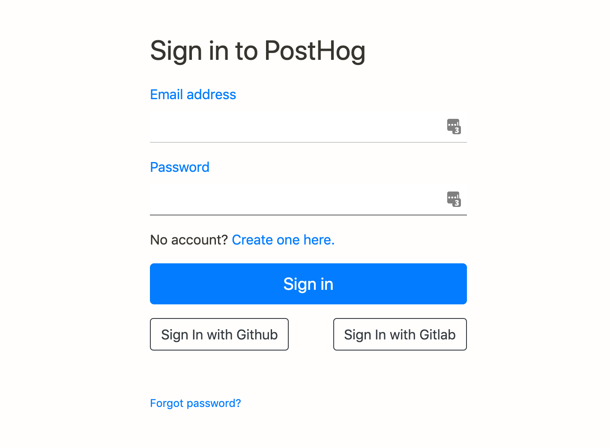
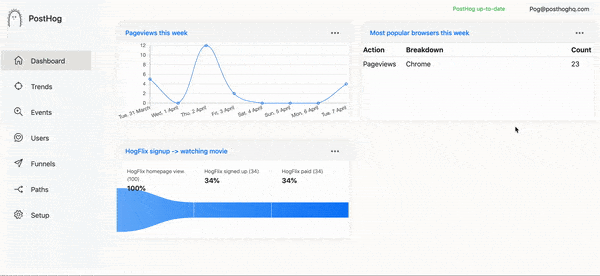
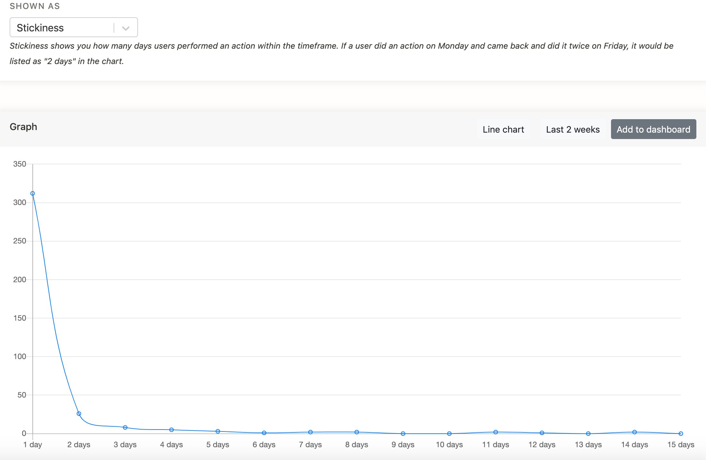
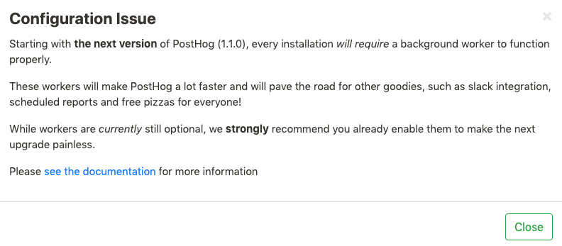

Like what you see and self-hosting? [Update](/docs/runbook/upgrading-posthog) your instance.

First our updates and new features.

Also as you will see below we have added Celery workers, we’ll move tasks to workers to speed up a lot of actions in PostHog so we've updated the upgrade docs too.

Updates and performance improvements this week have focused on making PostHog easier to use in small but powerful ways.

## PostHog updates

### [Filter by events](https://github.com/PostHog/posthog/pull/442)

This is perhaps the most exciting change to PostHog in this release, we have explained the important reason for creating a distinction between [Actions and Events](/blog/the-posthog-array-1-0-8).

Several users pointed out they shouldn’t have to create a distinct Action for a normal event like a pageview for example – PostHog was making it difficult to get to the information they wanted quickly.

Within Trends users can now filter by events and/or actions, multiplying the data that you can now see and manipulate within Trends.

### [Password Changes](https://github.com/PostHog/posthog/pull/468)

Since we launched this has been one of our longstanding issues ([22 February](https://github.com/PostHog/posthog/issues/167) to be exact) – we had neither the capability to change an existing password or reset if we had forgotten.

These small changes make this possible and should stop people getting stuck for simple reasons.

### [GitHub / GitLab Social Authorization](https://github.com/PostHog/posthog/pull/416)

Coupled with the above you can now authenticate your login through GitHub or GitLab making it even easier to login.

### [Logout Button](https://github.com/PostHog/posthog/pull/469)

Aaron was so used to typing /logout he did not realize how frustrating not having a logout button can be.

It had been pointed out several times that having a username in the top right corner of PostHog made it seem like it was a logout button, it wasn’t but now is. 

### [Explaining Stickiness](https://github.com/PostHog/posthog/pull/438)

We released Stickiness with [#1.0.9](/blog/the-posthog-array-1-0-9), whilst it is explained in our docs and youtube channel it is important to make sure people can understand the Trend Graphs whilst they are in front of them.

James thought it wasn’t clear that the repeated action is over a time frame (some actions that are important do not need to be repeated on consecutive days or perhaps over weekends).

So having a sentence here should mean that PostHog users infer the right conclusion from their data.

## Performance updates

### [We’re adding workers to PostHog](https://github.com/PostHog/posthog/issues/455)

This is so we can [create slack messages](https://github.com/PostHog/posthog/issues/105), recalculate Actions for large deployments, store events, and prefetch and cache Funnels.

So there will be a couple of things to watch out for this week as a result of this pr, every deployed app will provide a REDIS_URL to posthog. This will be used by celery to run background tasks. 

You will also see the below message – as with next week’s release you will need a background worker to get PostHog working properly.

###[ Precalculate Events that match Actions](https://github.com/PostHog/posthog/pull/420)

This is one of the most impactful updates to PostHog so far –  whenever we did a query involving actions in the frontend, the database had to do a lot of heavy lifting to calculate which events match the action. 

This led to long loading times as well as timeouts – now this works much faster and should be a joy to work with even with large Action volumes.

### Other performance improvements

* We also [sped up](https://github.com/PostHog/posthog/pull/465) the event insert by only loading actions that were really necessary.
* We now have an [asynchronous JS Snippet](https://github.com/PostHog/posthog/pull/440) as before PostHog’s array.js would block rendering DOM in some circumstances.
* We went further and fixed [array.js](https://github.com/PostHog/posthog/pull/436).
* Fixing ActionStep.url_ – so that it can be [null](https://github.com/PostHog/posthog/pull/435), this meant that you could not edit custom property in actions before this pr.
* [Set a default password for postgres](https://github.com/PostHog/posthog/pull/466) in docker-compose as this created an error in some configurations
* We also [fixed](https://github.com/PostHog/posthog/pull/459) demo actions not being recalculated with the new input of demo data from [last week](/blog/the-posthog-array-1-0-10).
* We said [last week](/blog/the-posthog-array-1-0-10) we were integrating PostHog as a managed app in GitLab and a series of prs were in relation to this. 

For a full breakdown of the changes and updates, please see our [changelog](https://github.com/PostHog/posthog/blob/master/CHANGELOG.md).
 
## Favorite issue

### [Filtering by date and events in funnels](https://github.com/PostHog/posthog/issues/444)

This was one of 4 issues raised by [jeremynevans](https://github.com/jeremynevans) at Savvy – it was raised in [our community page](/posts) and resulted in an excellent conversation with Tim resulting in more feature requests which is amazing.

He is also using PostHog for analytics on [Crowd Cure](https://crowd-cure.com/) to help build the largest clinical trial dataset to yet to help with the Coronavirus crisis – check it out on [Producthunt](https://www.producthunt.com/posts/crowdcure-covid-19).

## PR of the week

### [Add change user password form](https://github.com/PostHog/posthog/pull/443)

As mentioned above this was a long standing issue and big gap. Excellent and quick work from an amazing contributor, thank you [Gzog](https://github.com/gzog)!

## Repo round up

* [Excalidraw](https://github.com/excalidraw/excalidraw) (if you miss whiteboards at the office this is a good replacement.)
* [dns-over-wikipedia](https://github.com/aaronjanse/dns-over-wikipedia) (redirects idk domains using the official link in wikipedia.)
* [bungholio](https://github.com/johntitus/bungholio) (Get text alerts when products become available on Amazon – useful if resistance bands are as sparse in your location as they are in Aaron’s.)

## Share your feedback
We'd love to hear anything you have to say about PostHog, good or bad. As a thank you, we'll share some awesome [PostHog merch](https://merch.posthog.com).

Want to get involved? [Email us to schedule a 30 minute call](mailto:hey@posthog.com) with one of our teams to help us make PostHog even better!

## PostHog news

* We migrated our docs so we could host them ourselves – using docsify to generate our site. We’re pleased with it so far and have used it again for our company handbook.
* PostHog also got a nice mention as part of an “absurdly powerful and productive [‘low code’ stack” on HN](https://news.ycombinator.com/item?id=22786853), James was ecstatic. It consisted of:
	* [Hasura](https://hasura.io/)
	* [Forest Admin](https://www.forestadmin.com/)
	* [GraphQL Code Generator](https://graphql-code-generator.com/)
	* [Metabase](https://www.metabase.com/)
	* And [PostHog](https://posthog.com)!

	<ArrayCTA />
