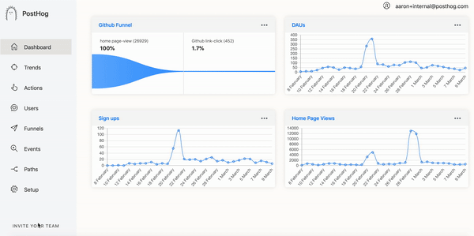
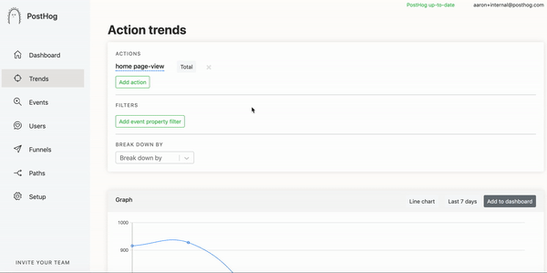
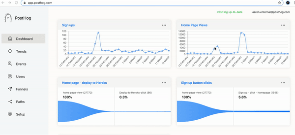
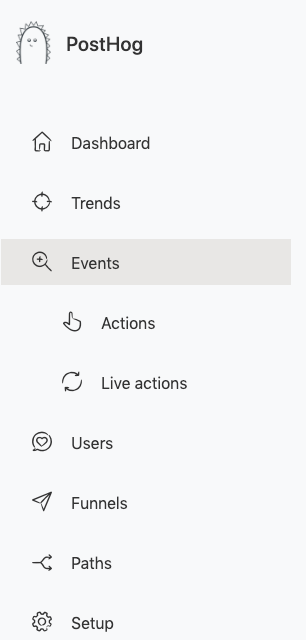
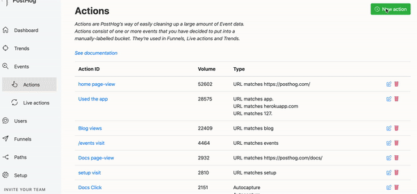
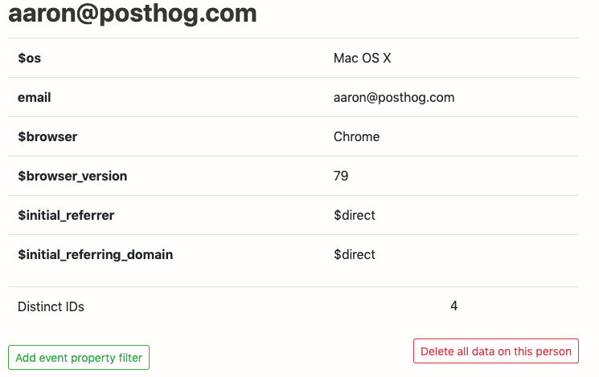

Welcome to our second PostHog Array which comes with a new naming convention.

We’re going to be doing weekly tagged releases from now on so the PostHog Array will reflect our most recent version.

Like what you see and self-hosting? [Update](/docs/runbook/upgrading-posthog) your instance.

First our updates and new features.

## Release notes

Nb. The following is for pre 1.0.8.

### Multiple users



We hadn’t built multiple users as initially this would have been in our paid version but after much internal discussion at PostHogHQ we realized this was not in line with our wish to make our MIT license as generous as possible or provide obstacles to adoption, as such you can have unlimited users!

### Multiple domains in one instance


Plenty of our users have several side projects they would like to use PostHog for or have multiple domains they would like to see activity for in one place – with this change this is now easy.

### Adding info to actions



James was trying to set the right action for a Trend graph when he couldn’t work out which action was which so we broke actions down by type, (autocapture, event and pageview) as well as exposing the selectors.

### Updating PostHog



We now have our changelog live on GitHub and a helpful reminder as to whether we are up to date.

Nb. The following is included in the 1.0.8 update

### Events Changes

This is a small but mighty change.

A key feature when building PostHog was autocapture. When we used other tools it was painful to have to add track(‘event’) for every element on our site.

As such we created two ideas;

-   Events (everything that happens on your website).
-   Actions (useful events you would like to visualize trends or create funnels for).

We saw one very (very) useful Loom video that clearly showed us we had not made it clear to our users…

Big L for us on that one so these changes should stop this from happening.

Firstly we have nested Actions within events.



### Updated Actions Creation

This focuses on making actions easier to set.



The “New action” button allows users to create any action with one click – whether it be matching a url for a specific page view or using our toolbar to select front-end elements from your site directly.

### Delete user data



When viewing an individual user you are now able to delete data on this person (should they ask you to, for example as this relates to GDPR).

### Performance updates

As part of every release we will keep you up to date with bug fixes and small performance updates:

-   [Paths](https://github.com/PostHog/posthog/pull/345) were slow and never indicated they were done loading, this has since been fixed.
-   We fixed a [cohorts](https://github.com/PostHog/posthog/issues/333) issue, as there was a bug that created an error if you selected “in the last…”
-   We noticed for some users they would see a stretched PostHog logo when viewing in [safari](https://github.com/PostHog/posthog/pull/340).
-   Email addresses did not show when viewing [users](https://github.com/PostHog/posthog/pull/326).
-   We sped up the loading of [events](https://github.com/PostHog/posthog/pull/321).
-   Support navigating between pages with the toolbar open while using [Turbolinks](https://github.com/PostHog/posthog/pull/369).

## Favorite issue

### [Ability to clear/delete events](https://github.com/PostHog/posthog/issues/307)

We built PostHog for those that are privacy conscious and didn’t want to send user data to 3rd parties.

The one thing we hadn’t thought about was deleting data you had already collected.

The [pull request](https://github.com/PostHog/posthog/pull/317) that came out of this just focuses on deleting data associated with a user but we may add more functionality too – issues around this are very welcome.

Thank you [funkyOne](https://github.com/funkyOne) for bringing it to our attention.

## PR of the week

### [Add new contributors to README #312](https://github.com/PostHog/posthog/pull/312)

There are lots of prs relating to all of our new features, but what was perhaps more important this week was to ensure we recognized our contributors for their efforts

It is exciting to have so many new people committing to the repo – as Tim commented:

```
@iMerica @frankcash @budnik @tirkarthi @J0 @pedroapfilho @sanketsaurav

Welcome to the club, and thanks for your contributions!
```

## Share your feedback
We'd love to hear anything you have to say about PostHog, good or bad. As a thank you, we'll share some awesome [PostHog merch](https://merch.posthog.com).

Want to get involved? [Email us to schedule a 30 minute call](mailto:hey@posthog.com) with one of our teams to help us make PostHog even better!


## Repo round up

Here is what we thought was cool and interesting in the last week:

-   [John Hopkins CSSE Visual Dashboard](https://github.com/CSSEGISandData/COVID-19) (We’ve been watching this frequently as we’re sure many are)
-   [Firecracker](https://github.com/firecracker-microvm/firecracker) (We like open source projects and this is great – although I must note it has been around since 2018)
-   [Zoom](https://github.com/zoom) (so this isn’t one particular repo but we have been super impressed with how resilient Zoom has been as all our meetings move to video)

## PostHog news

As we come to the end of YC, the gang is starting to break up. We have gone from an online [only demo day](https://news.ycombinator.com/item?id=22506013) to now just preparing slides. We’re a bit sad that we won’t get to present (well maybe only James is) but it drives home what an intense 3 months this has been!

Tim and James have headed back to Europe (in advance of travel ban) and we can test out our remote ethos, we have found Gitlab to be [helpful](https://about.gitlab.com/company/culture/all-remote/guide/). We always aimed to be remote post YC but now we are just one of many companies doing this as we see Covid-19 take effect.

<ArrayCTA />

