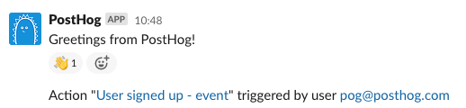
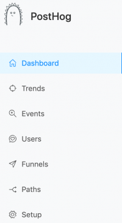
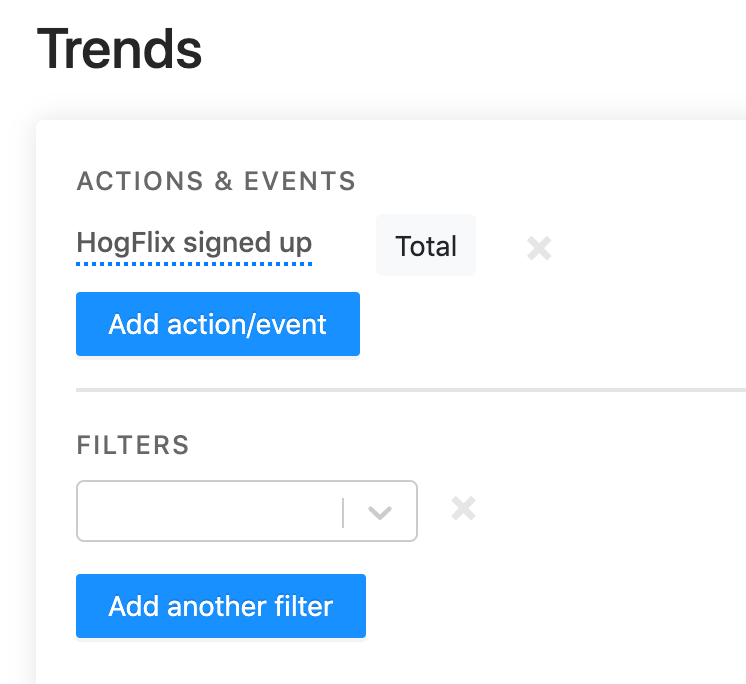
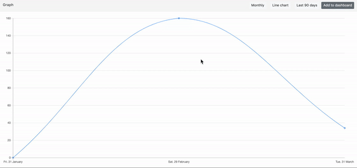
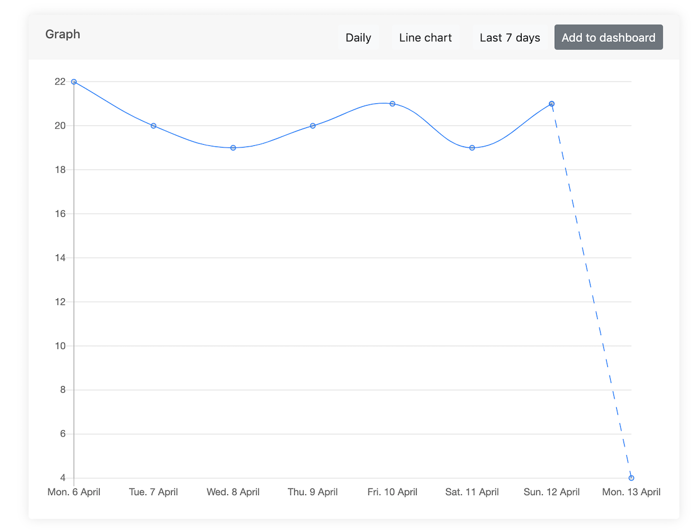
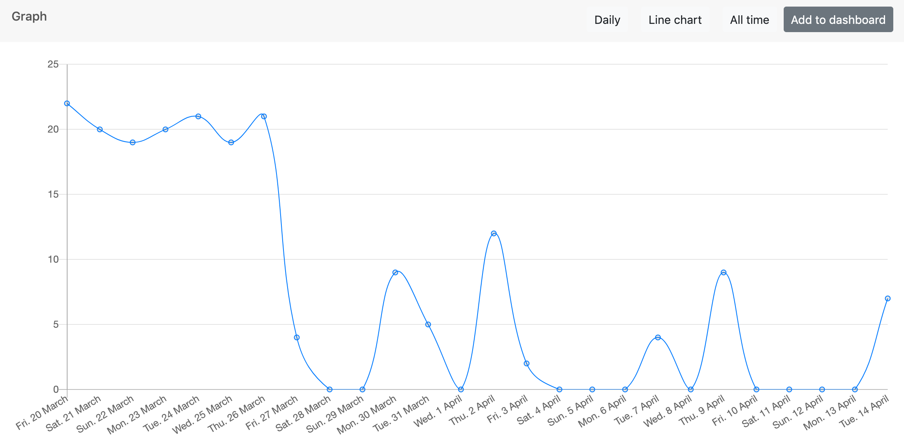
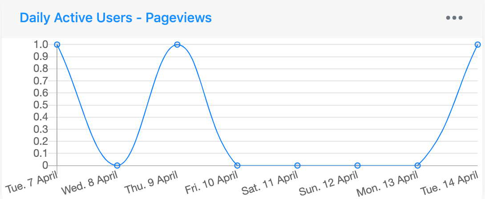
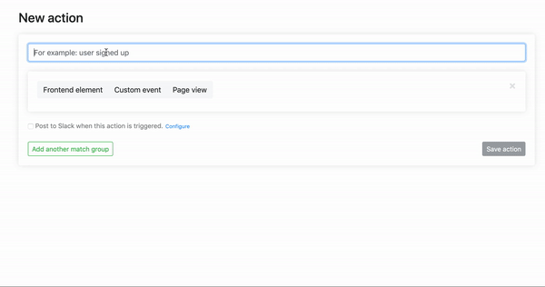

Major update time (hence the change to 1.*1*.0) - push-based integrations have been introduced!

Like what you see and self-hosting? [Update](/docs/runbook/upgrading-posthog) your instance.

First our updates and new features.

## Release notes

### [PostHog integrates with Slack](/docs/integrate/webhooks/slack)

This update allows you to send push notifications to Slack when an Action is triggered. Our docs show you how you can [integrate Slack](/docs/integrate/webhooks/slack) with your own PostHog instance.

It’s exciting because PostHog can now update you in real time when key actions are triggered – so if people were for instance having an issue installing your app you can reach out to them immediately. 

Product analytics help you understand how your work is being used but this is the first step towards PostHog helping you act on the metrics you record. 

### [Filtering Funnels by date](https://github.com/PostHog/posthog/pull/506)

Funnels allow you to track conversion of actions/events that users take – Seeing funnel performance over all-time is not useful if I wanted to see if I had improved conversion due to a recent change.

James used this to notice a 300% improvement in a conversion metric after updating the PostHog home page, this wasn’t possible before this release.

### [Filtering Funnels by events](https://github.com/PostHog/posthog/pull/561)

In addition to the update above we realized we were also increasing the amount of time it took to build funnels if you had to add actions even if your events were clear already.

Now you have a simpler way of using PostHog where you can act on your insights quicker.

### [New design system](https://github.com/PostHog/posthog/pull/530)

It had been mentioned that PostHog looked <strike>like it was designed by developers</strike> *functional* and that perhaps PostHog could be beautiful as well. 

Eric used [Ant Design](https://ant.design/) for this and began with adding the buttons and drop downs and the sidebar but we will be changing the [whole design](https://github.com/PostHog/posthog/issues/531) so that PostHog is both functional and beautiful. 

### [Adding time intervals to Trends](https://github.com/PostHog/posthog/pull/504)

A user told Tim that whilst Trends worked great, measuring performance on a daily basis limited the ability to work out trends for high volume events that might take place over a single day. Could we create options to change the time intervals to hours as well as days?

We went one further as you can now can build trend graphs across minutes, hours, days, weeks or months.

### [Dotted lines to represent data yet to be determined](https://github.com/PostHog/posthog/pull/578)

Aaron had to mentally remind himself when looking at PostHog stats each day that 9:30am in London meant well over half of PostHog users were yet to wake up – we felt that other users would have this issue so added dotted lines to make the distinction between collected and collecting data. 

This is tied to the below update where we want PostHog to feel intuitive so you can act on data confidently.

### [X axis starts at 0](https://github.com/PostHog/posthog/pull/563)

James was slightly worried that it looked like usage would drop dramatically to nothing. 

Luckily a contributor noticed that we didn’t always start the X axis at 0 to show all values. That sounded right in theory but not in practice. Trend graphs will all start at 0 so as not to shock you at plummeting volumes of actions or events.

### [Adding DAUs as a default dashboard](https://github.com/PostHog/posthog/pull/559)

Daily active users (DAUs) are a quick and insightful way to measure engagement with your site or app. 

We find it very useful so thought it would be a useful default dashboard for everyone new to PostHog. 

Note: this is *only* on new deployments.

### [Paths are prettier](https://github.com/PostHog/posthog/pull/542)

This is a small change but will be important for future versions as we want to make [paths](https://github.com/PostHog/posthog/issues/448) [powerful](https://github.com/PostHog/posthog/issues/568). For now we have updated the way urls are rendered so they don’t cover the whole screen depending on screen size.

### [UX Improvements to saving Actions](https://github.com/PostHog/posthog/pull/497)

We added conditional autofocus and disabling the save button if no changes have been made. 

This ensures a smoother experience as well as helping you be sure exactly what you are saving.

## Performance updates

* Changed the way [we store event properties](https://github.com/PostHog/posthog/pull/588). This is very impactful if you have a large number of events which could break PostHog instances.
* You can now [filter by event name](https://github.com/PostHog/posthog/pull/571), we don’t know why we didn’t include this originally but now you can get a list of events with a specific name.
* Fixed a small bug that [duplicated users](https://github.com/PostHog/posthog/pull/552) in Cohorts.
* We added some helpful mypy rules to [configure mypy](https://github.com/PostHog/posthog/pull/562).
* Added a [timestamp index](https://github.com/PostHog/posthog/pull/583) which allows event tables to load at very large volumes.
* We added [updates](https://github.com/PostHog/posthog/pull/558) to get helm charts to work with redis and workers.
* A [type migration](https://github.com/PostHog/posthog/pull/519) to [fix a bug](https://github.com/PostHog/posthog/pull/513) in Trends.

For a full breakdown of the changes and updates, please see the [changelog](https://github.com/PostHog/posthog/blob/master/CHANGELOG.md).
 
## Favorite issue (!)

[PostHog won’t load, endpoints returning 503 error](https://github.com/PostHog/posthog/issues/581)

This issue isn’t a great one to see come up on GitHub but it there are 2 parts that make it our favorite. 

1. Tim managed to get a pr to fix in a day 
1. It helped push us to refactor the way we store events which will have a big impact on users with large event volumes – we’re excited that people are using PostHog at scale as this should help us improve

Thank you [dazbradbury](https://github.com/dazbradbury) for bringing it to our attention.

## PR of the week

### [Replace current Sidebar with Ant Design Sidebar](https://github.com/PostHog/posthog/pull/530)

This is the PR of the week as it’s one of the first by a new member of the PostHog team welcome [Eric](https://github.com/EDsCODE)!

We’re very excited to be growing the group and this is the first of what we hope will be many contributions.

## Repo round up

* [Covid Safe Paths](https://github.com/tripleblindmarket/covid-safe-paths) (With a lot of focus on contact tracing by governments, we were intrigued by a project that also focuses on the privacy issues with large scale data collection)
* [Delivery Slot Finder](https://github.com/ahertel/Amazon-Fresh-Whole-Foods-delivery-slot-finder) (We keep seeing repos appear that make it easier to stay at home and this was our favorite this week)
* [EbookFoundation Free programming books](https://github.com/EbookFoundation/free-programming-books) (If you are looking for things to do at home other than contribute to open source Aaron has been looking at this) 

## Share your feedback
We'd love to hear anything you have to say about PostHog, good or bad. As a thank you, we'll share some awesome [PostHog merch](https://merch.posthog.com).

Want to get involved? [Email us to schedule a 30 minute call](mailto:hey@posthog.com) with one of our teams to help us make PostHog even better!

## PostHog news

* It’s been a big week at PostHog towers, this was another really big release and now our [future updates](https://github.com/PostHog/posthog/projects/5) will be focusing on [our roadmap](/handbook/strategy/roadmap). James has put a lot of work in ensuring PostHog abides by its [values](/handbook/company/values) and remains transparent  – if you have thoughts write an issue or create a pr.
* PostHog is now Aaron, Eric, James, and Tim. A big welcome to the team – watch this space for more new joiners

<ArrayCTA />
