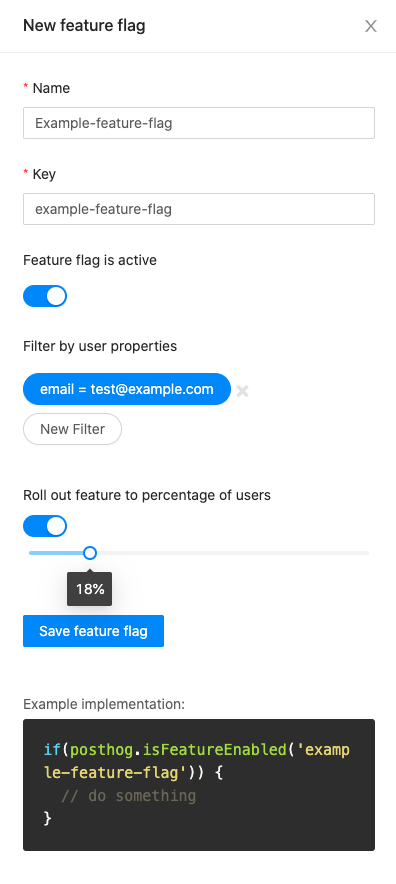
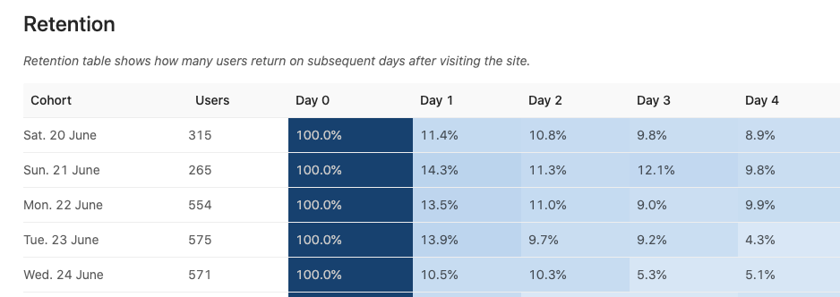

This is our most exciting release to date. Here we go: 🎉

You *have* to try the new toolbar out - you can walk through your own website or app and see where users are clicking. We did it on our own site and immediately found out a lot of things that surprised us, and it gave us a ton of areas to work on our own conversion rates. Go to your /setup page to switch the beta on.

Feature flags have also come out! If you're a developer and thinking of tweaking something a little out there, they give you more control. Like, woah.

On top of that (yep, there is more), we have a better retention view, deployment on platform.sh, new ways to edit our code with Porter, and a whole load of performance improvements as always.

If you're self hosting and desire these features - [update your PostHog](/docs/deployment/upgrading-posthog).

Please also update your `posthog-js` version to at least `1.2.4` if you have it installed via NPM. If you're using the snippet, you're good to go!  

## Release notes

### Toolbar

It's like inspect element, but for user data.

Easily see the ranking of which parts of the page your users are interacting with the most:

We learned a ton about our product and website within minutes of trying this out.

#### How to use it:

Step 1 - go to your setup page, and switch it on:

This little buddy will appear over your website, only if you are logged into PostHog (it will NOT appear for your regular visitors...):

Hover over him to get started!

#### Fair warning! (It's BETA! Really!)

The toolbar is now in public beta! No, not "gmail beta", *real* BETA! There's still a lot of work to be done ([follow along here!](https://github.com/PostHog/posthog/projects/7)). It **will** feel like a bumpy ride on an unpolished road, *especially* when you click the mysterious "dock" icon! 👀

However, as we already found so much value in using this toolbar ourselves, we felt it was ready to share with you all! 

When you're trying it out, please raise all issues that you find [here](https://github.com/PostHog/posthog/issues/1129)!

### Feature flags

This is the first step in the direction of becoming a product experimentation platform.

Feature flags let you roll out changes to users with a certain property, or to a percentage of users, or some combo of the two.

Why use it? For now, this lets you carefully release big changes to gather early user feedback, or to check that nothing is broken by a new feature.

In the long run, we intend on improving the connection between feature flags and the rest of the stats. If you see a cool use case, let us know about.

Learn more about [how to use feature flags](/docs/features/feature-flags), and please give us any [feature requests](https://github.com/PostHog/posthog/issues/new?assignees=&labels=enhancement&template=feature_request.md&title=) for these that you would like to see in a future edition.

### Retention page

PostHog already had stickiness, but now there is a table that demonstrates perhaps more clearly how your users are coming back (or not!)

Head to the users menu in the left hand navigation to give it a whirl.

### Better onboarding

You may be one of the lucky folks whom we asked to watch setting up the product. That really made obvious to us that are set up process was a little confusing.

We've had a go at redoing how our set up flow works, and will be tracking if it helps more people get through PostHog's own funnel!

### Platform.sh deployment

You can now deploy on platform.sh - a very simple, new and trendy way to get up and running.

One click deploy for platform.sh (#1044)

### Porter development

We *always* love it when a community pull request appears.

Porter is what the cool kids are using to do web development in the cloud. Thank you so much to [porter-dev](https://github.com/porter-dev) for creating this pull request.

Hopefully that'll make life easier for other people to contribute.

### Event name filtering

By popular demand, you can now filter the events table by the event name. Happy debugging your implementations!

## Bug fixes and performance improvements

* We are now more privacy friendly - you can [discard IP address data](https://github.com/PostHog/posthog/pull/1081)
* We fixed a bug with [the start times for the session view](https://github.com/PostHog/posthog/pull/1077)
* We [improved the ./bin/test command](https://github.com/PostHog/posthog/pull/1074)
* We now let you [break down users by their properties](https://github.com/PostHog/posthog/pull/1070) (it wasn't working before!)
* We [sped up the people page](https://github.com/PostHog/posthog/pull/1056) - pro tip: don't load stuff you don't need!
* We [disabled batching in the snippet](https://github.com/PostHog/posthog/pull/1049), since this helps prevent data loss
* Fix moving from sessions to trends (#1039)
* Fix person properties being selected (#1040)
* Automatically select hourly if today/yesterday (#1057)
* 1052 replace today with 24 hours (#1054)
* 1041 paginate people modal (#1042)
* Copy array.js.map as well to better debug errors (#1047)
* Show upgrade warning if using a really old browser (#1046)
* Add black (#1043)
* Fix Typo (#1032)
* Fix force refresh for cache (#1035)
* Fix failing tests (#1036)
* Closes #975 add prroperties to person and fix pagination (#976)
* Fix texts too long (#1029)
* Add free pairing session to contributing guide (#1028)
* chore: clean the configs for release-drafter (#1088)
* chore: Automate the creation of the change log (#1080)

## Favorite issue

## Weekly round up

* [Traffic simular](https://github.com/dabreegster/abstreet)
* [Cyclops lamb born](https://www.mirror.co.uk/news/weird-news/farmer-baffled-after-sheep-gave-22251344)

## PostHog news

We are hungry for your feedback this week.

Feature flags and the toolbar (and bringing those together one day) could really propel the product forward - please raise bugs, ask for more features, and let us know what you think!

### Open roles

Full stack or growth engineers - we want you!